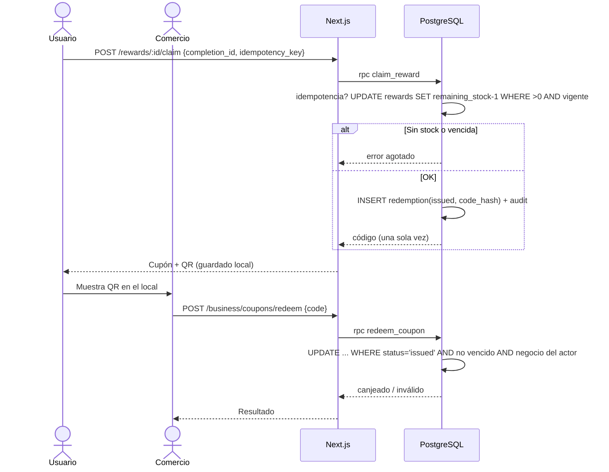
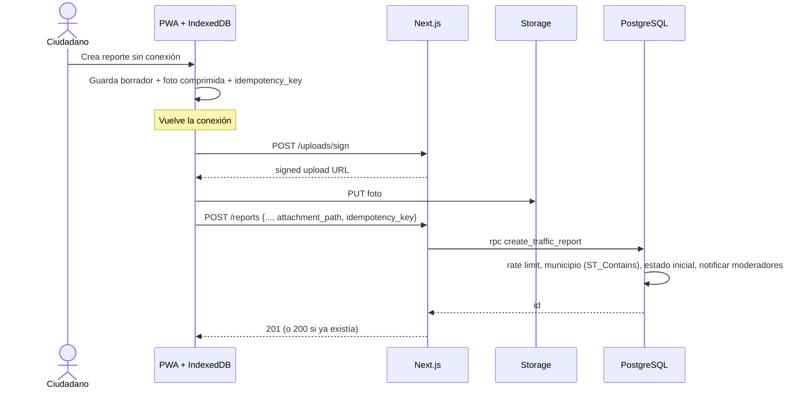
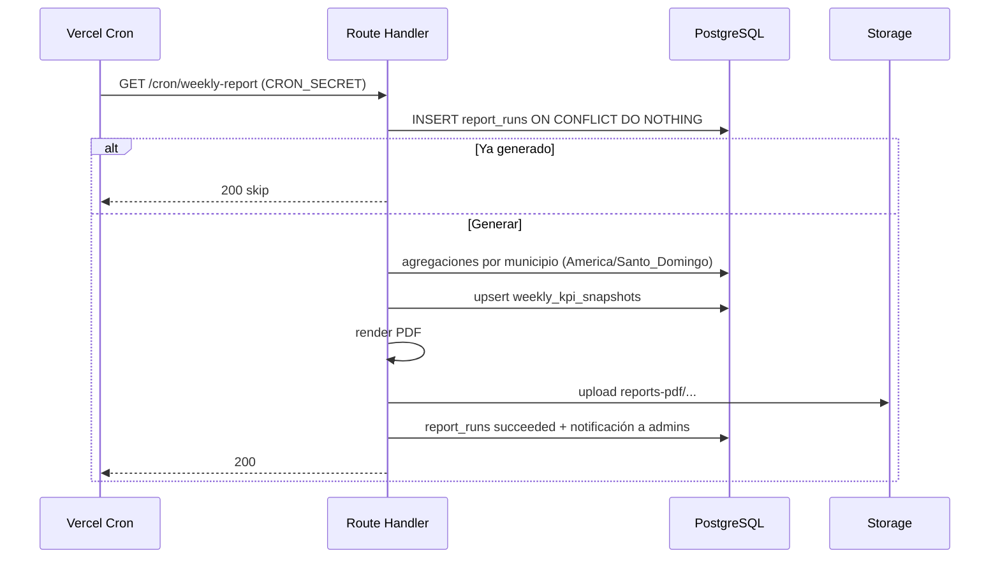
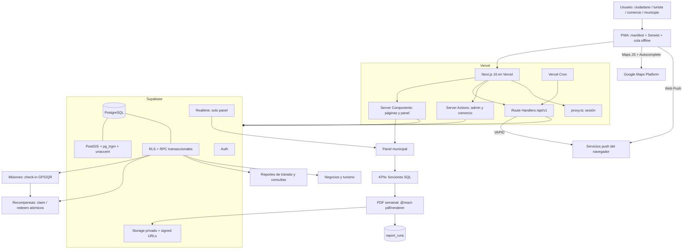

# SR Conecta — Arquitectura Técnica Definitiva

> Documento de arquitectura para el repositorio. Versión 1.0 · 23 de septiembre de 2026
> Alcance: desde el MVP del reto TechEmprende SR Conecta 2026 hasta producción municipal y escala regional.
> Fuentes oficiales y precios consultados el **23/09/2026** (ver §31 y Anexo E). Todo precio debe re-verificarse antes de presupuestar.

---

## 0. Contexto que cambia decisiones (leído de conectasr.com)

Antes de decidir, estos hechos del reto condicionan la arquitectura más que cualquier preferencia técnica:

| Hecho del reto | Consecuencia arquitectónica |
|---|---|
| Provincia Santiago Rodríguez, 3 municipios: San Ignacio de Sabaneta (cabecera), Monción y Villa Los Almácigos | Territorio pequeño. El volumen de puntos en MVP es de cientos a pocos miles, no millones. No sobre-optimizar. |
| La organización entrega **datos geográficos abiertos** de la provincia | Deben importarse a PostGIS (límites municipales, POIs, caminos). PostGIS es la fuente de verdad territorial, no Google. |
| Demo en vivo de **25 minutos con datos reales** | Semilla de datos reproducible, guion de demo y plan B si una API externa falla. |
| El proyecto ganador se libera bajo **MIT o Apache 2.0** y pasa a los patrocinadores (FUNDESER) | Todas las dependencias deben ser compatibles en licencia. La cuenta de Google Cloud, Supabase y Vercel deben poder **transferirse**. Nada de claves ni cuentas personales incrustadas. |
| Stack libre; se evalúa el resultado | Priorizar lo que el equipo domina y lo que se demuestra bien, no lo más sofisticado. |
| "Cualquier ciudadano ingresa datos y **recibe notificaciones** sobre el mapa" | Notificaciones in-app son obligatorias; push es un canal adicional. |

---

## 1. Executive Summary

SR Conecta se construye como un **monolito modular** en **Next.js 16 (App Router) + TypeScript**, desplegado en **Vercel**, con **Supabase** como plataforma de datos (PostgreSQL + PostGIS + Auth + Storage). El mapa base es **Google Maps JavaScript API** con marcadores avanzados y clustering, pero **todos los datos de negocio viven en PostgreSQL/PostGIS**. Google aporta mapa base, autocompletado de direcciones puntual y navegación vía enlace profundo; nunca es la base de datos de negocios.

Las operaciones críticas (completar misión, reclamar y canjear recompensa, cambiar estado de consulta, asignar roles) se ejecutan como **funciones transaccionales en PostgreSQL** invocadas únicamente desde el servidor. El frontend nunca decide si una misión se completó ni si queda inventario.

Del stack propuesto se mantiene cerca del 80%. Los cambios importantes: se elimina Firebase Cloud Messaging (Web Push + VAPID es suficiente), se reemplaza el uso de Routes API por enlaces de navegación de Google Maps y rutas propias en PostGIS, Realtime se limita a uno o dos casos, y se agregan `pg_trgm`/`unaccent` para búsqueda, Serwist para el service worker y Sentry para errores.

## 2. Architectural Verdict

**Veredicto: el stack es correcto en su columna vertebral y excesivo en sus bordes.**

| Acción | Qué |
|---|---|
| **Mantener** | Next.js, React, TypeScript, Tailwind, shadcn/ui, Google Maps JS API, Supabase (Postgres, PostGIS, Auth, Storage), React Hook Form, Zod, Recharts, Vercel, GitHub + Actions, Vitest, Playwright |
| **Cambiar** | FCM → Web Push/VAPID · Routes API → deep links + rutas PostGIS · Geocoding para municipio → `ST_Contains` en PostGIS · "librería PDF" → `@react-pdf/renderer` · Realtime "para todo" → 1–2 canales |
| **Eliminar** | Firebase (cualquier producto) · Places como catálogo de negocios · llamadas a Google por cada movimiento del mapa · Edge Functions en MVP |
| **Introducir** | `pg_trgm` + `unaccent` + full-text en español · Serwist (service worker) · `@vis.gl/react-google-maps` · Sentry · rate limiting en Postgres · migraciones con Supabase CLI · Map ID de Google (requerido por AdvancedMarkerElement) |
| **Postergar** | Vector tiles propios (`ST_AsMVT`), mapas offline, Traffic Layer como feature principal, Routes API en app, analítica avanzada, multi-provincia |

Tres cuestionamientos directos a decisiones del documento original:

1. **"Tráfico con Google Traffic Layer" no es un pilar confiable.** La cobertura de tráfico en vivo en zonas rurales de Santiago Rodríguez no está verificada y probablemente es escasa. El valor real de tránsito viene de **reportes ciudadanos propios** (accidentes, derrumbes, vías cerradas). Traffic Layer queda como capa opcional encendible.
2. **"Rutas: Google Routes API" es innecesario para ecoturismo.** Un sendero no existe en Google. Las rutas de ecoturismo son `LineString` propios en PostGIS. Para "cómo llegar al inicio del sendero" basta un enlace a Google Maps (sin costo de API).
3. **"No cargar toda la provincia" es correcto para capas que crecen, no para todas.** Límites municipales, rutas y lugares turísticos son pocos y estables: cargarlos una vez por sesión, simplificados y cacheados, es más rápido y barato que consultar por viewport. El filtrado por viewport se aplica a capas que crecen (negocios, reportes).

## 3. Recommended Final Stack

| Área | Tecnología | Clasificación |
|---|---|---|
| Framework | Next.js 16 (App Router) | [OBLIGATORIA] |
| Lenguaje | TypeScript (strict) | [OBLIGATORIA] |
| UI | Tailwind CSS + shadcn/ui | [RECOMENDADA] |
| Mapa | Google Maps JavaScript API vía `@vis.gl/react-google-maps` | [OBLIGATORIA] |
| Marcadores | AdvancedMarkerElement (requiere Map ID) | [RECOMENDADA] |
| Clustering | `@googlemaps/markerclusterer` | [RECOMENDADA] |
| Búsqueda externa | Places API (New) — solo Autocomplete con session tokens | [OPCIONAL] |
| Navegación | Google Maps URLs (deep link) | [RECOMENDADA] |
| Rutas en app | Routes API | [FUTURA] |
| Tráfico | TrafficLayer (toggle) | [OPCIONAL] |
| Geocoding | Solo reverse geocoding bajo demanda para dirección legible | [OPCIONAL] |
| Base de datos | PostgreSQL (Supabase) | [OBLIGATORIA] |
| Geodatos | PostGIS | [OBLIGATORIA] |
| Búsqueda propia | Full-text `spanish` + `pg_trgm` + `unaccent` | [RECOMENDADA] |
| Auth | Supabase Auth (email + OTP/magic link; Google OAuth opcional) | [OBLIGATORIA] |
| Archivos | Supabase Storage (buckets privados + URLs firmadas) | [OBLIGATORIA] |
| Lógica crítica | Funciones PL/pgSQL (RPC) + RLS | [OBLIGATORIA] |
| Realtime | Supabase Realtime (solo panel admin y estado propio) | [OPCIONAL] |
| Edge Functions | — | [FUTURA] |
| PWA | Web App Manifest + Serwist | [OBLIGATORIA] |
| Push | Web Push + VAPID (`web-push`) | [RECOMENDADA] |
| Firebase Cloud Messaging | — | [NO RECOMENDADA] |
| Formularios | React Hook Form + Zod | [RECOMENDADA] |
| Gráficos | Recharts | [RECOMENDADA] |
| PDF | `@react-pdf/renderer` en Route Handler (runtime Node) | [OBLIGATORIA] |
| Cron | Vercel Cron (+ GitHub Actions schedule como respaldo) | [RECOMENDADA] |
| Errores | Sentry (plan gratuito) | [RECOMENDADA] |
| Tests | Vitest + Playwright | [RECOMENDADA] |
| CI/CD | GitHub Actions + Vercel Git integration | [OBLIGATORIA] |
| Hosting | Vercel + Supabase | [OBLIGATORIA] |
| Estado global | Zustand solo para estado del mapa; sin Redux | [OPCIONAL] |
| Data fetching cliente | TanStack Query (solo en el módulo mapa) | [RECOMENDADA] |

## 4. Why This Stack

- **Un solo lenguaje de punta a punta (TypeScript) y un solo motor de datos (Postgres).** Menos piezas que mantener para un equipo de 1–5 personas y para una fundación que heredará el código.
- **PostGIS resuelve el 90% de la lógica geográfica** (cercanía, geocercas, pertenencia a municipio, rutas) sin pagar por llamada. Google solo resuelve lo que no podemos producir nosotros: el mapa base y la búsqueda de direcciones arbitrarias.
- **Supabase da Auth, Storage y RLS sobre el mismo Postgres**, evitando un backend Express separado. La seguridad vive junto a los datos.
- **Next.js permite SSR para páginas públicas indexables** (turismo, negocios) y una app cliente rica para el mapa, en un solo proyecto.
- **Todo es open source o reemplazable**, compatible con la liberación MIT/Apache del reto. El único proveedor propietario crítico es Google Maps, y está aislado detrás de un adaptador.

## 5. Architecture Principles

1. **Postgres es la fuente de verdad.** Si un dato importa al negocio o al municipio, vive en nuestra base.
2. **El cliente propone, el servidor dispone.** Ubicación, evidencias y clics son "reclamos"; la base de datos decide.
3. **Operaciones críticas = una transacción en la base de datos.** Nunca "leer en JS, decidir en JS, escribir en JS".
4. **Google se invoca por intención del usuario, nunca por evento del mapa.**
5. **Mínimo de piezas.** Cada servicio nuevo debe justificar su costo operativo.
6. **RLS siempre activo**, incluso cuando el acceso pasa por el servidor. Defensa en profundidad.
7. **Privacidad por defecto.** Ubicación puntual, con propósito, nunca rastreo continuo.
8. **Todo cambio de estado relevante deja rastro** (historial + auditoría).
9. **Idempotencia en todo lo que se puede reintentar** (cron, canjes, cola offline).
10. **Diseñar para transferencia.** Otro equipo debe poder operar esto con la documentación del repo.

## 6. System Architecture

```text
┌──────────────────────── Dispositivo (PWA) ────────────────────────┐
│ Next.js client · Mapa (Google Maps JS) · Service Worker (Serwist)  │
│ Cola offline (IndexedDB) · Web Push                               │
└──────────────┬─────────────────────────────────────┬──────────────┘
               │ HTTPS (cookies de sesión)            │ Maps JS / Autocomplete
               ▼                                      ▼
┌──────────── Vercel ────────────┐         ┌──── Google Maps Platform ────┐
│ Next.js 16                     │         │ Maps JS · Places Autocomplete │
│ · Server Components (páginas)  │         │ · (Routes/Geocoding opcional) │
│ · Route Handlers /api/v1       │         └──────────────────────────────┘
│ · Server Actions (admin)       │
│ · proxy.ts (sesión)            │
│ · Cron → PDF semanal           │
└──────────────┬─────────────────┘
               │ supabase-js (JWT del usuario) / service_role solo en cron
               ▼
┌──────────────────── Supabase ─────────────────────┐
│ PostgreSQL 15+ · PostGIS · pg_trgm · unaccent       │
│ RLS · Funciones RPC transaccionales · Triggers      │
│ Auth · Storage (privado + signed URLs) · Realtime   │
└────────────────────────────────────────────────────┘
```

Estilo: **monolito modular** (§13). Un despliegue, un repositorio, una base de datos, módulos por dominio con fronteras explícitas.

## 7. Frontend Architecture

- **Dos "caras" en una app:** (a) sitio público y listados SSR (turismo, negocios, perfil de lugar), (b) aplicación de mapa cliente pesada.
- **El mapa se carga con `dynamic(() => import(...), { ssr: false })`** detrás de un esqueleto. La primera pintura nunca espera a Google.
- **Estado:** servidor = TanStack Query en el módulo mapa (cache por bbox/capa); UI del mapa (capas activas, filtros, feature seleccionado) = Zustand o `useReducer`. Filtros persistidos en la URL (`?capas=turismo,reportes&cat=…`) para compartir enlaces.
- **Formularios:** React Hook Form + un **único esquema Zod por operación**, compartido cliente/servidor (`modules/*/schemas.ts`). El servidor revalida siempre.
- **Diseño:** mobile-first, bottom sheet para detalles en móvil, panel lateral en escritorio. shadcn/ui copia componentes al repo (sin dependencia en runtime), Tailwind para tokens.
- **Accesibilidad:** todo lo que está en el mapa debe tener equivalente en lista (requisito práctico y de accesibilidad).
- **i18n:** español como único idioma en MVP; textos centralizados para añadir inglés (turistas) en Fase 2.

## 8. Next.js Architecture

| Pieza | Uso en SR Conecta |
|---|---|
| App Router + layouts | `(public)`, `(app)` (mapa, requiere o no login), `(admin)`, `(business)` como route groups con layouts propios |
| Server Components | Páginas públicas, listados, ficha de lugar, todas las vistas del panel admin (lectura) |
| Client Components | Mapa, geolocalización, cámara/QR, formularios interactivos, gráficos Recharts |
| Route Handlers `/api/v1/*` | Todo lo que llama el mapa y la PWA (features por viewport, crear reporte, check-in de misión, reclamo de recompensa), webhooks, cron. Motivo: la cola offline del service worker reintenta **requests HTTP**, no Server Actions |
| Server Actions | Mutaciones de formularios del panel admin y del panel de negocio (moderar, crear misión, editar negocio). Siempre validan sesión y rol dentro de la acción |
| `proxy.ts` | (Next 16 renombró `middleware.ts` a `proxy.ts`, runtime Node). Solo refresca la sesión Supabase y hace redirecciones gruesas (`/admin` sin sesión → login). **No es la capa de autorización** |
| Caching | Catálogos públicos (turismo, rutas, categorías, límites) con `use cache`/`revalidateTag` invalidados desde acciones admin. Datos por usuario y reportes: sin cache de servidor |
| loading.tsx / error.tsx | Por route group; `error.tsx` reporta a Sentry |
| Runtime | Node para PDF, push y cualquier cosa con `web-push` o `@react-pdf/renderer` |

**Dónde corre cada lógica:**

| Capa | Responsabilidad |
|---|---|
| Cliente | Render, UX, obtener ubicación, leer QR, comprimir imágenes, cola offline, validación temprana (Zod) |
| Servidor Next | Autenticación de la request, validación Zod autoritativa, orquestación, llamadas server-to-server, firma de URLs, envío push, PDF |
| PostgreSQL | Reglas de negocio críticas: geocercas, completitud de misión, inventario, transiciones de estado, historial, auditoría, RLS, rate limits |
| Google APIs | Mapa base, autocompletado de direcciones, (opcional) dirección legible |
| Supabase | Auth, Storage, Realtime (limitado) |

## 9. Map Architecture

### 9.1 Capas y estrategia de carga

| Capa | Geometría | Volumen esperado | Estrategia |
|---|---|---|---|
| Municipios (3) | MultiPolygon | 3 | Carga única, simplificado (`ST_SimplifyPreserveTopology`), cache CDN largo |
| Rutas de ecoturismo | LineString/MultiLineString | decenas | Carga única de trazos simplificados; geometría completa al abrir la ruta |
| Lugares turísticos | Point | decenas–cientos | Carga única por sesión (payload pequeño) |
| Negocios | Point | cientos → miles | **Por viewport** + filtros |
| Reportes de tránsito activos | Point | decenas | Por viewport, solo `status in (active, verified)` y no expirados, refresco cada 60 s |
| Consultas ciudadanas | Point | cientos | Solo en panel admin por viewport; al ciudadano solo las suyas o las públicas aprobadas |
| Misiones | Point (paso) | decenas | Por viewport, solo activas y vigentes |
| Recompensas | — | — | No son capa: se muestran dentro del negocio o misión |

### 9.2 Zoom

| Zoom Google | Qué se muestra | Cómo |
|---|---|---|
| ≤ 10 (provincia) | Polígonos de municipios con conteos por capa | Endpoint de agregados: `count(*) group by municipality_id` (barato: pertenencia precalculada) |
| 11–14 (municipio) | Clusters | Puntos del viewport (límite 500) + `MarkerClusterer` en cliente |
| ≥ 15 (calle) | Todos los puntos, íconos por categoría | Mismo endpoint; al tocar un punto se pide el detalle |

Detalle (fotos, horario, descripción) **nunca** viaja en la consulta de viewport; solo `id, tipo, categoría, lat, lng, título corto, ícono`.

### 9.3 Flujo de consulta

1. Evento `idle` del mapa (no `bounds_changed`) + debounce de 300 ms.
2. El bbox se **redondea a una rejilla** (p. ej. 0.01°) para que requests similares compartan cache (TanStack Query en cliente y `s-maxage` corto en CDN para capas públicas anónimas).
3. Si el nuevo bbox está contenido en uno ya cargado con los mismos filtros, no se consulta.
4. `GET /api/v1/map/features?bbox=…&layers=…&zoom=…&cat=…` → Postgres con `&&`/`ST_Intersects` sobre índice GIST → GeoJSON compacto.
5. Límite duro de 500 features por respuesta; si se excede, se devuelve `truncated: true` y el cliente sugiere acercar.

**Fase 2:** si los negocios superan ~20k puntos, pasar a vector tiles propios con `ST_AsMVT` servidos por Route Handler y cache CDN.

## 10. Google Maps Architecture

### 10.1 Google Maps vs Leaflet (para este proyecto)

| Criterio | Google Maps Platform | Leaflet/MapLibre + tiles (OSM vía MapTiler/Stadia) |
|---|---|---|
| Calidad del mapa en SR | Buena cartografía vial y satelital; familiar para el usuario dominicano | OSM en zonas rurales de SR depende de la comunidad; calidad variable, hay que verificar |
| UX | Estándar de facto, gestos y estilo conocidos | Excelente con MapLibre (vectorial); Leaflet más básico |
| Places / búsqueda | Líder, con negocios locales | Requiere geocodificador aparte (Nominatim/Photon/Pelias); calidad menor en RD |
| Rutas | Routes API (costo) | OSRM/GraphHopper/ORS externos |
| Tráfico | Traffic Layer (cobertura rural incierta) | No disponible |
| Markers/clustering | AdvancedMarkerElement + MarkerClusterer | Plugins maduros |
| GeoJSON/polígonos/rutas propias | Data Layer y polylines; suficiente | Nativo y muy flexible |
| Costos | Por SKU, cuotas gratuitas mensuales por SKU | Tiles gratuitos limitados o de pago; sin facturación por carga si self-host |
| Dependencia | Alta; **el contenido de Google no puede mostrarse sobre mapas no-Google** | Baja |
| Equipo | Muy documentado | Documentado, más piezas |
| Datos propios | Sí, vía nuestra API | Sí, vía nuestra API |

**Decisión: Google Maps JavaScript API como mapa base en MVP y Fase 2**, por calidad percibida en la demo, familiaridad del usuario y búsqueda de direcciones locales. **Con dos salvaguardas:**

1. **Adaptador de mapa** (`modules/map/provider/`): el resto de la app habla con una interfaz propia (`MapView`, `addLayer(geojson)`, `onFeatureClick`), no con `google.maps.*`. Nuestra API devuelve GeoJSON neutral.
2. **Plan B documentado: MapLibre GL + tiles OSM.** Como los términos de Google prohíben usar su contenido sobre un mapa no-Google, **solo nuestros datos propios migran**. Esto refuerza la regla de no depender de Places para datos de negocio.

### 10.2 Uso selectivo de APIs

| API | ¿Usar? | Cuándo se invoca | Nunca |
|---|---|---|---|
| Maps JavaScript API (Dynamic Maps) | Sí | Una carga por apertura de la vista mapa | Recargar el mapa al cambiar de pestaña interna |
| AdvancedMarkerElement | Sí | Render de marcadores (requiere Map ID) | Miles de marcadores sin clustering |
| MarkerClusterer | Sí | Zoom 11–14 | — |
| Places Autocomplete (New) | Opcional | Solo cuando el usuario escribe en "buscar dirección" y **nuestra búsqueda propia no encontró resultado**; y en el alta de negocio para vincular `google_place_id` | Por cada tecla sin session token; para listar negocios en el mapa |
| Place Details (New) | Mínimo | Al seleccionar una sugerencia: solo campos `location` y `formattedAddress` con **field mask** | Pedir fotos, reseñas o rating |
| Nearby/Text Search | No | — | Poblar la capa de negocios |
| Routes API | Futuro | Solo si se exige ruta dibujada dentro de la app | Por cada interacción |
| Navegación | Sí (gratis) | Botón "Cómo llegar": URL `https://www.google.com/maps/dir/?api=1&destination=lat,lng` | — |
| TrafficLayer | Opcional | Toggle manual del usuario | Encendido por defecto |
| Geocoding (reverse) | Opcional | Una vez al crear un reporte, si se quiere texto de dirección | Para saber el municipio (eso lo hace PostGIS) |

### 10.3 Datos propios vs datos de Google

| Dato | Dónde vive | Política |
|---|---|---|
| `place_id` de Google | `businesses.google_place_id` | Puede almacenarse indefinidamente (exento de restricciones de caché según las políticas de Places) |
| Lat/lng obtenidos de Google | No se usan como coordenada oficial | La caché de coordenadas de Google está limitada a 30 días; por eso **la coordenada oficial del negocio la confirma el dueño/moderador arrastrando el pin** y se guarda como dato propio |
| Nombre, dirección, horario, fotos, reseñas de Google | No se almacenan | Se piden en vivo si se muestran, con atribución de Google |
| Todo lo demás (negocios, rutas, reportes, misiones) | PostgreSQL | Fuente de verdad propia |

### 10.4 Claves y costos

- **Clave de navegador** (`NEXT_PUBLIC_GOOGLE_MAPS_KEY`): restringida por referrer HTTP (dominios de producción y previews) y **por API** (solo Maps JS y Places).
- **Clave de servidor** (`GOOGLE_MAPS_SERVER_KEY`): solo si se usa Geocoding/Routes desde el servidor; restringida por API; nunca en el cliente.
- Proyectos de Google Cloud separados para dev y prod.
- **Cuotas diarias por API** en la consola (tope duro práctico), **alertas de presupuesto** al 50/80/100%, y revisión semanal del reporte por SKU.
- Map ID y estilos vía Cloud-based styling.
- La cuenta de facturación debe estar a nombre de la organización que operará la plataforma (FUNDESER/municipio), no de un integrante.

## 11. Geospatial Architecture

### 11.1 Decisiones

| Tema | Decisión | Motivo |
|---|---|---|
| SRID | **4326 (WGS84)** en todas las columnas | Compatibilidad directa con GPS, Google y GeoJSON |
| Tipo de columna | `geometry(<Tipo>, 4326)` | Compatible con todas las funciones (`ST_Contains`, `ST_AsMVT`, simplificación) |
| Distancias en metros | Cast a `geography` en la consulta, con **índice GIST de expresión** `((geom::geography))` | `ST_DWithin(geom::geography, punto::geography, 1000)` = metros reales usando índice |
| Viewport | `geom && ST_MakeEnvelope(minLng, minLat, maxLng, maxLat, 4326)` | Operador de bbox, usa índice GIST de geometría |
| Pertenencia a municipio | `municipality_id` calculado por trigger al insertar/mover (`ST_Contains`) | Evita joins espaciales en cada lectura y alimenta KPIs por municipio |
| Índices | GIST en `geom` de cada tabla espacial + GIST de expresión geography donde haya búsquedas por radio | — |

Alternativa aceptable: almacenar en UTM zona 19N (EPSG:32619) para cálculos métricos rápidos. **Descartada**: añade conversiones en cada lectura para ganar poco a esta escala.

### 11.2 Tipos por entidad

| Entidad | Tipo |
|---|---|
| municipalities | MultiPolygon |
| businesses, tourism_places, traffic_reports, citizen_requests, mission_steps | Point |
| eco_routes | MultiLineString (un sendero puede tener tramos) |
| geocercas de misiones | Point + `radius_m` (no polígono) en MVP; Polygon opcional en Fase 2 |

### 11.3 Consultas tipo (patrones)

| Pregunta | Patrón |
|---|---|
| Negocios a 1 km | `ST_DWithin(b.geom::geography, :p::geography, 1000)` + `ORDER BY b.geom <-> :p` + `LIMIT` |
| Lugares turísticos a 2 km | Igual con 2000 |
| Reportes dentro de esta zona | `ST_Intersects(r.geom, :zona)` |
| Rutas cercanas | `ST_DWithin(route.geom::geography, :p::geography, 3000)` |
| Misión dentro de 100 m | `ST_DWithin(step.geom::geography, :p::geography, step.radius_m)` **dentro de la RPC de check-in** |
| Objetos visibles | `geom && ST_MakeEnvelope(...)` + filtros + `LIMIT 500` |
| Clustering servidor (si hace falta) | `ST_SnapToGrid(geom, tamaño_por_zoom)` + `count(*)` agrupado |

Importación de datos abiertos de la provincia: `ogr2ogr` (GDAL) → tablas de staging → validación `ST_IsValid`/`ST_MakeValid` → tablas finales, versionado como migración/seed.

## 12. Backend Architecture

No hay backend separado. El "backend" son tres capas dentro del monolito:

1. **Route Handlers / Server Actions** (Next.js): autenticación, validación Zod, orquestación, integraciones (push, PDF, Google server-side).
2. **Servicios de dominio en TypeScript** (`modules/<dominio>/server/*.ts`): funciones puras de aplicación que llaman a Supabase con el JWT del usuario.
3. **PostgreSQL**: RLS + funciones RPC transaccionales + triggers de historial/auditoría.

Regla: **si una operación modifica inventario, estado o permisos, termina en una función SQL**. TypeScript orquesta; SQL garantiza.

No se agrega Express, NestJS ni una cola de mensajes en MVP. Tareas asíncronas (push, PDF) se ejecutan inline o por cron con tablas de estado.

## 13. Supabase Architecture

| Componente | Uso | Nota |
|---|---|---|
| PostgreSQL | Sí | Fuente de verdad |
| PostGIS, pg_trgm, unaccent | Sí | Extensiones habilitadas por migración |
| Auth | Sí | Email+OTP/magic link; Google OAuth opcional. Teléfono/SMS postergado (costo) |
| RLS | Sí, en **todas** las tablas | Tablas sin política = inaccesibles |
| Database Functions (RPC) | Sí | Check-in, completar misión, reclamar/canjear recompensa, transición de estado, asignar rol, rate limit |
| Triggers | Sí | `updated_at`, municipio por ST_Contains, historial de estados, auditoría |
| Storage | Sí | Buckets privados: `report-evidence`, `mission-evidence`, `reports-pdf`; bucket público solo `public-media` (fotos aprobadas de lugares/negocios) |
| Realtime | Limitado | Ver §26 |
| Edge Functions | No en MVP | Todo lo resuelve Next.js; evitar dos runtimes de servidor |
| pg_cron | Opcional | Expirar reportes de tránsito y cupones vencidos cada hora (gratis, sin depender del plan de Vercel) |
| Migraciones | Sí | Supabase CLI, SQL versionado en `supabase/migrations`, nunca cambios manuales en producción |

Nota a verificar: fuentes secundarias reportan que en 2026 Supabase exige `GRANT` explícitos para exponer tablas nuevas vía Data API. Las migraciones deben incluir los `GRANT` necesarios y probarse en un proyecto recién creado.

## 14. Database Architecture

- Esquemas: `public` (tablas expuestas con RLS), `private` (funciones internas, tablas de rate limit, helpers `SECURITY DEFINER` no expuestos por API).
- Claves primarias `uuid` (`gen_random_uuid()`); `created_at`, `updated_at` en todas.
- Estados como `enum` de Postgres (o `text` + `CHECK`) — transiciones validadas por función, no por UI.
- Borrado lógico (`deleted_at`) en entidades de contenido; borrado físico para datos personales cuando el usuario lo pide (§32).
- Tablas append-only: `request_status_history`, `moderation_actions`, `audit_logs`, `mission_step_checkins`, `reward_redemptions` (solo cambian de estado por RPC).
- Particionado: no en MVP. `audit_logs` candidato a partición mensual en Fase 3.

## 15. ERD

```mermaid
erDiagram
    profiles ||--o{ user_roles : "tiene"
    municipalities ||--o{ user_roles : "alcance opcional"
    profiles ||--o{ business_members : "administra"
    businesses ||--o{ business_members : "tiene"
    business_categories ||--o{ businesses : "clasifica"
    municipalities ||--o{ businesses : "contiene"
    municipalities ||--o{ tourism_places : "contiene"
    municipalities ||--o{ eco_routes : "contiene"
    municipalities ||--o{ traffic_reports : "contiene"
    municipalities ||--o{ citizen_requests : "contiene"
    profiles ||--o{ traffic_reports : "reporta"
    profiles ||--o{ citizen_requests : "crea"
    citizen_requests ||--o{ request_status_history : "registra"
    profiles ||--o{ citizen_requests : "asignado a"
    missions ||--|{ mission_steps : "compone"
    businesses ||--o{ mission_steps : "puede apuntar a"
    tourism_places ||--o{ mission_steps : "puede apuntar a"
    eco_routes ||--o{ mission_steps : "puede apuntar a"
    profiles ||--o{ mission_step_checkins : "realiza"
    mission_steps ||--o{ mission_step_checkins : "recibe"
    missions ||--o{ mission_completions : "se completa"
    profiles ||--o{ mission_completions : "logra"
    businesses ||--o{ rewards : "ofrece"
    missions ||--o{ rewards : "otorga"
    rewards ||--o{ reward_redemptions : "emite"
    mission_completions ||--o| reward_redemptions : "habilita"
    profiles ||--o{ reward_redemptions : "posee"
    profiles ||--o{ notifications : "recibe"
    profiles ||--|| notification_preferences : "configura"
    profiles ||--o{ push_subscriptions : "registra"
    profiles ||--o{ attachments : "sube"
    profiles ||--o{ moderation_actions : "modera"
    profiles ||--o{ audit_logs : "actor"
    report_runs ||--o| weekly_kpi_snapshots : "usa"

    profiles {
        uuid id PK "= auth.users.id"
        text display_name
        uuid home_municipality_id FK
        bool location_consent
        timestamptz created_at
    }
    user_roles {
        uuid user_id PK,FK
        app_role role PK "citizen|entrepreneur|moderator|municipal_admin|super_admin"
        uuid municipality_id FK "alcance, null = provincia"
        uuid granted_by FK
    }
    municipalities {
        uuid id PK
        text name
        text code
        geometry geom "MultiPolygon 4326"
        geometry geom_simplified "MultiPolygon 4326"
    }
    business_categories {
        uuid id PK
        text slug
        text name
        text icon
    }
    businesses {
        uuid id PK
        uuid category_id FK
        uuid municipality_id FK
        text name
        text description
        geometry geom "Point 4326"
        text google_place_id "opcional"
        jsonb opening_hours
        text phone
        text whatsapp
        business_status status "draft|pending|verified|suspended"
        tsvector search_vector
    }
    business_members {
        uuid business_id PK,FK
        uuid user_id PK,FK
        text member_role "owner|staff"
    }
    tourism_places {
        uuid id PK
        uuid municipality_id FK
        text name
        text kind "mirador|rio|cultural..."
        geometry geom "Point 4326"
        text status
        tsvector search_vector
    }
    eco_routes {
        uuid id PK
        uuid municipality_id FK
        text name
        geometry geom "MultiLineString 4326"
        geometry geom_simplified
        numeric distance_km "calculado por ST_Length geography"
        int duration_min
        text difficulty "baja|media|alta"
        geometry start_point "Point 4326"
    }
    traffic_reports {
        uuid id PK
        uuid reporter_id FK
        uuid municipality_id FK
        text type "accidente|derrumbe|via_cerrada|..."
        smallint severity "1-3"
        geometry geom "Point 4326"
        text status "pending|active|verified|resolved|rejected|expired"
        timestamptz expires_at
    }
    citizen_requests {
        uuid id PK
        uuid requester_id FK
        uuid municipality_id FK
        uuid assigned_to FK
        text category
        text description
        geometry geom "Point 4326, opcional"
        request_status status
        bool is_public
    }
    request_status_history {
        bigint id PK
        uuid request_id FK
        request_status from_status
        request_status to_status
        uuid changed_by FK
        text note
        timestamptz created_at
    }
    missions {
        uuid id PK
        text title
        mission_level level "easy|medium|hard"
        text verification "gps|gps_qr|gps_qr_evidence"
        timestamptz starts_at
        timestamptz ends_at
        int max_completions "null = ilimitado"
        text status
    }
    mission_steps {
        uuid id PK
        uuid mission_id FK
        smallint position
        uuid business_id FK "nullable"
        uuid tourism_place_id FK "nullable"
        uuid eco_route_id FK "nullable"
        geometry geom "Point 4326"
        int radius_m
        text qr_secret_hash "si aplica"
    }
    mission_step_checkins {
        uuid id PK
        uuid user_id FK
        uuid mission_step_id FK
        geometry claimed_geom "Point 4326"
        int accuracy_m
        text method
        text status "accepted|pending_review|rejected"
        timestamptz created_at
    }
    mission_completions {
        uuid id PK
        uuid mission_id FK
        uuid user_id FK
        timestamptz completed_at
    }
    rewards {
        uuid id PK
        uuid business_id FK
        uuid mission_id FK
        text title
        mission_level min_level
        int total_stock
        int remaining_stock
        int per_user_limit
        timestamptz valid_from
        timestamptz valid_until
        int redeem_window_days
        bool restock_on_expiry
        text status
    }
    reward_redemptions {
        uuid id PK
        uuid reward_id FK
        uuid user_id FK
        uuid mission_completion_id FK "UNIQUE"
        text code_hash
        text status "issued|redeemed|expired|revoked"
        text idempotency_key "UNIQUE"
        timestamptz expires_at
        timestamptz redeemed_at
        uuid redeemed_by FK
    }
    notifications {
        uuid id PK
        uuid user_id FK
        text kind
        jsonb payload
        timestamptz read_at
        text push_status "none|sent|failed"
    }
    notification_preferences {
        uuid user_id PK,FK
        bool push_enabled
        jsonb topics
        uuid_array municipalities
    }
    push_subscriptions {
        uuid id PK
        uuid user_id FK
        text endpoint "UNIQUE"
        text p256dh
        text auth
        timestamptz last_success_at
    }
    attachments {
        uuid id PK
        uuid owner_id FK
        text entity_type
        uuid entity_id
        text bucket
        text path
        text mime
        int bytes
        text status "pending|approved|rejected"
    }
    moderation_actions {
        bigint id PK
        uuid moderator_id FK
        text entity_type
        uuid entity_id
        text action
        text reason
    }
    audit_logs {
        bigint id PK
        uuid actor_id FK
        text action
        text entity_type
        uuid entity_id
        jsonb before
        jsonb after
        inet ip
        timestamptz created_at
    }
    report_runs {
        uuid id PK
        date period_start
        date period_end
        int version
        text status "running|succeeded|failed"
        text storage_path
        text trigger "cron|manual"
        int attempts
        text error
    }
    weekly_kpi_snapshots {
        uuid id PK
        date period_start
        uuid municipality_id FK "null = provincia"
        jsonb metrics
    }
```



Tablas añadidas a la lista original y por qué son necesarias: `user_roles` (reemplaza `roles`: los roles se asignan, no se definen), `business_members` (quién administra cada negocio), `mission_step_checkins` (misiones de varios pasos y trazabilidad antifraude), `push_subscriptions` (un usuario tiene varios dispositivos). Nada más.

## 16. Authentication & Authorization

**Registro/login:** email + contraseña o magic link/OTP por email (Supabase Auth). Google OAuth opcional. `visitor` = sin sesión. Al registrarse, trigger crea `profiles` y `user_roles(citizen)`.

**Recuperación:** flujo nativo de Supabase (email con enlace), página `/auth/reset`.

**Sesiones:** `@supabase/ssr` con cookies httpOnly; `proxy.ts` refresca tokens. En servidor siempre `supabase.auth.getUser()` (valida con Auth), nunca confiar en `getSession()` para autorizar.

**Roles y permisos:**

| Capacidad | visitor | citizen | entrepreneur | moderator | municipal_admin | super_admin |
|---|---|---|---|---|---|---|
| Ver mapa, turismo, negocios verificados | ✓ | ✓ | ✓ | ✓ | ✓ | ✓ |
| Crear reportes de tránsito y consultas | — | ✓ | ✓ | ✓ | ✓ | ✓ |
| Ver estado de sus propias consultas | — | ✓ | ✓ | ✓ | ✓ | ✓ |
| Participar en misiones / reclamar recompensas | — | ✓ | ✓ | ✓* | ✓* | — |
| Gestionar su negocio, promociones y stock de recompensas | — | — | ✓ (solo los suyos) | — | ✓ | ✓ |
| Canjear cupones en su negocio | — | — | ✓ (solo los suyos) | — | — | ✓ |
| Moderar reportes, fotos, negocios | — | — | — | ✓ (su municipio) | ✓ | ✓ |
| Gestionar consultas (asignar, cambiar estado) | — | — | — | ✓ | ✓ | ✓ |
| Crear misiones, ver KPIs, generar PDF | — | — | — | — | ✓ | ✓ |
| Asignar roles, ver auditoría completa | — | — | — | — | — (solo moderators de su municipio) | ✓ |

\* El personal municipal no debería poder reclamar recompensas de misiones que ellos mismos crean (regla en la RPC).

**Implementación:** tabla `user_roles` sin políticas de escritura para usuarios; asignación solo por RPC `assign_role()` que verifica que el actor sea `super_admin` (o `municipal_admin` para `moderator` de su municipio) y escribe auditoría. Función `private.has_role(role, municipality_id)` usada por RLS. Opcional: Custom Access Token Hook de Supabase para incluir roles en el JWT (evita consultas repetidas); si se usa, asumir que un cambio de rol tarda hasta la expiración del token.

`entrepreneur` no es un rol que el usuario se da: se obtiene cuando un moderador aprueba la solicitud de alta de negocio.

## 17. Security Architecture

| Tema | Diseño |
|---|---|
| RLS | Activo en todas las tablas `public`. Políticas por rol y propiedad (`auth.uid()`), con alcance municipal vía `has_role()`. Tests automáticos de RLS en CI (§35) |
| `SUPABASE_SERVICE_ROLE_KEY` | Solo en variables de entorno de servidor (sin prefijo `NEXT_PUBLIC_`). Usada **únicamente** por el cron del PDF y tareas de sistema. Módulo `lib/supabase/admin.ts` con `import 'server-only'` para que el build falle si se importa en cliente |
| Requests de usuario | Siempre con el cliente Supabase autenticado con el JWT del usuario, para que RLS aplique incluso desde el servidor |
| Funciones `SECURITY DEFINER` | En esquema `private`, `search_path` fijado, validan `auth.uid()` y rol dentro de la función, `REVOKE EXECUTE` a `anon`/`authenticated` salvo las RPC públicas intencionales |
| Uploads | URL de subida firmada generada por el servidor tras validar sesión y cuota; límite de tamaño (5 MB), tipos permitidos (`image/jpeg`, `image/png`, `image/webp`), compresión en cliente, verificación de magic bytes al confirmar, quitar EXIF (contiene GPS y datos del dispositivo) antes de publicar |
| Descargas | Buckets privados + `createSignedUrl` de corta duración (p. ej. 5 min) tras verificar permiso; PDFs solo para roles admin |
| Rate limiting | Tabla `private.rate_limits` consultada dentro de cada RPC sensible (p. ej. máx. 5 reportes/hora, 20 check-ins/hora, 10 reclamos/día por usuario). Sin proveedor adicional en MVP. Vercel Firewall como capa extra en Fase 2 |
| Anti-abuso | Captcha (Cloudflare Turnstile) solo en registro y en creación de reportes para cuentas nuevas; reputación simple por usuario (reportes rechazados reducen límites) |
| Escalamiento de privilegios | Usuario no puede escribir `user_roles` ni columnas sensibles de `profiles`; `UPDATE` de perfil limitado por `GRANT` de columnas |
| Panel admin | Verificación de rol en layout de servidor **y** en cada acción; RLS como red final; 2FA (TOTP de Supabase Auth) obligatorio para `municipal_admin` y `super_admin` en Fase 2 |
| Auditoría | Toda acción administrativa y de recompensas → `audit_logs` (§33) |
| Cabeceras | CSP con dominios de Google Maps permitidos, `X-Frame-Options: DENY`, HSTS (Vercel) |
| Secretos | Vercel Environment Variables por entorno; `.env.example` sin valores; GitHub secret scanning activado |
| Claves Google | Restringidas por referrer y por API (§10.4) |

## 18. PWA Architecture

- **Manifest:** nombre, íconos (incluye maskable), `display: standalone`, `start_url: /mapa`, colores de marca.
- **Service Worker:** **Serwist** (sucesor mantenido de `next-pwa`).
- **Instalación:** prompt propio en Android/escritorio; en iPhone, instrucciones "Compartir → Añadir a pantalla de inicio" (iOS no ofrece prompt automático). **En iOS, Web Push solo funciona con la PWA instalada** (iOS 16.4+).

| Funciona offline | No funciona offline | Por qué |
|---|---|---|
| Shell de la app, navegación, pantallas visitadas | Mapa base de Google | Los términos de Google no permiten cachear tiles para uso offline; además pesaría demasiado |
| Última lista de lugares turísticos y rutas vistas (sin mapa, en lista) | Búsqueda, Autocomplete | Requieren servidor/Google |
| **Borradores** de reporte y consulta (IndexedDB, con foto comprimida) | Check-in de misión | La verificación es en servidor y con hora del servidor; aceptar check-ins offline abre fraude |
| **Cola de reintento**: el reporte se envía al volver la conexión (Background Sync donde exista; reintento al abrir la app en iOS) | Reclamar/canjear recompensa | Operación transaccional con inventario |
| Ver cupones ya emitidos (código y QR guardados localmente) | Panel admin | No aporta valor offline y amplía superficie de riesgo |

- Cada item de la cola lleva `idempotency_key` generado en cliente para evitar duplicados al reintentar.
- **Actualizaciones:** estrategia "nueva versión disponible → recargar", sin `skipWaiting` silencioso durante un formulario.
- **Caching:** estáticos con `CacheFirst` versionado; APIs públicas de catálogo con `StaleWhileRevalidate`; APIs de usuario con `NetworkOnly`.

## 19. Missions Architecture

### 19.1 Modelo

`missions` (nivel, método de verificación, vigencia, cupo) → `mission_steps` (1..n, cada uno un punto con radio y opcionalmente un negocio/lugar/ruta) → `mission_step_checkins` (evidencia por paso) → `mission_completions` (cuando todos los pasos requeridos están `accepted`).

Tipos soportados con el mismo modelo: visitar un lugar (1 paso), visitar varios (n pasos), completar ruta (pasos en inicio, punto medio y fin), visitar comercios (pasos en negocios), reportar incidencia válida (paso virtual que se cumple cuando un reporte del usuario pasa a `verified`, vía trigger), combinaciones.

### 19.2 Verificación por nivel

| Nivel | Método | Justificación |
|---|---|---|
| Fácil | GPS dentro del radio | Bajo valor de recompensa; fraude tolerable |
| Media | GPS + QR del lugar | El QR prueba presencia física; el GPS evita compartir fotos del QR |
| Difícil / premium | GPS + QR dinámico mostrado por el comercio o foto moderada | Alto valor → verificación humana o del comercio |

### 19.3 Flujo de check-in

1. Usuario abre la misión; la app pide ubicación **en ese momento** (`getCurrentPosition`, `enableHighAccuracy`, `maximumAge: 0`, timeout 15 s). No hay rastreo continuo.
2. Cliente envía `POST /api/v1/missions/:id/checkins` con `{step_id, lat, lng, accuracy, qr_token?, idempotency_key}`.
3. Servidor valida Zod y llama RPC `mission_checkin()` que en una transacción:
   - verifica misión activa y vigente, paso perteneciente a la misión, usuario elegible;
   - rechaza si `accuracy > 100 m` (pide reintentar al aire libre);
   - `ST_DWithin(step.geom::geography, claimed::geography, radius_m + LEAST(accuracy, 50))`;
   - valida QR (HMAC del token contra `qr_secret_hash`, con ventana de tiempo si es dinámico);
   - aplica rate limit y **velocidad imposible** (distancia/tiempo contra el check-in anterior del usuario > 150 km/h → `pending_review`);
   - inserta check-in; si todos los pasos están aceptados, inserta `mission_completions` (UNIQUE `(mission_id, user_id)`) y notificación.
4. Respuesta con estado del paso y progreso.

### 19.4 Límites del GPS y ataques

| Problema/ataque | Mitigación |
|---|---|
| Precisión de 20–100 m en exteriores, peor bajo techo o en montaña | Radio mínimo 50 m; tolerancia por `accuracy` con tope; QR en lugares cerrados |
| Spoofing (apps de ubicación falsa, DevTools "sensors") | Imposible de detectar al 100% en web → **no confiar solo en GPS para recompensas de valor**: QR/evidencia |
| Replay de request | `idempotency_key` + UNIQUE por paso/usuario + timestamp del servidor |
| QR fotografiado y compartido | GPS + QR combinados; QR dinámico (rota cada X minutos, generado por la app del comercio) para misiones premium |
| Multi-cuenta | Límite por cuenta verificada por email, captcha, revisión de patrones (mismo dispositivo/IP) en Fase 2 |
| PWA sin segundo plano | No se promete "detección automática al llegar": el usuario debe abrir la app y tocar "Estoy aquí" |

## 20. Rewards Architecture

### 20.1 Dos momentos distintos

- **Reclamar (claim):** el usuario, con una misión completada, obtiene un cupón. Consume inventario.
- **Canjear (redeem):** el comercio valida el cupón en su local y lo marca usado.

### 20.2 Escalado de recompensas

Cada `reward` define `min_level` (easy/medium/hard), `total_stock`, `remaining_stock`, `per_user_limit`, vigencia (`valid_from/valid_until`) y ventana de uso (`redeem_window_days`). El comercio define todo esto desde su panel; un moderador aprueba antes de publicarse. Misión fácil solo desbloquea recompensas `easy`; misión difícil puede elegir entre `hard` y niveles inferiores.

### 20.3 Reclamo transaccional (RPC `claim_reward`)

Patrón (descriptivo, no implementación final):

1. Si ya existe `reward_redemptions` con ese `idempotency_key` → devolver el mismo resultado (doble clic, retry, refresh).
2. Verificar que `mission_completion_id` pertenece a `auth.uid()` y no fue usada (UNIQUE `mission_completion_id`).
3. **Update atómico condicional:**
   `UPDATE rewards SET remaining_stock = remaining_stock - 1 WHERE id = :id AND status = 'active' AND remaining_stock > 0 AND now() BETWEEN valid_from AND valid_until RETURNING ...`
   Si no devuelve fila → agotado o vencido. El `UPDATE` bloquea la fila: dos usuarios por la última unidad → uno gana, el otro recibe "agotado". Sin `SELECT` previo + `UPDATE` separado.
4. Verificar `per_user_limit` (conteo dentro de la misma transacción, con `SELECT ... FOR UPDATE` sobre el perfil o índice único parcial si el límite es 1).
5. Generar código aleatorio de alta entropía en el servidor; guardar **hash** (`code_hash`), devolver el código en claro una sola vez (el cliente lo guarda para offline).
6. Insertar `reward_redemptions(status='issued', expires_at = least(valid_until, now() + redeem_window))`, auditoría y notificación. Todo en una transacción.

Restricciones: `CHECK (remaining_stock >= 0)`, UNIQUE `(idempotency_key)`, UNIQUE `(mission_completion_id)`, UNIQUE `(code_hash)`.

### 20.4 Canje en el comercio (RPC `redeem_coupon`)

El dependiente (miembro del negocio) escanea el QR del cupón o escribe el código → `UPDATE reward_redemptions SET status='redeemed', redeemed_at=now(), redeemed_by=auth.uid() WHERE code_hash = :h AND status='issued' AND expires_at > now() AND reward.business_id ∈ negocios del actor`. Condicional y atómico: un cupón no se canjea dos veces.

### 20.5 Expiración y devolución de stock

Job horario (pg_cron) marca `issued` vencidos como `expired`. Política por recompensa: si `restock_on_expiry`, devuelve la unidad (`remaining_stock + 1`) en la misma transacción. Nunca se decide en el frontend.

## 21. Citizen Reports Architecture

Dos flujos distintos que comparten adjuntos, moderación y auditoría:

### 21.1 Consultas ciudadanas (`citizen_requests`)

Solicitudes, quejas y consultas dirigidas al municipio. Ubicación opcional.

```text
received → under_review → assigned → in_progress → resolved → archived
      ↘            ↘                                    
       rejected ← (desde received / under_review / assigned)
```

- Transiciones válidas definidas en una tabla/función `request_transition_allowed(from, to, role)`; RPC `change_request_status(id, to, note)` valida, actualiza, inserta en `request_status_history`, audita y notifica al ciudadano. Trigger impide `UPDATE` directo de `status`.
- `resolved` exige nota; `rejected` exige motivo visible para el ciudadano.
- Asignación: `assigned_to` debe tener rol `moderator`/`municipal_admin` en el municipio de la consulta.
- `is_public`: la consulta solo aparece en el mapa público si un moderador la aprueba (y sin datos personales).
- Tiempo de resolución = `resolved.created_at - received.created_at` desde el historial.

### 21.2 Reportes de tránsito (`traffic_reports`)

| Campo | Diseño |
|---|---|
| Tipos | accidente, derrumbe, vía cerrada, vía inundada, obra, bache peligroso, semáforo/señal dañada, otro |
| Gravedad | 1 baja · 2 media · 3 alta |
| Ubicación | Punto obligatorio (ubicación actual o pin ajustado); municipio por trigger |
| Imágenes | Opcionales, hasta 3, bucket privado hasta moderación |
| Estados | `pending` → `active` (automático si el usuario tiene buena reputación, si no requiere moderador) → `verified` (moderador o N confirmaciones en Fase 2) → `resolved` / `rejected` / `expired` |
| Expiración | `expires_at` según tipo (p. ej. accidente 3 h, obra 7 días); job horario expira; el ciudadano puede marcar "ya no está" |
| Mapa | Solo `active`/`verified` no expirados; color por gravedad |
| Estadísticas | Todos los estados cuentan en KPIs (por tipo, municipio, tiempo hasta resolución) |

## 22. Tourism Architecture

- `tourism_places`: punto, tipo (mirador, río/balneario, sitio cultural, histórico, agroturismo), descripción, servicios (jsonb: parqueo, baños, guía, comida), accesibilidad, fotos aprobadas, horario, contacto, estado.
- `eco_routes`: `MultiLineString` importado desde GPX/KML/GeoJSON (subido por admin, convertido con GDAL o en servidor), `distance_km` calculado con `ST_Length(geom::geography)`, desnivel (si hay datos de elevación), duración estimada, dificultad, `start_point`, puntos de interés (relación simple con `tourism_places` cercanos vía `ST_DWithin`, no tabla adicional).
- "Cómo llegar al inicio" → deep link de Google Maps a `start_point`.
- Las rutas se muestran simplificadas en el mapa general y completas en la vista de ruta; descarga GPX opcional (Fase 2).
- Vistas de ficha cuentan para KPIs (§29).

## 23. Business Architecture

- **Alta:** usuario solicita → formulario (nombre, categoría, contacto, WhatsApp, horario, fotos, ubicación por pin) → opcional "vincular con Google" (Autocomplete, se guarda solo `google_place_id`) → `status = pending` → moderador verifica (llamada/visita) → `verified` y el solicitante recibe rol `entrepreneur` + fila en `business_members`.
- **Negocio registrado vs Google Place:** solo los negocios **registrados y verificados** aparecen en la capa "Negocios", participan en misiones y ofrecen recompensas. Un Google Place sin registro puede aparecer solo como resultado de búsqueda de dirección, nunca como negocio de SR Conecta.
- **Panel del negocio:** editar perfil, fotos, horario, promociones (texto con vigencia), recompensas (stock y reglas), escáner de cupones, estadísticas propias (vistas, canjes).
- **Suspensión:** moderador puede suspender; las recompensas activas pasan a `paused` y los cupones emitidos se respetan o revocan según política documentada.

## 24. Admin Dashboard Architecture

Ruta `/admin`, Server Components, filtros en URL (`?desde&hasta&municipio&categoria&estado&gravedad`).

| Sección | Contenido |
|---|---|
| Resumen | KPIs principales del periodo, comparación con periodo anterior, alertas (reportes de gravedad 3 abiertos, consultas vencidas) |
| Mapa | Mismo motor de mapa con capas administrativas (consultas no públicas, reportes pendientes) |
| Reportes / Consultas | Bandeja con filtros, detalle, cambio de estado, asignación, historial |
| Negocios | Solicitudes pendientes, verificados, suspendidos |
| Turismo / Rutas | CRUD, carga de GPX/GeoJSON, previsualización |
| Misiones / Recompensas | CRUD de misiones, aprobación de recompensas de comercios, inventario, canjes |
| Validaciones | Cola unificada de moderación (fotos, reportes, check-ins `pending_review`) |
| Usuarios | Búsqueda, roles (solo super_admin), suspensión |
| Auditoría | Consulta de `audit_logs` con filtros |
| PDF | Historial de `report_runs`, descarga (signed URL), regenerar |

Los KPIs se calculan con **funciones SQL de agregación** con filtros como parámetros; vistas materializadas solo si una consulta supera ~500 ms (Fase 2).

## 25. Notifications Architecture

**Decisión: Web Push + VAPID. Sin Firebase.**

| Criterio | Web Push + VAPID | FCM |
|---|---|---|
| Android/escritorio | ✓ | ✓ |
| iOS | ✓ (PWA instalada, 16.4+) | Usa el mismo Web Push por debajo en web |
| Dependencias | librería `web-push` en servidor | SDK de Firebase en cliente + proyecto Firebase |
| Datos | Suscripciones en nuestra tabla | Tokens en Firebase + nuestra tabla |
| Complejidad | Baja | Media, y agrega un segundo proveedor |

FCM solo se justificaría si en Fase 3 existe una app nativa; aun así se usaría **exclusivamente** como transporte push, nunca como base de datos.

**Diseño:**
- `notifications` es la fuente de verdad (centro de notificaciones in-app, estado leído `read_at`). Push es un canal de entrega (`push_status`).
- `notification_preferences`: por tema (estado de mis consultas, reportes cerca de mi municipio, nuevas misiones, recompensas por vencer) y municipios de interés.
- `push_subscriptions`: una por dispositivo; si el envío responde 404/410, se elimina.
- Envío: al crear la notificación en la RPC se inserta la fila; el Route Handler que ejecutó la operación envía el push después del commit (o un job cada minuto en Fase 2 procesa `push_status = 'pending'`).
- **"Notificaciones sobre el mapa"** (requisito del reto): alertas por municipio de interés (no por ubicación en vivo), p. ej. "Derrumbe reportado en la carretera Sabaneta–Monción".

## 26. Realtime Architecture

| Necesidad | Mecanismo | Motivo |
|---|---|---|
| Cargar mapa/listas | Request | Normal |
| Reportes de tránsito en el mapa | Polling cada 60 s mientras la pestaña está visible | Cambian poco; polling es simple y cacheable |
| Estado de mi consulta | Notificación in-app + push | El usuario no está mirando la pantalla |
| Bandeja del panel admin (nuevos reportes/consultas) | **Supabase Realtime** (Postgres Changes o Broadcast) con RLS | Único caso donde "en vivo" mejora el trabajo |
| Canje de cupón (pantalla del usuario se actualiza al canjear) | Realtime opcional o polling corto | Detalle de UX, no crítico |
| Alertas a ciudadanos | Push | Fuera de la app |

Todo lo demás: sin realtime.

## 27. PDF Reporting Architecture

```text
Vercel Cron (lunes 10:00 UTC = 06:00 America/Santo_Domingo)
  → GET /api/v1/cron/weekly-report  (header Authorization: Bearer CRON_SECRET)
  → calcular periodo: lunes 00:00 a domingo 23:59:59 de la semana anterior en America/Santo_Domingo (UTC-4, sin horario de verano)
  → INSERT report_runs (period_start, version=1, status='running') ON CONFLICT (period_start, version) DO NOTHING
      → si ya existe 'succeeded' → salir (idempotente)
      → si existe 'running' hace > 15 min → reintentar (attempts+1)
  → SQL de agregación por municipio y provincia → weekly_kpi_snapshots (upsert)
  → @react-pdf/renderer (runtime Node) → Buffer
  → Storage: reports-pdf/2026/semana-39/v1.pdf (privado)
  → report_runs.status='succeeded', storage_path; notificar a municipal_admin
  → error: status='failed', error, Sentry; reintento automático en la próxima ejecución diaria de verificación
```

- **Idempotencia:** clave única `(period_start, version)`; el cron puede dispararse dos veces sin duplicar.
- **Zona horaria:** todo cálculo de periodo en SQL con `AT TIME ZONE 'America/Santo_Domingo'`; las fechas se guardan en `timestamptz`.
- **Regeneración:** botón admin crea `version = max + 1` (no sobrescribe; historial completo). Auditoría registra quién regeneró.
- **Plan Hobby de Vercel:** los cron solo pueden correr una vez al día y con precisión de una hora; alcanza para un reporte semanal (se programa un chequeo diario que genera si falta). Además Hobby es solo para uso no comercial → producción municipal en Vercel Pro. Respaldo: GitHub Actions `schedule` llamando al mismo endpoint.
- **Límite de ejecución:** si el PDF crece (mapas estáticos, muchas páginas), mover la generación a un job con más tiempo; en MVP un PDF de 4–8 páginas con tablas y gráficos SVG es rápido.
- Contenido: portada, resumen ejecutivo, KPIs por municipio, reportes de tránsito por tipo/gravedad, consultas y tiempos de resolución, turismo, economía y gamificación, anexos.

## 28. API Architecture

Convenciones: `/api/v1`, JSON, errores `{ error: { code, message, details } }`, validación Zod, paginación por cursor, `Idempotency-Key` en POST críticos, respuestas GeoJSON para capas de mapa.

| Endpoint | Tipo | Detalle |
|---|---|---|
| `GET /api/v1/map/features` | Route Handler → SQL (RPC `map_features`) | bbox, zoom, layers, filtros |
| `GET /api/v1/map/aggregates` | Route Handler → SQL | Conteos por municipio |
| `GET /api/v1/map/static-layers` | Route Handler, cache CDN | Municipios + rutas simplificadas + turismo |
| `GET /api/v1/search?q=` | Route Handler → SQL (§29) | Búsqueda propia |
| `GET /api/v1/businesses`, `/:id` | Route Handler / Server Component | Listado y detalle |
| `GET /api/v1/tourism`, `/api/v1/routes`, `/:id` | Route Handler / Server Component | — |
| `POST /api/v1/reports` | Route Handler → RPC `create_traffic_report` | Idempotente; usado por cola offline |
| `POST /api/v1/requests` | Route Handler → RPC `create_citizen_request` | Idempotente |
| `GET /api/v1/me/requests` | Route Handler → SQL con RLS | — |
| `POST /api/v1/uploads/sign` | Route Handler → Storage | URL firmada de subida |
| `GET /api/v1/missions` | Route Handler → SQL | Cercanas/activas |
| `POST /api/v1/missions/:id/checkins` | Route Handler → RPC `mission_checkin` | Reemplaza a `/complete`: la completitud la decide la base |
| `POST /api/v1/rewards/:id/claim` | Route Handler → RPC `claim_reward` | Idempotente |
| `POST /api/v1/business/coupons/redeem` | Route Handler → RPC `redeem_coupon` | Solo miembros del negocio |
| `POST /api/v1/push/subscribe` / `DELETE` | Route Handler | — |
| `PATCH /api/v1/admin/reports/:id` | **Server Action** en panel (Route Handler solo si se necesita desde fuera) → RPC | — |
| `PATCH /api/v1/admin/requests/:id/status` | Server Action → RPC `change_request_status` | — |
| `GET /api/v1/admin/kpis` | Server Component → SQL | — |
| `POST /api/v1/admin/reports/weekly` | Server Action → misma función que el cron | Regenerar |
| `GET /api/v1/cron/weekly-report` | Route Handler protegido por `CRON_SECRET` | — |
| Autocomplete de direcciones | **Directo cliente → Google** con clave restringida | No proxiar por nuestro servidor |

## 29. Search Architecture

**A. Datos de SR Conecta (primero siempre):**
- Columna `search_vector` (`tsvector` con configuración `spanish`, pesos: nombre A, categoría B, descripción C) mantenida por trigger, índice GIN.
- `pg_trgm` + `unaccent` con índice GIN trigram sobre `unaccent(name)` para tolerar errores ("monsion" → Monción, "salto" → Salto de…).
- RPC `search_all(q, lat?, lng?, limit)` que une negocios, lugares turísticos y rutas, ordena por relevancia combinada (`ts_rank` + similitud trigram) y, si hay ubicación, por cercanía.

**B. Google Places (segundo, explícito):**
- Solo si A no devuelve resultados o el usuario elige "Buscar una dirección". Autocomplete (New) con session token; al elegir, Place Details con field mask mínimo. Centrar el mapa; no guardar el resultado.

## 30. Performance Architecture

| Objetivo | Móvil gama media, 4G | Escritorio |
|---|---|---|
| LCP (páginas públicas) | < 2.5 s | < 1.5 s |
| INP | < 200 ms | < 100 ms |
| CLS | < 0.1 | < 0.1 |
| Shell interactivo del mapa (sin tiles) | < 2.5 s | < 1.5 s |
| Mapa con primeras features | < 4 s | < 2.5 s |
| JS inicial propio (gzip, sin Google) | < 200 KB | < 200 KB |
| `GET /map/features` p95 en servidor | < 300 ms | — |

Técnicas: import dinámico del mapa y de Recharts/PDF/escáner QR; Server Components para todo lo que no es interactivo; `next/image` con tamaños responsivos y fotos convertidas a WebP al subir; payload de features mínimo; geometrías simplificadas por zoom; índices GIST/GIN; región de Vercel Functions y de Supabase **cercanas entre sí** (p. ej. ambas en us-east); CDN para catálogos públicos; medir con Vercel Speed Insights o Lighthouse CI.

## 31. Cost Architecture

Precios consultados el 23/09/2026 en documentación oficial y fuentes secundarias recientes. **Verificar en las páginas oficiales antes de presupuestar.**

| Servicio | Modelo (a la fecha de consulta) | Impacto en SR Conecta |
|---|---|---|
| Google Maps Platform | Desde marzo 2025 el crédito de US$200 fue reemplazado por **cuotas gratuitas mensuales por SKU**: en general 10,000 eventos para SKUs Essentials, 5,000 Pro y 1,000 Enterprise. Dynamic Maps (mapa JS) tiene 10,000 cargas gratis; luego del umbral, la primera banda cuesta US$7 por 1,000 cargas | MVP y primeros meses de producción probablemente dentro de la cuota si se evita recargar el mapa. Place Details Pro es más caro que Essentials: pedir solo campos Essentials con field mask |
| Supabase | Free: 500 MB de base de datos, 1 GB de storage, 50,000 MAU, 2 proyectos activos, **pausa tras 7 días de inactividad**, sin backups. Pro: desde US$25/mes por organización con US$10 de crédito de cómputo | Free sirve para desarrollo y demo (mantener actividad antes del jurado). Producción municipal → Pro (backups diarios, sin pausa) |
| Vercel | Hobby gratis pero **solo uso personal/no comercial**; cron limitado a una vez al día. Pro: US$20 por usuario/mes con US$20 de crédito incluido | Demo del reto en Hobby es aceptable; operación para FUNDESER/municipio → Pro |
| Web Push | Sin costo de proveedor | — |
| Sentry | Plan gratuito para equipos pequeños | Suficiente en MVP |
| Dominio | Costo anual del registrador | `.do` vía NIC.DO o `.com` |

**Estimación orden de magnitud Fase 2 (producción municipal):** Supabase Pro (~US$25) + Vercel Pro (~US$20 por miembro con acceso de despliegue) + Google (US$0 mientras se mantenga bajo cuota; presupuestar colchón). Fuera de tabla: tiempo de mantenimiento humano, que es el costo real.

**Controles:** cuotas diarias por API en Google Cloud; alertas de presupuesto; restricciones de clave; field masks; session tokens; nada de llamadas a Google por eventos de mapa; spend cap de Supabase activado; alertas de uso de Vercel; imágenes comprimidas en cliente (storage y egress).

## 32. Privacy Architecture

Marco: Ley 172-13 de protección de datos personales de República Dominicana (validar con asesoría legal del municipio/FUNDESER).

| Principio | Aplicación |
|---|---|
| Consentimiento | Permiso de ubicación solicitado **en contexto** (al tocar "Estoy aquí" o "Reportar aquí"), con explicación. `profiles.location_consent` para funciones que lo requieran. Términos y política de privacidad aceptados al registrarse |
| Minimización | Solo se guarda ubicación puntual ligada a una acción (reporte, check-in). Nunca trayectorias. Sin teléfono obligatorio |
| Retención | Check-ins: coordenadas exactas 90 días, luego se conserva solo "aceptado/rechazado" y municipio. Reportes de tránsito: coordenadas se mantienen (dato público), autor se desvincula a los 12 meses. Logs de auditoría: 2 años (definir con municipio) |
| Eliminación | "Eliminar mi cuenta": borra perfil, suscripciones, preferencias; anonimiza (`reporter_id = null`) reportes y consultas para preservar estadísticas; borra adjuntos privados |
| Acceso | "Descargar mis datos" (JSON) en Fase 2 |
| Anonimización | Mapa público nunca muestra autor de reportes/consultas; KPIs agregados; EXIF eliminado de fotos |
| Menores | Registro solo mayores de edad o con consentimiento; no se piden datos de edad más allá de una casilla |

## 33. Audit Architecture

`audit_logs(id, actor_id, actor_role, action, entity_type, entity_id, before jsonb, after jsonb, ip inet, user_agent, created_at)`

- Se escribe **desde las RPC y triggers**, no desde el cliente. Tabla append-only: sin políticas de `UPDATE`/`DELETE` para nadie excepto la retención automática.
- Acciones auditadas: cambios de rol, moderación, cambios de estado de consultas/reportes, verificación/suspensión de negocios, CRUD de misiones y recompensas, reclamos y canjes de cupones, regeneración de PDF, descargas de PDF, eliminación de cuentas.
- `before/after` solo con campos relevantes (no volcar filas completas con datos personales).
- IP: se pasa desde el Route Handler a la RPC como parámetro (Postgres no ve la IP real detrás de Vercel).
- Lectura: `super_admin` todo; `municipal_admin` su municipio.

## 34. Observability Architecture

| Necesidad | Herramienta MVP |
|---|---|
| Logs de aplicación | Vercel Logs (logs estructurados JSON con `request_id`) |
| Errores | **Sentry** (cliente, servidor, cron) — aporta valor real: errores del mapa en dispositivos variados son difíciles de reproducir |
| Base de datos | Supabase Dashboard: Query Performance, logs, advisors de seguridad y rendimiento (revisar semanalmente) |
| Google APIs | Google Cloud Console: métricas por API/SKU, cuotas, alertas de presupuesto |
| Cron | Tabla `report_runs` + alerta Sentry en fallo + check en el panel admin |
| Rendimiento | Vercel Speed Insights (Web Vitals reales) |
| Uptime | Monitor externo gratuito sobre `/api/v1/health` (Fase 2) |

No se introduce stack propio de métricas (Grafana/Prometheus) antes de Fase 3.

## 35. Testing Architecture

| Nivel | Herramienta | Qué cubre |
|---|---|---|
| Unit | Vitest | Esquemas Zod, cálculo de periodos/zona horaria, generación de datos del PDF, utilidades de bbox/rejilla, transiciones de estado |
| Base de datos | Vitest contra Supabase local (CLI + Docker), o pgTAP | **RLS por rol** (visitor no ve consultas privadas, entrepreneur no edita negocio ajeno, citizen no escribe `user_roles`), RPC de misiones, **concurrencia de recompensas** (N claims paralelos sobre stock 1 → exactamente 1 éxito), idempotencia, expiración |
| E2E | Playwright | Login/registro, crear reporte con foto, flujo de consulta hasta resuelta, misión con **geolocalización simulada** (`context.setGeolocation`) dentro/fuera del radio, QR (token de prueba inyectado), reclamo y canje de cupón, filtros del dashboard, descarga de PDF, modo offline (cola de reportes) |
| PDF | Vitest | Snapshot de datos de entrada + verificación de que el PDF se genera y tiene N páginas |
| Visual/manual | Checklist en dispositivos reales | Android gama media, iPhone con PWA instalada, tablet |

Google Maps en E2E: usar una clave de desarrollo con cuota baja o un modo `MAP_PROVIDER=mock` del adaptador para no gastar cuota en CI.

## 36. CI/CD

```text
feature/* → Pull Request
  ├─ lint (ESLint) + format check
  ├─ typecheck (tsc --noEmit)
  ├─ unit tests (Vitest)
  ├─ db tests (Supabase CLI local: migraciones desde cero + RLS + RPC)
  ├─ build (next build)
  └─ Vercel Preview Deployment → Playwright E2E contra el preview
merge a main (squash) → producción (Vercel) + supabase db push (migraciones) vía Action con aprobación manual
```

**Branching para equipo pequeño:** trunk-based. `main` protegida (PR obligatorio, checks verdes, 1 aprobación cuando haya más de una persona). Ramas cortas `feat/`, `fix/`, `chore/`. Conventional Commits para changelog. Releases etiquetadas `v0.x` hasta producción municipal.

## 37. Deployment

| Entorno | Frontend | Supabase | Google | Datos |
|---|---|---|---|---|
| Development | `next dev` local | Supabase CLI local (Docker) | Proyecto GCP dev, clave restringida a localhost | Seed sintético + datos abiertos de la provincia |
| Preview | Vercel Preview por PR | Proyecto Supabase `staging` | Clave dev con referrer `*.vercel.app` del proyecto | Seed de demo |
| Production | Vercel Production (dominio propio) | Proyecto Supabase `production` | Proyecto GCP prod | Reales |

(El plan Free de Supabase permite 2 proyectos activos: staging + production encajan.)

- **Variables:** `NEXT_PUBLIC_SUPABASE_URL`, `NEXT_PUBLIC_SUPABASE_ANON_KEY` (o publishable key), `SUPABASE_SERVICE_ROLE_KEY` (solo server), `NEXT_PUBLIC_GOOGLE_MAPS_KEY`, `NEXT_PUBLIC_GOOGLE_MAP_ID`, `GOOGLE_MAPS_SERVER_KEY` (opcional), `VAPID_PUBLIC_KEY`, `VAPID_PRIVATE_KEY`, `CRON_SECRET`, `SENTRY_DSN`, `APP_TIMEZONE=America/Santo_Domingo`. Validadas al arrancar con Zod (`config/env.ts`).
- **Migraciones:** solo hacia adelante; cada PR con migración se prueba desde cero en CI; en producción se aplican antes del deploy del código que las necesita (cambios compatibles hacia atrás: agregar columna → desplegar código → eliminar vieja en otra migración).
- **Backups:** Supabase Pro backups diarios; además `pg_dump` semanal por GitHub Action a almacenamiento de la organización. Probar restauración una vez por trimestre.
- **Rollback:** Vercel "Instant Rollback" al deployment anterior; migraciones con script de reversa documentado para cambios riesgosos.
- **Demo del reto:** congelar un deployment etiquetado, mantener Supabase activo la semana previa (evitar pausa por inactividad), video de respaldo de la demo.

## 38. Repository Structure

```text
sr-conecta/
├─ src/
│  ├─ app/
│  │  ├─ (public)/            # inicio, turismo, negocios, fichas (SSR)
│  │  ├─ (app)/mapa/          # mapa principal
│  │  ├─ (app)/misiones/      # misiones y cupones del usuario
│  │  ├─ (app)/cuenta/        # perfil, notificaciones, privacidad
│  │  ├─ (business)/negocio/  # panel del comercio
│  │  ├─ (admin)/admin/       # panel municipal
│  │  ├─ api/v1/              # Route Handlers
│  │  ├─ auth/                # callback, reset
│  │  └─ manifest.ts, sw.ts
│  ├─ modules/
│  │  ├─ map/                 # adaptador de proveedor, capas, viewport, clustering
│  │  ├─ businesses/
│  │  ├─ tourism/
│  │  ├─ routes/              # eco-rutas (no confundir con rutas HTTP)
│  │  ├─ traffic/
│  │  ├─ citizen-reports/     # consultas ciudadanas
│  │  ├─ missions/
│  │  ├─ rewards/
│  │  ├─ notifications/
│  │  ├─ admin/
│  │  ├─ analytics/           # KPIs
│  │  └─ reports/             # PDF semanal
│  │     # cada módulo: components/, server/, schemas.ts, types.ts, queries.ts, index.ts (API pública del módulo)
│  ├─ components/ui/          # shadcn/ui
│  ├─ components/shared/
│  ├─ lib/                    # supabase (server, client, admin[server-only]), google, push, sentry
│  ├─ hooks/                  # useGeolocation, useOnlineStatus, useOfflineQueue
│  ├─ types/                  # tipos generados de la base (supabase gen types)
│  ├─ utils/
│  ├─ config/                 # env.ts, constantes, zona horaria
│  └─ proxy.ts
├─ supabase/
│  ├─ migrations/
│  ├─ seed.sql
│  └─ tests/                  # RLS y RPC
├─ data/                      # scripts de importación de datos abiertos (GDAL)
├─ tests/e2e/                 # Playwright
├─ docs/
│  ├─ architecture/  api/  database/  deployment/  decisions/   # ADRs
├─ README.md  ARCHITECTURE.md  DATABASE.md  API.md  DEPLOYMENT.md  SECURITY.md  CONTRIBUTING.md
├─ LICENSE                    # MIT o Apache-2.0 según bases
└─ .env.example
```

| Módulo | Responsabilidad |
|---|---|
| map | Única frontera con el proveedor de mapa; capas, viewport, clustering, selección |
| businesses | Alta, perfil, verificación, miembros, promociones |
| tourism | Lugares y atractivos |
| routes | Eco-rutas: importación, geometría, cálculo de distancia |
| traffic | Reportes de tránsito y su ciclo de vida |
| citizen-reports | Consultas ciudadanas, estados, historial |
| missions | Definición, check-ins, verificación, completitud |
| rewards | Inventario, reclamo, canje, expiración |
| notifications | In-app, preferencias, suscripciones, envío push |
| admin | Layout, navegación y cola de moderación del panel |
| analytics | Definición y cálculo de KPIs |
| reports | Generación, almacenamiento e historial del PDF |

Regla de dependencias: un módulo solo importa de otro a través de su `index.ts`. `map` no conoce reglas de negocio; los demás módulos le entregan capas.

## 39. Data Model

Resumen por tabla (el detalle de columnas está en el ERD §15; `DATABASE.md` tendrá índices y políticas):

| Tabla | Propósito | Índices clave | RLS (resumen) |
|---|---|---|---|
| profiles | Datos públicos mínimos del usuario | PK | Lectura propia; nombre visible si aplica |
| user_roles | Roles con alcance municipal | PK (user_id, role) | Solo lectura propia; escritura por RPC |
| municipalities | Límites territoriales | GIST(geom) | Lectura pública |
| business_categories | Catálogo | slug UNIQUE | Lectura pública |
| businesses | Negocios registrados | GIST(geom), GIST((geom::geography)), GIN(search_vector), GIN trgm(name), (status, category_id) | Público solo `verified`; miembros editan el suyo |
| business_members | Relación usuario–negocio | PK | Miembros y admins |
| tourism_places | Atractivos | GIST, GIN | Público `published` |
| eco_routes | Senderos | GIST(geom), GIST(start_point) | Público `published` |
| traffic_reports | Incidencias viales | GIST, (status, expires_at), municipality_id | Público activos sin autor; autor ve los suyos |
| citizen_requests | Consultas | GIST, (status, municipality_id), requester_id | Autor, asignados, moderadores del municipio; público si `is_public` |
| request_status_history | Historial | (request_id, created_at) | Igual que la consulta |
| missions / mission_steps | Gamificación | GIST(steps.geom), (status, ends_at) | Público activas; admins editan |
| mission_step_checkins | Evidencias | UNIQUE parcial (user_id, mission_step_id) WHERE status='accepted' | Propio + moderadores |
| mission_completions | Logros | UNIQUE (mission_id, user_id) | Propio + admins |
| rewards | Oferta e inventario | (business_id, status) | Público activas; comercio edita la suya (stock solo vía RPC) |
| reward_redemptions | Cupones | UNIQUE idempotency_key, UNIQUE mission_completion_id, UNIQUE code_hash | Propio; comercio ve los de su negocio |
| notifications | Centro de notificaciones | (user_id, read_at, created_at) | Propio |
| notification_preferences | Preferencias | PK | Propio |
| push_subscriptions | Dispositivos | UNIQUE endpoint | Propio |
| attachments | Archivos | (entity_type, entity_id) | Según entidad padre (función helper) |
| moderation_actions | Decisiones de moderación | (entity_type, entity_id) | Moderadores/admins |
| audit_logs | Auditoría | (entity_type, entity_id), (actor_id), created_at | Admins |
| report_runs | Ejecuciones del PDF | UNIQUE (period_start, version) | Admins |
| weekly_kpi_snapshots | KPIs congelados | UNIQUE (period_start, municipality_id) | Admins |

Nota sobre `attachments` polimórfica: no tiene FK real a la entidad; se acepta por simplicidad y se valida con trigger (`entity_type` en lista cerrada, entidad existe). Alternativa si crece: tablas de adjuntos por entidad.

KPIs de "visualizaciones": contador diario agregado (`daily_view_counts` en Fase 2, o Vercel Analytics en MVP) para no crear una tabla de eventos por cada vista.

## 40. Sequence Diagrams

### 40.1 Check-in de misión

```mermaid
sequenceDiagram
    actor U as Usuario
    participant C as PWA
    participant N as Next.js /api/v1
    participant DB as PostgreSQL (RPC)
    U->>C: Toca "Estoy aquí"
    C->>C: getCurrentPosition (alta precisión, maximumAge 0)
    opt Misión con QR
        U->>C: Escanea QR del lugar
    end
    C->>N: POST /missions/:id/checkins {step, lat, lng, accuracy, qr?, idempotency_key}
    N->>N: getUser() + Zod
    N->>DB: rpc mission_checkin(...)
    DB->>DB: vigencia, ST_DWithin, QR HMAC, rate limit, velocidad
    DB->>DB: INSERT checkin; si pasos completos INSERT completion + notification
    DB-->>N: {step_status, progress, completed}
    N-->>C: 200
    C-->>U: Paso completado / misión completada
```

### 40.2 Reclamo y canje de recompensa



### 40.3 Reporte de tránsito offline



### 40.4 PDF semanal



## 41. ADRs

> Cada ADR se guardará como archivo independiente en `docs/decisions/ADR-XXX-*.md`. Estado de todos: **Aceptado** (23/09/2026).

### ADR-001 Frontend: React
- **Contexto/Problema:** interfaz rica de mapa, formularios, paneles; equipo pequeño.
- **Decisión:** React.
- **Alternativas:** Vue/Nuxt, Svelte/SvelteKit, Flutter Web.
- **Pros:** ecosistema de mapas (`@vis.gl/react-google-maps`), shadcn/ui, mayor oferta de desarrolladores para quien herede el proyecto.
- **Contras:** más boilerplate que Svelte.
- **Consecuencias:** todo el UI en componentes React/TS.
- **Riesgos:** sobre-renderizado del mapa → aislar estado del mapa.

### ADR-002 Next.js 16 App Router
- **Contexto:** se necesitan páginas públicas indexables + app interactiva + API + cron en un solo despliegue.
- **Decisión:** Next.js 16 App Router, Route Handlers para API pública y PWA, Server Actions para formularios admin, `proxy.ts` solo para sesión.
- **Alternativas:** Vite SPA + backend aparte; Remix/React Router; Astro.
- **Pros:** SSR/SSG, API y frontend juntos, integración nativa con Vercel.
- **Contras:** complejidad del modelo servidor/cliente y del caching.
- **Consecuencias:** disciplina de fronteras `server-only`.
- **Riesgos:** cambios de API entre versiones mayores → fijar versión, actualizar con codemods.

### ADR-003 TypeScript strict
- **Decisión:** TypeScript `strict`, tipos generados desde la base (`supabase gen types`), Zod en fronteras.
- **Alternativas:** JavaScript.
- **Pros:** errores en compilación, refactor seguro, contratos claros.
- **Contras:** curva inicial.
- **Riesgos:** tipos desincronizados con la base → generar tipos en CI.

### ADR-004 Google Maps como mapa base
- **Contexto:** el mapa es el producto; demo con datos reales; usuarios dominicanos familiarizados con Google.
- **Decisión:** Google Maps JS API + AdvancedMarker + MarkerClusterer; Places solo Autocomplete; navegación por deep link; Routes y Traffic opcionales. Adaptador propio de proveedor.
- **Alternativas:** Leaflet/MapLibre + OSM (MapTiler/Stadia) + Nominatim/Photon + OSRM.
- **Pros:** calidad cartográfica y búsqueda local, UX conocida.
- **Contras:** costo variable, lock-in, términos restrictivos (sin caché de contenido, sin usarlo sobre mapas no-Google).
- **Consecuencias:** datos de negocio 100% propios; migración a MapLibre posible cambiando el adaptador.
- **Riesgos:** facturación inesperada → cuotas y alertas; cambios de precios → revisión trimestral.

### ADR-005 Supabase como plataforma de datos
- **Decisión:** Supabase (Postgres, Auth, Storage, RLS, Realtime limitado). Sin Edge Functions en MVP.
- **Alternativas:** Firebase; Postgres gestionado (Neon/RDS) + Auth.js + S3; backend propio NestJS.
- **Pros:** Postgres real con PostGIS, Auth y Storage integrados, RLS, open source y self-hosteable (salida del lock-in).
- **Contras:** pausa en plan Free, límites de plan, dependencia de su Auth.
- **Riesgos:** mal uso de `service_role` → módulo `server-only` y revisión en PR.

### ADR-006 PostgreSQL como única base de datos
- **Decisión:** una sola base relacional; nada de Firestore/Mongo/Redis en MVP.
- **Pros:** transacciones ACID para recompensas, joins, reporting, una sola copia de la verdad.
- **Contras:** escalar escrituras masivas requiere trabajo (irrelevante a esta escala).
- **Riesgos:** consultas lentas → índices, advisors, `EXPLAIN` en PR de consultas nuevas.

### ADR-007 PostGIS
- **Decisión:** PostGIS con SRID 4326, `geometry` + cast a `geography` con índices de expresión para distancias.
- **Alternativas:** cálculos en JS (Turf), Google para distancias.
- **Pros:** consultas espaciales indexadas, gratis, estándar abierto, importación de datos abiertos de la provincia.
- **Contras:** curva de aprendizaje SQL espacial.
- **Riesgos:** geometrías inválidas en importación → `ST_MakeValid` y validación en staging.

### ADR-008 Monolito modular
- **Decisión:** un repositorio, un despliegue, módulos por dominio con API interna (`index.ts`).
- **Alternativas:** microservicios, serverless fragmentado por funciones, backend separado.
- **Pros:** velocidad, un solo pipeline, transacciones simples, bajo costo operativo.
- **Contras:** despliegue acoplado.
- **Consecuencias:** fronteras de módulo verificadas con reglas de lint (`eslint-plugin-boundaries` o `import/no-restricted-paths`).
- **Riesgos:** "gran bola de lodo" → revisión de dependencias en PR.

### ADR-009 PWA
- **Decisión:** PWA con Serwist, offline solo para shell, borradores y cola de reportes.
- **Alternativas:** app nativa (React Native/Expo), Capacitor.
- **Pros:** un solo código para teléfono, tablet y PC; sin tiendas; permitido por las bases del reto.
- **Contras:** sin GPS en segundo plano, push en iOS solo instalada, instalación manual en iOS.
- **Riesgos:** usuarios iOS sin push → notificaciones in-app + email para eventos importantes.

### ADR-010 Misiones
- **Decisión:** misiones de n pasos con verificación escalonada (GPS / GPS+QR / GPS+QR dinámico o evidencia moderada), completitud decidida en RPC.
- **Alternativas:** solo GPS; solo QR; tracking continuo.
- **Pros:** balance fraude/fricción proporcional al valor de la recompensa.
- **Contras:** logística de QR en campo.
- **Riesgos:** spoofing GPS → no usar solo GPS para recompensas de valor.

### ADR-011 Recompensas
- **Decisión:** separar reclamo (consume stock) y canje (en comercio); ambos con `UPDATE` condicional atómico, idempotency keys y restricciones UNIQUE; código hasheado.
- **Alternativas:** stock en JS; colas; cupones estáticos compartidos.
- **Pros:** sin sobreventa ni doble canje, auditable.
- **Contras:** los comercios deben usar el escáner/panel.
- **Riesgos:** comercio no canjea digitalmente → código legible y validación por panel web simple.

### ADR-012 Realtime limitado
- **Decisión:** Realtime solo para la bandeja del panel admin (y opcionalmente pantalla de cupón); polling para tránsito; push para alertas.
- **Alternativas:** Realtime para todas las capas.
- **Pros:** menos conexiones, menos complejidad, dentro de límites de plan.
- **Contras:** reportes aparecen con hasta 60 s de retraso.
- **Riesgos:** ninguno relevante a esta escala.

### ADR-013 Notificaciones: Web Push + VAPID
- **Decisión:** `notifications` como fuente de verdad in-app + Web Push con VAPID. Sin Firebase.
- **Alternativas:** FCM, OneSignal, solo email.
- **Pros:** sin segundo proveedor ni SDK en cliente; estándar web.
- **Contras:** iOS requiere PWA instalada.
- **Riesgos:** suscripciones muertas → limpieza en 404/410.

### ADR-014 PDF con @react-pdf/renderer
- **Decisión:** generación en Route Handler (Node) desde snapshots de KPIs, disparada por Vercel Cron, versionada en `report_runs`.
- **Alternativas:** Puppeteer/Chromium headless (pesado en serverless), pdf-lib (bajo nivel), servicio externo.
- **Pros:** componentes React, sin navegador headless, TypeScript.
- **Contras:** CSS limitado (layout propio de la librería).
- **Riesgos:** timeouts si crece → mover a job de mayor duración.

### ADR-015 Despliegue Vercel + Supabase
- **Decisión:** Vercel (Hobby para demo, Pro para operación) + Supabase (Free en demo, Pro en producción). Tres entornos. Cuentas a nombre de la organización.
- **Alternativas:** VPS con Docker (Coolify), Netlify, Cloudflare, self-host de Supabase.
- **Pros:** cero operación de servidores, previews por PR, rollback instantáneo.
- **Contras:** costo por usuario en Vercel Pro; límites Hobby (no comercial, cron diario).
- **Riesgos:** lock-in de plataforma → Next.js y Supabase son portables (self-host documentado en Fase 3).

## 42. Risk Matrix

| Riesgo | Prob. | Impacto | Mitigación | Plan alternativo |
|---|---|---|---|---|
| Costos de Google fuera de control | Media | Alto | Cuotas diarias, alertas, field masks, sin llamadas por eventos | Pasar a MapLibre + OSM vía adaptador |
| Dependencia de Google / cambio de términos | Media | Alto | Datos propios, adaptador de mapa | Plan B MapLibre documentado |
| Cobertura de tráfico/Places pobre en zonas rurales de SR | Alta | Medio | Reportes ciudadanos propios como fuente principal | Traffic Layer desactivado |
| Clave de Google robada | Media | Medio | Restricción por referrer y API, cuotas | Rotación de clave |
| Abuso/spam de reportes | Alta | Medio | Rate limit, captcha, moderación, reputación | Requerir aprobación previa para todos |
| Fraude en misiones (GPS falso) | Alta | Medio | QR, evidencia, velocidad imposible, límites | Solo recompensas de bajo valor con GPS |
| Fraude en recompensas (doble canje, sobreventa) | Media | Alto | Transacciones atómicas, UNIQUE, idempotencia, auditoría | Revocación de cupones y auditoría |
| GPS impreciso en montaña/bajo techo | Alta | Medio | Radio mínimo 50 m, tolerancia por accuracy, QR | Validación manual |
| Datos falsos de negocios | Media | Medio | Verificación por moderador antes de publicar | Suspensión y auditoría |
| Saturación del mapa | Media | Medio | Clustering, zoom, límites por request | Vector tiles (Fase 2) |
| Crecimiento de la base | Baja | Medio | Retención, compresión de imágenes | Plan superior, particiones |
| Brecha de seguridad (RLS mal configurado, service_role expuesta) | Media | Alto | Tests de RLS en CI, `server-only`, advisors Supabase | Rotación de claves, respuesta a incidentes |
| Limitaciones PWA en iOS | Alta | Medio | Guía de instalación, notificaciones in-app | App nativa en Fase 3 si se justifica |
| Push no entregado | Media | Bajo | Centro de notificaciones in-app | Email para eventos críticos |
| Proyecto Supabase pausado antes de la demo | Media | Alto | Actividad regular / plan Pro la semana de la demo | Video de respaldo |
| Caída de proveedor durante la demo | Baja | Alto | Demo congelada, video, datos seed | Presentar desde entorno de respaldo |
| Mantenimiento tras el reto | Alta | Alto | Documentación, ADRs, código simple, transferencia de cuentas | Contrato de soporte con el equipo |
| Lock-in de Vercel/Supabase | Baja | Medio | Tecnologías portables | Self-host (Docker/Coolify + Supabase self-hosted) |
| Abandono del proyecto por el municipio | Media | Alto | Costos bajos, operación simple, KPIs útiles para el municipio | Licencia abierta permite continuidad por terceros |
| Deuda técnica por prisa del reto | Alta | Medio | Límites de alcance MVP claros, tests en lo crítico | Sprint de estabilización antes de Fase 2 |
| Incumplimiento de licencias (MIT/Apache) | Baja | Medio | Revisión de licencias de dependencias (`license-checker`) | Reemplazar dependencia |

## 43. MVP Scope

Objetivo: cubrir las **6 funcionalidades obligatorias** del reto con calidad demostrable en 25 minutos, más lo mínimo para que sea creíble como plataforma.

**Dentro:**
1. Mapa con capas: municipios, turismo, rutas, negocios, reportes de tránsito, misiones; clustering; filtros; búsqueda propia.
2. Negocios: alta con verificación, ficha, panel básico.
3. Rutas de ecoturismo: importación GeoJSON/GPX, ficha, "cómo llegar".
4. Reportes de tránsito: creación con foto, moderación, expiración, mapa.
5. Consultas ciudadanas: ciclo de estados completo con historial y notificación.
6. PDF semanal automático + regeneración manual.
7. Panel admin: resumen KPIs, bandejas, moderación, PDF.
8. Misiones: 1..n pasos con GPS y QR; recompensas con reclamo/canje transaccional.
9. Notificaciones in-app + Web Push.
10. PWA instalable, offline shell y cola de reportes.
11. Roles: visitor, citizen, entrepreneur, moderator, municipal_admin, super_admin.
12. Repositorio con documentación mínima, ADRs, CI.

**Fuera (explícitamente):** Routes API en app, vector tiles, mapas offline, inglés, exportación de datos del usuario, 2FA obligatorio, verificación por N confirmaciones, analítica avanzada, app nativa.

## 44. Phase 2 — Producción municipal

- **Usuarios:** miles a decenas de miles registrados; cientos a pocos miles activos diarios; picos en eventos/temporada turística.
- **Datos:** miles de negocios y reportes/año; fotos en GB.
- **Arquitectura:** misma; Supabase Pro, Vercel Pro, backups verificados, 2FA admin, Vercel Firewall, monitor de uptime, vistas materializadas para KPIs lentos, job de push asíncrono, confirmaciones comunitarias de reportes, `daily_view_counts`, inglés para turistas, exportación de datos del usuario, QR dinámico para comercios, vector tiles si negocios > ~20k.
- **Costos:** base mensual en decenas de USD + Google según uso.
- **Cambios organizativos:** proceso de moderación con responsables por municipio, SLA de consultas, acuerdo de datos con el municipio.

## 45. Phase 3 — Escala regional

- **Usuarios:** varias provincias (Región Noroeste); cientos de miles registrados.
- **Datos:** millones de filas en auditoría y reportes históricos.
- **Arquitectura:** multi-tenant por provincia (`province_id` + RLS) en la misma base antes que bases separadas; réplicas de lectura para reporting; particionado de `audit_logs`/históricos; tiles vectoriales cacheados en CDN; cola de trabajos dedicada (p. ej. pgmq o Inngest) para push/PDF; evaluación de MapLibre + tiles propios si el costo de Google lo justifica; app nativa solo si se necesitan capacidades nativas reales (GPS en segundo plano con consentimiento, NFC).
- **Costos:** revisar compute de Supabase y SKUs de Google con volumen; considerar subscripción de Google Maps si el uso es estable.
- **Lo que NO cambia:** Postgres como fuente de verdad, lógica crítica en la base, monolito modular (se extrae un servicio solo si una carga específica lo exige, p. ej. generación masiva de reportes).

## 46. Final Architecture Diagram

Ver Anexo D (diagrama Mermaid completo).

## 47. Final Technology Matrix

| Tecnología | Clasificación | Fase |
|---|---|---|
| Next.js 16, React, TypeScript | [OBLIGATORIA] | MVP |
| Tailwind CSS, shadcn/ui | [RECOMENDADA] | MVP |
| Google Maps JS API, AdvancedMarker, MarkerClusterer | [OBLIGATORIA]/[RECOMENDADA] | MVP |
| `@vis.gl/react-google-maps` | [RECOMENDADA] | MVP |
| Places Autocomplete (New) | [OPCIONAL] | MVP |
| Google Maps deep links | [RECOMENDADA] | MVP |
| TrafficLayer | [OPCIONAL] | MVP |
| Geocoding | [OPCIONAL] | MVP/Fase 2 |
| Routes API | [FUTURA] | Fase 2+ |
| Supabase Postgres + PostGIS + pg_trgm + unaccent | [OBLIGATORIA] | MVP |
| Supabase Auth, Storage, RLS, RPC | [OBLIGATORIA] | MVP |
| Supabase Realtime | [OPCIONAL] | MVP (limitado) |
| Supabase Edge Functions | [FUTURA] | Fase 3 si hace falta |
| pg_cron | [OPCIONAL] | MVP |
| Serwist (PWA) | [OBLIGATORIA] | MVP |
| Web Push + VAPID | [RECOMENDADA] | MVP |
| Firebase Cloud Messaging / Firestore | [NO RECOMENDADA] | — |
| React Hook Form + Zod | [RECOMENDADA] | MVP |
| TanStack Query | [RECOMENDADA] | MVP |
| Zustand | [OPCIONAL] | MVP |
| Redux | [NO RECOMENDADA] | — |
| Recharts | [RECOMENDADA] | MVP |
| @react-pdf/renderer | [OBLIGATORIA] | MVP |
| Vercel Cron | [RECOMENDADA] | MVP |
| Vitest, Playwright | [RECOMENDADA] | MVP |
| GitHub Actions | [OBLIGATORIA] | MVP |
| Sentry | [RECOMENDADA] | MVP |
| Cloudflare Turnstile | [OPCIONAL] | MVP/Fase 2 |
| Vector tiles (`ST_AsMVT`) | [FUTURA] | Fase 2/3 |
| Express/NestJS separado | [NO RECOMENDADA] | — |
| Microservicios, Kubernetes | [NO RECOMENDADA] | — |

## 48. Final Recommendation

Construir SR Conecta como **Next.js 16 + Supabase (PostGIS) + Google Maps**, monolito modular, con **toda la lógica crítica en PostgreSQL** y Google reducido a mapa base y búsqueda de direcciones. Quitar Firebase, no usar Routes API en el MVP, tratar el tráfico como dato ciudadano propio y limitar Realtime al panel.

Orden de construcción sugerido para el reto: (1) esquema, RLS y datos abiertos importados; (2) mapa con capas y búsqueda; (3) reportes y consultas con panel; (4) negocios y turismo; (5) misiones y recompensas; (6) PDF y KPIs; (7) PWA/push; (8) pulido de demo y documentación. Lo que se corte por tiempo debe salir de 5–7, nunca de la seguridad ni de las 6 funcionalidades obligatorias.

---

## Anexo A — Decisiones críticas

| Decisión | Tecnología | Motivo | Riesgo | Mitigación | Alternativa |
|---|---|---|---|---|---|
| Framework | Next.js 16 App Router | SSR + API + PWA en un proyecto | Complejidad server/client | Fronteras `server-only`, convenciones | Vite SPA + API aparte |
| Mapa base | Google Maps JS API | Calidad y familiaridad | Costo y lock-in | Cuotas, adaptador | MapLibre + OSM |
| Fuente de verdad | PostgreSQL | Transacciones y reporting | Punto único de falla | Backups, Pro | — |
| Geodatos | PostGIS (4326) | Consultas espaciales indexadas y gratis | Geometrías inválidas | Validación en importación | Turf en JS |
| Arquitectura | Monolito modular | Velocidad y simplicidad | Acoplamiento | Reglas de lint de módulos | Microservicios |
| Autorización | RLS + RPC + roles en tabla | Seguridad junto a los datos | Políticas mal escritas | Tests de RLS en CI | Autorización solo en API |
| Recompensas | UPDATE condicional atómico + UNIQUE + idempotencia | Evita sobreventa y doble canje | Bug en RPC | Tests de concurrencia | Colas |
| Verificación de misiones | GPS / GPS+QR / evidencia por nivel | Fraude proporcional al valor | Spoofing | QR y límites | Solo QR |
| Rutas ecoturísticas | LineString propios en PostGIS | Senderos no existen en Google | Datos incompletos | Carga GPX por admin | Routes API (no sirve para senderos) |
| Navegación | Deep links Google Maps | Costo cero | Sale de la app | UX clara | Routes API |
| Tráfico | Reportes ciudadanos + Traffic Layer opcional | Cobertura rural incierta de Google | Pocos reportes | Misiones que premian reportes válidos | Solo Traffic Layer |
| Búsqueda | FTS español + trigram | Datos propios primero, gratis | Relevancia | Pesos y pruebas | Algolia/Meilisearch |
| Notificaciones | In-app + Web Push VAPID | Sin segundo proveedor | iOS requiere instalación | In-app + email | FCM |
| Realtime | Solo panel admin | Evitar complejidad | Retraso de 60 s en mapa | Polling | Realtime total |
| PWA | Serwist | Mantenido, integrado con Next | Cambios de API | Fijar versión | Workbox manual |
| PDF | @react-pdf/renderer + cron | TS, sin headless | Timeouts | Versionado y reintentos | Puppeteer |
| Hosting | Vercel + Supabase | Cero ops | Planes gratuitos no comerciales / pausas | Pro en producción | VPS + Coolify |
| Errores | Sentry | Diagnóstico en dispositivos variados | Datos personales en eventos | Scrubbing de PII | Solo logs |

## Anexo B — No hacer

| No hacer | Por qué | Qué hacer en su lugar |
|---|---|---|
| Usar Google Places como base de negocios | Términos prohíben almacenar su contenido; no controlas los datos | Tabla `businesses` propia; guardar solo `google_place_id` |
| Llamar Places/Geocoding en cada movimiento del mapa | Facturación explosiva | Consultar PostGIS por viewport; Google solo por intención |
| Cargar todos los puntos de la provincia que crecen | Payload y render lentos | Viewport + zoom + clustering (salvo capas pequeñas estáticas) |
| Decidir la completitud de misión en el frontend | Manipulable | RPC transaccional en Postgres |
| `SELECT stock` y luego `UPDATE` en JS | Race conditions, sobreventa | `UPDATE ... WHERE remaining_stock > 0 RETURNING` |
| Exponer `service_role` o usarla para requests de usuario | Salta RLS | Cliente con JWT del usuario; `service_role` solo en cron `server-only` |
| Confiar en `proxy.ts` como autorización | Se puede omitir en ciertos caminos | Verificar sesión y rol en cada handler/acción + RLS |
| Tracking GPS continuo | Invasivo, no viable en PWA, drena batería | Ubicación puntual por acción |
| Aceptar check-ins offline | Fraude con hora/ubicación manipuladas | Check-in solo online con hora del servidor |
| Firebase + Supabase | Dos fuentes de verdad | Solo Supabase; Web Push para notificaciones |
| Microservicios/Kubernetes en MVP | Costo operativo sin beneficio | Monolito modular |
| Redux por costumbre | Complejidad sin necesidad | Estado local, Zustand para el mapa, TanStack Query |
| Buckets públicos para evidencias | Fuga de datos personales | Buckets privados + signed URLs |
| Publicar fotos con EXIF | Revela ubicación y dispositivo | Quitar EXIF al procesar |
| Cambios de esquema desde el dashboard en producción | No reproducible | Migraciones versionadas |
| Claves de Google sin restricciones | Robo y facturación ajena | Restricción por referrer y API + cuotas |
| Cron no idempotente | PDFs duplicados | `report_runs` con clave única |
| Guardar fechas sin zona horaria | Reportes semanales incorrectos | `timestamptz` + cálculo en `America/Santo_Domingo` |
| Cuentas personales de integrantes en Google/Vercel/Supabase | Imposible transferir al ganador/patrocinador | Cuentas de organización desde el inicio |

## Anexo C — MVP vs Futuro

| Capacidad | MVP | Fase 2 | Fase 3 |
|---|---|---|---|
| Mapa y capas | Google Maps, viewport, clustering | Vector tiles si hace falta | Multi-provincia, evaluación MapLibre |
| Búsqueda | FTS + trigram + Autocomplete | Ranking por popularidad | Motor dedicado si hace falta |
| Negocios | Alta verificada, panel básico | Promociones avanzadas, estadísticas | Programa regional |
| Turismo y rutas | Lugares, rutas GeoJSON/GPX | Inglés, descarga GPX, elevación | Paquetes regionales |
| Tránsito | Reportes + moderación + expiración | Confirmaciones comunitarias | Integración con datos oficiales (INTRANT/COE) si existen |
| Consultas | Ciclo completo + historial | SLA, asignación automática por categoría | Integración con sistemas municipales |
| Misiones | GPS + QR | QR dinámico, evidencia moderada | Temporadas, eventos regionales |
| Recompensas | Reclamo/canje transaccional | Reglas comerciales avanzadas | Red de comercios regional |
| Notificaciones | In-app + Web Push | Push asíncrono, email | Nativo si hay app |
| Realtime | Panel admin | Pantalla de cupón | Según necesidad |
| PWA | Shell, borradores, cola | Mejoras offline de catálogo | App nativa opcional |
| KPIs | Funciones SQL | Vistas materializadas | Réplica de lectura/BI |
| PDF | Semanal + regeneración | Mensual, por municipio | Por provincia |
| Seguridad | RLS, rate limit, captcha, auditoría | 2FA admin, WAF | Pentest externo |
| Observabilidad | Sentry, logs, consola Google | Uptime, alertas | Stack de métricas |
| Infra | Hobby/Free (demo) | Vercel Pro + Supabase Pro | Compute mayor, réplicas, multi-tenant |

## Anexo D — Diagrama final



## Anexo E — Fuentes consultadas (23/09/2026)

- Google Maps Platform, pricing overview y categorías: https://developers.google.com/maps/billing-and-pricing/overview · https://developers.google.com/maps/billing-and-pricing/pricing-categories · FAQ de cambios de marzo 2025: https://developers.google.com/maps/billing-and-pricing/faq
- Políticas de Places API (New), exención de place ID: https://developers.google.com/maps/documentation/places/web-service/policies
- Google Maps Platform Service Specific Terms (caché de lat/lng 30 días, prohibición de uso con mapas no-Google)
- Supabase pricing y billing: https://supabase.com/pricing · https://supabase.com/docs/guides/platform/billing-on-supabase
- Vercel pricing, plan Hobby y cron: https://vercel.com/pricing · https://vercel.com/docs/plans/hobby · https://vercel.com/docs/cron-jobs/usage-and-pricing
- Next.js 16: `middleware.ts` renombrado a `proxy.ts` (runtime Node)
- Bases del reto: https://conectasr.com

Cifras tomadas de fuentes secundarias recientes (p. ej. precio de Dynamic Maps tras la cuota, límites de cron Hobby) deben confirmarse en la página oficial antes de presupuestar.
