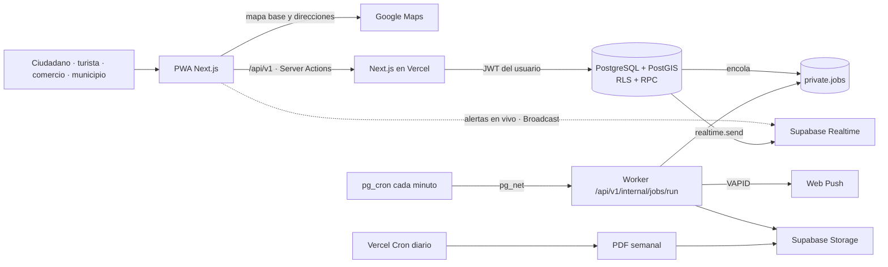
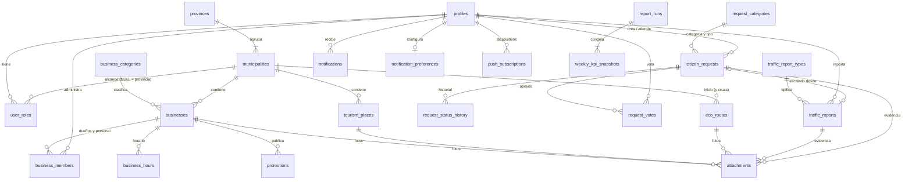
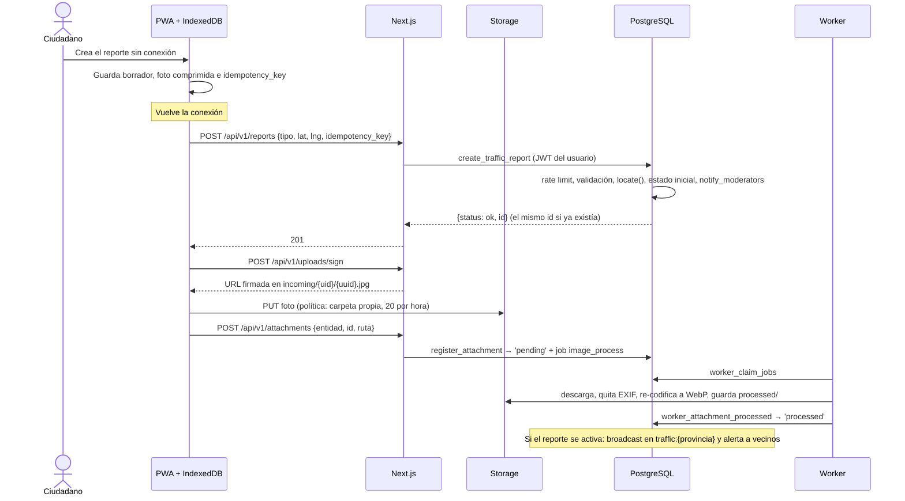
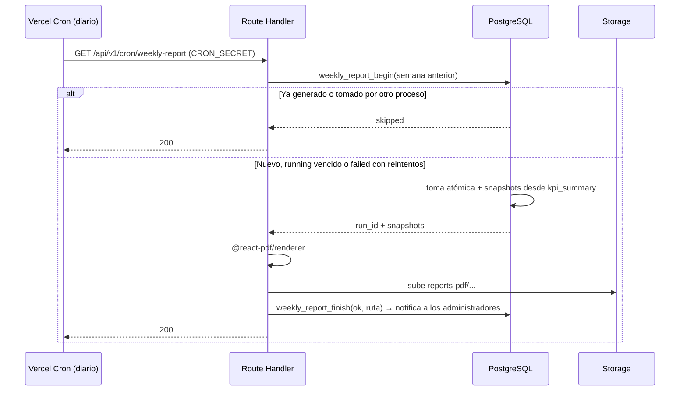
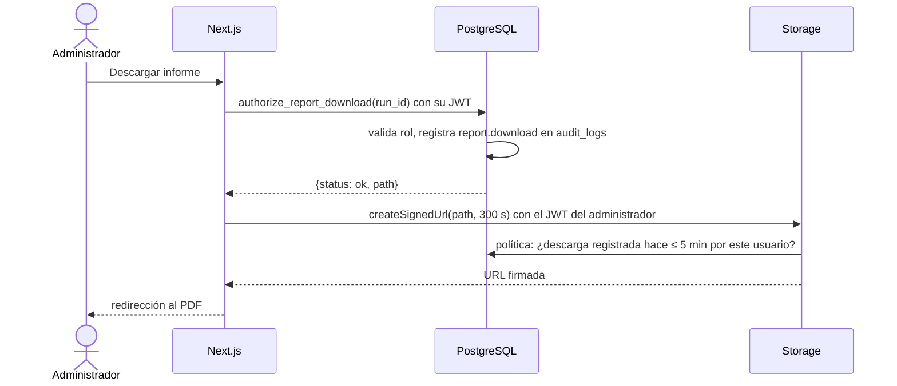

# SR Conecta — Arquitectura

> **Versión 2.3 · 2 de octubre de 2026**
> Plataforma geográfica para la provincia Santiago Rodríguez (República Dominicana), para el reto TechEmprende SR Conecta 2026.
> Este documento es la referencia única de diseño antes de programar. Reemplaza a las versiones 1.x: el historial de esas versiones está en Git.

---

## Índice

0. [Cómo leer este documento](#0-cómo-leer-este-documento)
1. [Contexto y requisitos](#1-contexto-y-requisitos)
2. [La solución en una página](#2-la-solución-en-una-página)
3. [Principios](#3-principios)
4. [Stack](#4-stack)
5. [Arquitectura del sistema](#5-arquitectura-del-sistema)
6. [Frontend y experiencia de uso](#6-frontend-y-experiencia-de-uso)
7. [Mapa y geografía](#7-mapa-y-geografía)
8. [Backend y datos](#8-backend-y-datos)
9. [Módulos funcionales](#9-módulos-funcionales)
10. [Seguridad y privacidad](#10-seguridad-y-privacidad)
11. [Tiempo real, trabajos asíncronos y tareas programadas](#11-tiempo-real-trabajos-asíncronos-y-tareas-programadas)
12. [API](#12-api)
13. [Operación](#13-operación)
14. [Calidad: pruebas y rendimiento](#14-calidad-pruebas-y-rendimiento)
15. [Estructura del repositorio](#15-estructura-del-repositorio)
16. [Alcance, plan y fases](#16-alcance-plan-y-fases)
17. [Riesgos](#17-riesgos)
18. [Decisiones de arquitectura (ADR)](#18-decisiones-de-arquitectura-adr)
19. [No hacer](#19-no-hacer)
20. [Pendiente de verificar](#20-pendiente-de-verificar)

---

## 0. Cómo leer este documento

| Si necesitas… | Ve a |
|---|---|
| Entender qué se construye y por qué | §1, §2, §3 |
| Saber qué tecnología usar | §4 |
| Implementar una funcionalidad | §9 (módulo) + §12 (API) + [DATABASE.md](DATABASE.md) (RPC y tablas) |
| Revisar permisos o seguridad | §10 |
| Desplegar u operar | §13 |
| Saber qué entra en el MVP | §16 |

**Jerarquía de fuentes.** Si dos fuentes discrepan, manda la primera:

1. El SQL de [`supabase/migrations/`](supabase/migrations). Es ejecutable y está probado (§14.1).
2. [DATABASE.md](DATABASE.md): explica el SQL (tablas, RPC, RLS, índices).
3. Este documento: arquitectura, módulos, operación y decisiones.

Este documento no repite columnas ni firmas de funciones: las nombra y remite a DATABASE.md.

**Etiquetas de fase:**
- **[MVP]**: se entrega para la demo del reto (28–30/10/2026).
- **[Fase 2]**: producción municipal.
- **[Fase 3]**: escala regional.

Si una capacidad no tiene etiqueta, es [MVP].

**Estado del repositorio (02/10/2026):**

| Pieza | Estado |
|---|---|
| Base de datos (23 migraciones, 142 pruebas), aplicada en Supabase staging | ✅ Verificada |
| Decisiones de arquitectura ([`docs/decisions/`](docs/decisions)) | ✅ 21 ADR |
| Mapa con tránsito en vivo, acceso por código, reportes y seguimiento, perfil | ✅ Funcionando contra staging |
| Panel municipal: resumen, bandeja, validaciones, informes, equipo, auditoría | ✅ |
| Worker de la cola, informe semanal en PDF, PWA sin conexión, Web Push | ✅ |
| Negocios, turismo, rutas y propuestas: fichas, alta, panel del comercio, edición | ✅ |
| Proveedor Google Maps, despliegue en Vercel con dominio y correo propio | ⏳ Pendiente de cuentas |

---

## 1. Contexto y requisitos

### 1.1 El reto

Fuente: bases oficiales de conectasr.com (endpoint público `/api/convocatoria`), leídas el 24/09/2026.

| Hecho | Consecuencia para la arquitectura |
|---|---|
| Provincia Santiago Rodríguez, con 3 municipios: San Ignacio de Sabaneta (cabecera), Monción y Villa Los Almácigos | Territorio pequeño: cientos a pocos miles de puntos. No se optimiza para millones. |
| La organización entrega **datos geográficos abiertos** de la provincia | Se importan a PostGIS. PostGIS es la fuente de verdad territorial, no Google. |
| Demo en vivo de **25 minutos con datos reales** | Semilla reproducible, guion de demo y plan B si falla un servicio externo. |
| El ganador libera el código con **MIT o Apache 2.0** y lo transfiere a FUNDESER | Todas las dependencias deben tener licencia compatible. Cuentas de la organización desde el día uno, nunca personales. |
| Stack libre; se evalúa el resultado | Se prioriza lo que se demuestra bien y se puede mantener. |
| "Cualquier ciudadano ingresa datos y **recibe notificaciones** sobre el mapa" | Notificaciones in-app obligatorias, alertas de tránsito por municipio y push como canal adicional. |
| Entregables: MVP, mapa integrado, panel municipal, PDF semanal, **repositorio público en GitHub** con documentación técnica y manual de despliegue, demo de 25 min | El repositorio se hace público antes de la entrega (hoy es privado). |
| Calendario: desarrollo hasta el **27/10/2026**; demo del **28 al 30/10/2026** | Unas 5 semanas de construcción (§16.3). |

**Criterios de evaluación (100 puntos):**

| Criterio | Puntos | Cómo lo atiende la arquitectura |
|---|---|---|
| MVP funcional | 25 | Las 6 funcionalidades obligatorias en el alcance mínimo (§16.1) |
| UX/UI para **baja alfabetización digital** | 20 | Reglas de lenguaje e interacción (§6.2) y prueba con vecinos |
| Innovación (geolocalización, tiempo real, IA o automatización) | 20 | Alertas de tránsito en vivo (§11.1), alertas por municipio (§9.5), PDF automático (§9.6) |
| Pertinencia territorial | 15 | Datos abiertos de la provincia, municipios como unidad de gestión |
| Sostenibilidad: el municipio opera sin el equipo | 10 | Catálogos editables sin deploy, manuales, costos bajos (§13) |
| Código y documentación | 10 | Base de datos probada, ADRs, este documento |

### 1.2 Las seis funcionalidades obligatorias

Texto literal de las bases:

| F | Funcionalidad | Texto de las bases |
|---|---|---|
| F1 | Mapa Interactivo Ciudadano | "Mapa en tiempo real donde cualquier usuario puede ver y agregar puntos de interés, negocios, rutas y alertas georreferenciadas." |
| F2 | Negocios Turísticos y Locales | "Registro abierto de negocios locales y establecimientos turísticos con categorías, fotos, horarios y datos de contacto." |
| F3 | Rutas de Ecoturismo | "Trazado y consulta de rutas ecológicas, culturales y de aventura con información de dificultad, duración y servicios disponibles." |
| F4 | Reporte de Tránsito | "Sistema colaborativo de alertas viales: accidentes, cierres, baches, semáforos dañados y desvíos en tiempo real." |
| F5 | Consultas Ciudadanas | "Canal digital para que los ciudadanos reporten problemas comunitarios, voten prioridades y den seguimiento a sus solicitudes." |
| F6 | Reportes Semanales Automáticos | "Generación automática de informes en PDF con métricas de uso, reportes por municipio y estado de solicitudes." |

### 1.3 Trazabilidad: requisito → diseño

| Requisito | Módulo | Piezas en la base de datos | Estado |
|---|---|---|---|
| F1 ver el mapa | §7, §9.1 | `map_features`, `map_aggregates`, `search_all` | ✅ SQL probado |
| F1 agregar puntos de interés y rutas | §9.4 | `propose_place`, `propose_route`, `review_content` | ✅ |
| F1 agregar negocios | §9.3 | `submit_business` | ✅ |
| F1 alertas georreferenciadas en tiempo real | §9.2, §11.1 | `create_traffic_report`, trigger `traffic_reports_broadcast` | ✅ (canal Realtime: verificar en Supabase, §20) |
| F2 registro abierto con categorías y contacto | §9.3 | `submit_business`, `update_business` | ✅ |
| F2 fotos | §9.3, §10.5 | `register_attachment`, `worker_attachment_*` | ✅ |
| F2 horarios | §9.3 | `set_business_hours`, tabla `business_hours` | ✅ |
| F3 trazado y consulta | §9.4 | `propose_route` (GeoJSON), `update_route` | ✅ |
| F3 dificultad, duración y servicios | §9.4 | columnas `difficulty`, `duration_min` y `services` de `eco_routes` | ✅ |
| F4 los cinco tipos de alerta | §9.2 | catálogo `traffic_report_types` | ✅ |
| F4 colaborativo | §9.2 | reputación y moderación en `moderate_traffic_report` | ✅ |
| F5 reportar problemas | §9.2 | `create_citizen_request` | ✅ |
| F5 votar prioridades | §9.2 | `toggle_request_vote`, `request_votes` | ✅ |
| F5 dar seguimiento | §9.2 | `my_activity`, `request_status_history`, notificaciones | ✅ |
| F6 PDF automático | §9.6 | `weekly_report_begin`/`weekly_report_finish`, `kpi_summary`, `authorize_report_download` | ✅ SQL · ⏳ generación del PDF |
| "Recibe notificaciones sobre el mapa" | §9.5 | `notifications`, `worker_run_fanout_alert` | ✅ SQL · ⏳ envío push |
| Panel municipal | §9.7 | RPC de moderación, `kpi_summary` | ✅ SQL · ⏳ interfaz |

---

## 2. La solución en una página

SR Conecta es un **monolito modular**:
- **Aplicación:** Next.js 16 (App Router) con TypeScript, desplegada en Vercel.
- **Datos:** Supabase (PostgreSQL + PostGIS, Auth, Storage).
- **Mapa base:** Google Maps, detrás de un adaptador propio.

Tres ideas sostienen todo el diseño:

1. **PostgreSQL es la fuente de verdad y la barrera de seguridad.** Toda operación que cambia estado, permisos o contadores es una función SQL (RPC) que valida todo por sí misma. Cualquiera puede llamar la API de Supabase directamente, sin pasar por Next.js (ADR-018).
2. **Google aporta el mapa base, nunca los datos.** Negocios, rutas, reportes y consultas viven en PostGIS. Google solo pinta el mapa, busca direcciones y ofrece el enlace "Cómo llegar".
3. **Todo efecto lento o externo va por una cola.** Push, procesamiento de fotos y alertas se encolan en la misma transacción que los origina y los ejecuta un worker con reintentos (ADR-016).



---

## 3. Principios

1. **La base de datos decide.** El cliente propone (ubicación, fotos, texto) y la RPC valida y decide. Zod en Next.js es UX y defensa temprana, no la barrera.
2. **Una operación crítica es una transacción.** Nunca "leer en JS, decidir en JS, escribir en JS".
3. **Rechazar no es fallar.** Un rechazo de negocio (límite alcanzado, transición no válida) se **devuelve** como `{status:'rejected', reason}` y hace commit, para que el contador de rate limit y la auditoría persistan. `RAISE EXCEPTION` queda solo para errores de programación.
4. **Mínimo privilegio.** No hay `super_admin` (ADR-020). Cada rol tiene alcance territorial, y las columnas personales están ocultas por grants.
5. **Google por intención del usuario, nunca por evento del mapa.**
6. **Privacidad por defecto.** Ubicación puntual ligada a una acción, nunca rastreo. Sin EXIF en las fotos. Sin autor en el mapa público.
7. **Todo cambio relevante deja rastro:** historial de estados, acciones de moderación y auditoría.
8. **Reintentar es seguro.** Idempotencia en creaciones reintentables, compare-and-set en cambios de estado y bloqueo optimista en ediciones.
9. **Evolución aditiva.** Esquema, API y eventos crecen agregando, nunca renombrando ni borrando en el mismo release. Lo que costará caro después y poco hoy se prepara ya: `province_id`, estados como texto, catálogos en tablas y PK particionables (ADR-017).
10. **Diseñar para transferir.** Otro equipo debe poder operar la plataforma con lo que hay en el repositorio.

---

## 4. Stack

Una sola tabla, con la fase en que entra cada pieza.

| Área | Tecnología | Fase | Nota |
|---|---|---|---|
| Framework | Next.js 16.3 (App Router) + React 19.3 + TypeScript 6.0 `strict` | MVP | `proxy.ts` (antes `middleware.ts`) solo refresca la sesión. TypeScript 6.0 y no 7: `typescript-eslint` exige TypeScript < 6.1 |
| Lint | ESLint 9 + `eslint-config-next` + `typescript-eslint` + `eslint-plugin-boundaries` | MVP | ESLint 9 y no 10: los plugins de `eslint-config-next` (`import`, `jsx-a11y`, `react`) aún no soportan ESLint 10. Actualizar cuando lo soporten |
| UI | Tailwind CSS + shadcn/ui | MVP | Componentes copiados al repo, sin dependencia en runtime |
| Formularios | React Hook Form + Zod | MVP | Un esquema Zod por operación, compartido cliente/servidor |
| Estado | TanStack Query (datos del mapa) + Zustand (UI del mapa) | MVP | Sin Redux |
| Gráficos | Recharts | MVP | Panel municipal |
| Mapa | Google Maps JavaScript API vía `@vis.gl/react-google-maps`, AdvancedMarkerElement (requiere Map ID), `@googlemaps/markerclusterer` | MVP | Detrás del adaptador `modules/map/provider` |
| Direcciones | Places Autocomplete (New) con session tokens | MVP (opcional) | Solo si la búsqueda propia no encuentra nada |
| Navegación | Enlace `https://www.google.com/maps/dir/?api=1&destination=lat,lng` | MVP | Sin costo de API |
| Tráfico de Google | TrafficLayer como capa opcional | MVP (opcional) | Apagada por defecto |
| Base de datos | Supabase PostgreSQL + PostGIS + `pg_trgm` + `unaccent` + `pgcrypto` | MVP | Probado en PostgreSQL 18.3 + PostGIS 3.6.2; compatible con 15+ |
| Lógica crítica | RPC PL/pgSQL + RLS + grants por columna | MVP | ADR-018 |
| Auth | Supabase Auth: email con contraseña u OTP/magic link; Google OAuth opcional; captcha Turnstile nativo | MVP | SMS postergado por costo |
| Email | SMTP propio (Resend, Amazon SES o Brevo) configurado en Supabase Auth | MVP | El SMTP por defecto de Supabase es solo para pruebas |
| Archivos | Supabase Storage: `report-evidence` (privado), `public-media` (público), `reports-pdf` (privado) | MVP | §10.5 |
| Tiempo real | Supabase Realtime **Broadcast**, solo para alertas de tránsito públicas | MVP | ADR-012 |
| Cola y planificador | `private.jobs` + `pg_cron` + `pg_net` + Supabase Vault | MVP | ADR-016 |
| PWA | Web App Manifest + Serwist | MVP | §6.4 |
| Push | Web Push + VAPID (librería `web-push`) | MVP | Sin Firebase |
| PDF | `@react-pdf/renderer` en Route Handler (runtime Node) | MVP | Vercel Cron diario |
| Errores | Sentry | MVP | Plan gratuito de 1 usuario (verificar, §20) |
| Pruebas | PGlite (base de datos) ✅, regla de fronteras (`node:test`) ✅, Vitest y Playwright ⏳ | MVP | §14 |
| CI/CD | GitHub Actions + Vercel | MVP | `.github/workflows/ci.yml` ✅ (lint, typecheck, fronteras, base de datos). Producción: migrar → desplegar (ADR-019) ⏳ |
| Hosting | Vercel (Hobby en demo → Team Pro) + Supabase (Free en demo → Pro) | MVP → Fase 2 | Cuentas de la organización |
| Por PR | Supabase Branching | Fase 2 | Requiere plan Pro |
| Protección extra | Vercel Firewall | Fase 2 | |
| Tiles propios | `ST_AsMVT` | Fase 2/3 | Solo si los negocios superan ~20 000 |
| Cola dedicada | `pgmq` o Inngest | Fase 3 | Mismo contrato de productores |
| Routes API | — | Futura | Solo si se exige ruta dibujada dentro de la app |
| **No usar** | Firebase (FCM, Firestore), Redux, Express/NestJS, microservicios, Kubernetes, Edge Functions en MVP | — | §19 |

---

## 5. Arquitectura del sistema

### 5.1 Despliegue

```text
┌──────────────────────── Dispositivo (PWA) ─────────────────────────┐
│ Next.js client · Mapa (Google Maps JS) · Service Worker (Serwist)   │
│ Borradores y cola offline (IndexedDB) · Web Push · canal Broadcast  │
└──────────────┬──────────────────────────────┬───────────────────────┘
               │ HTTPS (cookie de sesión)       │ Maps JS / Autocomplete
               ▼                                ▼
┌──────────── Vercel ─────────────┐   ┌──── Google Maps Platform ────┐
│ Next.js 16                      │   │ Maps JS · Places Autocomplete │
│ · Server Components (páginas)   │   └──────────────────────────────┘
│ · Route Handlers /api/v1        │
│ · Server Actions (paneles)      │
│ · proxy.ts (solo sesión)        │
│ · Vercel Cron diario → PDF      │
│ · Worker /api/v1/internal/jobs  │◄──── pg_net (pg_cron, cada minuto)
└──────────────┬──────────────────┘
               │ supabase-js con el JWT del usuario
               │ (service_role solo en worker y cron)
               ▼
┌──────────────────────── Supabase ─────────────────────────┐
│ PostgreSQL + PostGIS + pg_trgm + unaccent                   │
│ RLS · RPC SECURITY DEFINER · grants por columna · triggers  │
│ private.jobs · pg_cron · pg_net · Vault                     │
│ Auth (SMTP propio, Turnstile) · Storage · Realtime Broadcast│
└─────────────────────────────────────────────────────────────┘
```

### 5.2 Capas del backend

No hay un servidor de aplicación separado. Son **cuatro capas con una sola autoridad**:

| # | Capa | Responsabilidad | No debe |
|---|---|---|---|
| 1 | Route Handler / Server Action | Transporte HTTP, sesión (`getUser()`), validación de forma con Zod, traducción de `reason` a HTTP | Decidir permisos o estados; usar `service_role` en requests de usuario |
| 2 | Servicio TS (`modules/<dominio>/server`) | Orquestar, combinar lecturas, firmar URLs de Storage | Encadenar varias escrituras esperando atomicidad (entre RPC no hay transacción) |
| 3 | **RPC en `public`** | Regla de negocio completa y atómica: identidad, rol, alcance, entradas, rate limit, historial, auditoría, encolado | Llamar servicios externos de forma síncrona |
| 4 | Tablas | Invariantes: `CHECK`, FK, `UNIQUE`, RLS, grants por columna, triggers de derivados | Contener reglas de negocio ocultas |

**Lecturas:**
- Las simples van a las tablas con el JWT del usuario, y RLS filtra.
- Las compuestas o públicas van por RPC `SECURITY INVOKER` (`map_features`, `map_aggregates`, `search_all`), así RLS sigue aplicando.

**Escrituras:** siempre por RPC. Las únicas excepciones son las filas propias de preferencias, suscripciones push, marcar una notificación como leída y 4 columnas del perfil (DATABASE.md §7).

### 5.3 Dónde corre cada cosa

| Lugar | Qué hace |
|---|---|
| Navegador | Render, ubicación (con permiso), compresión de fotos, borradores y cola offline, validación temprana |
| Next.js (Vercel) | Páginas, API `/api/v1`, Server Actions, firma de URLs de Storage, worker de la cola (procesamiento de fotos, push, alertas), PDF |
| PostgreSQL | Reglas de negocio, pertenencia territorial, transiciones, historial, auditoría, rate limits, encolado, broadcast |
| Google | Mapa base, autocompletado de direcciones, navegación externa |

---

## 6. Frontend y experiencia de uso

### 6.1 Organización

- **Dos caras en una app.** El sitio público con SSR (inicio, fichas de negocio, lugar y ruta) y la aplicación de mapa del lado del cliente.
- **Route groups:** `(public)`, `(app)` (mapa y cuenta), `(business)` (panel del comercio) y `(admin)` (panel municipal). Cada uno tiene su layout, `loading.tsx`, `error.tsx` y `not-found.tsx`.
- **El mapa se carga con `dynamic(..., { ssr: false })`** detrás de un esqueleto. La primera pintura nunca espera a Google.
- **Todo lo que está en el mapa tiene equivalente en lista.** Es un requisito de accesibilidad y el plan B si Google falla.
- **Filtros en la URL** (`?capas=turismo,transito&cat=…`), para poder compartir enlaces.
- **Idioma:** solo español en el MVP, con los textos centralizados. El inglés para turistas llega en Fase 2, usando la columna `translations` que ya existe.

### 6.2 Baja alfabetización digital (criterio de 20 puntos)

- Lenguaje simple y en segunda persona: "Reportar un problema", no "Crear incidencia".
- Cada acción lleva ícono **y** texto. Las categorías usan íconos grandes.
- Flujos de 3 pasos como máximo, con una decisión por pantalla.
- Un reporte se puede enviar solo con tipo, ubicación y foto, sin escribir texto.
- Los estados se explican con palabras ("Lo están revisando"), no con códigos.
- El texto base mide 16 px o más, y los objetivos táctiles al menos 44×44 px.
- Antes de la demo se prueba con al menos 5 vecinos reales.

### 6.3 Estados de pantalla, formularios y accesibilidad

- **Estados de pantalla.** Toda vista con datos implementa `LOADING` (esqueleto), `EMPTY` (explica por qué y qué hacer), `ERROR` (mensaje claro y botón de reintentar, sin detalles internos), `DISABLED` (con motivo, por ejemplo "sin conexión"), `UNAUTHORIZED` y `NOT FOUND`.
- **Formularios:**
  - el botón se desactiva mientras se envía, y la `idempotency_key` evita duplicados;
  - los errores van por campo, asociados con `aria-describedby`;
  - el foco pasa al primer error.
- **Responsive, mobile-first,** con cortes en 640 / 768 / 1024 / 1280 px:
  - móvil: mapa a pantalla completa, barra inferior y bottom sheets;
  - escritorio: panel lateral fijo.
- **WCAG 2.1 AA:**
  - controles reales (`<button>`, `<a>`) y foco visible;
  - se respeta `prefers-reduced-motion`, también en las animaciones del mapa;
  - el contraste AA se verifica con axe en los E2E.

### 6.4 PWA y modos de conexión

- **Instalación.** Manifest con `display: standalone` y `start_url: /mapa`; service worker con Serwist.
- **iPhone.** Se muestran instrucciones para "Añadir a pantalla de inicio". En iOS, Web Push solo funciona con la PWA instalada (iOS 16.4+).
- **Modos de conexión.** Siempre visibles en la barra superior; nunca se simula un offline que no existe:

| Modo | Cuándo | Funciona | Se bloquea (con explicación) |
|---|---|---|---|
| **ONLINE** | Red y API responden | Todo | — |
| **DEGRADED** | Hay red, pero falla un servicio (Google, API con 5xx, Storage) | Lista en lugar de mapa; caché con aviso "datos de hace X min"; borradores y cola | Lo que dependa del servicio caído |
| **OFFLINE** | Sin red | Shell, pantallas visitadas, última lista de lugares y rutas, borradores de reporte y consulta con foto comprimida, cola de envío, "mis reportes" (último estado sincronizado) | Mapa base de Google (sus términos no permiten cachear tiles), búsqueda, alta de negocios, panel |

**Cola offline:**
- cada item lleva una `idempotency_key` generada en el cliente;
- se reintenta con Background Sync donde exista, o al abrir la app en iOS;
- si la sesión expiró, el item queda como "requiere iniciar sesión" y nunca se descarta en silencio.

**Actualizaciones.** Aviso "nueva versión disponible" y recarga, sin `skipWaiting` silencioso durante un formulario.

**Caché:**

| Tipo de recurso | Estrategia |
|---|---|
| Estáticos | `CacheFirst` versionado |
| Catálogos públicos | `StaleWhileRevalidate` |
| Datos de usuario | `NetworkOnly` |

---

## 7. Mapa y geografía

### 7.1 Capas

| Capa | Geometría | Volumen | Carga |
|---|---|---|---|
| Municipios (3) | MultiPolygon | 3 | Una vez por sesión: `geom_simplified`, con caché CDN larga |
| Rutas de ecoturismo | MultiLineString | decenas | Una vez por sesión (simplificadas); geometría completa al abrir la ruta |
| Lugares turísticos | Point | decenas–cientos | Por viewport (`map_features`, capa `tourism`) |
| Negocios aprobados | Point | cientos → miles | Por viewport (capa `business`) |
| Alertas de tránsito | Point | decenas | Por viewport (capa `traffic`): solo `active`/`verified` no vencidas, sin autor. Además, en vivo por Broadcast (§11.1) |
| Consultas públicas | Point | cientos | Por viewport (capa `request`): solo `is_public` en `approved`, `in_progress` o `resolved`, sin autor |

Las consultas **no públicas** no están en el mapa público:
- el ciudadano ve las suyas en "Mi actividad" (`my_activity`);
- el personal las ve en la bandeja del panel, que lee las tablas filtradas por RLS.

No existe un endpoint de mapa autenticado aparte.

### 7.2 Zoom y viewport

| Zoom de Google | Qué se muestra | Fuente |
|---|---|---|
| ≤ 10 (provincia) | Municipios con conteos por capa | `map_aggregates()`: conteos públicos por municipio y un punto dentro de cada polígono |
| 11–14 (municipio) | Clusters | `map_features` + MarkerClusterer en cliente |
| ≥ 15 (calle) | Todos los puntos, con ícono por categoría | `map_features`; el detalle se pide al tocar un punto |

**Flujo de consulta:**
1. El mapa emite el evento `idle` (no `bounds_changed`); se espera 300 ms de debounce.
2. El bbox se redondea hacia afuera a una rejilla de 0.01°, para compartir caché.
3. No se consulta si el bbox está contenido en uno ya cargado con los mismos filtros.
4. `map_features` rechaza bbox inválidos o de más de 2° por lado, y devuelve como máximo 500 features con `truncated: true` cuando hay más. El cliente sugiere entonces acercar el mapa.
5. La respuesta de viewport lleva solo `id`, tipo, categoría, coordenadas y título. Fotos, horario y descripción se piden al abrir la ficha.

**[Fase 2/3]:** si los negocios superan ~20 000, se pasa a vector tiles propios (`ST_AsMVT`) con caché CDN.

### 7.3 Uso de Google Maps

| API | Uso | Nunca |
|---|---|---|
| Maps JavaScript (Dynamic Maps) | Una carga por apertura de la vista mapa | Recargar el mapa al cambiar de pestaña interna |
| AdvancedMarkerElement + MarkerClusterer | Marcadores y clusters (requiere Map ID) | Miles de marcadores sin clustering |
| Places Autocomplete (New) | "Buscar una dirección" cuando la búsqueda propia no encuentra nada; vincular `google_place_id` en el alta de negocio | Una llamada por tecla sin session token; poblar la capa de negocios |
| Place Details (New) | Al elegir una sugerencia: solo `location` y `formattedAddress` (field mask) | Pedir fotos, reseñas o rating |
| Navegación | Botón "Cómo llegar" con enlace (sin costo de API) | — |
| TrafficLayer | Capa opcional que enciende el usuario | Encendida por defecto (la cobertura rural es incierta) |
| Geocoding inverso | Opcional: dirección legible al reportar | Calcular el municipio (eso lo hace PostGIS) |

**Qué se guarda de Google:**
- **`google_place_id`:** se puede guardar indefinidamente, en `businesses.google_place_id`.
- **Coordenadas de Google:** nunca son la coordenada oficial. El dueño o el moderador confirman el pin, y esa coordenada es un dato propio.
- **Nombre, fotos y reseñas de Google:** no se almacenan.

**Claves:**
- La clave de navegador se restringe por referrer (dominios de producción y previews) y por API.
- Proyectos de Google Cloud separados para dev y prod.
- Cuotas diarias por API y alertas de presupuesto al 50/80/100 %.
- Facturación a nombre de la organización.

**Plan B: MapLibre GL + tiles OSM.** Toda la app habla con el adaptador (`MapView`, `addLayer(geojson)`, `onFeatureClick`), nunca con `google.maps.*`, y nuestra API devuelve GeoJSON neutral. Como los términos de Google prohíben mostrar su contenido sobre mapas no-Google, solo nuestros datos migrarían.

### 7.4 PostGIS

| Tema | Decisión |
|---|---|
| SRID | 4326 (WGS84) en todas las columnas, con typmod `geometry(<Tipo>, 4326)` |
| Distancias en metros | Cast a `geography`, con índice GiST de expresión `((geom::geography))` |
| Viewport | `geom && ST_MakeEnvelope(...)` con índice GiST |
| Pertenencia a municipio | `private.locate(geom)`, **llamada dentro de cada RPC** que crea o mueve un punto: el municipio que cubre el punto (`ST_Covers`, el borde cuenta). Si ninguno lo cubre, el más cercano a ≤ 2 km. Si tampoco hay, ninguno |
| Fuera de la provincia | Un reporte de tránsito queda `out_of_area`, visible solo para el alcance provincial. Una consulta o propuesta se rechaza con `out_of_area`. Una consulta sin ubicación exige que el ciudadano elija el municipio |
| Rutas | `municipality_id` = municipio del punto de inicio. `municipality_ids` = todos los municipios que cruza (trigger `eco_routes_municipalities`). `distance_km`, `start_point` y `geom_simplified` son columnas generadas. Entre 2 y 5 000 vértices |
| Provincia | `province_id` en toda tabla territorial, con FK compuesta `(municipality_id, province_id)`: es imposible guardar un municipio de otra provincia |
| Importación | Datos abiertos con `ogr2ogr` → staging → `ST_IsValid`/`ST_MakeValid` → tablas finales. **Simplificación topológica en la importación** (mapshaper, o `ST_CoverageSimplify` si la versión lo soporta, §20), para que las fronteras compartidas no queden con huecos |

`supabase/seed.sql` trae municipios **rectangulares de demostración**, que se reemplazan por los límites oficiales.

**Consultas espaciales tipo.** Son patrones para funciones nuevas; hoy el SQL usa el viewport y la pertenencia:

| Pregunta | Patrón | Índice que usa |
|---|---|---|
| Objetos visibles en pantalla | `geom && ST_MakeEnvelope(minLng, minLat, maxLng, maxLat, 4326)` + filtros + `LIMIT 500` | GiST de `geom` |
| Negocios a 1 km de un punto | `ST_DWithin(geom::geography, punto::geography, 1000)` + `ORDER BY geom <-> punto` + `LIMIT` | GiST de expresión `(geom::geography)` |
| Lugares turísticos a 2 km | El mismo patrón, con 2000 | Ídem |
| Rutas cercanas | `ST_DWithin(ruta.geom::geography, punto::geography, 3000)` | Ídem |
| Reportes dentro de una zona dibujada | `ST_Intersects(r.geom, zona)` | GiST de `geom` |
| Clustering en servidor (si el cliente no alcanza) | `ST_SnapToGrid(geom, tamaño_de_celda_por_zoom)` + `count(*)` agrupado | GiST de `geom` |

---

## 8. Backend y datos

Resumen. El detalle (columnas, índices, políticas, matriz de grants) está en [DATABASE.md](DATABASE.md).

### 8.1 Cifras del esquema verificado

| | |
|---|---|
| Migraciones | 17 (`20260924120000` a `20260925120000`) |
| Tablas | 27 en `public` (todas con RLS) y 6 en `private` |
| Funciones | 35 en `public` (32 `SECURITY DEFINER`, 3 `SECURITY INVOKER`) y 34 en `private` |
| Seguridad | 31 políticas RLS + 4 de Storage; grants por columna; `EXECUTE` explícito por función |
| Índices | 109, incluidos GiST, GIN y parciales |
| Triggers | 16 |
| Pruebas | 113, todas pasan (§14.1) |

### 8.2 Esquemas y roles de base de datos

| Esquema | Expuesto por la Data API | Contenido |
|---|---|---|
| `public` | Sí | Tablas de negocio con RLS y las RPC invocables |
| `private` | No | Helpers de RLS, transiciones, rate limit, cola, mantenimiento. Los helpers que usan las políticas tienen `EXECUTE` concedido a `anon`/`authenticated`, porque las políticas se evalúan con el rol del usuario |
| `extensions` | No | PostGIS, `pg_trgm`, `unaccent`, `pgcrypto`, `pg_net`. Con `USAGE` concedido, para que las funciones INVOKER vean los tipos de PostGIS |

| Rol de Postgres | Quién |
|---|---|
| `anon` | Visitante sin sesión |
| `authenticated` | Usuario con sesión. Su rol de negocio real sale de `user_roles` |
| `service_role` | Solo el worker y el cron, en el servidor |

### 8.3 Contrato de las RPC

1. La identidad sale de `auth.uid()`, nunca de un parámetro.
2. Cada RPC asume que la llaman directamente con la anon key y valida todo por sí misma.
3. Los rechazos se devuelven (`{status:'rejected', reason}`), no se lanzan.
4. **Idempotencia** con `p_idempotency_key` y `UNIQUE (autor, clave)` en las tres creaciones que se reintentan desde la cola offline o un doble envío: `create_traffic_report`, `create_citizen_request` y `submit_business`. Las demás creaciones se protegen con rate limit y restricciones únicas (`request_votes`, `business_hours`) o con `FOR UPDATE` (`escalate_traffic_report` devuelve la incidencia existente).
5. **Compare-and-set** en cambios de estado: `p_expected_status`. Si otro se adelantó, se devuelve `stale_state` con el estado actual.
6. **Bloqueo optimista** en ediciones: `p_version`. Si no coincide, se devuelve `version_conflict`. Lo usan `update_business`, `update_place` y `update_route`.
7. Los efectos secundarios se encolan con `private.enqueue()` en la misma transacción.
8. `SECURITY DEFINER` siempre con `search_path` fijo:
   - RPC de `public`: `pg_catalog, extensions, public`, porque usan tipos de PostGIS;
   - helpers internos: `''`, con nombres totalmente calificados.

**Mapeo de `reason` a HTTP** (capa 1):

| Resultado | HTTP |
|---|---|
| `status: ok` | 200 / 201 |
| `not_authenticated` | 401 |
| `forbidden`, `own_request` | 403 |
| `not_found` | 404 |
| `stale_state`, `version_conflict`, `conflict` | 409 |
| Errores de validación (`invalid_*`, `*_required`, `out_of_area`, `not_votable`, `no_changes`, `unknown_field`, `bbox_too_large`, …) | 422 |
| `rate_limited` | 429 |
| Excepción no controlada | 500 sin detalles; el detalle va a Sentry |

### 8.4 Modelo de datos (resumen)



Tablas que no aparecen en el diagrama porque no tienen relaciones que aporten:
- **en `public`:** `feature_flags`, `engagement_daily` (métricas diarias agregadas), `moderation_actions` y `audit_logs`;
- **en `private`:** `jobs`, `rate_limit_rules`, `rate_limit_hits` y las tres tablas de transiciones.

**Decisiones de modelo que conviene conocer antes de programar:**

| Decisión | Motivo |
|---|---|
| Estados como `text` + `CHECK`, con transiciones en tablas `private.*_transitions` | Un `enum` no permite quitar ni renombrar valores |
| Adjuntos como **arco exclusivo**: una FK real por entidad y `CHECK (num_nonnulls(...) = 1)` | Cascadas reales y ningún adjunto huérfano |
| Horario normalizado en `business_hours` (`weekday`, `opens`, `closes`) | Permite consultar "abierto ahora". Si `closes < opens`, el negocio cierra después de medianoche |
| Grants por columna: `requester_id`, `reporter_id`, `assigned_to`, `created_by`, `proposed_by` e `idempotency_key` ocultos | RLS protege filas, no columnas |
| `audit_logs` con PK `(created_at, id)` | Lista para particionado mensual sin reescribir la tabla |
| `weekly_kpi_snapshots` inmutables por `report_run_id` | Cada PDF se puede auditar contra sus propios datos |
| `UNIQUE NULLS NOT DISTINCT` donde `NULL` significa "provincia" | Sin eso, dos `NULL` no chocan y se duplican filas |
| FK hacia `profiles`: `CASCADE` en los datos propios, `SET NULL` en el historial | La baja de una cuenta no rompe estadísticas ni historial |
| `translations jsonb` en negocios, lugares, rutas y categorías | Inglés en Fase 2 sin cambiar el esquema |
| En Storage se guarda `bucket` + `path`, nunca URLs | Se puede cambiar de dominio o CDN sin migrar datos |

### 8.5 Catálogos editables sin deploy

| Catálogo | Contenido inicial |
|---|---|
| `traffic_report_types` | accidente (gravedad 3, dura 3 h) · bache (2, 7 días) · calle_cerrada (2, 12 h) · derrumbe (3, 2 días) · desvio (1, 2 días) · obra (1, 7 días) · otro (1, 6 h) · semaforo (2, 2 días) · via_inundada (3, 12 h) |
| `request_categories` | Incidencias: agua, alumbrado, basura, infraestructura, otro_incidente · Consultas: consulta, propuesta, queja |
| `business_categories` | agroturismo, artesania, cafeteria, colmado, hotel, otro, restaurante, salud, servicios |
| `private.rate_limit_rules` | §10.6 |
| `feature_flags` | Activación por provincia o municipio |

En el MVP se editan por migración o SQL de operación. La pantalla de administración de catálogos llega en **[Fase 2]**.

---

## 9. Módulos funcionales

### 9.1 Mapa y búsqueda (F1)

- **Capas y zoom:** §7.
- **Búsqueda propia:** `search_all(q, limit)`.
  - Busca en negocios aprobados, lugares publicados y rutas publicadas.
  - Relevancia: el mayor valor entre `ts_rank` sobre `search_vector` (español, sin acentos; nombre con peso A, descripción con peso C) y la similitud por trigramas sobre `f_unaccent(name)`, que tolera errores como "monsion" → Monción.
  - La consulta admite de 2 a 80 caracteres y devuelve como máximo 50 resultados.
  - No ordena por cercanía. Eso queda para **[Fase 2]** si hace falta.
- **Dirección externa:** si `search_all` no encuentra nada, o si el usuario elige "Buscar una dirección", se usa Autocomplete de Google. El mapa se centra en el resultado, que no se guarda.
- **Aportes ciudadanos al mapa:**
  - lugares y rutas (§9.4);
  - negocios (§9.3);
  - alertas de tránsito (§9.2).

### 9.2 Participación ciudadana (F4 y F5)

Un solo botón "Reportar", con dos grupos. El servidor enruta cada tipo a su flujo:

| Grupo | Tabla | Naturaleza |
|---|---|---|
| **Tránsito** (los tipos de `traffic_report_types`) | `traffic_reports` | Temporal: vence solo y se ve en el mapa en vivo mientras está activo |
| **Servicios municipales**: incidencias (`kind = incident`) y consultas, quejas o propuestas (`kind = inquiry`) | `citizen_requests` | La gestiona el municipio hasta resolverla; los vecinos votan prioridades |

#### Reportes de tránsito

| Aspecto | Diseño |
|---|---|
| Crear | `create_traffic_report`: idempotente, 5 por hora. Punto obligatorio; gravedad 1–3 (si no se indica, la del tipo); descripción opcional (≤ 500) |
| Estado inicial | `out_of_area` si está fuera de la provincia; `active` si el autor tiene reputación ≥ 5; en otro caso `pending`, que modera el personal |
| Transiciones (`moderate_traffic_report`, compare-and-set) | `pending → active / rejected` · `active → verified / resolved / rejected` · `verified → resolved` · `out_of_area → rejected` |
| Reputación | +1 cuando un reporte pasa a `active` o `verified`; −2 cuando se rechaza (rango −100 a 100) |
| Vencimiento | `expires_at = now() + default_ttl` del tipo. Las lecturas filtran siempre por `expires_at > now()`, así que la visibilidad no depende del job. `pg_cron` marca `expired` cada 15 minutos, para los KPIs y para avisar por Broadcast |
| Tiempo real | Cada cambio a `active`, `verified`, `resolved`, `expired` o `rejected` se emite por Broadcast (§11.1) |
| Alerta a vecinos | Al activarse un reporte de gravedad ≥ 2 se encola una alerta por municipio (§9.5) |
| Fotos | Hasta 3, en el bucket privado (§10.5) |
| Escalar | `escalate_traffic_report(id, categoría)`: el personal convierte, por ejemplo, un bache que no se resuelve solo en una incidencia municipal enlazada (`escalated_request_id`). Conserva autor y ubicación. Repetir la llamada devuelve la misma incidencia |
| "Ya no está" | **[Fase 2]**: confirmación comunitaria del ciudadano |

#### Incidencias y consultas municipales

```text
pending → under_review → approved → in_progress → resolved → archived
   │            │            │
   └────────────┴────────────┴──→ rejected   (motivo obligatorio y visible)
```

| Aspecto | Diseño |
|---|---|
| Crear | `create_citizen_request`: idempotente, 5 por hora. `incident` exige punto. `inquiry` admite punto o municipio elegido. La categoría debe coincidir con el `kind` (FK compuesta) |
| Transiciones | `change_request_status` con compare-and-set, **un paso por llamada**, según `private.request_transitions`. Personal del municipio (o el asignado) salvo `resolved → archived`, que requiere `municipal_admin`. `in_progress` exige responsable; `resolved` exige nota; `rejected` exige motivo |
| Protección del estado | El estado no se puede actualizar directamente: los usuarios no tienen permiso de `UPDATE` sobre la tabla, y la única vía es la RPC. Un ciudadano no mueve su propio reporte, y nadie salta de `pending` a `resolved` |
| Asignar | `assign_request`: el responsable debe ser personal del municipio de la consulta |
| Visibilidad | `set_request_public`: solo el personal hace pública una consulta, y el mapa la muestra sin autor |
| Votar prioridades | `toggle_request_vote`: un voto por persona (PK `(request_id, user_id)`), solo en consultas públicas en `approved` o `in_progress`, nunca en la propia, 30 por hora. `support_count` lo mantiene un trigger. El panel ordena la bandeja por apoyos |
| Archivo automático | `pg_cron` diario: `resolved` → `archived` a los 30 días |
| Seguimiento | `my_activity()` devuelve los reportes de tránsito, las consultas y los votos del usuario con su estado. El estado de negocios y propuestas llega por notificación (`content_status`). Cada cambio de estado notifica al autor (§9.5) |
| Tiempo de resolución | Se calcula desde `request_status_history` |

### 9.3 Negocios (F2)

```text
pending → under_review → approved ⇄ suspended → archived
   │            │                        (approved → archived)
   └────────────┴──→ rejected → archived
```

| Aspecto | Diseño |
|---|---|
| Alta | `submit_business`: idempotente, 3 por día. Pin, categoría y contacto (teléfono, WhatsApp, email y web validados por `CHECK`). Entra como `pending`. El estado `draft` existe en el esquema para un futuro guardado de borradores en el servidor |
| Revisión | `review_content('business', …)` con compare-and-set. El solicitante queda como `owner` en `business_members` desde el alta; al aprobarse el negocio recibe el rol `entrepreneur`. `rejected` y `suspended` exigen motivo |
| Suspensión o archivo | El negocio sale del mapa y **sus promociones activas pasan a `paused`** |
| Edición | `update_business`: lista blanca de campos (incluido `google_place_id`), `p_version` y 30 por hora. Miembros del negocio o personal del municipio |
| Horario | `set_business_hours`: reemplaza el horario completo, validado |
| Promociones | `create_promotion`: informativas (texto y vigencia de hasta 90 días), sin stock, códigos ni canje. Entran como `pending` y se moderan: `pending → active / rejected`, `active ⇄ paused` |
| Fotos | Hasta 10 por negocio (§10.5) |
| Estadísticas del comercio | `track_engagement(entidad, id, métrica)` suma vistas, clics en "Cómo llegar" y clics en WhatsApp por día en `engagement_daily`. Nunca se guarda una fila por evento ni se identifica al visitante. El comercio ve las de su negocio. No tiene límite por usuario porque la llaman visitantes anónimos: las cifras son orientativas, y el cliente cuenta como máximo una vista por ficha y sesión |
| Google | Solo los negocios **registrados y aprobados** aparecen en la capa de negocios. Un lugar de Google sin registro solo aparece como resultado de búsqueda de dirección |

### 9.4 Turismo y rutas (F1 y F3)

| Aspecto | Diseño |
|---|---|
| Lugares | Tipo (mirador, río/balneario, cultural, histórico, agroturismo, naturaleza, otro), servicios (`jsonb` validado), accesibilidad, información de horario |
| Rutas | `MultiLineString` con tipo (ecológica, cultural, aventura), dificultad (baja, media, alta), duración, servicios, y distancia calculada por la base |
| Proponer | `propose_place` / `propose_route`, 5 por día. Un ciudadano propone (`pending`, `proposed_by`); si lo hace el personal, se publica directamente. La ruta llega como GeoJSON: dibujada en el mapa o convertida desde un GPX en el cliente. Se valida geometría, pertenencia a la provincia y entre 2 y 5 000 vértices |
| Revisar | `review_content('place' / 'route', …)`: `pending → published / rejected`, `published → archived`. El autor recibe una notificación |
| Editar | `update_place` / `update_route`: lista blanca, `p_version` y 30 por hora. Puede editar el personal del municipio, o el autor mientras la propuesta siga `pending`. Solo el personal cambia la geometría de una ruta |
| Cómo llegar | Enlace de Google Maps al `start_point` de la ruta o al punto del lugar |
| Fotos | Hasta 10 por lugar o ruta (§10.5) |
| Métricas | Vistas y clics en "Cómo llegar" con `track_engagement` |
| **[Fase 2]** | Descarga GPX, perfil de elevación, inglés |

### 9.5 Notificaciones

**Web Push + VAPID, sin Firebase (ADR-013).** `notifications` es la fuente de verdad: centro in-app con `read_at`. Push es un canal de entrega.

| Tema (`kind`) | Cuándo | Destinatario |
|---|---|---|
| `request_status` | Cambia el estado de una consulta | Autor |
| `traffic_status` | Se modera un reporte de tránsito | Autor |
| `content_status` | Se revisa un negocio, lugar, ruta, promoción o foto | Autor o dueño |
| `traffic_nearby` | Un reporte de gravedad ≥ 2 pasa a `active` o `verified` | Vecinos del municipio (ver abajo) |
| `system` | Avisos de operación | Según el caso |

- **Entrega:**
  - `private.notify()` inserta la notificación y, si el usuario activó push, encola un job `push`.
  - El worker envía con `web-push` y marca `sent` o `failed`, con reintentos.
  - Una suscripción que responde 404 o 410 se elimina.
- **Alertas sobre el mapa** ("recibe notificaciones sobre el mapa"):
  - Por municipio, no por ubicación en vivo.
  - El trigger `traffic_reports_alert` encola **una sola** alerta `fanout_alert` por reporte.
  - `worker_run_fanout_alert` notifica a quienes tienen ese municipio como municipio de residencia y no han configurado preferencias (el tema viene activado por defecto), y a quienes tienen el tema `traffic_nearby` con ese municipio en su lista.
  - Excluye al autor. Solo reciben push quienes lo activaron.
  - Todas las notificaciones de una alerta se insertan en una sola transacción; el worker envía los push en lotes (máximo 500 por ejecución), para no superar el tiempo máximo de una función serverless.
- **Preferencias:** `notification_preferences` (temas, municipios de interés, push, email).
- **Canales:** `modules/notifications/channels/` con `in_app` y `push` en el MVP. El canal `email` para notificaciones llega en **[Fase 2]**: el job existe en el contrato de la cola, pero todavía ningún productor lo usa. En el MVP, el email se limita a lo que envía Supabase Auth (OTP, recuperación) por el SMTP propio.
- **iOS sin PWA instalada:** solo notificaciones in-app hasta que llegue el canal email. Es una reducción consciente del MVP: la guía de instalación en iPhone es parte del flujo de registro.

### 9.6 KPIs e informe semanal (F6)

- **Una sola fuente de KPIs: `kpi_summary(desde, hasta, municipio)`.** Cubre:
  - tránsito por tipo;
  - consultas recibidas, resueltas, rechazadas y abiertas;
  - tiempo medio de resolución y consultas más apoyadas;
  - negocios, turismo y usuarios nuevos;
  - vistas.

  El panel la llama en vivo, y el PDF se genera desde snapshots de esa misma función. Una prueba verifica que el snapshot sea igual a `kpi_summary` para el mismo periodo, así que "dashboard = 72 / PDF = 69" es imposible por construcción.
- **Acceso:**
  - KPIs del panel: `municipal_admin` de su municipio, o provincial para toda la provincia. Los moderadores no ven KPIs.
  - PDF: todo `municipal_admin` puede descargarlo. El informe es provincial, con cifras agregadas y sin datos personales.

```text
Vercel Cron DIARIO 10:00 UTC (06:00 America/Santo_Domingo)
  → GET /api/v1/cron/weekly-report   (Authorization: Bearer CRON_SECRET)
  → weekly_report_begin(periodo = semana anterior, lunes a domingo)
       · ya 'succeeded' → termina (así pasa 6 de cada 7 días)
       · 'running' con más de 15 min o 'failed' con < 5 intentos → toma atómica, attempts + 1
       · guarda weekly_kpi_snapshots (provincia + cada municipio) desde kpi_summary
  → @react-pdf/renderer (runtime Node) → reports-pdf/{provincia}/{año}/semana-{nn}/v{n}.pdf
  → weekly_report_finish(ok, storage_path) → notifica a los administradores
```

- **Idempotencia:** `UNIQUE (province_id, period_start, version)`. Vercel y el respaldo de GitHub Actions pueden dispararlo dos veces sin duplicar.
- **Regenerar:** solo el **administrador provincial**, con `weekly_report_begin(periodo, p_manual => true)`. Crea `version = máx + 1` con snapshots nuevos; nunca sobrescribe.
- **Descarga auditada (ADR-021):**
  1. El servidor llama `authorize_report_download(run_id)` con el JWT del administrador. La función valida el rol, registra `report.download` en `audit_logs` y devuelve la ruta.
  2. El servidor crea la URL firmada de 5 minutos **con el JWT del mismo usuario**, nunca con `service_role`.
  3. La política de Storage `reports_pdf_read_after_audit` solo deja leer el PDF a quien registró esa descarga en los últimos 5 minutos. Sin rastro en la auditoría no hay lectura, aunque se llame a Storage directamente.
- **Contenido del PDF:**
  - portada y resumen;
  - KPIs por municipio;
  - tránsito por tipo y gravedad;
  - consultas y tiempos de resolución, con las más apoyadas;
  - negocios y turismo.
- **Zona horaria:** todos los periodos se calculan en `America/Santo_Domingo` (UTC−4, sin horario de verano) y se guardan como `timestamptz`.
- **Plan Hobby de Vercel:** el cron solo corre una vez al día. Por eso el diseño es un chequeo diario que genera el informe si falta; todo lo más frecuente vive en `pg_cron`.

### 9.7 Panel municipal y panel del comercio

**Panel municipal** (`/admin`): Server Components, con filtros en la URL. La bandeja se actualiza por **sondeo cada 30 s**, no por Realtime (ADR-012).

| Sección | Contenido | Fase |
|---|---|---|
| Resumen | `kpi_summary` del periodo; alertas (tránsito de gravedad 3 abierto, consultas antiguas) | MVP |
| Bandejas | Tránsito, consultas e incidencias: detalle, cambio de estado, asignación, escalado, historial | MVP |
| Validaciones | Cola única de negocios, lugares, rutas, promociones y fotos (`review_content`) | MVP |
| Turismo y rutas | Alta y edición (`propose_*` publica directo si lo hace el personal; `update_place`, `update_route`) | MVP |
| Usuarios y roles | `assign_role`, `revoke_role`, según la matriz de §10.2 | MVP |
| Auditoría | Consulta de `audit_logs` por alcance | MVP |
| Informes | Historial de `report_runs`, descarga auditada; regenerar (solo provincial) | MVP |
| Sistema | Estado de la cola (`worker_queue_health`), catálogos, feature flags, reintento de jobs `dead` | Fase 2 |
| Suspensión de usuarios | Bloqueo de cuentas abusivas | Fase 2 |

**Panel del comercio** (`/negocio`): datos, horario, fotos, promociones y estadísticas propias.

---

## 10. Seguridad y privacidad

### 10.1 Autenticación

- **Registro e inicio de sesión:**
  - métodos: email con contraseña u OTP/magic link; Google OAuth opcional;
  - Turnstile con la integración nativa de Supabase Auth: se valida en el servidor de Auth y no se puede saltar;
  - al registrarse, el trigger `on_auth_user_created` crea el perfil y el rol `citizen`. Si falla, el registro falla.
- **Sesión:**
  - `@supabase/ssr` con cookies `Secure` y `SameSite=Lax`;
  - no son `httpOnly`, porque el cliente de Supabase las lee; se compensa con una CSP estricta (§10.7);
  - en el servidor se autoriza con `getUser()` (o `getClaims()` verificado, §20), nunca con `getSession()` a secas;
  - `proxy.ts` solo refresca la sesión y hace redirecciones gruesas. **No es autorización.**
- **Anti-enumeración:** respuestas genéricas en login y recuperación; captcha también en la recuperación de contraseña; límites de Supabase Auth configurados; redirecciones post-login solo a rutas internas.
- **Roles en el JWT:** no se usa el Custom Access Token Hook en el MVP. Los roles se leen de `user_roles` en cada operación (helpers `private.*`), así que un cambio de rol tiene efecto inmediato y no espera a que venza el token.
- **Paneles:** el layout de servidor verifica el rol, cada Server Action vuelve a verificarlo y la RPC decide al final.
- **2FA (TOTP) obligatorio para `municipal_admin`:** **[Fase 2]**, con verificación `aal2` en las RPC administrativas.

### 10.2 Roles y permisos

Cinco roles:
- `visitor` (sin sesión);
- `citizen`;
- `entrepreneur` (se obtiene al aprobarse un negocio, nunca lo pide el usuario);
- `moderator`;
- `municipal_admin` (con alcance de municipio, o provincial si `municipality_id` es `NULL`).

**No hay `super_admin` (ADR-020).** El primer administrador provincial se crea con [`supabase/ops/grant_provincial_admin.sql`](supabase/ops/grant_provincial_admin.sql), ejecutado por la organización con `service_role` y auditado.

| Capacidad | visitor | citizen | entrepreneur | moderator | admin municipal | admin provincial |
|---|---|---|---|---|---|---|
| Ver mapa, turismo, rutas y negocios aprobados | ✓ | ✓ | ✓ | ✓ | ✓ | ✓ |
| Reportar tránsito, crear consultas, votar, proponer lugares y rutas, registrar un negocio | — | ✓ | ✓ | ✓ | ✓ | ✓ |
| Ver su actividad y sus notificaciones | — | ✓ | ✓ | ✓ | ✓ | ✓ |
| Editar su negocio, horario, fotos y promociones | — | — | ✓ (los suyos) | — | — | — |
| Moderar tránsito, consultas, negocios, lugares, rutas, promociones y fotos | — | — | — | su municipio | su municipio | toda la provincia |
| Ver tránsito fuera de la provincia (`out_of_area`) | — | — | — | — | — | ✓ |
| Archivar consultas resueltas | — | — | — | — | su municipio | ✓ |
| Ver KPIs | — | — | — | — | su municipio | ✓ |
| Descargar el PDF semanal (provincial, auditado) | — | — | — | — | ✓ | ✓ |
| Regenerar el PDF | — | — | — | — | — | ✓ |
| Asignar o revocar `moderator` | — | — | — | — | su municipio | ✓ |
| Asignar o revocar `municipal_admin` de un municipio | — | — | — | — | — | ✓ |
| Crear otro administrador provincial | — | — | — | — | — | Solo por script de operación |
| Ver auditoría | — | — | — | — | su municipio | ✓ |

Implementación en SQL:
- helpers `private.user_has_role`, `is_staff(municipio)`, `is_admin(municipio)`, `is_provincial_admin()` e `is_any_staff()`;
- `user_roles` no tiene políticas de escritura; solo cambia por `assign_role` y `revoke_role`, con rate limit y auditoría.

### 10.3 La base de datos como barrera (ADR-018)

- **Llamadas directas.** La anon key es pública, y cualquier usuario puede llamar tablas y RPC sin pasar por Next.js. Por eso:
  - ninguna tabla crítica admite escritura directa;
  - cada RPC valida identidad, rol, alcance y entradas;
  - el captcha vive en Supabase Auth.
- **Permisos por defecto:**
  - `EXECUTE` se revoca de `PUBLIC` con la forma global de `ALTER DEFAULT PRIVILEGES`, y cada función recibe su grant explícito;
  - las políticas usan `(select auth.uid())`;
  - las comprobaciones que tocan columnas ocultas se hacen en helpers `SECURITY DEFINER` (`private.can_read_request`).
- **`SUPABASE_SERVICE_ROLE_KEY`:**
  - solo en el servidor, en `lib/supabase/admin.ts` con `import 'server-only'`;
  - la usan solo el worker y el cron, nunca un request de usuario.
- **Pruebas de ataque directo:** llaman las RPC con JWT de cada rol, saltando Next.js (§14.1).

### 10.4 Superficie expuesta

| Rol | Puede ejecutar |
|---|---|
| `anon` | `map_features`, `map_aggregates`, `search_all`, `track_engagement` + lectura de tablas públicas por RLS |
| `authenticated` | Lo anterior + las RPC de ciudadano, comercio y personal (cada una verifica el rol real) + `kpi_summary`, `weekly_report_begin` y `authorize_report_download` (solo administradores) |
| `service_role` | `worker_claim_jobs`, `worker_finish_job`, `worker_attachment_processed`, `worker_attachment_published`, `worker_run_fanout_alert`, `worker_queue_health`, `weekly_report_finish` |

La lista completa por función está en DATABASE.md §6.

### 10.5 Fotos y archivos

```text
1. Cliente  → POST /api/v1/uploads/sign                  (sesión válida)
              Next genera la ruta incoming/{uid}/{uuid}.{jpg|png|webp} y una URL de subida firmada
2. Cliente  → PUT a Storage (bucket privado report-evidence)
              Política de Storage: solo en incoming/{auth.uid()}/ y máximo 20 subidas por hora
3. Cliente  → POST /api/v1/attachments → register_attachment(entidad, id, ruta)
              Valida: ruta exacta del usuario, objeto existente, MIME (JPEG/PNG/WebP) y tamaño (≤ 5 MB),
              propiedad de la entidad, máximo 3 fotos por reporte o consulta y 10 por negocio, lugar o ruta,
              30 registros por hora → attachments 'pending' + job image_process
4. Worker   → verifica magic bytes, limita a 4096 px por lado y 40 MP, quita EXIF, re-codifica a WebP,
              guarda processed/{attachment_id}.webp → worker_attachment_processed → 'processed'
              (o 'rejected'); siempre encola el borrado del original
5. Personal → review_content('attachment', …): processed → approved / rejected
              Las fotos de negocios, lugares y rutas aprobadas → job publish_media → copia a
              public-media → worker_attachment_published. La evidencia de tránsito y consultas
              nunca se publica: queda privada, con URL firmada para el autor y el personal
```

- El nombre final lo genera el servidor. El nombre que envía el cliente nunca llega a una ruta.
- **Limpieza de subidas abandonadas.** La retención diaria borra dos casos:
  - adjuntos `pending` con más de 24 h;
  - objetos en `incoming/` que nadie registró en 24 h.
- **Descargas privadas:** `createSignedUrl` de 5 minutos, creada con el JWT del usuario, para que la política de Storage decida (evidencia: autor o personal; PDF: §9.6).

### 10.6 Límites de uso (rate limits)

Ventana fija por usuario y acción. Las reglas están en `private.rate_limit_rules`; los contadores, en `private.rate_limit_hits`. Los intentos rechazados también cuentan (principio 3).

| Acción | Límite |
|---|---|
| `traffic_report_create` | 5 por hora |
| `request_create` | 5 por hora |
| `request_vote` | 30 por hora |
| `business_submit` | 3 por día |
| `business_update` (incluye horario y promociones) | 30 por hora |
| `proposal_create` (lugares y rutas) | 5 por día |
| `content_update` (`update_place`, `update_route`) | 30 por hora |
| `attachment_register` | 30 por hora |
| `staff_action` (moderación y gestión) | 300 por hora |
| `role_change` | 30 por hora |
| Subidas a Storage (política de Storage) | 20 por hora |

**[Fase 2]:** límites más bajos para cuentas con reputación negativa, y Vercel Firewall.

### 10.7 Cabeceras y red

- **CSP estricta con nonce:**
  - permite los dominios de Google Maps, Supabase y Sentry;
  - sin `unsafe-inline` en scripts;
  - `frame-ancestors 'none'`.
- **Resto de cabeceras:**
  - `X-Frame-Options: DENY`;
  - HSTS;
  - `X-Content-Type-Options: nosniff`;
  - `Referrer-Policy: strict-origin-when-cross-origin`;
  - `Permissions-Policy: geolocation=(self), camera=(self), microphone=(), payment=()`.
- **CORS:** solo mismo origen, salvo `GET /api/v1/map/*`, que es público y sin credenciales.

### 10.8 Secretos

- **Variables de Vercel** por entorno, validadas al arrancar con Zod (`config/env.ts`):
  - `.env.example` sin valores en el repo;
  - secret scanning de GitHub activado.
- **Secretos que Postgres necesita en claro:** el URL y el secreto del worker van en **Vault** (`worker_url`, `jobs_secret`), cargados por un script de despliegue.
- **Clave de Google:** restringida por referrer y por API (§7.3).

### 10.9 Auditoría

- **Quién escribe:** `private.audit()`, llamado desde las RPC y triggers. La tabla es inmutable para todos; solo la retención borra.
- **Qué se audita:**
  - cambios de rol;
  - moderación y cambios de estado;
  - escalados;
  - generación y regeneración del informe;
  - **cada descarga del PDF**, incluidos los intentos denegados (obligatoria por diseño, ADR-021);
  - bajas de cuenta.
- **Qué guarda cada registro:**
  - actor y su rol;
  - acción, entidad y resultado (`success`, `denied`, `error`);
  - municipio;
  - `before`/`after` con los campos relevantes, nunca la fila completa.
- **IPs.** Dos columnas, ninguna probatoria:
  - `ip_observed`: la IP con la que Supabase vio la llamada;
  - `ip_declared`: la que envía Next.js, solo informativa.
- **Lectura:** el administrador ve su alcance.

### 10.10 Privacidad (Ley 172-13, a validar con asesoría legal)

| Principio | Aplicación |
|---|---|
| Consentimiento | Permiso de ubicación pedido en contexto, al tocar "Reportar aquí", con explicación. Términos y privacidad al registrarse. Registro solo para mayores de edad (casilla) |
| Minimización | Solo la ubicación puntual de una acción, nunca trayectorias. Teléfono no obligatorio |
| Anonimización | El mapa público nunca muestra autores. Las fotos van sin EXIF. Los KPIs son agregados |
| Retención (`pg_cron` diario, 04:30 UTC) | Autor de reportes de tránsito → `NULL` a los 12 meses · auditoría: 2 años · notificaciones leídas: 180 días · contadores de rate limit: 2 días · jobs `done`/`dead`: 14 días · subidas abandonadas: 24 h |
| Baja de cuenta | Borrar el usuario de `auth.users` (§10.11) |
| Descargar mis datos | **[Fase 2]** |

### 10.11 Baja de cuenta

El trigger `profiles_before_delete`:
1. **Bloquea** la baja (`transfer_ownership_first`) si el usuario es el único `owner` de un negocio que no está rechazado ni archivado.
2. Encola el borrado de sus evidencias privadas en Storage y las marca como `rejected`.
3. Audita `account.delete`.

Después, las FK borran en cascada perfil, roles, membresías, preferencias, suscripciones y notificaciones. Reportes, consultas, historial y auditoría quedan con el autor en `NULL`, así las estadísticas no se rompen.

---

## 11. Tiempo real, trabajos asíncronos y tareas programadas

### 11.1 Tiempo real (ADR-012)

| Necesidad | Mecanismo |
|---|---|
| Alertas de tránsito en vivo en el mapa | **Realtime Broadcast** en el canal público `traffic:{province_id}`. El trigger `traffic_reports_broadcast` emite `{id, type, severity, lat, lng, status}`, sin autor ni fotos, cuando un reporte pasa a `active`, `verified`, `resolved`, `expired` o `rejected`. Un fallo del broadcast nunca revierte el reporte. Si el canal cae, el mapa vuelve a pedir `map_features` cada 60 s |
| Bandeja del panel municipal | **Sondeo cada 30 s**. No se usa Postgres Changes: evita una publicación de tablas con datos personales y la complejidad de RLS en Realtime |
| Estado de mi consulta | Notificación in-app + push |
| Alertas a vecinos | Notificación in-app + push (§9.5) |

Nada más usa tiempo real.

### 11.2 Flujos clave

**Reporte de tránsito creado sin conexión, con foto:**



**Informe semanal:**



**Descarga auditada del PDF:**



### 11.3 Cola de trabajos (ADR-016)

- **Tabla:** `private.jobs` con `kind`, `payload`, `dedupe_key`, `run_at`, `attempts`, `max_attempts`, `status` y `locked_until`.
- **Productores:** insertan con `private.enqueue()` dentro de su transacción. `dedupe_key` es único mientras el job está activo.
- **Consumidor:** `POST /api/v1/internal/jobs/run` (protegido con `JOBS_SECRET`).
  - Lo despierta `pg_cron` cada minuto por `pg_net`.
  - Toma lotes con `worker_claim_jobs` (`FOR UPDATE SKIP LOCKED`, recuperando locks vencidos).
  - Cierra cada job con `worker_finish_job`: `done`, o reintento con espera de 30 s × 2^(intentos − 1), o `dead` al agotar los intentos.

| `kind` | Productor | Qué hace el worker |
|---|---|---|
| `push` | `private.notify()` | Envía Web Push (`worker_push_payload` / `worker_push_result`) |
| `notify_moderators` | Creación de reportes de tránsito, consultas, negocios, promociones y propuestas | `worker_notify_moderators`: avisa al personal del municipio (nunca al autor) |
| `image_process` | `register_attachment` | Procesa la foto (§10.5) |
| `publish_media` | Aprobación de una foto pública | Copia a `public-media` |
| `fanout_alert` | Trigger `traffic_reports_alert` | Llama `worker_run_fanout_alert` y después envía los push |
| `delete_storage_object` | Procesamiento, retención, baja de cuenta | Borra el objeto de Storage |
| `email` | — (reservado) | **[Fase 2]**: canal email de notificaciones |
| `pdf_weekly` | "Generar ahora" del panel (`request_weekly_report`) | Renderiza y sube el PDF de esa versión (`worker_report_run`). El cron diario sigue en línea |

**Salud:** `worker_queue_health()` devuelve los pendientes, el más antiguo, los fallidos y los `dead`. `/api/v1/health` falla si el pendiente más antiguo tiene más de 10 minutos.

### 11.4 Tareas programadas

| Tarea | Frecuencia | Dónde |
|---|---|---|
| Despertar al worker | Cada minuto | `pg_cron` → `private.wake_worker()` → `pg_net` |
| Marcar tránsito vencido | Cada 15 minutos | `pg_cron` → `private.expire_traffic_reports()` |
| Archivar consultas resueltas (30 días) | Diaria, 04:15 UTC | `pg_cron` → `private.archive_resolved_requests()` |
| Retención y limpieza (§10.10) | Diaria, 04:30 UTC | `pg_cron` → `private.apply_retention()` |
| Informe semanal | Diaria, 10:00 UTC (genera solo si falta) | Vercel Cron → `/api/v1/cron/weekly-report`. Respaldo: GitHub Actions `schedule` |
| Copia de seguridad | Diaria | GitHub Action con `pg_dump` (§13.5) |

---

## 12. API

### 12.1 Convenciones

- **Rutas:** `/api/v1`, JSON. Las capas de mapa se devuelven en GeoJSON.
- **Errores:** los de protocolo, autenticación o servidor responden `{ error: { code, message } }`. Los rechazos de negocio responden según §8.3 con `{ status: 'rejected', reason }`.
- **Idempotencia:** los `POST` que crean reportes, consultas o negocios aceptan la cabecera `Idempotency-Key`.
- **Listados:** paginación por cursor.
- **Compatibilidad:** en `/v1` solo se hacen cambios aditivos. Un cambio incompatible crea `/v2` en paralelo, que convive hasta que la versión mínima de la PWA (cabecera `X-App-Version`) lo permita.
- **Caché, tres clases que nunca se mezclan en un endpoint:**

| Clase | Ejemplos | Caché |
|---|---|---|
| Catálogos públicos estables | Capas estáticas, categorías, fichas públicas | `use cache` + `revalidateTag`; CDN larga |
| Capas públicas volátiles | `map/features`, `map/aggregates` | `public, s-maxage=30`; se ejecutan como `anon` e ignoran cookies |
| Datos de usuario o de rol | `me/*`, panel | `private, no-store` |

### 12.2 Endpoints HTTP

Los consumen la PWA, la cola offline y los cron.

| Endpoint | Rol | Implementación |
|---|---|---|
| `GET /api/v1/map/features?bbox&layers` | anon | RPC `map_features` |
| `GET /api/v1/map/aggregates` | anon | RPC `map_aggregates` |
| `GET /api/v1/map/static-layers` | anon | Tablas por RLS: `municipalities.geom_simplified` + rutas publicadas simplificadas |
| `GET /api/v1/search?q=` | anon | RPC `search_all` |
| `GET /api/v1/businesses`, `/tourism`, `/routes` y sus fichas `/:slug` | anon | Tablas por RLS (también como Server Components SSR) |
| `POST /api/v1/engagement` | anon | RPC `track_engagement` |
| `POST /api/v1/reports` | citizen | RPC `create_traffic_report` (idempotente, cola offline) |
| `POST /api/v1/requests` | citizen | RPC `create_citizen_request` (idempotente) |
| `POST /api/v1/requests/:id/vote` | citizen | RPC `toggle_request_vote` |
| `POST /api/v1/businesses` | citizen | RPC `submit_business` (idempotente) |
| `POST /api/v1/proposals/places` | citizen | RPC `propose_place` |
| `POST /api/v1/proposals/routes` | citizen | RPC `propose_route` (GeoJSON; el GPX se convierte en el cliente) |
| `POST /api/v1/uploads/sign` | citizen | Storage: URL de subida firmada en `incoming/{uid}/` |
| `POST /api/v1/attachments` | citizen | RPC `register_attachment` |
| `GET /api/v1/me/activity` | citizen | RPC `my_activity` |
| `GET /api/v1/me/notifications`, `PATCH …/:id` (leída) | citizen | Tabla `notifications` por RLS (solo `read_at` es editable) |
| `GET`, `PUT /api/v1/me/notification-preferences` | citizen | Tabla `notification_preferences` por RLS |
| Activar o desactivar push en este dispositivo (Server Action del perfil) | citizen | RPC `register_push_device` / `unregister_push_device` |
| `POST /api/v1/internal/jobs/run` | `JOBS_SECRET` | `worker_claim_jobs`, `worker_finish_job`, `worker_attachment_info`, `worker_attachment_processed`, `worker_attachment_published`, `worker_run_fanout_alert`, `worker_notify_moderators`, `worker_push_payload`, `worker_push_result`, `worker_report_run` (con `service_role`) |
| `GET /api/v1/cron/weekly-report` | `CRON_SECRET` | `weekly_report_begin`, `kpi_summary`, `weekly_report_finish` (con `service_role`) |
| `GET /api/v1/reports/:id/download` | municipal_admin | RPC `authorize_report_download` + `createSignedUrl` con el JWT del usuario (§9.6) |
| `GET /api/v1/health` | público | Ping a la base + `worker_queue_health` (sin detalles al público) |
| Autocomplete de direcciones | — | Directo del cliente a Google con clave restringida; no pasa por nuestro servidor |

### 12.3 Operaciones de los paneles (Server Actions)

No son endpoints públicos. Si algún día se necesitan desde fuera, se agrega un Route Handler sobre la misma RPC.

| Operación | RPC |
|---|---|
| Moderar un reporte de tránsito | `moderate_traffic_report` |
| Escalar tránsito a incidencia | `escalate_traffic_report` |
| Cambiar estado de una consulta | `change_request_status` |
| Asignar responsable | `assign_request` |
| Publicar o despublicar una consulta | `set_request_public` |
| Revisar negocio, lugar, ruta, promoción o foto | `review_content` |
| Editar negocio / horario / promoción | `update_business` / `set_business_hours` / `create_promotion` |
| Editar lugar o ruta | `update_place` / `update_route` |
| Alta de lugar o ruta por el personal | `propose_place` / `propose_route` (se publican directamente) |
| Asignar o revocar roles | `assign_role` / `revoke_role` |
| KPIs del panel | `kpi_summary` |
| Regenerar el informe (provincial) | `weekly_report_begin(periodo, true)` + generación del PDF |

**Cobertura:** las 35 funciones de `public` quedan asignadas a un endpoint o a una Server Action. Ninguna queda sin consumidor.

---

## 13. Operación

### 13.1 Entornos

| Entorno | Next.js | Supabase | Google | Datos |
|---|---|---|---|---|
| Desarrollo | `next dev` | Supabase CLI local | Proyecto dev, clave para localhost | `seed.sql` + datos abiertos |
| CI | `next start` en el runner | Supabase CLI local con las migraciones del PR | Adaptador `MAP_PROVIDER=mock` | Semilla de pruebas |
| Preview | Vercel Preview por PR | MVP: proyecto `staging` compartido · Fase 2: Supabase Branching | Clave dev con referrer `*.vercel.app` | Semilla de demo |
| Producción | Vercel Production con dominio propio | Proyecto `production` | Proyecto prod | Reales |

- **Auth en previews:** se agrega `https://*-<equipo>.vercel.app/**` a las Redirect URLs del proyecto `staging`.

### 13.2 Cuentas y planes

| Fase | Supabase | Vercel |
|---|---|---|
| Reto y demo | Organización Free de la organización: `staging` + `production` | Hobby en una cuenta creada con **email de la organización**; despliega la Action |
| Producción municipal | La organización pasa a Pro (cada proyecto paga su cómputo) | Team Pro de la organización; el proyecto se transfiere |

Ninguna cuenta (Google Cloud, Supabase, Vercel, Sentry, SMTP, dominio) puede ser personal de un integrante.

### 13.3 CI/CD (ADR-019)

```text
feat/* → Pull Request
  ├─ lint + formato + reglas de fronteras de módulos
  ├─ typecheck + tipos de la base regenerados sin diferencias
  ├─ pruebas de base de datos (supabase/tests: PGlite, sin Docker)
  ├─ unitarias (Vitest)
  ├─ build
  ├─ E2E (Playwright) contra next start + Supabase local con las migraciones del PR
  └─ Vercel Preview

merge a main (squash) → Action "release" (entorno production con aprobación manual):
  1. supabase db push           (migraciones compatibles con el código anterior)
  2. vercel deploy --prod       (el código sale SOLO después de migrar)
  3. prueba de humo contra /api/v1/health
El auto-deploy de producción de Vercel desde main está desactivado; los previews siguen automáticos.
```

- **Flujo de trabajo:** trunk-based. `main` protegida; ramas cortas `feat/`, `fix/`, `chore/`; Conventional Commits; etiquetas `v0.x` hasta producción.

### 13.4 Migraciones

- Solo hacia adelante.
- Siempre compatibles con el código anterior: expandir → migrar datos → contraer.
- Una responsabilidad por archivo.
- Toda tabla nueva nace con RLS, grants explícitos y su fila en la matriz de DATABASE.md §7.
- Toda función nueva lleva `search_path` fijo y `grant execute` explícito.
- Nunca se hacen cambios manuales en el dashboard de producción.

### 13.5 Copias de seguridad y recuperación

- **Plan Free:** no tiene backups. Desde el primer dato real, `pg_dump` diario por GitHub Action a almacenamiento de la organización, por el pooler de Supabase en modo sesión (§20).
- **Plan Pro:** se suman los backups diarios de Supabase.
- **Restauración:** se prueba una vez por trimestre.
- **Rollback:** Instant Rollback de Vercel. Para cambios de esquema riesgosos, un script de reversa documentado.

### 13.6 Observabilidad

| Necesidad | Herramienta |
|---|---|
| Errores (cliente, servidor, cron) | Sentry, con PII eliminada |
| Logs | Vercel Logs (JSON con `request_id`) |
| Base de datos | Supabase: rendimiento de consultas y advisors de seguridad y rendimiento (revisión semanal) |
| Cola | `worker_queue_health`, alerta de Sentry cuando un job pasa a `dead`, `/api/v1/health` |
| Informe semanal | `report_runs` + alerta de Sentry si falla |
| Google | Consola de Google Cloud: métricas por SKU, cuotas y presupuesto |
| Uptime | Monitor externo gratuito sobre `/api/v1/health`. También detecta la pausa de Supabase Free antes de la demo |
| Rendimiento real | Vercel Speed Insights |

### 13.7 Costos (consultados el 23/09/2026; verificar antes de presupuestar, §20)

| Servicio | Modelo | Impacto |
|---|---|---|
| Google Maps Platform | Desde marzo de 2025, cuota gratuita mensual por SKU (Dynamic Maps: 10 000 cargas) | Dentro de la cuota si no se recarga el mapa y se usan field masks |
| Supabase | Free: 500 MB, pausa tras 7 días sin actividad, sin backups. Pro: desde US$25/mes por organización + cómputo por proyecto | Free para demo; Pro para producción |
| Vercel | Hobby: gratis, uso no comercial, cron diario. Pro: US$20 por miembro al mes | Hobby para demo; Team Pro para producción |
| Email, Web Push | Niveles gratuitos / sin costo | — |
| Sentry | Gratuito para 1 usuario | — |

**Orden de magnitud en Fase 2:** unos US$55–75 al mes (Supabase Pro + cómputo de `staging` + Vercel Pro), más Google según el uso. El costo real es el mantenimiento humano.

**Controles:**
- cuotas diarias en Google y alertas de presupuesto;
- spend cap de Supabase;
- alertas de uso de Vercel;
- fotos comprimidas en el cliente.

### 13.8 Demo del reto

- Deployment etiquetado y congelado.
- Actividad en Supabase la semana previa (evitar la pausa).
- Semilla de datos reales de la provincia.
- Video de respaldo.
- Guion de 25 minutos que muestre las 6 funcionalidades, la alerta en vivo y la generación del PDF.

### 13.9 Variables de entorno

Se validan al arrancar con Zod (`config/env.ts`); si falta una, la aplicación no arranca. El repositorio solo contiene `.env.example`, sin valores.

| Variable | Dónde se usa | Pública | Nota |
|---|---|---|---|
| `NEXT_PUBLIC_SUPABASE_URL` | Cliente y servidor | Sí | URL del proyecto Supabase |
| `NEXT_PUBLIC_SUPABASE_ANON_KEY` | Cliente y servidor | Sí | Anon o publishable key; RLS la protege |
| `SUPABASE_SERVICE_ROLE_KEY` | Solo worker y cron | **No** | Solo en `lib/supabase/admin.ts` (`server-only`) |
| `NEXT_PUBLIC_GOOGLE_MAPS_KEY` | Cliente | Sí | Restringida por referrer y por API |
| `NEXT_PUBLIC_GOOGLE_MAP_ID` | Cliente | Sí | Requerido por AdvancedMarkerElement |
| `GOOGLE_MAPS_SERVER_KEY` | Servidor (opcional) | **No** | Solo si se usa Geocoding desde el servidor |
| `NEXT_PUBLIC_VAPID_PUBLIC_KEY` | Cliente | Sí | Suscripción Web Push |
| `VAPID_PRIVATE_KEY` | Worker | **No** | Firma de los push |
| `VAPID_SUBJECT` | Worker | No | `mailto:` de la organización |
| `CRON_SECRET` | Vercel Cron → `/api/v1/cron/weekly-report` | **No** | Vercel lo envía en `Authorization: Bearer` |
| `JOBS_SECRET` | `pg_net` → `/api/v1/internal/jobs/run` | **No** | El mismo valor va en Vault como `jobs_secret` |
| `SENTRY_DSN` / `NEXT_PUBLIC_SENTRY_DSN` | Servidor / cliente | DSN público | Con eliminación de PII |
| `APP_TIMEZONE` | Servidor | No | `America/Santo_Domingo` |
| `DEFAULT_PROVINCE_CODE` | Servidor | No | `SR` |
| `NEXT_PUBLIC_APP_URL` | Cliente y servidor | Sí | Redirecciones de Auth y enlaces en notificaciones |

- **Configuración fuera de Vercel:**
  - SMTP: se configura en Supabase Auth (host, usuario y clave del proveedor), no en Next.js mientras no exista el canal email (Fase 2);
  - Vault: `worker_url` (URL pública de `/api/v1/internal/jobs/run`) y `jobs_secret`, cargados por un script de despliegue.
- **Rotación:** cada secreto se rota en Vercel y, si aplica, en Vault, sin cambiar código.

---

## 14. Calidad: pruebas y rendimiento

### 14.1 Pruebas de base de datos ✅

```bash
cd supabase/tests && npm install && npm test
```

- **Motor:** PGlite (PostgreSQL 18.3 + PostGIS 3.6.2 en WebAssembly), sin Docker.
- **Stubs de Supabase** (`supabase-stubs.sql`): `auth.uid()` desde los claims del JWT, `storage.objects`, `realtime.send`, Vault y los roles `anon`, `authenticated` y `service_role`.
- **Resultado:** **142 pruebas en 19 secciones (A–S), todas pasan.**

| Qué cubren |
|---|
| Grants y superficie expuesta (qué ejecuta cada rol, sin funciones abiertas a `PUBLIC`) |
| RLS por rol y columnas ocultas |
| Ataques directos a las RPC con entradas inválidas y con roles sin permiso |
| Transiciones de estado, compare-and-set y bloqueo optimista |
| Idempotencia y rate limit con rechazos |
| PostGIS: pertenencia, fuera de área, rutas, viewport |
| Negocios, horarios, promociones, fotos, propuestas y edición |
| Alertas por municipio y broadcast |
| KPIs: snapshot igual a `kpi_summary` |
| Descarga del PDF: sin registro en la auditoría no hay lectura en Storage; la autorización es personal y vence a los 5 minutos |
| Cola, retención, expiración y baja de cuenta |

**No verificable fuera de Supabase:** §20.

### 14.2 Pruebas de la aplicación ⏳

| Nivel | Herramienta | Qué cubre |
|---|---|---|
| Unitarias | Vitest | Esquemas Zod, periodos y zona horaria, rejilla de bbox, mapeo de `reason` a HTTP, datos del PDF |
| E2E | Playwright | Registro e inicio de sesión; reporte con foto y geolocalización simulada dentro y fuera de la provincia; consulta hasta resuelta; voto; alta y aprobación de negocio; propuesta de ruta; panel y PDF; modo offline con cola; axe en las pantallas principales |
| PDF | Vitest | Se genera y tiene las secciones esperadas |
| Manual | Dispositivos reales | Android de gama media, iPhone con la PWA instalada, tablet; prueba con 5 vecinos |

En E2E, Google usa el adaptador `mock`, y los canales push y email usan modo `mock`.

### 14.3 Prototipo de diseño

- **Qué es:** `project/Main.dc.html`, navegable sin instalación. Un smoke test automatizado de 39 comprobaciones pasa.
- **Qué no representa del producto final** (limitaciones intencionales):
  - datos en memoria y sin login;
  - mapa de Esri;
  - "Generar PDF" simulado;
  - sin línea de tiempo de estados para los reportes de tránsito;
  - sin flujos de consultas `inquiry` ni de propuestas de lugares y rutas.

### 14.4 Objetivos de rendimiento

| Métrica | Móvil de gama media (4G) | Escritorio |
|---|---|---|
| LCP (páginas públicas) | < 2.5 s | < 1.5 s |
| INP | < 200 ms | < 100 ms |
| CLS | < 0.1 | < 0.1 |
| Mapa con primeras features | < 4 s | < 2.5 s |
| JS inicial propio (gzip, sin Google) | < 200 KB | < 200 KB |
| `map_features` p95 en servidor | < 300 ms | — |

**Técnicas:**
- import dinámico del mapa, Recharts y el PDF;
- Server Components para todo lo no interactivo;
- `next/image` y fotos en WebP;
- payload mínimo por viewport y geometrías simplificadas;
- regiones de Vercel y Supabase cercanas entre sí.

Antes de producción se revisa `EXPLAIN (ANALYZE, BUFFERS)` de `map_features`, `search_all` y `kpi_summary` con volumen realista.

---

## 15. Estructura del repositorio

✅ = existe hoy · ⏳ = se crea al implementar

```text
sr-conecta/
├─ README.md  ARCHITECTURE.md  DATABASE.md                       ✅
├─ project/                     prototipo de diseño               ✅
├─ supabase/
│  ├─ migrations/               23 migraciones                    ✅
│  ├─ seed.sql                  semilla de desarrollo             ✅
│  ├─ ops/                      scripts de operación              ✅
│  └─ tests/                    142 pruebas (PGlite)              ✅
├─ package.json  tsconfig.json  eslint.config.mjs  eslint.boundaries.mjs  ✅
├─ .github/workflows/ci.yml     comprobaciones en cada PR                      ✅
├─ src/                         ✅ (negocios, turismo y rutas en curso)
│  ├─ app/
│  │  ├─ (public)/  (app)/mapa/  (app)/cuenta/  (business)/negocio/  (admin)/admin/
│  │  ├─ api/v1/                Route Handlers (§12.2)
│  │  ├─ auth/                  callback, reset
│  │  └─ manifest.ts  offline/        (service worker: public/sw.js)
│  ├─ modules/                  map · businesses · tourism · routes · traffic · citizen-reports
│  │                            notifications · jobs · media · admin · analytics · reports
│  │                            (cada uno: components/ server/ schemas.ts queries.ts types.ts index.ts)
│  ├─ components/ui/            shadcn/ui
│  ├─ lib/supabase/             server · client · anon · admin (server-only)
│  ├─ hooks/                    useGeolocation · useOnlineStatus · useOfflineQueue
│  ├─ types/                    supabase gen types
│  ├─ config/env.ts
│  └─ proxy.ts
├─ data/                        límites OSM de los municipios                  ✅
├─ tests/boundaries/            prueba de regresión de la regla de fronteras   ✅
├─ tests/e2e/                   Playwright                                     ⏳
├─ docs/
│  ├─ decisions/                21 ADR, una por archivo                        ✅
│  └─ manual-administrativo.md  manual del panel municipal (entregable)        ⏳
├─ DEPLOYMENT.md                manual de despliegue (entregable)              ⏳
├─ SECURITY.md  CONTRIBUTING.md  API.md                                        ⏳
├─ LICENSE                      MIT o Apache-2.0                               ⏳
├─ vercel.json                  cron diario del informe                        ✅
└─ .env.example                                                                ✅
```

**Reglas de módulos:**
- Un módulo solo importa de otro a través de su `index.ts`. Lo exige `eslint-plugin-boundaries` (`eslint.boundaries.mjs`), corre en `npm run lint` y en el CI, y tiene su prueba de regresión (`npm run test:boundaries`).
- Las capas compartidas (`components`, `hooks`, `lib`, `config`, `types`, `utils`) no importan módulos de dominio, y nada importa de `src/app`.
- `map` no conoce reglas de negocio: los demás módulos le entregan capas.
- `jobs` no conoce reglas de negocio: cada módulo registra sus handlers por `kind`.
- `queries.ts` es la única frontera con la base; no hay capa "repositorio" adicional.

---

## 16. Alcance, plan y fases

### 16.1 Alcance del MVP

| # | Alcance | Bases | ¿Recortable? |
|---|---|---|---|
| 1 | Mapa con capas, clustering, filtros, búsqueda propia, alertas de tránsito en vivo, propuestas ciudadanas | F1 | No |
| 2 | Negocios: alta con verificación, categorías, fotos, horario, contacto, ficha, panel básico, promociones | F2 | Las promociones sí |
| 3 | Rutas: consulta con dificultad, duración y servicios; trazado por el personal y por ciudadanos | F3 | La propuesta ciudadana puede degradarse a "solo personal" |
| 4 | Tránsito: los cinco tipos de las bases y más, foto, moderación, vencimiento, tiempo real, escalado | F4 | No |
| 5 | Consultas: ciclo de estados con historial, votación, seguimiento y notificación | F5 | No |
| 6 | PDF semanal automático + regeneración | F6 | No |
| 7 | Panel municipal: KPIs, bandejas, validaciones, roles, auditoría, informes | Entregable | No |
| 8 | Notificaciones in-app + alertas por municipio | Requisito general | No |
| 9 | Web Push | Requisito general | Sí (queda in-app) |
| 10 | PWA instalable, offline shell y cola de reportes | "Móvil o web progresiva" | La cola no; la instalación sí |
| 11 | Roles y seguridad | — | No |
| 12 | Repositorio público, documentación técnica, manual de despliegue, manual administrativo | Entregable | No |

**Fuera del MVP:**
- Routes API y vector tiles;
- mapas offline e inglés;
- descargar mis datos;
- 2FA obligatorio;
- confirmaciones comunitarias ("ya no está");
- panel Sistema y suspensión de usuarios;
- email de notificaciones;
- analítica avanzada y app nativa.

**Fuera del proyecto: misiones y recompensas.** Por decisión del proyecto no existen ni se reintroducen. Los comercios tienen solo promociones informativas.

### 16.2 Regla de recorte

Si falta tiempo, se recortan primero los ítems marcados como recortables. Nunca se recortan:
- la base de datos y la seguridad;
- las notificaciones in-app;
- el PDF semanal;
- las 6 funcionalidades.

Postergar los cimientos es exactamente el cambio brusco que esta arquitectura evita.

### 16.3 Plan por semanas

| Semana | Entrega | Cubre |
|---|---|---|
| 1 (24–30 sep) | **Cimientos:** cuentas de la organización, SMTP propio, proyecto Supabase con las 17 migraciones aplicadas y verificadas (§20), Vault, `pg_cron`, esqueleto Next.js con auth y roles, worker de la cola, CI con release "migrar → desplegar". Importación de datos abiertos | Base de todo |
| 2 (1–7 oct) | Mapa (capas, zoom, búsqueda, Broadcast) y reportes de tránsito con fotos, moderación y escalado | F1, F4 |
| 3 (8–14 oct) | Consultas con estados, votos y seguimiento; panel municipal (bandejas, validaciones, roles); notificaciones in-app y alertas | F5, panel |
| 4 (15–21 oct) | Negocios (alta, horario, fotos, promociones), turismo, rutas y propuestas; KPIs y PDF | F2, F3, F6 |
| 5 (22–27 oct) | PWA, push, cola offline, prueba con vecinos, manuales, repositorio público, guion y ensayo de la demo | UX, sostenibilidad, documentación |

### 16.4 Fases siguientes

| Capacidad | MVP | Fase 2: producción municipal | Fase 3: escala regional |
|---|---|---|---|
| Mapa | Google, viewport, clustering, `map_aggregates` | Vector tiles si hacen falta | Multi-provincia; evaluar MapLibre |
| Búsqueda | FTS + trigramas + Autocomplete | Cercanía y popularidad | Motor dedicado si hace falta |
| Tránsito | Reportes, moderación, vencimiento, Broadcast, alertas | Confirmaciones comunitarias ("ya no está") | Datos oficiales (INTRANT/COE) si existen |
| Consultas | Ciclo completo, votos, historial | SLA, asignación automática por categoría | Integración con sistemas municipales |
| Negocios y turismo | Alta verificada, fotos, horario, promociones | Inglés, GPX, elevación | Paquetes regionales |
| Notificaciones | In-app, push, alertas por municipio | Canal email, resúmenes | Canal nativo si hay app |
| Panel | Bandejas, validaciones, roles, auditoría, informes | Sistema (cola, catálogos, flags), suspensión de usuarios | — |
| Seguridad | RLS, RPC, rate limits, captcha, auditoría | 2FA admin (`aal2`), Vercel Firewall | Pentest externo |
| Datos | `province_id` desde hoy | Descargar mis datos | Nuevas provincias sin migración de datos; particionado de `audit_logs` |
| Cola | `private.jobs` + `pg_cron` | Más tipos de job | `pgmq` o Inngest con el mismo contrato |
| Infraestructura | Hobby + Free | Vercel Team Pro, Supabase Pro + Branching | Más cómputo, réplicas de lectura |

### 16.5 Tamaño esperado por fase

| | MVP (demo) | Fase 2: producción municipal | Fase 3: escala regional |
|---|---|---|---|
| Usuarios | Decenas (equipo, jurado, vecinos de prueba) | Miles a decenas de miles registrados; cientos a pocos miles activos por día; picos en temporada turística | Varias provincias de la Región Noroeste; cientos de miles registrados |
| Datos | Semilla + datos abiertos | Miles de negocios y de reportes por año; fotos en GB | Millones de filas en auditoría e históricos |
| Arquitectura | La de este documento | La misma, sin migraciones estructurales: solo se activa lo marcado como Fase 2 | Multi-provincia en la misma base (sin migrar datos), particionado de `audit_logs`, réplicas de lectura, tiles en CDN |
| Costo mensual | US$0 (planes gratuitos) | Decenas de USD + Google según uso (§13.7) | Revisar cómputo de Supabase y SKUs de Google con el volumen real |
| Organización | Equipo del reto | Responsables de moderación por municipio, SLA de respuesta a consultas, acuerdo de datos con el municipio, contrato de soporte | Gobernanza regional de datos y de roles |

Lo que no cambia en ninguna fase: PostgreSQL como fuente de verdad, la lógica crítica en la base y el monolito modular. Un servicio aparte solo se extrae si una carga concreta lo exige (por ejemplo, generación masiva de informes).

---

## 17. Riesgos

| Riesgo | Prob. | Impacto | Mitigación | Plan B |
|---|---|---|---|---|
| Llamadas directas a la API saltando Next.js | Alta | Alto | RPC autosuficientes, sin escritura directa, pruebas de ataque directo | Revocar la RPC afectada y corregir por migración |
| Costos de Google fuera de control | Media | Alto | Cuotas, alertas, field masks, sin llamadas por eventos del mapa | MapLibre + OSM vía adaptador |
| Supabase Free pausado antes de la demo | Media | Alto | Actividad regular, monitor de uptime | Video de respaldo |
| Emails de OTP no entregados | Media | Alto | SMTP propio con SPF, DKIM y DMARC antes de abrir el registro | Google OAuth |
| Pérdida de datos (Free no tiene backups) | Media | Alto | `pg_dump` diario desde el primer dato real | Restaurar el último dump |
| Código desplegado antes que su migración | Media | Alto | Action: migrar → desplegar; migraciones compatibles | Instant Rollback |
| Spam o reportes falsos | Alta | Medio | Rate limits, captcha, moderación, reputación | Moderación previa para todos |
| GPS impreciso en montaña | Alta | Medio | Pin ajustable; validación del moderador | — |
| Cobertura pobre de Google en zonas rurales | Alta | Medio | Reportes ciudadanos como fuente principal | TrafficLayer apagada |
| Limitaciones de la PWA en iOS | Alta | Medio | Guía de instalación; in-app siempre | App nativa en Fase 3 si se justifica |
| Cola detenida | Media | Medio | `/health`, `worker_queue_health`, alerta en `dead` | Disparo manual del worker |
| Algo que funciona en PGlite no funciona igual en Supabase real (§20) | Media | Medio | Aplicar las migraciones en un proyecto real en la semana 1 | Ajustar por migración |
| Mantenimiento tras el reto | Alta | Alto | Documentación, catálogos sin deploy, cuentas transferibles, costos bajos | Contrato de soporte |
| Deuda técnica por la prisa del reto | Alta | Medio | Alcance claro, pruebas en lo crítico | Sprint de estabilización antes de la Fase 2 |
| Licencias incompatibles | Baja | Medio | `license-checker` en CI | Reemplazar la dependencia |
| Brecha de seguridad: RLS mal escrita o `service_role` expuesta | Media | Alto | Pruebas de RLS y de ataque directo en CI, `server-only`, advisors de Supabase | Rotar claves, revocar la función afectada, respuesta a incidentes |
| Clave de Google robada o usada desde otro sitio | Media | Medio | Restricción por referrer y por API, cuotas diarias | Rotar la clave |
| Negocios falsos o con datos inventados | Media | Medio | Verificación por el moderador (llamada o visita) antes de aprobar | Suspensión con motivo y auditoría |
| Push no entregado | Media | Bajo | Centro de notificaciones in-app siempre | Canal email en Fase 2 |
| Saturación del mapa | Media | Medio | Clustering, zoom con agregados, máximo 500 features por respuesta | Vector tiles (Fase 2/3) |
| Crecimiento de la base | Baja | Medio | Retención automática, fotos comprimidas, sin filas por evento | Plan superior, particionado |
| Caída de un proveedor durante la demo | Baja | Alto | Deployment congelado, semilla de datos, lista en lugar de mapa (modo DEGRADED) | Video de respaldo |
| Cambio de términos o precios de Google | Media | Alto | Datos 100 % propios, adaptador de mapa (ADR-004) | MapLibre + OSM |
| Lock-in de Vercel o Supabase | Baja | Medio | Tecnologías portables y autoalojables | Autoalojar (Docker/Coolify + Supabase self-hosted) |
| El municipio abandona la plataforma | Media | Alto | Costos bajos, operación simple, KPIs útiles para el municipio, manual administrativo | La licencia abierta permite que otros la continúen |

---

## 18. Decisiones de arquitectura (ADR)

Cada ADR tiene su archivo en [`docs/decisions/`](docs/decisions), con contexto, alternativas, consecuencias y riesgos. Esta tabla es el resumen. Todas están **Aceptadas**, salvo las indicadas.

| ADR | Decisión | Alternativas descartadas | Consecuencia principal |
|---|---|---|---|
| [001](docs/decisions/ADR-001-react.md) | React | Vue, Svelte, Flutter Web | Ecosistema de mapas y más desarrolladores disponibles para quien herede el proyecto |
| [002](docs/decisions/ADR-002-nextjs-app-router.md) | Next.js 16 App Router; Route Handlers para la PWA, Server Actions para los paneles; `proxy.ts` solo para sesión | Vite SPA + API aparte; Remix; Astro | Disciplina de fronteras `server-only` |
| [003](docs/decisions/ADR-003-typescript-strict.md) | TypeScript `strict`, tipos generados desde la base, Zod en fronteras | JavaScript | Tipos regenerados en CI |
| [004](docs/decisions/ADR-004-google-maps.md) | Google Maps como mapa base, detrás de un adaptador; Places solo Autocomplete; navegación por enlace | Leaflet/MapLibre + OSM | Datos 100 % propios; plan B MapLibre |
| [005](docs/decisions/ADR-005-supabase.md) | Supabase como plataforma de datos; sin Edge Functions en el MVP | Firebase; Neon + Auth.js + S3; NestJS | Postgres real, portable y autoalojable |
| [006](docs/decisions/ADR-006-postgresql-unica.md) | PostgreSQL como única base de datos | Firestore, Mongo, Redis | Una sola copia de la verdad |
| [007](docs/decisions/ADR-007-postgis.md) | PostGIS con SRID 4326 y cast a `geography` | Turf en JS; Google para distancias | Consultas espaciales indexadas y gratuitas |
| [008](docs/decisions/ADR-008-monolito-modular.md) | Monolito modular | Microservicios; backend separado | Un despliegue; fronteras verificadas por lint |
| [009](docs/decisions/ADR-009-pwa.md) | PWA con Serwist | React Native, Capacitor | Sin tiendas; push en iOS solo con la PWA instalada |
| [010](docs/decisions/ADR-010-misiones.md) | Misiones — **Retirada** (24/09/2026) | — | Fuera del alcance del proyecto; no se reintroducen |
| [011](docs/decisions/ADR-011-recompensas.md) | Recompensas — **Retirada** (24/09/2026) | — | Los comercios tienen solo promociones informativas |
| [012](docs/decisions/ADR-012-realtime.md) | **Realtime solo para alertas de tránsito públicas (Broadcast por provincia).** El panel usa sondeo de 30 s. *Revisada en v2.0: ya no incluye la bandeja del panel* | Realtime para todas las capas; Postgres Changes en el panel | Sin publicación de tablas con datos personales |
| [013](docs/decisions/ADR-013-notificaciones.md) | Notificaciones: `notifications` + Web Push VAPID por la cola; email en Fase 2 | FCM, OneSignal, envío inline | Ningún evento de trigger o cron queda sin entregar |
| [014](docs/decisions/ADR-014-pdf.md) | PDF con `@react-pdf/renderer` desde snapshots inmutables, con chequeo diario | Puppeteer, pdf-lib | Sin navegador headless; versionado |
| [015](docs/decisions/ADR-015-vercel-supabase.md) | Vercel + Supabase, con cuentas de la organización | VPS + Coolify, Netlify, Cloudflare | Cero servidores que operar |
| [016](docs/decisions/ADR-016-cola-trabajos.md) | Cola de trabajos en PostgreSQL (`private.jobs`, outbox) con `pg_cron` + `pg_net` | Envío inline, Inngest, QStash, `pgmq` | Evento y efecto atómicos; consumidor reemplazable |
| [017](docs/decisions/ADR-017-evolucion-sin-rupturas.md) | Evolución sin rupturas (`province_id`, estados como texto, catálogos, PK particionables, snapshots, `translations`, API aditiva, adaptadores) | YAGNI estricto | Fases 2 y 3 aditivas |
| [018](docs/decisions/ADR-018-base-de-datos-barrera.md) | La base de datos es la barrera de seguridad | Todo con `service_role` desde Next.js | RPC autosuficientes y pruebas de ataque directo |
| [019](docs/decisions/ADR-019-orden-despliegue.md) | Producción: la Action migra y luego despliega; E2E contra Supabase local | Migrar desde el build de Vercel; base compartida | Nunca hay código nuevo sobre un esquema viejo |
| [020](docs/decisions/ADR-020-sin-super-admin.md) | Sin `super_admin`; gobernanza por `municipal_admin` provincial y scripts de operación | `super_admin` con 2FA | Nadie amplía su propio poder desde la aplicación |
| [021](docs/decisions/ADR-021-descarga-pdf-auditada.md) | Descarga del PDF con auditoría obligatoria: la política de Storage exige el registro en `audit_logs` | Firmar con `service_role` y auditar desde Next.js; no auditar | La auditoría no se puede saltar; sin `service_role` en requests de usuario |

### 18.1 Decisiones que cambiaron de la v1.6 a la v2.x

Ninguna decisión cambia en silencio. Estas se revisaron en la auditoría del 24–25/09/2026:

| Tema | v1.6 | v2.x | Motivo |
|---|---|---|---|
| Tiempo real en el panel | Postgres Changes con RLS | Sondeo cada 30 s (ADR-012) | No publicar tablas con datos personales; menos piezas |
| Endpoint de mapa autenticado `/api/v1/me/map/features` | Previsto | Eliminado | El ciudadano usa `my_activity`; el panel lee las tablas con RLS |
| 2FA del administrador provincial | Desde el MVP | Fase 2, junto con el resto de administradores (`aal2`) | Tiempo del reto; el alcance provincial solo se crea por script auditado |
| Canal email de notificaciones | MVP (para iPhone sin la PWA) | Fase 2 (ADR-013) | Recorte del MVP; in-app siempre y guía de instalación |
| Confirmar "ya no está" en tránsito | MVP | Fase 2 | El vencimiento automático cubre el MVP |
| Panel "Sistema" (cola, catálogos, flags) | MVP | Fase 2 | En el MVP se opera con `worker_queue_health` y SQL de operación |
| Auditoría de descargas del PDF | Declarada, sin pieza que la hiciera | Obligatoria por política de Storage (ADR-021) | La v1.6 prometía algo que nada implementaba |
| Firma de la URL del PDF | Con `service_role` desde el servidor | Con el JWT del administrador (ADR-021) | Cumplir ADR-018 |
| Envío de alertas masivas | Job que dividía destinatarios en lotes de ~500 | Una función SQL inserta todas; el worker envía los push por lotes | Más simple y atómico a la escala de 3 municipios |
| Custom Access Token Hook | Opcional | No se usa en el MVP | Los roles se leen de la tabla: un cambio de rol tiene efecto inmediato |
| Municipio de un punto | Trigger | Calculado en cada RPC con `private.locate()` | Una sola regla, visible en la operación |
| Rate limit | Ventana deslizante en `private.rate_limits` | Ventana fija en `private.rate_limit_hits` | Así está implementado y probado |
| Métricas de vistas | `daily_view_counts` en Fase 2 | `engagement_daily` + `track_engagement` en el MVP | Las estadísticas del comercio son parte de F2 |
| Vértices de una ruta | Máximo 2 000 | Entre 2 y 5 000 | Margen para rutas grabadas con GPS; es lo que valida el SQL |

---

## 19. No hacer

| No hacer | Hacer en su lugar |
|---|---|
| Usar Google Places como base de negocios | Tabla `businesses` propia; guardar solo `google_place_id` |
| Llamar a Google en cada movimiento del mapa | PostGIS por viewport; Google solo por intención del usuario |
| Confiar en que Next.js valida | Validación autoritativa dentro de cada RPC |
| Usar `service_role` en requests de usuario | JWT del usuario; `service_role` solo en el worker y el cron |
| `RAISE EXCEPTION` para rechazos de negocio | Devolver `{status:'rejected'}` y hacer commit |
| `enum` de Postgres para estados | `text` + `CHECK` y tablas de transiciones |
| `UNIQUE` con `NULL` significativo | `UNIQUE NULLS NOT DISTINCT` |
| `ALTER DEFAULT PRIVILEGES … IN SCHEMA` para revocar | La forma global, sin `IN SCHEMA` |
| Leer columnas ocultas dentro de una política | Helper `SECURITY DEFINER` |
| Revocar `EXECUTE` a los helpers de RLS | Esquema no expuesto + `GRANT EXECUTE` al rol |
| Mezclar datos públicos y privados en un endpoint cacheado | Endpoints separados por clase de caché |
| Enviar push inline "después del commit" | Cola `private.jobs` |
| Publicar Postgres Changes de tablas con datos personales | Broadcast con datos públicos; sondeo en el panel |
| Buckets públicos para evidencias; fotos con EXIF | Bucket privado + URL firmada; re-codificar sin EXIF |
| Auto-deploy de producción con la migración aparte | Action: migrar → desplegar |
| SMTP por defecto de Supabase con usuarios reales | SMTP propio con dominio verificado |
| Cambios de esquema desde el dashboard | Migraciones versionadas |
| Cuentas personales de integrantes | Cuentas de la organización |
| Rastreo GPS continuo | Ubicación puntual por acción |
| Firebase, Redux, microservicios o Kubernetes | Supabase, estado local, monolito modular |
| Cargar todos los puntos de las capas que crecen | Viewport + zoom + clustering (solo las capas pequeñas y estables se cargan completas) |
| Posponer `province_id` "hasta que haya otra provincia" | `province_id` desde el MVP (ADR-017) |
| Confiar en `proxy.ts` como autorización | Verificar sesión y rol en cada handler y acción; la RPC decide |
| Claves de Google sin restricciones | Restricción por referrer y por API + cuotas diarias |
| Cron o tareas programadas no idempotentes | Chequeo que genera solo si falta (`report_runs` con clave única), `dedupe_key` en la cola |
| Guardar fechas sin zona horaria | `timestamptz` + periodos calculados en `America/Santo_Domingo` |
| Crear URLs firmadas con `service_role` en un request de usuario | Firmar con el JWT del usuario y dejar que la política de Storage decida (ADR-021) |
| Reintroducir misiones o recompensas | Promociones informativas |

---

## 20. Pendiente de verificar

Lo que ninguna prueba local puede confirmar (19 puntos). Se resuelve en la semana 1, al crear el proyecto Supabase real.

| # | Qué verificar | Dónde |
|---|---|---|
| 1 | Todas las migraciones se aplican en un proyecto Supabase recién creado (verificado en staging: 23 de 23) | Supabase |
| 2 | `pg_cron`, `pg_net` y Vault se habilitan, y `cron.schedule` registra las 4 tareas (en las pruebas se omiten) | Supabase |
| 3 | La firma de `realtime.send(payload, event, topic, private)` y la suscripción del cliente a un canal Broadcast público | Documentación de Supabase Realtime |
| 4 | Las claves de `storage.objects.metadata` (`mimetype`, `size`) que usa `register_attachment` | Supabase Storage |
| 5 | `storage.foldername()` y los límites de los buckets en el servicio real | Supabase Storage |
| 6 | Que la Data API exponga solo `public`, y los grants por defecto a tablas nuevas (la migración 200 los fija explícitamente) | Supabase |
| 7 | El método recomendado de validación de sesión en `@supabase/ssr` (`getUser` o `getClaims`) | Documentación de Supabase |
| 8 | La integración nativa de Turnstile en Supabase Auth | Documentación de Supabase |
| 9 | Los límites del SMTP por defecto de Supabase | Documentación de Supabase |
| 10 | Conexión directa solo por IPv6 frente a los runners de GitHub (usar el pooler) | Supabase |
| 11 | Disponibilidad y precio de Supabase Branching | Supabase |
| 12 | `proxy.ts` y el runtime Node en Next.js 16 | Documentación de Next.js |
| 13 | Límites de Vercel Hobby (cron, uso comercial, commits de colaboradores en repos privados) | Vercel |
| 14 | Precios y cuotas de Google Maps por SKU | Google |
| 15 | Límite de usuarios del plan gratuito de Sentry | Sentry |
| 16 | `ST_CoverageSimplify` en la versión de PostGIS del proyecto | Supabase |
| 17 | Rendimiento con los polígonos oficiales de los municipios (los de desarrollo son rectángulos) | Datos abiertos |
| 18 | Hacer **público** el repositorio antes de la entrega (hoy es privado) | GitHub |
| 19 | `createSignedUrl` con el JWT del usuario respeta la política `reports_pdf_read_after_audit` (ADR-021) | Supabase Storage |

**Fuentes consultadas:**
- bases del reto: https://conectasr.com;
- precios de Google Maps: https://developers.google.com/maps/billing-and-pricing/overview;
- políticas de Places: https://developers.google.com/maps/documentation/places/web-service/policies;
- Supabase: https://supabase.com/pricing;
- Vercel: https://vercel.com/pricing y https://vercel.com/docs/cron-jobs/usage-and-pricing.

---

### Versiones

| Versión | Fecha | Cambio |
|---|---|---|
| 1.0–1.6 | 23–24/09/2026 | Diseño inicial, revisiones, alineación con las bases y definición de la base de datos (historial en Git) |
| 2.0 | 24/09/2026 | Documento reorganizado de principio a fin. Una decisión por tema, sin secciones retiradas. Alineado con el SQL verificado: fotos, alertas por municipio, edición de lugares y rutas, métricas de uso, Realtime solo para tránsito, sondeo del panel, catálogo completo de API |
| 2.1 | 25/09/2026 | Recupera lo que la v2.0 había perdido de la v1.6 y añade: 21 ADR completas en `docs/decisions/`, registro de decisiones cambiadas (§18.1), variables de entorno (§13.9), diagramas de secuencia (§11.2), consultas espaciales tipo (§7.4), tamaño por fase (§16.5), 11 riesgos y 7 reglas de "No hacer" más. Nueva descarga auditada del PDF (ADR-021, migración `20260925120000`, 6 pruebas) |
| **2.2** | 25/09/2026 | La regla de fronteras de ADR-008 deja de ser solo documento: `package.json`, `tsconfig.json`, ESLint con `eslint-plugin-boundaries` (8 pruebas de regresión, incluido el alias `@/`), los 12 módulos con su `index.ts` y CI en GitHub Actions |
