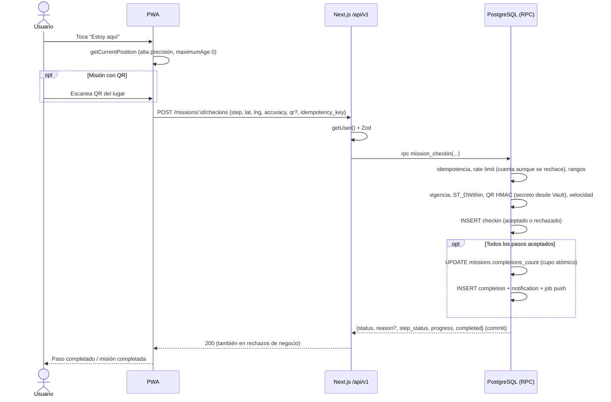
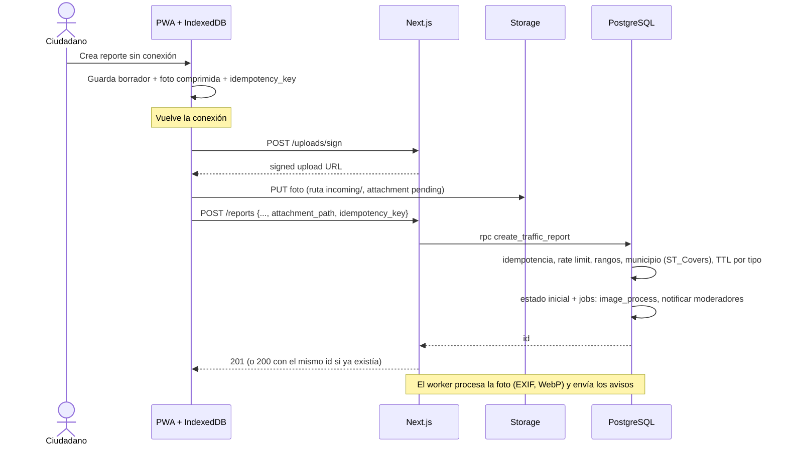
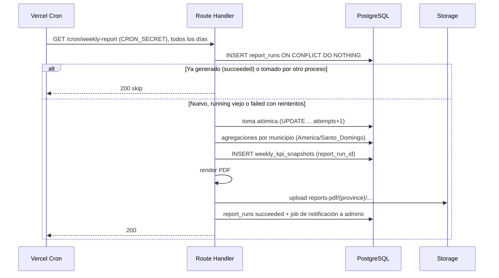
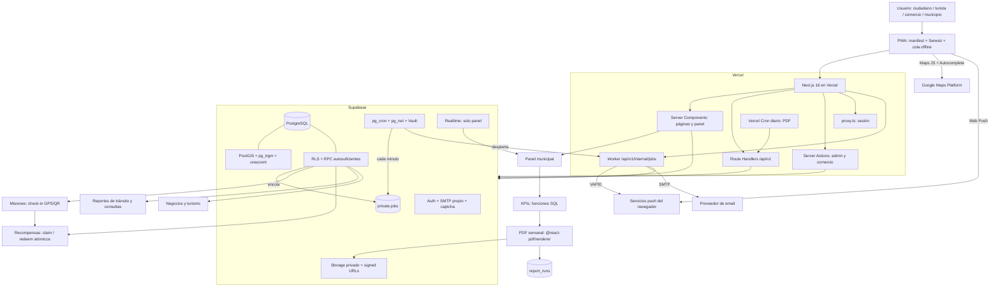

# SR Conecta — Arquitectura Técnica Definitiva

> Documento de arquitectura para el repositorio. Versión 1.1 · 24 de septiembre de 2026 (v1.0: 23/09/2026)
> Alcance: desde el MVP del reto TechEmprende SR Conecta 2026 hasta producción municipal y escala regional.
> Fuentes oficiales y precios consultados el **23/09/2026** (ver §31 y Anexo E). Todo precio debe re-verificarse antes de presupuestar.
> **v1.1** corrige contradicciones internas de seguridad, datos e infraestructura detectadas en revisión y añade decisiones de **evolución sin rupturas** (§5.1) para que las Fases 2 y 3 se construyan agregando piezas, no reescribiendo. Registro completo en el Anexo F.

---

## 0. Contexto que cambia decisiones (leído de conectasr.com)

Antes de decidir, estos hechos del reto condicionan la arquitectura más que cualquier preferencia técnica:

| Hecho del reto | Consecuencia arquitectónica |
|---|---|
| Provincia Santiago Rodríguez, 3 municipios: San Ignacio de Sabaneta (cabecera), Monción y Villa Los Almácigos | Territorio pequeño. El volumen de puntos en MVP es de cientos a pocos miles, no millones. No sobre-optimizar. |
| La organización entrega **datos geográficos abiertos** de la provincia | Deben importarse a PostGIS (límites municipales, POIs, caminos). PostGIS es la fuente de verdad territorial, no Google. |
| Demo en vivo de **25 minutos con datos reales** | Semilla de datos reproducible, guion de demo y plan B si una API externa falla. |
| El proyecto ganador se libera bajo **MIT o Apache 2.0** y pasa a los patrocinadores (FUNDESER) | Todas las dependencias deben ser compatibles en licencia. La cuenta de Google Cloud, Supabase y Vercel deben poder **transferirse**. Nada de claves ni cuentas personales incrustadas. |
| Stack libre; se evalúa el resultado | Priorizar lo que el equipo domina y lo que se demuestra bien, no lo más sofisticado. |
| "Cualquier ciudadano ingresa datos y **recibe notificaciones** sobre el mapa" | Notificaciones in-app son obligatorias; push es un canal adicional. |

---

## 1. Executive Summary

SR Conecta se construye como un **monolito modular** en **Next.js 16 (App Router) + TypeScript**, desplegado en **Vercel**, con **Supabase** como plataforma de datos (PostgreSQL + PostGIS + Auth + Storage). El mapa base es **Google Maps JavaScript API** con marcadores avanzados y clustering, pero **todos los datos de negocio viven en PostgreSQL/PostGIS**. Google aporta mapa base, autocompletado de direcciones puntual y navegación vía enlace profundo; nunca es la base de datos de negocios.

Las operaciones críticas (completar misión, reclamar y canjear recompensa, cambiar estado de consulta, asignar roles) se ejecutan como **funciones transaccionales en PostgreSQL** que validan por sí mismas todo lo que importa. El flujo normal pasa por Next.js, pero **cada RPC se diseña asumiendo que un usuario autenticado puede invocarla directamente** con la anon key y su JWT (PostgREST es público por diseño). El frontend nunca decide si una misión se completó ni si queda inventario, y Next.js tampoco es la barrera de seguridad: lo es Postgres.

Del stack propuesto se mantiene cerca del 80%. Los cambios importantes: se elimina Firebase Cloud Messaging (Web Push + VAPID es suficiente), se reemplaza el uso de Routes API por enlaces de navegación de Google Maps y rutas propias en PostGIS, Realtime se limita a uno o dos casos, y se agregan `pg_trgm`/`unaccent` para búsqueda, Serwist para el service worker y Sentry para errores. Desde v1.1 se incorporan además una **cola de trabajos en Postgres** (`pg_cron` + `pg_net`) para todo lo asíncrono (push, email, imágenes, PDF), un **proveedor SMTP transaccional** y un modelo de datos preparado para multi-provincia desde el MVP.

## 2. Architectural Verdict

**Veredicto: el stack es correcto en su columna vertebral y excesivo en sus bordes.**

| Acción | Qué |
|---|---|
| **Mantener** | Next.js, React, TypeScript, Tailwind, shadcn/ui, Google Maps JS API, Supabase (Postgres, PostGIS, Auth, Storage), React Hook Form, Zod, Recharts, Vercel, GitHub + Actions, Vitest, Playwright |
| **Cambiar** | FCM → Web Push/VAPID · Routes API → deep links + rutas PostGIS · Geocoding para municipio → `ST_Covers` en PostGIS (§11.1) · "librería PDF" → `@react-pdf/renderer` · Realtime "para todo" → 1–2 canales |
| **Eliminar** | Firebase (cualquier producto) · Places como catálogo de negocios · llamadas a Google por cada movimiento del mapa · Edge Functions en MVP |
| **Introducir** | `pg_trgm` + `unaccent` + full-text en español · Serwist (service worker) · `@vis.gl/react-google-maps` · Sentry · rate limiting en Postgres · migraciones con Supabase CLI · Map ID de Google (requerido por AdvancedMarkerElement) · `pg_cron` + `pg_net` + cola `private.jobs` · Supabase Vault (secretos en base) · SMTP transaccional (Resend/SES/Brevo) · `province_id` desde el MVP |
| **Postergar** | Vector tiles propios (`ST_AsMVT`), mapas offline, Traffic Layer como feature principal, Routes API en app, analítica avanzada, multi-provincia |

Tres cuestionamientos directos a decisiones del documento original:

1. **"Tráfico con Google Traffic Layer" no es un pilar confiable.** La cobertura de tráfico en vivo en zonas rurales de Santiago Rodríguez no está verificada y probablemente es escasa. El valor real de tránsito viene de **reportes ciudadanos propios** (accidentes, derrumbes, vías cerradas). Traffic Layer queda como capa opcional encendible.
2. **"Rutas: Google Routes API" es innecesario para ecoturismo.** Un sendero no existe en Google. Las rutas de ecoturismo son `LineString` propios en PostGIS. Para "cómo llegar al inicio del sendero" basta un enlace a Google Maps (sin costo de API).
3. **"No cargar toda la provincia" es correcto para capas que crecen, no para todas.** Límites municipales, rutas y lugares turísticos son pocos y estables: cargarlos una vez por sesión, simplificados y cacheados, es más rápido y barato que consultar por viewport. El filtrado por viewport se aplica a capas que crecen (negocios, reportes).

## 3. Recommended Final Stack

| Área | Tecnología | Clasificación |
|---|---|---|
| Framework | Next.js 16 (App Router) | [OBLIGATORIA] |
| Lenguaje | TypeScript (strict) | [OBLIGATORIA] |
| UI | Tailwind CSS + shadcn/ui | [RECOMENDADA] |
| Mapa | Google Maps JavaScript API vía `@vis.gl/react-google-maps` | [OBLIGATORIA] |
| Marcadores | AdvancedMarkerElement (requiere Map ID) | [RECOMENDADA] |
| Clustering | `@googlemaps/markerclusterer` | [RECOMENDADA] |
| Búsqueda externa | Places API (New) — solo Autocomplete con session tokens | [OPCIONAL] |
| Navegación | Google Maps URLs (deep link) | [RECOMENDADA] |
| Rutas en app | Routes API | [FUTURA] |
| Tráfico | TrafficLayer (toggle) | [OPCIONAL] |
| Geocoding | Solo reverse geocoding bajo demanda para dirección legible | [OPCIONAL] |
| Base de datos | PostgreSQL (Supabase) | [OBLIGATORIA] |
| Geodatos | PostGIS | [OBLIGATORIA] |
| Búsqueda propia | Full-text `spanish` + `pg_trgm` + `unaccent` | [RECOMENDADA] |
| Auth | Supabase Auth (email + OTP/magic link; Google OAuth opcional) | [OBLIGATORIA] |
| Email transaccional | SMTP propio configurado en Supabase Auth y usado por la cola (Resend, Amazon SES o Brevo). El SMTP por defecto de Supabase es solo para pruebas y tiene límites muy bajos | [OBLIGATORIA] |
| Archivos | Supabase Storage (buckets privados + URLs firmadas) | [OBLIGATORIA] |
| Lógica crítica | Funciones PL/pgSQL (RPC) + RLS | [OBLIGATORIA] |
| Trabajos asíncronos | Tabla `private.jobs` (outbox) + `pg_cron` (planificador) + `pg_net` (dispara el worker HTTP en Next.js) | [OBLIGATORIA] |
| Secretos en base | Supabase Vault (secretos de QR, pepper de cupones, credenciales de `pg_net`) | [RECOMENDADA] |
| Realtime | Supabase Realtime (solo panel admin y estado propio) | [OPCIONAL] |
| Edge Functions | — | [FUTURA] |
| PWA | Web App Manifest + Serwist | [OBLIGATORIA] |
| Push | Web Push + VAPID (`web-push`) | [RECOMENDADA] |
| Firebase Cloud Messaging | — | [NO RECOMENDADA] |
| Formularios | React Hook Form + Zod | [RECOMENDADA] |
| Gráficos | Recharts | [RECOMENDADA] |
| PDF | `@react-pdf/renderer` en Route Handler (runtime Node) | [OBLIGATORIA] |
| Cron | `pg_cron` para jobs de datos (expiraciones, retención, cola); Vercel Cron diario para el PDF; GitHub Actions `schedule` como respaldo | [OBLIGATORIA] |
| Errores | Sentry (plan gratuito: verificar límite de usuarios; el plan Developer es de 1 persona) | [RECOMENDADA] |
| Tests | Vitest + Playwright | [RECOMENDADA] |
| CI/CD | GitHub Actions + Vercel (deploy de producción disparado por la Action después de migrar; §36) | [OBLIGATORIA] |
| Base de datos por PR | Supabase local en CI (MVP) → Supabase Branching (con plan Pro) | [RECOMENDADA] |
| Hosting | Vercel + Supabase | [OBLIGATORIA] |
| Estado global | Zustand solo para estado del mapa; sin Redux | [OPCIONAL] |
| Data fetching cliente | TanStack Query (solo en el módulo mapa) | [RECOMENDADA] |

## 4. Why This Stack

- **Un solo lenguaje de punta a punta (TypeScript) y un solo motor de datos (Postgres).** Menos piezas que mantener para un equipo de 1–5 personas y para una fundación que heredará el código.
- **PostGIS resuelve el 90% de la lógica geográfica** (cercanía, geocercas, pertenencia a municipio, rutas) sin pagar por llamada. Google solo resuelve lo que no podemos producir nosotros: el mapa base y la búsqueda de direcciones arbitrarias.
- **Supabase da Auth, Storage y RLS sobre el mismo Postgres**, evitando un backend Express separado. La seguridad vive junto a los datos.
- **Next.js permite SSR para páginas públicas indexables** (turismo, negocios) y una app cliente rica para el mapa, en un solo proyecto.
- **Todo es open source o reemplazable**, compatible con la liberación MIT/Apache del reto. El único proveedor propietario crítico es Google Maps, y está aislado detrás de un adaptador.

## 5. Architecture Principles

1. **Postgres es la fuente de verdad.** Si un dato importa al negocio o al municipio, vive en nuestra base.
2. **El cliente propone, la base de datos dispone.** Ubicación, evidencias y clics son "reclamos"; la base de datos decide. Toda RPC y toda tabla expuesta asume que puede ser invocada directamente, sin pasar por Next.js: la validación en Next (Zod) es UX y defensa temprana, nunca la única barrera.
3. **Operaciones críticas = una transacción en la base de datos.** Nunca "leer en JS, decidir en JS, escribir en JS".
4. **Google se invoca por intención del usuario, nunca por evento del mapa.**
5. **Mínimo de piezas.** Cada servicio nuevo debe justificar su costo operativo.
6. **RLS siempre activo**, incluso cuando el acceso pasa por el servidor. Defensa en profundidad.
7. **Privacidad por defecto.** Ubicación puntual, con propósito, nunca rastreo continuo.
8. **Todo cambio de estado relevante deja rastro** (historial + auditoría).
9. **Idempotencia en todo lo que se puede reintentar** (cron, canjes, cola offline).
10. **Diseñar para transferencia.** Otro equipo debe poder operar esto con la documentación del repo.
11. **Evolución aditiva.** Esquema, API y eventos cambian agregando (columnas, endpoints, tipos de job), nunca renombrando ni borrando en el mismo release. Lo que se sabe que vendrá (multi-provincia, idiomas, particiones, colas) se prepara desde el MVP cuando cuesta poco hoy y mucho después (§5.1).
12. **Asíncrono por cola, no inline.** Todo efecto secundario lento o externo (push, email, procesamiento de imágenes, PDF) se encola en la misma transacción que lo origina y lo ejecuta un worker con reintentos. Así ningún efecto se pierde si falla un proveedor, y la cola se puede cambiar de motor sin tocar a quien produce los trabajos.

### 5.1 Diseño para evolucionar sin rupturas

Decisiones que cuestan horas en el MVP y evitan migraciones grandes o reescrituras en Fase 2/3:

| Decisión desde el MVP | Evita en el futuro | Costo hoy |
|---|---|---|
| Tabla `provinces` y `province_id` en todas las tablas territoriales y en `user_roles` (una sola fila: Santiago Rodríguez) | Migración multi-tenant de Fase 3 (backfill de millones de filas y reescritura de todas las políticas RLS) | Una columna con valor por defecto y un filtro más en RLS |
| Estados como `text` + `CHECK` o tablas catálogo, **no** `enum` de Postgres | Los `enum` no permiten eliminar ni renombrar valores sin recrear el tipo | Ninguno |
| Catálogos configurables en tablas (`traffic_report_types` con expiración, ícono y gravedad por defecto; `business_categories`; límites de rate limit por acción) | Deploys para cambiar reglas operativas | Una tabla pequeña por catálogo |
| Cola `private.jobs` con contrato estable (`kind`, `payload`, `run_at`, `attempts`, `status`, `dedupe_key`) | Cambiar a `pgmq`/Inngest en Fase 3 sin modificar productores: solo cambia el consumidor | Una tabla + un Route Handler |
| `audit_logs` y tablas históricas con PK `(created_at, id)` | El particionado mensual exige que la PK incluya la clave de partición; cambiarla después obliga a reescribir la tabla | Ninguno |
| Snapshots de KPIs inmutables por ejecución (`report_run_id`) | Pérdida de trazabilidad entre un PDF y los datos que lo generaron | Unas filas más por semana |
| Contenido traducible con columna `translations jsonb` (`{"en": {"name": …, "description": …}}`) en turismo, rutas, negocios y categorías | Tablas de traducción añadidas a posteriori y cambios en todas las consultas | Una columna vacía |
| Rutas de Storage con convención `{bucket}/{province}/{entity}/{id}/{uuid}.{ext}`; en base solo se guardan `bucket` + `path`, nunca URLs | Migración de URLs al cambiar de dominio, CDN o proveedor de storage | Ninguno |
| API versionada `/api/v1` con reglas de compatibilidad: solo cambios aditivos; lo incompatible va a `/v2` en paralelo | Romper PWAs instaladas con código viejo en caché | Disciplina en revisión de PR |
| Adaptadores en las fronteras: mapa (`modules/map/provider`), búsqueda de direcciones, canales de notificación (`push`, `email`, futuro `native`) | Cambiar Google, SMTP o agregar app nativa sin tocar dominio | Una interfaz por frontera |
| Feature flags en tabla `feature_flags` (por provincia/municipio) | Deploys o ramas largas para activar capas, misiones o pilotos por municipio | Una tabla y un helper |
| Identificadores públicos estables (`slug` en negocios, lugares y rutas) separados del `uuid` | Romper enlaces compartidos e indexados al cambiar nombres o migrar datos | Una columna única |

## 6. System Architecture

```text
┌──────────────────────── Dispositivo (PWA) ────────────────────────┐
│ Next.js client · Mapa (Google Maps JS) · Service Worker (Serwist)  │
│ Cola offline (IndexedDB) · Web Push                               │
└──────────────┬─────────────────────────────────────┬──────────────┘
               │ HTTPS (cookies de sesión)            │ Maps JS / Autocomplete
               ▼                                      ▼
┌──────────── Vercel ────────────┐         ┌──── Google Maps Platform ────┐
│ Next.js 16                     │         │ Maps JS · Places Autocomplete │
│ · Server Components (páginas)  │         │ · (Routes/Geocoding opcional) │
│ · Route Handlers /api/v1       │         └──────────────────────────────┘
│ · Server Actions (admin)       │
│ · proxy.ts (sesión)            │
│ · Cron → PDF semanal           │
│ · Worker /api/v1/internal/jobs │◄──── pg_net (disparo por pg_cron)
└──────────────┬─────────────────┘
               │ supabase-js (JWT del usuario) / service_role solo en worker y cron
               ▼
┌──────────────────── Supabase ─────────────────────┐
│ PostgreSQL 15+ · PostGIS · pg_trgm · unaccent       │
│ RLS · Funciones RPC transaccionales · Triggers      │
│ pg_cron · pg_net · cola private.jobs · Vault        │
│ Auth (SMTP propio) · Storage (privado) · Realtime   │
└────────────────────────────────────────────────────┘
```

Estilo: **monolito modular** (§12, ADR-008). Un despliegue, un repositorio, una base de datos, módulos por dominio con fronteras explícitas.

## 7. Frontend Architecture

- **Dos "caras" en una app:** (a) sitio público y listados SSR (turismo, negocios, perfil de lugar), (b) aplicación de mapa cliente pesada.
- **El mapa se carga con `dynamic(() => import(...), { ssr: false })`** detrás de un esqueleto. La primera pintura nunca espera a Google.
- **Estado:** servidor = TanStack Query en el módulo mapa (cache por bbox/capa); UI del mapa (capas activas, filtros, feature seleccionado) = Zustand o `useReducer`. Filtros persistidos en la URL (`?capas=turismo,reportes&cat=…`) para compartir enlaces.
- **Formularios:** React Hook Form + un **único esquema Zod por operación**, compartido cliente/servidor (`modules/*/schemas.ts`). El servidor revalida siempre.
- **Diseño:** mobile-first, bottom sheet para detalles en móvil, panel lateral en escritorio. shadcn/ui copia componentes al repo (sin dependencia en runtime), Tailwind para tokens.
- **Accesibilidad:** todo lo que está en el mapa debe tener equivalente en lista (requisito práctico y de accesibilidad).
- **i18n:** español como único idioma en MVP; textos centralizados para añadir inglés (turistas) en Fase 2.

## 8. Next.js Architecture

| Pieza | Uso en SR Conecta |
|---|---|
| App Router + layouts | `(public)`, `(app)` (mapa, requiere o no login), `(admin)`, `(business)` como route groups con layouts propios |
| Server Components | Páginas públicas, listados, ficha de lugar, todas las vistas del panel admin (lectura) |
| Client Components | Mapa, geolocalización, cámara/QR, formularios interactivos, gráficos Recharts |
| Route Handlers `/api/v1/*` | Todo lo que llama el mapa y la PWA (features por viewport, crear reporte, check-in de misión, reclamo de recompensa), webhooks, cron y el worker de la cola (`/api/v1/internal/jobs/run`, protegido por secreto). Motivo: la cola offline del service worker reintenta **requests HTTP**, no Server Actions |
| Server Actions | Mutaciones de formularios del panel admin y del panel de negocio (moderar, crear misión, editar negocio). Siempre validan sesión y rol dentro de la acción |
| `proxy.ts` | (Next 16 renombró `middleware.ts` a `proxy.ts`, runtime Node). Solo refresca la sesión Supabase y hace redirecciones gruesas (`/admin` sin sesión → login). **No es la capa de autorización** |
| Caching | Tres clases de respuesta, **nunca mezcladas en un mismo endpoint**: (1) catálogos públicos estables (turismo, rutas, categorías, límites) con `use cache`/`revalidateTag` y CDN larga; (2) capas públicas volátiles (reportes de tránsito activos, negocios por viewport) con `s-maxage` ≤ 30 s y sin cookies; (3) datos por usuario o por rol con `Cache-Control: private, no-store`. Ver §9.3 |
| loading.tsx / error.tsx | Por route group; `error.tsx` reporta a Sentry |
| Runtime | Node para PDF, push y cualquier cosa con `web-push` o `@react-pdf/renderer` |

**Dónde corre cada lógica:**

| Capa | Responsabilidad |
|---|---|
| Cliente | Render, UX, obtener ubicación, leer QR, comprimir imágenes, cola offline, validación temprana (Zod) |
| Servidor Next | Autenticación de la request, validación Zod (defensa temprana y mensajes de error claros), orquestación, llamadas server-to-server, firma de URLs, worker de la cola (push, email, imágenes), PDF |
| PostgreSQL | **Barrera autoritativa**: reglas de negocio críticas, validación de entradas que importan (rangos, longitudes, pertenencia), geocercas, completitud de misión, inventario, transiciones de estado, historial, auditoría, RLS, rate limits, encolado de efectos secundarios |
| Google APIs | Mapa base, autocompletado de direcciones, (opcional) dirección legible |
| Supabase | Auth, Storage, Realtime (limitado) |

## 9. Map Architecture

### 9.1 Capas y estrategia de carga

| Capa | Geometría | Volumen esperado | Estrategia |
|---|---|---|---|
| Municipios (3) | MultiPolygon | 3 | Carga única, cache CDN largo. Simplificación **topológica en la importación** (mapshaper, o `ST_CoverageSimplify` si la versión de PostGIS lo soporta) para que las fronteras compartidas no queden con huecos ni solapes; `ST_SimplifyPreserveTopology` por polígono no preserva fronteras entre vecinos |
| Rutas de ecoturismo | LineString/MultiLineString | decenas | Carga única de trazos simplificados; geometría completa al abrir la ruta |
| Lugares turísticos | Point | decenas–cientos | Carga única por sesión (payload pequeño) |
| Negocios | Point | cientos → miles | **Por viewport** + filtros |
| Reportes de tránsito activos | Point | decenas | Por viewport en el endpoint **público** (sin autor), solo `status in (active, verified)` y `expires_at > now()`, `s-maxage=30`, refresco cada 60 s |
| Consultas ciudadanas | Point | cientos | Endpoint **autenticado** (`/api/v1/me/map/features`, `no-store`): el panel admin ve las de su alcance; el ciudadano, las suyas. Las públicas aprobadas (`is_public`) sí van al endpoint público |
| Misiones | Point (paso) | decenas | Por viewport, solo activas y vigentes |
| Recompensas | — | — | No son capa: se muestran dentro del negocio o misión |

### 9.2 Zoom

| Zoom Google | Qué se muestra | Cómo |
|---|---|---|
| ≤ 10 (provincia) | Polígonos de municipios con conteos por capa | Endpoint de agregados: `count(*) group by municipality_id` (barato: pertenencia precalculada) |
| 11–14 (municipio) | Clusters | Puntos del viewport (límite 500) + `MarkerClusterer` en cliente |
| ≥ 15 (calle) | Todos los puntos, íconos por categoría | Mismo endpoint; al tocar un punto se pide el detalle |

Detalle (fotos, horario, descripción) **nunca** viaja en la consulta de viewport; solo `id, tipo, categoría, lat, lng, título corto, ícono`.

### 9.3 Flujo de consulta

1. Evento `idle` del mapa (no `bounds_changed`) + debounce de 300 ms.
2. El bbox se **redondea hacia afuera a una rejilla** (p. ej. 0.01°) para que requests similares compartan cache (TanStack Query en cliente y `s-maxage` corto en CDN, solo en el endpoint público).
3. Si el nuevo bbox está contenido en uno ya cargado con los mismos filtros, no se consulta.
4. Dos endpoints con la misma forma de respuesta y distinta política de cache:
   - `GET /api/v1/map/features?bbox=…&layers=…&zoom=…&cat=…` → **público y anónimo**: se ejecuta con el rol `anon` aunque haya sesión, ignora cookies y responde `public, s-maxage=30`. Solo capas visibles para cualquier visitante.
   - `GET /api/v1/me/map/features?…` → **autenticado**, `private, no-store`: capas del usuario (mis consultas) y administrativas según rol. RLS filtra.
   Ambos van a Postgres con `&&`/`ST_Intersects` sobre índice GIST y devuelven GeoJSON compacto. El cliente combina las dos respuestas en el adaptador de mapa.
5. Límite duro de 500 features por respuesta; si se excede, se devuelve `truncated: true` y el cliente sugiere acercar.

**Fase 2:** si los negocios superan ~20k puntos, pasar a vector tiles propios con `ST_AsMVT` servidos por Route Handler y cache CDN.

## 10. Google Maps Architecture

### 10.1 Google Maps vs Leaflet (para este proyecto)

| Criterio | Google Maps Platform | Leaflet/MapLibre + tiles (OSM vía MapTiler/Stadia) |
|---|---|---|
| Calidad del mapa en SR | Buena cartografía vial y satelital; familiar para el usuario dominicano | OSM en zonas rurales de SR depende de la comunidad; calidad variable, hay que verificar |
| UX | Estándar de facto, gestos y estilo conocidos | Excelente con MapLibre (vectorial); Leaflet más básico |
| Places / búsqueda | Líder, con negocios locales | Requiere geocodificador aparte (Nominatim/Photon/Pelias); calidad menor en RD |
| Rutas | Routes API (costo) | OSRM/GraphHopper/ORS externos |
| Tráfico | Traffic Layer (cobertura rural incierta) | No disponible |
| Markers/clustering | AdvancedMarkerElement + MarkerClusterer | Plugins maduros |
| GeoJSON/polígonos/rutas propias | Data Layer y polylines; suficiente | Nativo y muy flexible |
| Costos | Por SKU, cuotas gratuitas mensuales por SKU | Tiles gratuitos limitados o de pago; sin facturación por carga si self-host |
| Dependencia | Alta; **el contenido de Google no puede mostrarse sobre mapas no-Google** | Baja |
| Equipo | Muy documentado | Documentado, más piezas |
| Datos propios | Sí, vía nuestra API | Sí, vía nuestra API |

**Decisión: Google Maps JavaScript API como mapa base en MVP y Fase 2**, por calidad percibida en la demo, familiaridad del usuario y búsqueda de direcciones locales. **Con dos salvaguardas:**

1. **Adaptador de mapa** (`modules/map/provider/`): el resto de la app habla con una interfaz propia (`MapView`, `addLayer(geojson)`, `onFeatureClick`), no con `google.maps.*`. Nuestra API devuelve GeoJSON neutral.
2. **Plan B documentado: MapLibre GL + tiles OSM.** Como los términos de Google prohíben usar su contenido sobre un mapa no-Google, **solo nuestros datos propios migran**. Esto refuerza la regla de no depender de Places para datos de negocio.

### 10.2 Uso selectivo de APIs

| API | ¿Usar? | Cuándo se invoca | Nunca |
|---|---|---|---|
| Maps JavaScript API (Dynamic Maps) | Sí | Una carga por apertura de la vista mapa | Recargar el mapa al cambiar de pestaña interna |
| AdvancedMarkerElement | Sí | Render de marcadores (requiere Map ID) | Miles de marcadores sin clustering |
| MarkerClusterer | Sí | Zoom 11–14 | — |
| Places Autocomplete (New) | Opcional | Solo cuando el usuario escribe en "buscar dirección" y **nuestra búsqueda propia no encontró resultado**; y en el alta de negocio para vincular `google_place_id` | Por cada tecla sin session token; para listar negocios en el mapa |
| Place Details (New) | Mínimo | Al seleccionar una sugerencia: solo campos `location` y `formattedAddress` con **field mask** | Pedir fotos, reseñas o rating |
| Nearby/Text Search | No | — | Poblar la capa de negocios |
| Routes API | Futuro | Solo si se exige ruta dibujada dentro de la app | Por cada interacción |
| Navegación | Sí (gratis) | Botón "Cómo llegar": URL `https://www.google.com/maps/dir/?api=1&destination=lat,lng` | — |
| TrafficLayer | Opcional | Toggle manual del usuario | Encendido por defecto |
| Geocoding (reverse) | Opcional | Una vez al crear un reporte, si se quiere texto de dirección | Para saber el municipio (eso lo hace PostGIS) |

### 10.3 Datos propios vs datos de Google

| Dato | Dónde vive | Política |
|---|---|---|
| `place_id` de Google | `businesses.google_place_id` | Puede almacenarse indefinidamente (exento de restricciones de caché según las políticas de Places) |
| Lat/lng obtenidos de Google | No se usan como coordenada oficial | La caché de coordenadas de Google está limitada a 30 días; por eso **la coordenada oficial del negocio la confirma el dueño/moderador arrastrando el pin** y se guarda como dato propio |
| Nombre, dirección, horario, fotos, reseñas de Google | No se almacenan | Se piden en vivo si se muestran, con atribución de Google |
| Todo lo demás (negocios, rutas, reportes, misiones) | PostgreSQL | Fuente de verdad propia |

### 10.4 Claves y costos

- **Clave de navegador** (`NEXT_PUBLIC_GOOGLE_MAPS_KEY`): restringida por referrer HTTP (dominios de producción y previews) y **por API** (solo Maps JS y Places).
- **Clave de servidor** (`GOOGLE_MAPS_SERVER_KEY`): solo si se usa Geocoding/Routes desde el servidor; restringida por API; nunca en el cliente.
- Proyectos de Google Cloud separados para dev y prod.
- **Cuotas diarias por API** en la consola (tope duro práctico), **alertas de presupuesto** al 50/80/100%, y revisión semanal del reporte por SKU.
- Map ID y estilos vía Cloud-based styling.
- La cuenta de facturación debe estar a nombre de la organización que operará la plataforma (FUNDESER/municipio), no de un integrante.

## 11. Geospatial Architecture

### 11.1 Decisiones

| Tema | Decisión | Motivo |
|---|---|---|
| SRID | **4326 (WGS84)** en todas las columnas | Compatibilidad directa con GPS, Google y GeoJSON |
| Tipo de columna | `geometry(<Tipo>, 4326)` | Compatible con todas las funciones (`ST_Contains`, `ST_AsMVT`, simplificación) |
| Distancias en metros | Cast a `geography` en la consulta, con **índice GIST de expresión** `((geom::geography))` | `ST_DWithin(geom::geography, punto::geography, 1000)` = metros reales usando índice |
| Viewport | `geom && ST_MakeEnvelope(minLng, minLat, maxLng, maxLat, 4326)` | Operador de bbox, usa índice GIST de geometría |
| Pertenencia a municipio | `municipality_id` calculado por trigger al insertar/mover. Puntos: `ST_Covers` (incluye el borde; `ST_Contains` lo excluye). Si no cae en ningún municipio: el más cercano a ≤ 2 km (`ORDER BY geom <-> p`), y si no hay ninguno, `NULL` + estado `out_of_area` visible para moderadores de alcance provincial. Líneas (rutas): el municipio que contiene el `start_point`, más `municipality_ids uuid[]` con todos los que la ruta cruza (`ST_Intersects`), para filtros y KPIs. Registros sin geometría (consultas sin ubicación): el usuario elige el municipio y es obligatorio | Evita joins espaciales en cada lectura, alimenta KPIs y garantiza que ningún registro quede invisible para el RLS municipal |
| Provincia | `province_id` en toda tabla territorial, derivado del municipio por el mismo trigger | Multi-provincia (Fase 3) sin migración de datos (§5.1) |
| Índices | GIST en `geom` de cada tabla espacial + GIST de expresión geography donde haya búsquedas por radio | — |

Alternativa aceptable: almacenar en UTM zona 19N (EPSG:32619) para cálculos métricos rápidos. **Descartada**: añade conversiones en cada lectura para ganar poco a esta escala.

### 11.2 Tipos por entidad

| Entidad | Tipo |
|---|---|
| municipalities | MultiPolygon |
| businesses, tourism_places, traffic_reports | Point (obligatorio) |
| citizen_requests | Point opcional (municipio obligatorio si no hay punto) |
| mission_steps | Point + `radius_m` si `kind = 'location'`; sin geometría si `kind = 'virtual'` (§19.1) |
| eco_routes | MultiLineString (un sendero puede tener tramos) |
| geocercas de misiones | Point + `radius_m` (no polígono) en MVP; Polygon opcional en Fase 2 |

### 11.3 Consultas tipo (patrones)

| Pregunta | Patrón |
|---|---|
| Negocios a 1 km | `ST_DWithin(b.geom::geography, :p::geography, 1000)` + `ORDER BY b.geom <-> :p` + `LIMIT` |
| Lugares turísticos a 2 km | Igual con 2000 |
| Reportes dentro de esta zona | `ST_Intersects(r.geom, :zona)` |
| Rutas cercanas | `ST_DWithin(route.geom::geography, :p::geography, 3000)` |
| Dentro de la geocerca de un paso | `ST_DWithin(step.geom::geography, :p::geography, step.radius_m + LEAST(:accuracy, 50))` **dentro de la RPC de check-in** (misma fórmula que §19.3) |
| Objetos visibles | `geom && ST_MakeEnvelope(...)` + filtros + `LIMIT 500` |
| Clustering servidor (si hace falta) | `ST_SnapToGrid(geom, tamaño_por_zoom)` + `count(*)` agrupado |

Importación de datos abiertos de la provincia: `ogr2ogr` (GDAL) → tablas de staging → validación `ST_IsValid`/`ST_MakeValid` → tablas finales, versionado como migración/seed.

## 12. Backend Architecture

No hay backend separado. El "backend" son tres capas dentro del monolito:

1. **Route Handlers / Server Actions** (Next.js): autenticación, validación Zod, orquestación, integraciones (push, PDF, Google server-side).
2. **Servicios de dominio en TypeScript** (`modules/<dominio>/server/*.ts`): funciones puras de aplicación que llaman a Supabase con el JWT del usuario.
3. **PostgreSQL**: RLS + funciones RPC transaccionales + triggers de historial/auditoría.

Regla: **si una operación modifica inventario, estado o permisos, termina en una función SQL**. TypeScript orquesta; SQL garantiza.

**Contrato de las RPC** (aplica a todas las funciones invocables por usuarios):
- **Autosuficientes:** validan `auth.uid()`, rol, alcance y *todas* las entradas que importan (rangos de lat/lng, `accuracy`, longitudes de texto, tipos permitidos). Asumen que pueden ser llamadas directamente sin Next.js.
- **Rechazo de negocio ≠ excepción:** un rechazo esperado (fuera de radio, sin stock, límite alcanzado) **devuelve** `{status: 'rejected', reason}` y hace commit, para que el contador de rate limit, el intento rechazado y la auditoría persistan. `RAISE EXCEPTION` solo para errores de programación, datos corruptos o acceso no autorizado.
- **Idempotentes:** toda RPC de creación acepta `p_idempotency_key` y devuelve el mismo resultado si se repite.
- **Efectos secundarios encolados:** notificaciones, push, email y procesamiento de archivos se insertan en `private.jobs` dentro de la misma transacción; nunca se llaman servicios externos desde SQL de forma síncrona.

No se agrega Express, NestJS ni un broker de mensajes. Lo asíncrono va por una **cola en Postgres** (`private.jobs`): los productores (RPC, triggers, `pg_cron`) insertan filas; `pg_cron` dispara cada minuto, vía `pg_net`, el worker `POST /api/v1/internal/jobs/run` en Next.js, que toma lotes con `FOR UPDATE SKIP LOCKED`, ejecuta y marca `done`/`failed` con reintentos exponenciales y `dead` tras N intentos. En Fase 3 el consumidor puede pasar a `pgmq` o Inngest sin cambiar productores (§5.1).

## 13. Supabase Architecture

| Componente | Uso | Nota |
|---|---|---|
| PostgreSQL | Sí | Fuente de verdad |
| PostGIS, pg_trgm, unaccent | Sí | Extensiones habilitadas por migración |
| Auth | Sí | Email+OTP/magic link; Google OAuth opcional. Teléfono/SMS postergado (costo). **SMTP propio obligatorio** antes de abrir registro a ciudadanos. Captcha (Turnstile) con la integración nativa de Supabase Auth, que se valida en el servidor de Auth y no se puede saltar llamando la API directo |
| RLS | Sí, en **todas** las tablas | Tablas sin política = inaccesibles |
| Database Functions (RPC) | Sí | Check-in, completar misión, reclamar/canjear recompensa, transición de estado, asignar rol, rate limit. Las RPC invocables viven en `public` (el único esquema expuesto); los helpers internos, en `private` (§14) |
| Triggers | Sí | `updated_at`, municipio y provincia por `ST_Covers` (§11.1), historial de estados, auditoría, encolado de jobs |
| Storage | Sí | Buckets privados: `report-evidence`, `mission-evidence`, `reports-pdf`; bucket público solo `public-media` (fotos aprobadas de lugares/negocios) |
| Realtime | Limitado | Ver §26 |
| Edge Functions | No en MVP | Todo lo resuelve Next.js; evitar dos runtimes de servidor |
| pg_cron | **Sí (obligatorio)** | Único planificador sub-diario disponible sin Vercel Pro: cada minuto dispara el worker de la cola; cada hora expira reportes y cupones (con devolución de stock); cada noche aplica la retención de §32 y limpia uploads huérfanos |
| pg_net | Sí | Llamadas HTTP asíncronas desde Postgres, usadas solo para despertar al worker (`/api/v1/internal/jobs/run`) con un secreto guardado en Vault |
| Vault | Sí | Secretos que la base necesita en claro: secretos de QR de misiones, pepper de cupones, secreto del worker |
| Branching | Fase 2 (plan Pro) | Una base efímera por PR con sus migraciones aplicadas (§36) |
| Migraciones | Sí | Supabase CLI, SQL versionado en `supabase/migrations`, nunca cambios manuales en producción |

Nota a verificar: fuentes secundarias reportan que en 2026 Supabase exige `GRANT` explícitos para exponer tablas nuevas vía Data API. Las migraciones deben incluir los `GRANT` necesarios y probarse en un proyecto recién creado.

## 14. Database Architecture

- **Esquemas:**
  - `public`: único esquema expuesto por la Data API. Tablas con RLS y las RPC invocables por usuarios.
  - `private`: **no expuesto** por la API (no figura en "Exposed schemas"). Helpers de RLS (`has_role`, `is_business_member`), tablas internas (`rate_limits`, `jobs`) y funciones de sistema. Que no esté expuesto no significa que no tenga permisos: los helpers usados por políticas RLS **necesitan** `GRANT USAGE ON SCHEMA private` y `GRANT EXECUTE` a `authenticated` (y a `anon` si la política aplica a visitantes), porque las políticas se evalúan con el rol del usuario. Las funciones de sistema (retención, worker) sí llevan `REVOKE EXECUTE ... FROM anon, authenticated`.
- Claves primarias `uuid` (`gen_random_uuid()`); `created_at` en todas y `updated_at` en las mutables.
- **Estados como `text` + `CHECK`** (o tabla catálogo cuando el valor lleva atributos, p. ej. `traffic_report_types`). No se usan `enum` de Postgres: no permiten eliminar ni renombrar valores sin recrear el tipo (§5.1). Las transiciones se validan por función, no por UI.
- **`province_id`** en toda tabla territorial (§5.1).
- Borrado lógico (`deleted_at`) en entidades de contenido; borrado físico para datos personales cuando el usuario lo pide (§32).
- **Tres clases de tablas de rastro**, con reglas distintas:
  - *Inmutables* (`request_status_history`, `moderation_actions`, `audit_logs`): solo `INSERT`. La única excepción es la retención de §32, ejecutada por una función de sistema en `private`.
  - *De estado controlado* (`mission_step_checkins`, `reward_redemptions`, `report_runs`): filas que cambian de estado, pero **solo mediante RPC**. Sin `UPDATE`/`DELETE` para usuarios y cada transición auditada. No son append-only.
  - *Redactables por privacidad*: la retención de §32 anula columnas sensibles (coordenadas exactas, autor) mediante una función de sistema, nunca borra la fila, para no romper los KPIs.
- **Idempotencia en el esquema:** `idempotency_key text` con `UNIQUE (user_id, idempotency_key)` en toda tabla creada por una operación reintentable (`traffic_reports`, `citizen_requests`, `mission_step_checkins`, `reward_redemptions`).
- **Unicidad con `NULL`:** toda restricción `UNIQUE` que incluye una columna donde `NULL` tiene significado (p. ej. `municipality_id NULL` = provincia) se declara `UNIQUE NULLS NOT DISTINCT` (PostgreSQL 15+). Sin eso, dos `NULL` no chocan y se duplican filas.
- **Política de claves foráneas hacia `profiles`** (necesaria para "eliminar mi cuenta", §32):
  - `ON DELETE CASCADE` para los datos propios y privados del usuario: `notification_preferences`, `push_subscriptions`, `notifications`, `business_members`, `user_roles`.
  - `ON DELETE SET NULL` (columna nullable) para las referencias históricas que deben sobrevivir: `traffic_reports.reporter_id`, `citizen_requests.requester_id`, `assigned_to`, `mission_step_checkins.user_id`, `mission_completions.user_id`, `reward_redemptions.user_id`, `redeemed_by`, `request_status_history.changed_by`, `moderation_actions.moderator_id`, `audit_logs.actor_id`, `user_roles.granted_by`.
- **Preparado para particionar:** `audit_logs` y los históricos grandes usan PK `(created_at, id)` desde el MVP. Se particionan (mensual) en Fase 3 sin reescribir la tabla.

## 15. ERD

```mermaid
erDiagram
    provinces ||--|{ municipalities : "agrupa"
    profiles ||--o{ user_roles : "tiene"
    municipalities ||--o{ user_roles : "alcance opcional"
    profiles ||--o{ business_members : "administra"
    businesses ||--o{ business_members : "tiene"
    business_categories ||--o{ businesses : "clasifica"
    municipalities ||--o{ businesses : "contiene"
    municipalities ||--o{ tourism_places : "contiene"
    municipalities ||--o{ eco_routes : "contiene"
    municipalities ||--o{ traffic_reports : "contiene"
    municipalities ||--o{ citizen_requests : "contiene"
    traffic_report_types ||--o{ traffic_reports : "tipifica"
    profiles ||--o{ traffic_reports : "reporta"
    profiles ||--o{ citizen_requests : "crea"
    citizen_requests ||--o{ request_status_history : "registra"
    profiles ||--o{ citizen_requests : "asignado a"
    missions ||--|{ mission_steps : "compone"
    businesses ||--o{ mission_steps : "puede apuntar a"
    tourism_places ||--o{ mission_steps : "puede apuntar a"
    eco_routes ||--o{ mission_steps : "puede apuntar a"
    profiles ||--o{ mission_step_checkins : "realiza"
    mission_steps ||--o{ mission_step_checkins : "recibe"
    missions ||--o{ mission_completions : "se completa"
    profiles ||--o{ mission_completions : "logra"
    businesses ||--o{ rewards : "ofrece"
    missions |o--o{ rewards : "exclusiva (opcional)"
    rewards ||--o{ reward_redemptions : "emite"
    mission_completions ||--o| reward_redemptions : "habilita"
    profiles ||--o{ reward_redemptions : "posee"
    profiles ||--o{ notifications : "recibe"
    profiles ||--|| notification_preferences : "configura"
    profiles ||--o{ push_subscriptions : "registra"
    profiles ||--o{ attachments : "sube"
    profiles ||--o{ moderation_actions : "modera"
    profiles ||--o{ audit_logs : "actor"
    report_runs ||--|{ weekly_kpi_snapshots : "congela"

    provinces {
        uuid id PK
        text name
        text code "UNIQUE"
    }
    profiles {
        uuid id PK "= auth.users.id"
        text display_name
        uuid home_municipality_id FK
        bool location_consent
        timestamptz created_at
    }
    user_roles {
        bigint id PK
        uuid user_id FK "ON DELETE CASCADE"
        text role "CHECK: citizen|entrepreneur|moderator|municipal_admin|super_admin"
        uuid province_id FK
        uuid municipality_id FK "alcance, null = toda la provincia"
        uuid granted_by FK "ON DELETE SET NULL"
    }
    municipalities {
        uuid id PK
        uuid province_id FK
        text name
        text code
        geometry geom "MultiPolygon 4326"
        geometry geom_simplified "MultiPolygon 4326, simplificación topológica"
    }
    business_categories {
        uuid id PK
        text slug "UNIQUE"
        text name
        text icon
        jsonb translations
    }
    businesses {
        uuid id PK
        uuid province_id FK
        uuid category_id FK
        uuid municipality_id FK
        text slug "UNIQUE, identificador público estable"
        text name
        text description
        jsonb translations "i18n futuro"
        geometry geom "Point 4326"
        text google_place_id "opcional"
        jsonb opening_hours
        text phone
        text whatsapp
        text status "CHECK: draft|pending|verified|suspended"
        tsvector search_vector
    }
    business_members {
        uuid business_id PK,FK
        uuid user_id PK,FK
        text member_role "owner|staff"
    }
    tourism_places {
        uuid id PK
        uuid province_id FK
        uuid municipality_id FK
        text slug "UNIQUE"
        text name
        jsonb translations
        text kind "mirador|rio|cultural..."
        geometry geom "Point 4326"
        text status "CHECK: draft|published|archived"
        tsvector search_vector
    }
    eco_routes {
        uuid id PK
        uuid province_id FK
        uuid municipality_id FK "municipio del start_point"
        uuid_array municipality_ids "todos los que cruza"
        text slug "UNIQUE"
        text name
        jsonb translations
        geometry geom "MultiLineString 4326"
        geometry geom_simplified
        numeric distance_km "calculado por ST_Length geography"
        int duration_min
        text difficulty "baja|media|alta"
        geometry start_point "Point 4326"
    }
    traffic_report_types {
        text code PK "accidente|derrumbe|via_cerrada|..."
        text name
        text icon
        smallint default_severity
        interval default_ttl "accidente 3 h, obra 7 días"
        bool active
    }
    traffic_reports {
        uuid id PK
        uuid province_id FK
        uuid reporter_id FK "nullable, ON DELETE SET NULL"
        uuid municipality_id FK "nullable solo si status = out_of_area"
        text type FK "-> traffic_report_types.code"
        smallint severity "1-3"
        geometry geom "Point 4326"
        text status "CHECK: pending|active|verified|resolved|rejected|expired|out_of_area"
        timestamptz expires_at
        text idempotency_key "UNIQUE (reporter_id, idempotency_key)"
    }
    citizen_requests {
        uuid id PK
        uuid province_id FK
        uuid requester_id FK "nullable, ON DELETE SET NULL"
        uuid municipality_id FK "NOT NULL: por trigger o elegido por el usuario"
        uuid assigned_to FK "ON DELETE SET NULL"
        text category
        text description
        geometry geom "Point 4326, opcional"
        text status "CHECK: received|under_review|assigned|in_progress|resolved|archived|rejected"
        bool is_public
        text idempotency_key "UNIQUE (requester_id, idempotency_key)"
    }
    request_status_history {
        bigint id PK
        uuid request_id FK
        text from_status
        text to_status
        uuid changed_by FK "ON DELETE SET NULL"
        text note
        timestamptz created_at
    }
    missions {
        uuid id PK
        uuid province_id FK
        uuid municipality_id FK "nullable = toda la provincia"
        text title
        text level "CHECK: easy|medium|hard"
        text verification "CHECK: gps|gps_qr|gps_qr_evidence"
        timestamptz starts_at
        timestamptz ends_at
        int max_completions "null = ilimitado"
        int completions_count "contador atómico"
        uuid created_by FK
        text status "CHECK: draft|active|paused|ended"
    }
    mission_steps {
        uuid id PK
        uuid mission_id FK
        smallint position
        text kind "CHECK: location|virtual"
        text virtual_rule "si kind = virtual, p. ej. traffic_report_verified"
        uuid business_id FK "nullable"
        uuid tourism_place_id FK "nullable"
        uuid eco_route_id FK "nullable"
        geometry geom "Point 4326, NOT NULL si kind = location"
        int radius_m "CHECK >= 50 si kind = location"
        uuid qr_secret_id "ref. a Vault, si aplica"
    }
    mission_step_checkins {
        uuid id PK
        uuid user_id FK "ON DELETE SET NULL"
        uuid mission_step_id FK
        geometry claimed_geom "Point 4326, nullable (paso virtual o redactado a 90 días)"
        int accuracy_m
        text method "CHECK: gps|gps_qr|evidence|virtual"
        text status "CHECK: accepted|pending_review|rejected"
        text reject_reason
        text idempotency_key "UNIQUE (user_id, idempotency_key)"
        timestamptz created_at
    }
    mission_completions {
        uuid id PK
        uuid mission_id FK
        uuid user_id FK "ON DELETE SET NULL"
        timestamptz completed_at
    }
    rewards {
        uuid id PK
        uuid province_id FK
        uuid business_id FK
        uuid mission_id FK "nullable: null = disponible para cualquier misión del nivel"
        text title
        text min_level "CHECK: easy|medium|hard"
        int total_stock
        int remaining_stock "CHECK >= 0"
        int per_user_limit "cuenta canjes del usuario en esta recompensa, entre misiones distintas"
        timestamptz valid_from
        timestamptz valid_until
        int redeem_window_days
        bool restock_on_expiry
        text status "CHECK: pending_approval|active|paused|ended"
    }
    reward_redemptions {
        uuid id PK
        uuid reward_id FK
        uuid user_id FK "ON DELETE SET NULL"
        uuid mission_completion_id FK "UNIQUE"
        text code_hash "UNIQUE, HMAC-SHA256(pepper, código)"
        bytea code_ciphertext "código cifrado, para volver a entregarlo"
        text status "CHECK: issued|redeemed|expired|revoked"
        text idempotency_key "UNIQUE (user_id, idempotency_key)"
        timestamptz expires_at
        timestamptz redeemed_at
        uuid redeemed_by FK "ON DELETE SET NULL"
    }
    notifications {
        uuid id PK
        uuid user_id FK "ON DELETE CASCADE"
        text kind
        jsonb payload
        timestamptz read_at
        text push_status "CHECK: none|pending|sent|failed"
    }
    notification_preferences {
        uuid user_id PK,FK
        bool push_enabled
        jsonb topics
        uuid_array municipalities
    }
    push_subscriptions {
        uuid id PK
        uuid user_id FK
        text endpoint "UNIQUE"
        text p256dh
        text auth
        timestamptz last_success_at
    }
    attachments {
        uuid id PK
        uuid owner_id FK
        text entity_type
        uuid entity_id
        text bucket
        text path
        text mime
        int bytes
        text status "pending|approved|rejected"
    }
    moderation_actions {
        bigint id PK
        uuid moderator_id FK
        text entity_type
        uuid entity_id
        text action
        text reason
    }
    audit_logs {
        timestamptz created_at PK "PK (created_at, id): lista para particionar"
        bigint id PK
        uuid province_id FK
        uuid actor_id FK "ON DELETE SET NULL"
        text actor_role
        text action
        text entity_type
        uuid entity_id
        jsonb before
        jsonb after
        inet ip_observed "vista por Supabase"
        inet ip_declared "declarada por Next.js, no probatoria"
        text user_agent
    }
    report_runs {
        uuid id PK
        uuid province_id FK
        date period_start
        date period_end
        int version
        text status "CHECK: running|succeeded|failed"
        text storage_path
        text trigger "CHECK: cron|manual"
        int attempts
        timestamptz started_at
        text error
    }
    weekly_kpi_snapshots {
        uuid id PK
        uuid report_run_id FK "inmutable: un juego de snapshots por ejecución"
        date period_start
        uuid municipality_id FK "null = provincia"
        jsonb metrics
    }
    jobs {
        bigint id PK "esquema private"
        text kind "push|email|image_process|pdf|fanout_alert|..."
        jsonb payload
        text dedupe_key "UNIQUE parcial mientras está pendiente"
        timestamptz run_at
        int attempts
        text status "CHECK: pending|running|done|failed|dead"
        text last_error
    }
    feature_flags {
        text key PK
        uuid province_id PK,FK
        uuid municipality_id "null = toda la provincia"
        bool enabled
        jsonb config
    }
```



Tablas añadidas a la lista original y por qué son necesarias: `user_roles` (reemplaza `roles`: los roles se asignan, no se definen; PK sustituta porque `municipality_id` puede ser `NULL` y una PK no admite `NULL`. Unicidad con `UNIQUE NULLS NOT DISTINCT (user_id, role, province_id, municipality_id)`, que permite a un moderador tener alcance en varios municipios), `business_members` (quién administra cada negocio), `mission_step_checkins` (misiones de varios pasos y trazabilidad antifraude), `push_subscriptions` (un usuario tiene varios dispositivos). Añadidas en v1.1: `provinces` (multi-provincia sin migración), `traffic_report_types` (reglas operativas configurables), `jobs` (cola asíncrona, esquema `private`) y `feature_flags` (activación por territorio).

## 16. Authentication & Authorization

**Registro/login:** email + contraseña o magic link/OTP por email (Supabase Auth). Google OAuth opcional. `visitor` = sin sesión. Al registrarse, trigger crea `profiles` y `user_roles(citizen)`.

**Recuperación:** flujo nativo de Supabase (email con enlace), página `/auth/reset`.

**Sesiones:** `@supabase/ssr` con cookies de sesión `Secure` + `SameSite=Lax`. **No son `httpOnly`**: el cliente de navegador de Supabase necesita leer el token para Realtime (§26) y para las consultas desde el cliente. Esto se asume y se compensa con CSP estricta (§17), sin scripts de terceros innecesarios, y con tokens de acceso de vida corta. `proxy.ts` refresca tokens. En servidor, autorizar siempre con una sesión validada por Auth (`supabase.auth.getUser()`, o `getClaims()` con verificación de firma JWT si la versión del SDK lo ofrece), nunca con `getSession()` a secas.

**Captcha:** Turnstile con la integración nativa de Supabase Auth en registro y login sospechoso. Se valida en el servidor de Auth, así que no se puede saltar llamando la API directamente.

**Roles y permisos:**

| Capacidad | visitor | citizen | entrepreneur | moderator | municipal_admin | super_admin |
|---|---|---|---|---|---|---|
| Ver mapa, turismo, negocios verificados | ✓ | ✓ | ✓ | ✓ | ✓ | ✓ |
| Crear reportes de tránsito y consultas | — | ✓ | ✓ | ✓ | ✓ | ✓ |
| Ver estado de sus propias consultas | — | ✓ | ✓ | ✓ | ✓ | ✓ |
| Participar en misiones / reclamar recompensas | — | ✓ | ✓ | ✓* | ✓* | — |
| Gestionar su negocio, promociones y stock de recompensas | — | — | ✓ (solo los suyos) | — | ✓ | ✓ |
| Canjear cupones en su negocio | — | — | ✓ (solo los suyos) | — | — | ✓ |
| Moderar reportes, fotos, negocios | — | — | — | ✓ (su alcance) | ✓ (su alcance) | ✓ |
| Gestionar consultas (asignar, cambiar estado) | — | — | — | ✓ (su alcance) | ✓ (su alcance) | ✓ |
| Crear misiones, ver KPIs, generar PDF | — | — | — | — | ✓ (su alcance) | ✓ |
| Asignar rol `moderator` | — | — | — | — | ✓ (solo en su alcance) | ✓ |
| Asignar cualquier otro rol | — | — | — | — | — | ✓ |
| Ver auditoría | — | — | — | — | ✓ (su alcance) | ✓ (completa) |

"Su alcance" = los municipios de sus filas en `user_roles` (`municipality_id NULL` = toda la provincia).

\* Moderadores y administradores municipales pueden participar como ciudadanos, pero la RPC `claim_reward` rechaza recompensas de misiones de su propio alcance y de misiones o recompensas que ellos crearon o aprobaron (`missions.created_by`, aprobación registrada en `moderation_actions`).

**Implementación:** tabla `user_roles` sin políticas de escritura para usuarios; asignación solo por RPC `assign_role()` que verifica que el actor sea `super_admin` (o `municipal_admin` asignando `moderator` dentro de su alcance) y escribe auditoría. Función `private.has_role(role, municipality_id)` usada por RLS (con `GRANT EXECUTE` a `authenticated`, §14). Opcional: Custom Access Token Hook de Supabase para incluir roles en el JWT (evita consultas repetidas); si se usa, asumir que un cambio de rol tarda hasta la expiración del token.

`entrepreneur` no es un rol que el usuario se da: se obtiene cuando un moderador aprueba la solicitud de alta de negocio.

## 17. Security Architecture

| Tema | Diseño |
|---|---|
| RLS | Activo en todas las tablas `public`. Políticas por rol y propiedad (`auth.uid()`), con alcance municipal vía `has_role()`. Tests automáticos de RLS en CI (§35) |
| Superficie de API directa | La anon key es pública y PostgREST expone `public`: **cualquier usuario autenticado puede llamar RPC y tablas sin pasar por Next.js**. Por eso: (1) las tablas críticas (`rewards.remaining_stock`, `reward_redemptions`, `mission_*`, `user_roles`, `status` de consultas y reportes) no tienen políticas de `INSERT`/`UPDATE` para usuarios, solo se modifican por RPC; (2) cada RPC valida todo por sí misma (§12); (3) nada de lo que haga Next.js (Zod, captcha, IP) se considera garantía. Tests de CI que llaman las RPC directamente con un JWT de prueba (§35) |
| `SUPABASE_SERVICE_ROLE_KEY` | Solo en variables de entorno de servidor (sin prefijo `NEXT_PUBLIC_`). Usada **únicamente** por el worker de la cola (procesamiento de imágenes, envío de push y email, PDF) y por el cron. Nunca en un request iniciado por un usuario. Módulo `lib/supabase/admin.ts` con `import 'server-only'` para que el build falle si se importa en cliente |
| Requests de usuario | Siempre con el cliente Supabase autenticado con el JWT del usuario, para que RLS aplique incluso desde el servidor |
| Funciones `SECURITY DEFINER` | `search_path = ''` y nombres calificados; validan `auth.uid()` y rol dentro de la función. RPC invocables: en `public`, con `GRANT EXECUTE` solo al rol que corresponde (`authenticated`, o `anon` si son públicas). Helpers de RLS: en `private` (no expuesto) **con** `GRANT USAGE`/`EXECUTE` a `authenticated`/`anon`, porque las políticas se evalúan con el rol del usuario. Funciones de sistema (retención, worker): en `private` con `REVOKE EXECUTE FROM anon, authenticated` (§14) |
| Uploads | URL de subida firmada generada por el servidor tras validar sesión y cuota. El archivo llega a una ruta `incoming/` del bucket privado y se registra en `attachments` como `pending`. Un job `image_process` (worker con `service_role`) verifica los magic bytes, rechaza lo que no sea `image/jpeg`/`png`/`webp` o supere 5 MB, **quita EXIF** (contiene GPS y datos del dispositivo), genera WebP en tamaños estándar y mueve el resultado a su ruta final. Solo tras aprobación de moderación se copia a `public-media`. Uploads `pending` con más de 24 h se borran por `pg_cron` |
| Descargas | Buckets privados + `createSignedUrl` de corta duración (p. ej. 5 min) tras verificar permiso; PDFs solo para roles admin |
| Rate limiting | Tabla `private.rate_limits` (ventana deslizante por `user_id` + acción; límites configurables en tabla) consultada dentro de cada RPC sensible (p. ej. máx. 5 reportes/hora, 20 check-ins/hora, 10 reclamos/día, 10 intentos de canje fallidos/hora por dependiente). **Los intentos rechazados también cuentan**: como las RPC devuelven los rechazos en lugar de lanzar excepción (§12), el incremento del contador hace commit. Sin proveedor adicional en MVP. Vercel Firewall como capa extra en Fase 2 |
| Anti-abuso | Captcha (Turnstile) vía integración nativa de Supabase Auth en registro. Los reportes de cuentas nuevas o con baja reputación entran como `pending` (moderación) en vez de depender de un captcha que se podría saltar. Reputación simple por usuario: los reportes rechazados reducen los límites |
| Escalamiento de privilegios | Usuario no puede escribir `user_roles` ni columnas sensibles de `profiles`; `UPDATE` de perfil limitado por `GRANT` de columnas |
| Panel admin | Verificación de rol en layout de servidor **y** en cada acción; RLS como red final; 2FA (TOTP de Supabase Auth) obligatorio para `municipal_admin` y `super_admin` en Fase 2 |
| Auditoría | Toda acción administrativa y de recompensas → `audit_logs` (§33) |
| Cabeceras | CSP estricta con nonce (dominios de Google Maps, Supabase y Sentry permitidos; sin `unsafe-inline` en scripts), `X-Frame-Options: DENY`, HSTS (Vercel). Es la mitigación principal de XSS, ya que las cookies de sesión son legibles por JS |
| Secretos | Vercel Environment Variables por entorno; `.env.example` sin valores; GitHub secret scanning activado. Secretos que la base necesita en claro (secretos de QR, pepper de cupones, secreto del worker): **Supabase Vault**, nunca en columnas normales |
| Claves Google | Restringidas por referrer y por API (§10.4) |

## 18. PWA Architecture

- **Manifest:** nombre, íconos (incluye maskable), `display: standalone`, `start_url: /mapa`, colores de marca.
- **Service Worker:** **Serwist** (sucesor mantenido de `next-pwa`).
- **Instalación:** prompt propio en Android/escritorio; en iPhone, instrucciones "Compartir → Añadir a pantalla de inicio" (iOS no ofrece prompt automático). **En iOS, Web Push solo funciona con la PWA instalada** (iOS 16.4+).

| Funciona offline | No funciona offline | Por qué |
|---|---|---|
| Shell de la app, navegación, pantallas visitadas | Mapa base de Google | Los términos de Google no permiten cachear tiles para uso offline; además pesaría demasiado |
| Última lista de lugares turísticos y rutas vistas (sin mapa, en lista) | Búsqueda, Autocomplete | Requieren servidor/Google |
| **Borradores** de reporte y consulta (IndexedDB, con foto comprimida) | Check-in de misión | La verificación es en servidor y con hora del servidor; aceptar check-ins offline abre fraude |
| **Cola de reintento**: el reporte se envía al volver la conexión (Background Sync donde exista; reintento al abrir la app en iOS) | Reclamar/canjear recompensa | Operación transaccional con inventario |
| Ver cupones ya emitidos (código y QR guardados localmente; si se pierden, se recuperan online desde "Mis cupones", §20.3) | Panel admin | No aporta valor offline y amplía superficie de riesgo |

- Cada item de la cola lleva `idempotency_key` generado en cliente para evitar duplicados al reintentar. El servidor lo persiste en la fila creada (`UNIQUE (user_id, idempotency_key)`, §14).
- Si al reintentar la sesión expiró, el item queda en la cola con estado "requiere iniciar sesión" y se reenvía tras el login; nunca se descarta en silencio.
- **Actualizaciones:** estrategia "nueva versión disponible → recargar", sin `skipWaiting` silencioso durante un formulario.
- **Caching:** estáticos con `CacheFirst` versionado; APIs públicas de catálogo con `StaleWhileRevalidate`; APIs de usuario con `NetworkOnly`.

## 19. Missions Architecture

### 19.1 Modelo

`missions` (nivel, método de verificación, vigencia, cupo) → `mission_steps` (1..n) → `mission_step_checkins` (evidencia por paso) → `mission_completions` (cuando todos los pasos requeridos están `accepted`).

Dos clases de paso, distinguidas por `mission_steps.kind`:
- **`location`**: punto + `radius_m` (≥ 50 m) y, opcionalmente, un negocio, lugar o ruta. Se cumple con check-in presencial (§19.3).
- **`virtual`**: sin geometría; `virtual_rule` indica el evento que lo cumple (p. ej. `traffic_report_verified`). Un trigger sobre la entidad origen inserta el check-in con `method = 'virtual'` y `claimed_geom = NULL`, y luego evalúa si la misión quedó completa con la misma función que usa `mission_checkin`.

Tipos soportados con el mismo modelo: visitar un lugar (1 paso), visitar varios (n pasos), completar ruta (pasos en inicio, punto medio y fin), visitar comercios (pasos en negocios), reportar incidencia válida (paso virtual), combinaciones.

### 19.2 Verificación por nivel

| Nivel | Método | Justificación |
|---|---|---|
| Fácil | GPS dentro del radio | Bajo valor de recompensa; fraude tolerable |
| Media | GPS + QR del lugar | El QR prueba presencia física; el GPS evita compartir fotos del QR |
| Difícil / premium | GPS + QR dinámico mostrado por el comercio o foto moderada | Alto valor → verificación humana o del comercio |

### 19.3 Flujo de check-in

1. Usuario abre la misión; la app pide ubicación **en ese momento** (`getCurrentPosition`, `enableHighAccuracy`, `maximumAge: 0`, timeout 15 s). No hay rastreo continuo.
2. Cliente envía `POST /api/v1/missions/:id/checkins` con `{step_id, lat, lng, accuracy, qr_token?, idempotency_key}`.
3. Servidor valida Zod (defensa temprana) y llama RPC `mission_checkin()`, que **revalida todo** (la RPC también puede ser invocada directamente, §17) y en una transacción:
   - si ya existe un check-in con ese `(user_id, idempotency_key)` → devuelve el mismo resultado;
   - registra el intento en `private.rate_limits` y, si se excede, devuelve `rejected: rate_limited`;
   - valida rangos (`lat`/`lng` válidos, `accuracy` entre 0 y 100 m; si `accuracy > 100` → `rejected: low_accuracy`, pide reintentar al aire libre);
   - verifica misión activa y vigente, paso perteneciente a la misión y usuario elegible (regla de §16 sobre personal municipal);
   - `ST_DWithin(step.geom::geography, claimed::geography, radius_m + LEAST(accuracy, 50))`;
   - valida QR: recalcula `HMAC(secreto, step_id ‖ ventana_de_tiempo)` con el secreto **leído de Vault** (`qr_secret_id`) y compara en tiempo constante. Para QR dinámico se aceptan la ventana actual y la anterior. Un hash del secreto no sirve para verificar un HMAC: por eso se guarda el secreto cifrado y no su hash;
   - **velocidad imposible** (distancia/tiempo contra el check-in anterior del usuario > 150 km/h → `pending_review`);
   - inserta el check-in (aceptado, rechazado o `pending_review`: **los rechazos también se guardan**, son evidencia antifraude). Los rechazos se **devuelven** como resultado y la transacción hace commit (§12);
   - si todos los pasos están aceptados: reserva cupo con `UPDATE missions SET completions_count = completions_count + 1 WHERE id = :id AND (max_completions IS NULL OR completions_count < max_completions) RETURNING id`. Sin fila → `rejected: mission_full`. Con fila → inserta `mission_completions` (UNIQUE `(mission_id, user_id)`) y encola la notificación.
4. Respuesta `200` con `{status, reason?, step_status, progress, completed}`; los rechazos de negocio no son errores HTTP.

### 19.4 Límites del GPS y ataques

| Problema/ataque | Mitigación |
|---|---|
| Precisión de 20–100 m en exteriores, peor bajo techo o en montaña | Radio mínimo 50 m; tolerancia por `accuracy` con tope; QR en lugares cerrados |
| Spoofing (apps de ubicación falsa, DevTools "sensors") | Imposible de detectar al 100% en web → **no confiar solo en GPS para recompensas de valor**: QR/evidencia |
| Replay de request | `idempotency_key` + UNIQUE por paso/usuario + timestamp del servidor |
| QR fotografiado y compartido | GPS + QR combinados; QR dinámico (rota cada X minutos, generado por la app del comercio) para misiones premium |
| Multi-cuenta | Límite por cuenta verificada por email, captcha, revisión de patrones (mismo dispositivo/IP) en Fase 2 |
| PWA sin segundo plano | No se promete "detección automática al llegar": el usuario debe abrir la app y tocar "Estoy aquí" |

## 20. Rewards Architecture

### 20.1 Dos momentos distintos

- **Reclamar (claim):** el usuario, con una misión completada, obtiene un cupón. Consume inventario.
- **Canjear (redeem):** el comercio valida el cupón en su local y lo marca usado.

### 20.2 Escalado de recompensas

Cada `reward` define `min_level` (easy/medium/hard), `total_stock`, `remaining_stock`, `per_user_limit`, vigencia (`valid_from/valid_until`) y ventana de uso (`redeem_window_days`). El comercio define todo esto desde su panel; un moderador aprueba antes de publicarse (`pending_approval` → `active`).

**Regla de elegibilidad (única):** una `mission_completion` de nivel N puede canjearse por **una** recompensa activa con `min_level ≤ N`. Si la recompensa tiene `mission_id`, es exclusiva de esa misión; si `mission_id` es `NULL`, está disponible para cualquier misión del nivel suficiente. Cada completion se usa una sola vez (UNIQUE `mission_completion_id`). `per_user_limit` cuenta cuántas veces un mismo usuario obtuvo **esa** recompensa usando completions de misiones distintas; como cada misión solo se completa una vez por usuario, un límite > 1 exige recompensas no exclusivas.

### 20.3 Reclamo transaccional (RPC `claim_reward`)

Patrón (descriptivo, no implementación final):

1. Si ya existe `reward_redemptions` con ese `(user_id, idempotency_key)` → devolver **el mismo resultado, incluido el código**, descifrado desde `code_ciphertext` (doble clic, retry, respuesta perdida por la red).
2. Verificar que `mission_completion_id` pertenece a `auth.uid()`, no fue usada (UNIQUE `mission_completion_id`) y cumple la regla de elegibilidad de §20.2 y la de personal municipal de §16.
3. Verificar `per_user_limit` **antes** de tocar el stock (conteo con `SELECT ... FOR UPDATE` sobre la fila del perfil para serializar reclamos del mismo usuario, o índice único parcial si el límite es 1). Así la fila caliente de `rewards` se bloquea el menor tiempo posible.
4. **Update atómico condicional:**
   `UPDATE rewards SET remaining_stock = remaining_stock - 1 WHERE id = :id AND status = 'active' AND remaining_stock > 0 AND now() BETWEEN valid_from AND valid_until RETURNING ...`
   Si no devuelve fila → agotado o vencido (se devuelve `rejected`, no excepción). El `UPDATE` bloquea la fila: dos usuarios por la última unidad → uno gana, el otro recibe "agotado". Sin `SELECT` previo + `UPDATE` separado.
5. **Código:** 10 caracteres Crockford Base32 generados con `gen_random_bytes` (~50 bits; legible y dictable sin ambigüedad `0/O`, `1/I/L`). Se guarda:
   - `code_hash = HMAC-SHA256(pepper, código)` para buscarlo al canjear. El pepper vive en Vault, así que un volcado de la tabla no permite fuerza bruta offline;
   - `code_ciphertext`: el código cifrado con una clave en Vault, para volver a entregarlo (paso 1 y pantalla "Mis cupones").
   Ya no depende de que el cliente conserve el código: lo guarda localmente solo para uso offline.
6. Insertar `reward_redemptions(status='issued', expires_at = least(valid_until, now() + redeem_window))`, auditoría y job de notificación. Todo en una transacción.

Restricciones: `CHECK (remaining_stock >= 0)`, UNIQUE `(user_id, idempotency_key)`, UNIQUE `(mission_completion_id)`, UNIQUE `(code_hash)`.

### 20.4 Canje en el comercio (RPC `redeem_coupon`)

El dependiente (miembro del negocio) escanea el QR del cupón o escribe el código → `UPDATE reward_redemptions SET status='redeemed', redeemed_at=now(), redeemed_by=auth.uid() WHERE code_hash = :h AND status='issued' AND expires_at > now() AND reward.business_id ∈ negocios del actor`. Condicional y atómico: un cupón no se canjea dos veces. El código se normaliza (mayúsculas, sin guiones, `O→0`, `I/L→1`) antes de calcular el HMAC. Los intentos fallidos cuentan en el rate limit del dependiente (10/hora), lo que junto a los ~50 bits del código hace inviable la fuerza bruta desde el mostrador.

### 20.5 Expiración y devolución de stock

Job horario de `pg_cron` (obligatorio, §13) marca `issued` vencidos como `expired`. Política por recompensa: si `restock_on_expiry`, devuelve la unidad (`remaining_stock + 1`) en la misma transacción. Nunca se decide en el frontend.

## 21. Citizen Reports Architecture

Dos flujos distintos que comparten adjuntos, moderación y auditoría:

### 21.1 Consultas ciudadanas (`citizen_requests`)

Solicitudes, quejas y consultas dirigidas al municipio. Ubicación opcional; **municipio obligatorio**: si hay punto, lo calcula el trigger (§11.1), y si no hay, el ciudadano lo elige en el formulario. Así ninguna consulta queda fuera del alcance de un moderador.

```text
received → under_review → assigned → in_progress → resolved → archived
      ↘            ↘                                    
       rejected ← (desde received / under_review / assigned)
```

- Transiciones válidas definidas en una tabla/función `request_transition_allowed(from, to, role)`; RPC `change_request_status(id, to, note)` valida, actualiza, inserta en `request_status_history`, audita y notifica al ciudadano. Trigger impide `UPDATE` directo de `status`.
- `resolved` exige nota; `rejected` exige motivo visible para el ciudadano.
- Asignación: `assigned_to` debe tener rol `moderator`/`municipal_admin` en el municipio de la consulta.
- `is_public`: la consulta solo aparece en el mapa público si un moderador la aprueba (y sin datos personales).
- Tiempo de resolución = `resolved.created_at - received.created_at` desde el historial.

### 21.2 Reportes de tránsito (`traffic_reports`)

| Campo | Diseño |
|---|---|
| Tipos | Tabla catálogo `traffic_report_types` (accidente, derrumbe, vía cerrada, vía inundada, obra, bache peligroso, semáforo/señal dañada, otro), con ícono, gravedad por defecto y duración (`default_ttl`) editables desde el panel sin deploy |
| Gravedad | 1 baja · 2 media · 3 alta |
| Ubicación | Punto obligatorio (ubicación actual o pin ajustado); municipio por trigger (§11.1). Fuera de la provincia → `out_of_area`, visible solo para moderadores provinciales |
| Imágenes | Opcionales, hasta 3, bucket privado hasta moderación |
| Estados | `pending` → `active` (automático si el usuario tiene buena reputación, si no requiere moderador) → `verified` (moderador o N confirmaciones en Fase 2) → `resolved` / `rejected` / `expired` |
| Expiración | `expires_at = now() + traffic_report_types.default_ttl` (p. ej. accidente 3 h, obra 7 días). Las lecturas filtran siempre `expires_at > now()` (la visibilidad no depende del job); el job horario de `pg_cron` solo actualiza el estado a `expired` para KPIs. El ciudadano puede marcar "ya no está" |
| Mapa | Solo `active`/`verified` no expirados; color por gravedad |
| Estadísticas | Todos los estados cuentan en KPIs (por tipo, municipio, tiempo hasta resolución) |

## 22. Tourism Architecture

- `tourism_places`: punto, tipo (mirador, río/balneario, sitio cultural, histórico, agroturismo), descripción, servicios (jsonb: parqueo, baños, guía, comida), accesibilidad, fotos aprobadas, horario, contacto, estado.
- `eco_routes`: `MultiLineString` importado desde GPX/KML/GeoJSON (subido por admin, convertido con GDAL o en servidor), `distance_km` calculado con `ST_Length(geom::geography)`, desnivel (si hay datos de elevación), duración estimada, dificultad, `start_point`, puntos de interés (relación simple con `tourism_places` cercanos vía `ST_DWithin`, no tabla adicional).
- "Cómo llegar al inicio" → deep link de Google Maps a `start_point`.
- Las rutas se muestran simplificadas en el mapa general y completas en la vista de ruta; descarga GPX opcional (Fase 2).
- Vistas de ficha cuentan para KPIs (§24, §39).
- Nombre, descripción y servicios admiten `translations` (§5.1) desde el MVP, aunque el inglés llegue en Fase 2.

## 23. Business Architecture

- **Alta:** usuario solicita → formulario (nombre, categoría, contacto, WhatsApp, horario, fotos, ubicación por pin) → opcional "vincular con Google" (Autocomplete, se guarda solo `google_place_id`) → `status = pending` → moderador verifica (llamada/visita) → `verified` y el solicitante recibe rol `entrepreneur` + fila en `business_members`.
- **Negocio registrado vs Google Place:** solo los negocios **registrados y verificados** aparecen en la capa "Negocios", participan en misiones y ofrecen recompensas. Un Google Place sin registro puede aparecer solo como resultado de búsqueda de dirección, nunca como negocio de SR Conecta.
- **Panel del negocio:** editar perfil, fotos, horario, promociones (texto con vigencia), recompensas (stock y reglas), escáner de cupones, estadísticas propias (vistas, canjes).
- **Suspensión:** moderador puede suspender; las recompensas activas pasan a `paused` y los cupones emitidos se respetan o revocan según política documentada.

## 24. Admin Dashboard Architecture

Ruta `/admin`, Server Components, filtros en URL (`?desde&hasta&municipio&categoria&estado&gravedad`).

| Sección | Contenido |
|---|---|
| Resumen | KPIs principales del periodo, comparación con periodo anterior, alertas (reportes de gravedad 3 abiertos, consultas vencidas) |
| Mapa | Mismo motor de mapa con capas administrativas (consultas no públicas, reportes pendientes) |
| Reportes / Consultas | Bandeja con filtros, detalle, cambio de estado, asignación, historial |
| Negocios | Solicitudes pendientes, verificados, suspendidos |
| Turismo / Rutas | CRUD, carga de GPX/GeoJSON, previsualización |
| Misiones / Recompensas | CRUD de misiones, aprobación de recompensas de comercios, inventario, canjes |
| Validaciones | Cola unificada de moderación (fotos, reportes, check-ins `pending_review`) |
| Usuarios | Búsqueda, roles (solo super_admin), suspensión |
| Auditoría | Consulta de `audit_logs` con filtros |
| PDF | Historial de `report_runs`, descarga (signed URL), regenerar |
| Sistema (super_admin) | Estado de la cola `private.jobs` (pendientes, fallidos, `dead` con botón de reintento), feature flags por municipio, catálogos (`traffic_report_types`, categorías, límites de rate limit) |

Los KPIs se calculan con **funciones SQL de agregación** con filtros como parámetros; vistas materializadas solo si una consulta supera ~500 ms (Fase 2).

## 25. Notifications Architecture

**Decisión: Web Push + VAPID. Sin Firebase.**

| Criterio | Web Push + VAPID | FCM |
|---|---|---|
| Android/escritorio | ✓ | ✓ |
| iOS | ✓ (PWA instalada, 16.4+) | Usa el mismo Web Push por debajo en web |
| Dependencias | librería `web-push` en servidor | SDK de Firebase en cliente + proyecto Firebase |
| Datos | Suscripciones en nuestra tabla | Tokens en Firebase + nuestra tabla |
| Complejidad | Baja | Media, y agrega un segundo proveedor |

FCM solo se justificaría si en Fase 3 existe una app nativa; aun así se usaría **exclusivamente** como transporte push, nunca como base de datos.

**Diseño:**
- `notifications` es la fuente de verdad (centro de notificaciones in-app, estado leído `read_at`). Push es un canal de entrega (`push_status`).
- `notification_preferences`: por tema (estado de mis consultas, reportes cerca de mi municipio, nuevas misiones, recompensas por vencer) y municipios de interés.
- `push_subscriptions`: una por dispositivo; si el envío responde 404/410, se elimina.
- **Envío por cola (desde el MVP):** quien origina el evento (una RPC, un trigger o un job de `pg_cron`) inserta en la misma transacción la fila de `notifications` (`push_status = 'pending'` si el usuario tiene push activo) y un job `push` en `private.jobs`. El worker (§12) envía con `web-push`, marca `sent`/`failed` y reintenta con backoff. Esto cubre **todos** los orígenes (reportes verificados por trigger, cupones por vencer desde `pg_cron`, cambios de estado desde Server Actions), cosa que un envío inline "después del commit" no garantiza. La latencia es de ≤ 1 minuto con el disparo por minuto de `pg_cron`; si hace falta inmediatez, la RPC puede además llamar a `pg_net` para despertar al worker en el acto.
- **Canales detrás de una interfaz** (`modules/notifications/channels/`): `in_app` (siempre), `push` (Web Push), `email` (SMTP propio, para eventos importantes y para usuarios iOS sin PWA instalada) y, en el futuro, `native`. Agregar un canal no toca a los productores.
- **"Notificaciones sobre el mapa"** (requisito del reto): alertas por municipio de interés (no por ubicación en vivo), p. ej. "Derrumbe reportado en la carretera Sabaneta–Monción". Se implementan como un job `fanout_alert` que divide a los destinatarios en lotes de ~500 y encola un job `push` por lote, para no superar el tiempo máximo de una función serverless.

## 26. Realtime Architecture

| Necesidad | Mecanismo | Motivo |
|---|---|---|
| Cargar mapa/listas | Request | Normal |
| Reportes de tránsito en el mapa | Polling cada 60 s mientras la pestaña está visible | Cambian poco; polling es simple y cacheable |
| Estado de mi consulta | Notificación in-app + push | El usuario no está mirando la pantalla |
| Bandeja del panel admin (nuevos reportes/consultas) | **Supabase Realtime** (Postgres Changes o Broadcast) con RLS | Único caso donde "en vivo" mejora el trabajo |
| Canje de cupón (pantalla del usuario se actualiza al canjear) | Realtime opcional o polling corto | Detalle de UX, no crítico |
| Alertas a ciudadanos | Push | Fuera de la app |

Todo lo demás: sin realtime.

## 27. PDF Reporting Architecture

```text
Vercel Cron DIARIO 10:00 UTC (= 06:00 America/Santo_Domingo)  — compatible con Hobby
  → GET /api/v1/cron/weekly-report  (header Authorization: Bearer CRON_SECRET)
  → calcular periodo: lunes 00:00 a domingo 23:59:59 de la semana anterior en America/Santo_Domingo (UTC-4, sin horario de verano)
  → INSERT report_runs (province_id, period_start, version=1, status='running', started_at=now())
      ON CONFLICT (province_id, period_start, version) DO NOTHING
      → si la fila ya existe con 'succeeded' → salir (idempotente; así se comportan 6 de cada 7 días)
      → si existe 'running' con started_at < now() - 15 min, o 'failed' con attempts < 5
          → UPDATE ... SET status='running', attempts=attempts+1, started_at=now()
            WHERE id=:id AND (condición anterior)   -- toma atómica; si no afecta filas, otro proceso la tomó
      → si 'failed' con attempts >= 5 → salir y alertar (Sentry + panel)
  → SQL de agregación por municipio y provincia → INSERT weekly_kpi_snapshots (report_run_id, …)   -- inmutable, sin upsert
  → @react-pdf/renderer (runtime Node) → Buffer
  → Storage: reports-pdf/{province}/2026/semana-39/v1.pdf (privado)
  → report_runs.status='succeeded', storage_path; job de notificación a municipal_admin
  → error: status='failed', error, Sentry; se reintenta en la ejecución del día siguiente
```

- **Idempotencia:** clave única `(province_id, period_start, version)`; el cron puede dispararse dos veces (Vercel + respaldo de GitHub Actions) sin duplicar.
- **Trazabilidad:** cada PDF queda ligado a sus propios snapshots (`weekly_kpi_snapshots.report_run_id`). Regenerar una v2 crea snapshots nuevos, no sobrescribe los de la v1, así que cualquier versión se puede auditar contra los datos que la generaron.
- **Zona horaria:** todo cálculo de periodo en SQL con `AT TIME ZONE 'America/Santo_Domingo'`; las fechas se guardan en `timestamptz`.
- **Regeneración:** botón admin crea `version = max + 1` (no sobrescribe; historial completo). Auditoría registra quién regeneró.
- **Plan Hobby de Vercel:** los cron solo pueden correr una vez al día y con precisión de una hora; alcanza porque el diseño es un chequeo diario que genera si falta. Todo lo que necesita más frecuencia vive en `pg_cron` (§13). Hobby es solo para uso no comercial → producción municipal en Vercel Pro. Respaldo: GitHub Actions `schedule` llamando al mismo endpoint.
- **Límite de ejecución:** si el PDF crece (mapas estáticos, muchas páginas), mover la generación a un job con más tiempo; en MVP un PDF de 4–8 páginas con tablas y gráficos SVG es rápido.
- Contenido: portada, resumen ejecutivo, KPIs por municipio, reportes de tránsito por tipo/gravedad, consultas y tiempos de resolución, turismo, economía y gamificación, anexos.

## 28. API Architecture

Convenciones: `/api/v1`, JSON, errores `{ error: { code, message, details } }`, validación Zod, paginación por cursor, `Idempotency-Key` en POST críticos, respuestas GeoJSON para capas de mapa. Los rechazos de negocio (sin stock, fuera de radio, límite alcanzado) responden `200` con `{status: 'rejected', reason}`; los códigos 4xx/5xx quedan para errores de protocolo, autenticación o servidor.

**Compatibilidad (§5.1):** en `/v1` solo se hacen cambios aditivos (campos nuevos opcionales, endpoints nuevos). Un cambio incompatible crea `/v2` en paralelo y `/v1` se mantiene hasta que la versión mínima de la PWA en uso lo permita (el service worker informa su versión en un header `X-App-Version`).

**Endpoints HTTP** (consumidos por la PWA, la cola offline y sistemas externos):

| Endpoint | Tipo | Detalle |
|---|---|---|
| `GET /api/v1/map/features` | Route Handler → SQL (RPC `map_features`) como `anon` | Capas públicas; `public, s-maxage=30`; ignora cookies |
| `GET /api/v1/me/map/features` | Route Handler → SQL con JWT del usuario | Capas del usuario y administrativas; `private, no-store` |
| `GET /api/v1/map/aggregates` | Route Handler → SQL | Conteos por municipio |
| `GET /api/v1/map/static-layers` | Route Handler, cache CDN | Municipios + rutas simplificadas + turismo |
| `GET /api/v1/search?q=` | Route Handler → SQL (§29) | Búsqueda propia |
| `GET /api/v1/businesses`, `/:id` | Route Handler / Server Component | Listado y detalle |
| `GET /api/v1/tourism`, `/api/v1/routes`, `/:id` | Route Handler / Server Component | — |
| `POST /api/v1/reports` | Route Handler → RPC `create_traffic_report` | Idempotente; usado por cola offline |
| `POST /api/v1/requests` | Route Handler → RPC `create_citizen_request` | Idempotente |
| `GET /api/v1/me/requests` | Route Handler → SQL con RLS | — |
| `POST /api/v1/uploads/sign` | Route Handler → Storage | URL firmada de subida |
| `GET /api/v1/missions` | Route Handler → SQL | Cercanas/activas |
| `POST /api/v1/missions/:id/checkins` | Route Handler → RPC `mission_checkin` | Reemplaza a `/complete`: la completitud la decide la base |
| `POST /api/v1/rewards/:id/claim` | Route Handler → RPC `claim_reward` | Idempotente |
| `POST /api/v1/business/coupons/redeem` | Route Handler → RPC `redeem_coupon` | Solo miembros del negocio |
| `GET /api/v1/me/rewards` | Route Handler → SQL con RLS | "Mis cupones", incluido el código descifrado de los `issued` |
| `POST /api/v1/push/subscribe` / `DELETE` | Route Handler | — |
| `GET /api/v1/cron/weekly-report` | Route Handler protegido por `CRON_SECRET` | Idempotente (§27) |
| `POST /api/v1/internal/jobs/run` | Route Handler protegido por `JOBS_SECRET` (en Vault del lado de Postgres) | Worker de la cola; lo despierta `pg_net` |
| `GET /api/v1/health` | Route Handler | Uptime; verifica base y antigüedad de la cola |
| Autocomplete de direcciones | **Directo cliente → Google** con clave restringida | No proxiar por nuestro servidor |

**Operaciones internas del panel** (no son endpoints HTTP públicos; si algún día se necesitan desde fuera, se agregan como Route Handler sobre la misma RPC):

| Operación | Implementación |
|---|---|
| Moderar reporte | Server Action → RPC `moderate_traffic_report` |
| Cambiar estado de consulta | Server Action → RPC `change_request_status` |
| KPIs del panel | Server Component → funciones SQL de agregación |
| Regenerar PDF semanal | Server Action → misma función que el cron, `version = max + 1` |

## 29. Search Architecture

**A. Datos de SR Conecta (primero siempre):**
- Columna `search_vector` (`tsvector` con configuración `spanish`, pesos: nombre A, categoría B, descripción C) mantenida por trigger, índice GIN.
- `pg_trgm` + `unaccent` con índice GIN trigram sobre `unaccent(name)` para tolerar errores ("monsion" → Monción, "salto" → Salto de…).
- RPC `search_all(q, lat?, lng?, limit)` que une negocios, lugares turísticos y rutas, ordena por relevancia combinada (`ts_rank` + similitud trigram) y, si hay ubicación, por cercanía.

**B. Google Places (segundo, explícito):**
- Solo si A no devuelve resultados o el usuario elige "Buscar una dirección". Autocomplete (New) con session token; al elegir, Place Details con field mask mínimo. Centrar el mapa; no guardar el resultado.

## 30. Performance Architecture

| Objetivo | Móvil gama media, 4G | Escritorio |
|---|---|---|
| LCP (páginas públicas) | < 2.5 s | < 1.5 s |
| INP | < 200 ms | < 100 ms |
| CLS | < 0.1 | < 0.1 |
| Shell interactivo del mapa (sin tiles) | < 2.5 s | < 1.5 s |
| Mapa con primeras features | < 4 s | < 2.5 s |
| JS inicial propio (gzip, sin Google) | < 200 KB | < 200 KB |
| `GET /map/features` p95 en servidor | < 300 ms | — |

Técnicas: import dinámico del mapa y de Recharts/PDF/escáner QR; Server Components para todo lo que no es interactivo; `next/image` con tamaños responsivos y fotos convertidas a WebP al subir; payload de features mínimo; geometrías simplificadas por zoom; índices GIST/GIN; región de Vercel Functions y de Supabase **cercanas entre sí** (p. ej. ambas en us-east); CDN para catálogos públicos; medir con Vercel Speed Insights o Lighthouse CI.

## 31. Cost Architecture

Precios consultados el 23/09/2026 en documentación oficial y fuentes secundarias recientes. **Verificar en las páginas oficiales antes de presupuestar.**

| Servicio | Modelo (a la fecha de consulta) | Impacto en SR Conecta |
|---|---|---|
| Google Maps Platform | Desde marzo 2025 el crédito de US$200 fue reemplazado por **cuotas gratuitas mensuales por SKU**: en general 10,000 eventos para SKUs Essentials, 5,000 Pro y 1,000 Enterprise. Dynamic Maps (mapa JS) tiene 10,000 cargas gratis; luego del umbral, la primera banda cuesta US$7 por 1,000 cargas | MVP y primeros meses de producción probablemente dentro de la cuota si se evita recargar el mapa. Place Details Pro es más caro que Essentials: pedir solo campos Essentials con field mask |
| Supabase | Free: 500 MB de base de datos, 1 GB de storage, 50,000 MAU, 2 proyectos activos, **pausa tras 7 días de inactividad**, sin backups. Pro: desde US$25/mes **por organización**, con US$10 de crédito de cómputo que cubre aproximadamente una instancia pequeña; **cada proyecto adicional de la organización paga su propio cómputo**. El plan es por organización: no se pueden mezclar proyectos Free y Pro en la misma | Free sirve para desarrollo y demo (mantener actividad antes del jurado). Producción municipal → organización Pro con `production` + `staging` (≈ US$25 + cómputo del segundo proyecto). Branching por PR también se cobra por cómputo usado |
| Vercel | Hobby gratis pero **solo uso personal/no comercial**, cuenta individual (sin equipo) y cron limitado a una vez al día. Pro: US$20 por miembro/mes con US$20 de crédito incluido | Demo del reto en Hobby, en una cuenta creada con un email de la organización (no de un integrante) para poder entregarla. Operación para FUNDESER/municipio → Team Pro (§37) |
| Email transaccional | Resend/Brevo/SES: niveles gratuitos de miles de emails/mes (verificar) | Suficiente para OTP y avisos en MVP y Fase 2 |
| Web Push | Sin costo de proveedor | — |
| Sentry | Plan gratuito (Developer) limitado a **1 usuario** (verificar); Team de pago para más | 1 cuenta de la organización en MVP; Team en Fase 2 si varias personas atienden errores |
| Dominio | Costo anual del registrador | `.do` vía NIC.DO o `.com` |

**Estimación orden de magnitud Fase 2 (producción municipal):** Supabase Pro (~US$25 + ~US$10 de cómputo del proyecto `staging`) + Vercel Pro (~US$20 por miembro con acceso de despliegue) + email (US$0 en nivel gratuito) + Google (US$0 mientras se mantenga bajo cuota; presupuestar colchón). Fuera de tabla: tiempo de mantenimiento humano, que es el costo real.

**Controles:** cuotas diarias por API en Google Cloud; alertas de presupuesto; restricciones de clave; field masks; session tokens; nada de llamadas a Google por eventos de mapa; spend cap de Supabase activado; alertas de uso de Vercel; imágenes comprimidas en cliente (storage y egress).

## 32. Privacy Architecture

Marco: Ley 172-13 de protección de datos personales de República Dominicana (validar con asesoría legal del municipio/FUNDESER).

| Principio | Aplicación |
|---|---|
| Consentimiento | Permiso de ubicación solicitado **en contexto** (al tocar "Estoy aquí" o "Reportar aquí"), con explicación. `profiles.location_consent` para funciones que lo requieran. Términos y política de privacidad aceptados al registrarse |
| Minimización | Solo se guarda ubicación puntual ligada a una acción (reporte, check-in). Nunca trayectorias. Sin teléfono obligatorio |
| Retención | Ejecutada cada noche por `pg_cron` mediante una función de sistema en `private` (la única autorizada a modificar tablas de rastro, §14). Check-ins: `claimed_geom` se pone en `NULL` a los 90 días (se conservan estado, método y municipio). Reportes de tránsito: coordenadas se mantienen (dato público), `reporter_id` se pone en `NULL` a los 12 meses. Logs de auditoría: 2 años (definir con el municipio); con la PK `(created_at, id)` la retención será un `DROP PARTITION` cuando se particione (Fase 3) |
| Eliminación | "Eliminar mi cuenta" = borrar el usuario de `auth.users`. Por la política de claves foráneas de §14: se borran en cascada perfil, suscripciones, preferencias, notificaciones, membresías y roles; quedan anonimizados (`SET NULL`) reportes, consultas, check-ins, completions, cupones, historial y auditoría, así las estadísticas no se rompen. Antes, un job borra los adjuntos privados del usuario en Storage. Si el usuario es el único `owner` de un negocio, la baja se bloquea hasta transferirlo |
| Acceso | "Descargar mis datos" (JSON) en Fase 2 |
| Anonimización | Mapa público nunca muestra autor de reportes/consultas; KPIs agregados; EXIF eliminado de fotos |
| Menores | Registro solo mayores de edad o con consentimiento; no se piden datos de edad más allá de una casilla |

## 33. Audit Architecture

`audit_logs(created_at, id, province_id, actor_id, actor_role, action, entity_type, entity_id, before jsonb, after jsonb, ip_observed inet, ip_declared inet, user_agent)`, con PK `(created_at, id)` lista para particionar (§14).

- Se escribe **desde las RPC y triggers**, no desde el cliente. Tabla inmutable: sin políticas de `UPDATE`/`DELETE` para nadie; la retención automática la hace una función de sistema (§32).
- Acciones auditadas: cambios de rol, moderación, cambios de estado de consultas/reportes, verificación/suspensión de negocios, CRUD de misiones y recompensas, reclamos y canjes de cupones, regeneración de PDF, descargas de PDF, eliminación de cuentas.
- `before/after` solo con campos relevantes (no volcar filas completas con datos personales).
- IP, en dos columnas y **ninguna probatoria**:
  - `ip_observed`: la IP con la que Supabase vio la llamada (leída de `request.headers` en PostgREST). Si la llamada vino de Next.js será una IP de Vercel; si fue directa, la del cliente.
  - `ip_declared`: la IP del usuario que Next.js pasa como parámetro. Un cliente que llama la RPC directamente puede inventarla, por eso se guarda aparte y se trata como dato informativo.
- Lectura: `super_admin` todo; `municipal_admin` su municipio.

## 34. Observability Architecture

| Necesidad | Herramienta MVP |
|---|---|
| Logs de aplicación | Vercel Logs (logs estructurados JSON con `request_id`) |
| Errores | **Sentry** (cliente, servidor, cron) — aporta valor real: errores del mapa en dispositivos variados son difíciles de reproducir |
| Base de datos | Supabase Dashboard: Query Performance, logs, advisors de seguridad y rendimiento (revisar semanalmente) |
| Google APIs | Google Cloud Console: métricas por API/SKU, cuotas, alertas de presupuesto |
| Cron | Tabla `report_runs` + alerta Sentry en fallo + check en el panel admin |
| Cola de trabajos | Panel "Sistema" (§24): jobs pendientes con más de 5 min, fallidos y `dead`; alerta Sentry cuando un job pasa a `dead`. `/api/v1/health` falla si el job pendiente más antiguo tiene más de 10 min (la cola está detenida) |
| Email | Panel del proveedor SMTP (rebotes, quejas) |
| Rendimiento | Vercel Speed Insights (Web Vitals reales) |
| Uptime | Monitor externo gratuito sobre `/api/v1/health` desde el MVP (detecta también la pausa de Supabase Free antes de la demo) |

No se introduce stack propio de métricas (Grafana/Prometheus) antes de Fase 3.

## 35. Testing Architecture

| Nivel | Herramienta | Qué cubre |
|---|---|---|
| Unit | Vitest | Esquemas Zod, cálculo de periodos/zona horaria, generación de datos del PDF, utilidades de bbox/rejilla, transiciones de estado |
| Base de datos | Vitest contra Supabase local (CLI + Docker), o pgTAP | **RLS por rol** (visitor no ve consultas privadas, entrepreneur no edita negocio ajeno, citizen no escribe `user_roles`); **ataque directo a la API**: con un JWT de ciudadano, llamar por PostgREST cada RPC y tabla crítica saltando Next.js con entradas inválidas (coordenadas fuera de rango, `accuracy` negativa, textos enormes, stock manipulado) → todo rechazado; RPC de misiones; **concurrencia de recompensas** (N claims paralelos sobre stock 1 → exactamente 1 éxito) y **de cupo de misión** (`max_completions`); idempotencia (el mismo `idempotency_key` devuelve el mismo código de cupón); **rate limit con rechazos** (N intentos fuera de radio agotan el límite); unicidad con `NULL` (`weekly_kpi_snapshots`, `user_roles`); eliminación de cuenta sin romper claves foráneas; expiración y retención; helpers de RLS con `GRANT` correctos (las políticas no fallan por permisos) |
| E2E | Playwright | Login/registro, crear reporte con foto, flujo de consulta hasta resuelta, misión con **geolocalización simulada** (`context.setGeolocation`) dentro/fuera del radio, QR (token de prueba inyectado), reclamo y canje de cupón, filtros del dashboard, descarga de PDF, modo offline (cola de reportes) |
| PDF | Vitest | Snapshot de datos de entrada + verificación de que el PDF se genera y tiene N páginas |
| Visual/manual | Checklist en dispositivos reales | Android gama media, iPhone con PWA instalada, tablet |

Google Maps en E2E: usar una clave de desarrollo con cuota baja o un modo `MAP_PROVIDER=mock` del adaptador para no gastar cuota en CI. Push y email en E2E: canales en modo `mock` que escriben en una tabla consultable por el test.

## 36. CI/CD

```text
feature/* → Pull Request
  ├─ lint (ESLint) + format check + reglas de fronteras de módulos
  ├─ typecheck (tsc --noEmit) + tipos de la base regenerados sin diferencias
  ├─ unit tests (Vitest)
  ├─ db tests (Supabase CLI local: migraciones desde cero + RLS + RPC + ataques directos)
  ├─ build (next build)
  ├─ E2E (Playwright) contra `next start` + Supabase LOCAL en el mismo job de CI
  │     → cada PR prueba SU esquema; ningún PR comparte base con otro
  └─ Vercel Preview Deployment (revisión visual/manual)
        MVP: apunta a `staging` → solo para PRs sin migraciones o ya mergeadas
        Fase 2 (Pro): Supabase Branching → cada preview con su propia base y sus migraciones

merge a main (squash) → GitHub Action "release" (environment `production` con aprobación manual):
  1. supabase db push   (migraciones compatibles hacia atrás, §37)
  2. vercel deploy --prod   (o deploy hook)   ← el código sale SOLO después de migrar
  3. smoke test contra /api/v1/health
El auto-deploy de producción de Vercel desde `main` está DESACTIVADO (git.deploymentEnabled.main = false);
los previews siguen automáticos.
```

**Branching para equipo pequeño:** trunk-based. `main` protegida (PR obligatorio, checks verdes, 1 aprobación cuando haya más de una persona). Ramas cortas `feat/`, `fix/`, `chore/`. Conventional Commits para changelog. Releases etiquetadas `v0.x` hasta producción municipal.

## 37. Deployment

| Entorno | Frontend | Supabase | Google | Datos |
|---|---|---|---|---|
| Development | `next dev` local | Supabase CLI local (Docker) | Proyecto GCP dev, clave restringida a localhost | Seed sintético + datos abiertos de la provincia |
| CI | `next start` en el runner | Supabase CLI local (Docker) con las migraciones del PR | Mock del adaptador | Seed de pruebas |
| Preview | Vercel Preview por PR | MVP: proyecto `staging` (compartido). Fase 2: Supabase Branching (una base por PR) | Clave dev con referrer `*.vercel.app` del proyecto | Seed de demo |
| Production | Vercel Production (dominio propio) | Proyecto Supabase `production` | Proyecto GCP prod | Reales |

**Cuentas y planes por fase** (el plan de Supabase es por organización y Hobby de Vercel es personal):

| Fase | Supabase | Vercel |
|---|---|---|
| Reto / demo | Organización Free de la organización con `staging` + `production` (2 proyectos Free) | Hobby en una cuenta creada con un email de la organización (no de un integrante); los despliegues los hace esa cuenta desde la Action |
| Producción municipal | La organización pasa a Pro (los dos proyectos pasan a pagar cómputo) | Team Pro de la organización; el proyecto se transfiere de la cuenta Hobby al Team |

En Hobby, los despliegues provocados por commits de otros colaboradores en repos privados pueden quedar bloqueados (verificar la política vigente). Por eso el despliegue de producción lo hace siempre la Action con el token de la cuenta de la organización.

- **Variables:** `NEXT_PUBLIC_SUPABASE_URL`, `NEXT_PUBLIC_SUPABASE_ANON_KEY` (o publishable key), `SUPABASE_SERVICE_ROLE_KEY` (solo server), `NEXT_PUBLIC_GOOGLE_MAPS_KEY`, `NEXT_PUBLIC_GOOGLE_MAP_ID`, `GOOGLE_MAPS_SERVER_KEY` (opcional), `VAPID_PUBLIC_KEY`, `VAPID_PRIVATE_KEY`, `CRON_SECRET`, `JOBS_SECRET`, `SMTP_*` o `RESEND_API_KEY`, `SENTRY_DSN`, `APP_TIMEZONE=America/Santo_Domingo`, `DEFAULT_PROVINCE_CODE`. Validadas al arrancar con Zod (`config/env.ts`). Los secretos que usa Postgres (`JOBS_SECRET`, pepper de cupones, clave de cifrado de códigos) se cargan además en Vault por un script de despliegue.
- **Auth en previews:** agregar `https://*-<equipo>.vercel.app/**` a las Redirect URLs de Supabase Auth del proyecto `staging`, para que los magic links y el login OAuth funcionen en cada preview.
- **Migraciones:** solo hacia adelante y **siempre compatibles con el código anterior**, porque durante el release conviven esquema nuevo y código viejo unos minutos: patrón expandir → migrar datos → contraer (agregar columna → desplegar código que la usa → eliminar la vieja en un release posterior). Cada PR con migración se prueba desde cero en CI. En producción la Action aplica la migración **antes** de desplegar el código (§36).
- **Backups:** con el plan Free **no hay backups**. Desde el primer dato real: `pg_dump` diario por GitHub Action a almacenamiento de la organización. Con Pro se suman los backups diarios de Supabase. La conexión de la Action usa el **pooler de Supabase (Supavisor, modo sesión)**, porque la conexión directa es solo IPv6 y los runners de GitHub no tienen IPv6 (verificar). Probar restauración una vez por trimestre.
- **Rollback:** Vercel "Instant Rollback" al deployment anterior; migraciones con script de reversa documentado para cambios riesgosos.
- **Demo del reto:** congelar un deployment etiquetado, mantener Supabase activo la semana previa (evitar pausa por inactividad), video de respaldo de la demo.

## 38. Repository Structure

```text
sr-conecta/
├─ src/
│  ├─ app/
│  │  ├─ (public)/            # inicio, turismo, negocios, fichas (SSR)
│  │  ├─ (app)/mapa/          # mapa principal
│  │  ├─ (app)/misiones/      # misiones y cupones del usuario
│  │  ├─ (app)/cuenta/        # perfil, notificaciones, privacidad
│  │  ├─ (business)/negocio/  # panel del comercio
│  │  ├─ (admin)/admin/       # panel municipal
│  │  ├─ api/v1/              # Route Handlers (públicos, me/, internal/jobs, cron)
│  │  ├─ auth/                # callback, reset
│  │  └─ manifest.ts, sw.ts
│  ├─ modules/
│  │  ├─ map/                 # adaptador de proveedor, capas, viewport, clustering
│  │  ├─ businesses/
│  │  ├─ tourism/
│  │  ├─ routes/              # eco-rutas (no confundir con rutas HTTP)
│  │  ├─ traffic/
│  │  ├─ citizen-reports/     # consultas ciudadanas
│  │  ├─ missions/
│  │  ├─ rewards/
│  │  ├─ notifications/       # channels/: in_app, push, email (futuro: native)
│  │  ├─ jobs/                # worker de la cola, registro de handlers por `kind`
│  │  ├─ media/               # procesamiento de imágenes (EXIF, WebP), rutas de Storage
│  │  ├─ admin/
│  │  ├─ analytics/           # KPIs
│  │  └─ reports/             # PDF semanal
│  │     # cada módulo: components/, server/, schemas.ts, types.ts, queries.ts, index.ts (API pública del módulo)
│  ├─ components/ui/          # shadcn/ui
│  ├─ components/shared/
│  ├─ lib/                    # supabase (server, client, anon, admin[server-only]), google, push, email, sentry
│  ├─ hooks/                  # useGeolocation, useOnlineStatus, useOfflineQueue
│  ├─ types/                  # tipos generados de la base (supabase gen types)
│  ├─ utils/
│  ├─ config/                 # env.ts, constantes, zona horaria
│  └─ proxy.ts
├─ supabase/
│  ├─ migrations/
│  ├─ seed.sql
│  └─ tests/                  # RLS, RPC y ataques directos a la API
├─ data/                      # scripts de importación de datos abiertos (GDAL)
├─ tests/e2e/                 # Playwright
├─ docs/
│  ├─ architecture/  api/  database/  deployment/  decisions/   # ADRs
├─ README.md  ARCHITECTURE.md  DATABASE.md  API.md  DEPLOYMENT.md  SECURITY.md  CONTRIBUTING.md
├─ LICENSE                    # MIT o Apache-2.0 según bases
└─ .env.example
```

| Módulo | Responsabilidad |
|---|---|
| map | Única frontera con el proveedor de mapa; capas, viewport, clustering, selección |
| businesses | Alta, perfil, verificación, miembros, promociones |
| tourism | Lugares y atractivos |
| routes | Eco-rutas: importación, geometría, cálculo de distancia |
| traffic | Reportes de tránsito y su ciclo de vida |
| citizen-reports | Consultas ciudadanas, estados, historial |
| missions | Definición, check-ins, verificación, completitud |
| rewards | Inventario, reclamo, canje, expiración |
| notifications | In-app, preferencias, suscripciones y canales de entrega (push, email) |
| jobs | Worker de `private.jobs`: toma de lotes, reintentos, registro de handlers por `kind`. Los módulos registran sus handlers; `jobs` no conoce reglas de negocio |
| media | Validación y procesamiento de imágenes, convención de rutas de Storage (§5.1) |
| admin | Layout, navegación y cola de moderación del panel |
| analytics | Definición y cálculo de KPIs |
| reports | Generación, almacenamiento e historial del PDF |

Regla de dependencias: un módulo solo importa de otro a través de su `index.ts`. `map` no conoce reglas de negocio; los demás módulos le entregan capas.

## 39. Data Model

Resumen por tabla (el detalle de columnas está en el ERD §15; `DATABASE.md` tendrá índices y políticas):

| Tabla | Propósito | Índices clave | RLS (resumen) |
|---|---|---|---|
| provinces | Territorio raíz (multi-provincia sin migración) | code UNIQUE | Lectura pública |
| profiles | Datos públicos mínimos del usuario | PK | Lectura propia; nombre visible si aplica |
| user_roles | Roles con alcance territorial | PK `id`; UNIQUE NULLS NOT DISTINCT (user_id, role, province_id, municipality_id) | Solo lectura propia; escritura por RPC |
| municipalities | Límites territoriales | GIST(geom), province_id | Lectura pública |
| business_categories | Catálogo | slug UNIQUE | Lectura pública |
| businesses | Negocios registrados | GIST(geom), GIST((geom::geography)), GIN(search_vector), GIN trgm(name), (status, category_id) | Público solo `verified`; miembros editan el suyo |
| business_members | Relación usuario–negocio | PK | Miembros y admins |
| tourism_places | Atractivos | GIST, GIN | Público `published` |
| eco_routes | Senderos | GIST(geom), GIST(start_point) | Público `published` |
| traffic_report_types | Catálogo de tipos con TTL y gravedad por defecto | PK code | Lectura pública; escritura super_admin |
| traffic_reports | Incidencias viales | GIST, (status, expires_at), municipality_id, UNIQUE (reporter_id, idempotency_key) | Público activos sin autor; autor ve los suyos; sin INSERT/UPDATE directo (solo RPC) |
| citizen_requests | Consultas | GIST, (status, municipality_id), requester_id, UNIQUE (requester_id, idempotency_key) | Autor, asignados, moderadores del municipio; público si `is_public`; sin INSERT/UPDATE directo |
| request_status_history | Historial | (request_id, created_at) | Igual que la consulta |
| missions / mission_steps | Gamificación | GIST(steps.geom), (status, ends_at); CHECK de coherencia `kind`/`geom` | Público activas (sin exponer `qr_secret_id`); admins editan |
| mission_step_checkins | Evidencias (aceptadas y rechazadas) | UNIQUE parcial (user_id, mission_step_id) WHERE status='accepted'; UNIQUE (user_id, idempotency_key) | Propio + moderadores; escritura solo por RPC |
| mission_completions | Logros | UNIQUE (mission_id, user_id) | Propio + admins |
| rewards | Oferta e inventario | (business_id, status) | Público activas; comercio edita la suya (stock solo vía RPC) |
| reward_redemptions | Cupones | UNIQUE (user_id, idempotency_key), UNIQUE mission_completion_id, UNIQUE code_hash | Propio (el código se lee por `/me/rewards`, nunca la columna cifrada); comercio ve los de su negocio sin el código |
| notifications | Centro de notificaciones | (user_id, read_at, created_at) | Propio |
| notification_preferences | Preferencias | PK | Propio |
| push_subscriptions | Dispositivos | UNIQUE endpoint | Propio |
| attachments | Archivos | (entity_type, entity_id) | Según entidad padre (función helper) |
| moderation_actions | Decisiones de moderación | (entity_type, entity_id) | Moderadores/admins |
| audit_logs | Auditoría | PK (created_at, id), (entity_type, entity_id), (actor_id) | Admins (por alcance) |
| report_runs | Ejecuciones del PDF | UNIQUE (province_id, period_start, version) | Admins |
| weekly_kpi_snapshots | KPIs congelados por ejecución | UNIQUE NULLS NOT DISTINCT (report_run_id, municipality_id) | Admins |
| jobs (`private`) | Cola asíncrona | (status, run_at) parcial WHERE status='pending'; UNIQUE parcial (dedupe_key) WHERE status IN ('pending','running') | Sin acceso por API; solo el worker (`service_role`) y funciones de sistema |
| feature_flags | Activación por territorio | PK (key, province_id), municipality_id | Lectura pública de flags no sensibles; escritura super_admin |

Nota sobre `attachments` polimórfica: no tiene FK real a la entidad; se acepta por simplicidad y se valida con trigger (`entity_type` en lista cerrada, entidad existe). Alternativa si crece: tablas de adjuntos por entidad.

KPIs de "visualizaciones": contador diario agregado (`daily_view_counts` en Fase 2, o Vercel Analytics en MVP) para no crear una tabla de eventos por cada vista.

## 40. Sequence Diagrams

### 40.1 Check-in de misión



### 40.2 Reclamo y canje de recompensa

```mermaid
sequenceDiagram
    actor U as Usuario
    actor S as Comercio
    participant N as Next.js
    participant DB as PostgreSQL
    U->>N: POST /rewards/:id/claim {completion_id, idempotency_key}
    N->>DB: rpc claim_reward
    alt Idempotency key ya usada
        DB->>DB: descifrar code_ciphertext
        DB-->>N: mismo cupón y mismo código
    else Nueva
        DB->>DB: elegibilidad + per_user_limit
        DB->>DB: UPDATE rewards SET remaining_stock-1 WHERE >0 AND vigente
        alt Sin stock o vencida
            DB-->>N: {status: rejected, reason: sold_out}
        else OK
            DB->>DB: INSERT redemption(issued, code_hash HMAC, code_ciphertext) + audit + job
            DB-->>N: código
        end
    end
    N-->>U: Cupón + QR (copia local; recuperable en "Mis cupones")
    U->>S: Muestra QR en el local
    S->>N: POST /business/coupons/redeem {code}
    N->>DB: rpc redeem_coupon
    DB->>DB: rate limit del dependiente; normalizar código; HMAC(pepper)
    DB->>DB: UPDATE ... WHERE code_hash AND status='issued' AND no vencido AND negocio del actor
    DB-->>N: canjeado / inválido
    N-->>S: Resultado
```

### 40.3 Reporte de tránsito offline



### 40.4 PDF semanal



## 41. ADRs

> Cada ADR se guardará como archivo independiente en `docs/decisions/ADR-XXX-*.md`. Estado de todos: **Aceptado** (ADR-001 a 015: 23/09/2026; revisados y ADR-016 a 019 añadidos: 24/09/2026).

### ADR-001 Frontend: React
- **Contexto/Problema:** interfaz rica de mapa, formularios, paneles; equipo pequeño.
- **Decisión:** React.
- **Alternativas:** Vue/Nuxt, Svelte/SvelteKit, Flutter Web.
- **Pros:** ecosistema de mapas (`@vis.gl/react-google-maps`), shadcn/ui, mayor oferta de desarrolladores para quien herede el proyecto.
- **Contras:** más boilerplate que Svelte.
- **Consecuencias:** todo el UI en componentes React/TS.
- **Riesgos:** sobre-renderizado del mapa → aislar estado del mapa.

### ADR-002 Next.js 16 App Router
- **Contexto:** se necesitan páginas públicas indexables + app interactiva + API + cron en un solo despliegue.
- **Decisión:** Next.js 16 App Router, Route Handlers para API pública y PWA, Server Actions para formularios admin, `proxy.ts` solo para sesión.
- **Alternativas:** Vite SPA + backend aparte; Remix/React Router; Astro.
- **Pros:** SSR/SSG, API y frontend juntos, integración nativa con Vercel.
- **Contras:** complejidad del modelo servidor/cliente y del caching.
- **Consecuencias:** disciplina de fronteras `server-only`.
- **Riesgos:** cambios de API entre versiones mayores → fijar versión, actualizar con codemods.

### ADR-003 TypeScript strict
- **Decisión:** TypeScript `strict`, tipos generados desde la base (`supabase gen types`), Zod en fronteras.
- **Alternativas:** JavaScript.
- **Pros:** errores en compilación, refactor seguro, contratos claros.
- **Contras:** curva inicial.
- **Riesgos:** tipos desincronizados con la base → generar tipos en CI.

### ADR-004 Google Maps como mapa base
- **Contexto:** el mapa es el producto; demo con datos reales; usuarios dominicanos familiarizados con Google.
- **Decisión:** Google Maps JS API + AdvancedMarker + MarkerClusterer; Places solo Autocomplete; navegación por deep link; Routes y Traffic opcionales. Adaptador propio de proveedor.
- **Alternativas:** Leaflet/MapLibre + OSM (MapTiler/Stadia) + Nominatim/Photon + OSRM.
- **Pros:** calidad cartográfica y búsqueda local, UX conocida.
- **Contras:** costo variable, lock-in, términos restrictivos (sin caché de contenido, sin usarlo sobre mapas no-Google).
- **Consecuencias:** datos de negocio 100% propios; migración a MapLibre posible cambiando el adaptador.
- **Riesgos:** facturación inesperada → cuotas y alertas; cambios de precios → revisión trimestral.

### ADR-005 Supabase como plataforma de datos
- **Decisión:** Supabase (Postgres, Auth con SMTP propio, Storage, RLS, Realtime limitado, `pg_cron`, `pg_net`, Vault). Sin Edge Functions en MVP.
- **Alternativas:** Firebase; Postgres gestionado (Neon/RDS) + Auth.js + S3; backend propio NestJS.
- **Pros:** Postgres real con PostGIS, Auth y Storage integrados, RLS, planificador y secretos dentro de la base, open source y self-hosteable (salida del lock-in).
- **Contras:** pausa en plan Free, límites de plan, dependencia de su Auth; la Data API expone `public` a cualquier usuario autenticado (ver ADR-018).
- **Riesgos:** mal uso de `service_role` → módulo `server-only`, uso restringido al worker y revisión en PR.

### ADR-006 PostgreSQL como única base de datos
- **Decisión:** una sola base relacional; nada de Firestore/Mongo/Redis en MVP.
- **Pros:** transacciones ACID para recompensas, joins, reporting, una sola copia de la verdad.
- **Contras:** escalar escrituras masivas requiere trabajo (irrelevante a esta escala).
- **Riesgos:** consultas lentas → índices, advisors, `EXPLAIN` en PR de consultas nuevas.

### ADR-007 PostGIS
- **Decisión:** PostGIS con SRID 4326, `geometry` + cast a `geography` con índices de expresión para distancias.
- **Alternativas:** cálculos en JS (Turf), Google para distancias.
- **Pros:** consultas espaciales indexadas, gratis, estándar abierto, importación de datos abiertos de la provincia.
- **Contras:** curva de aprendizaje SQL espacial.
- **Riesgos:** geometrías inválidas en importación → `ST_MakeValid` y validación en staging.

### ADR-008 Monolito modular
- **Decisión:** un repositorio, un despliegue, módulos por dominio con API interna (`index.ts`).
- **Alternativas:** microservicios, serverless fragmentado por funciones, backend separado.
- **Pros:** velocidad, un solo pipeline, transacciones simples, bajo costo operativo.
- **Contras:** despliegue acoplado.
- **Consecuencias:** fronteras de módulo verificadas con reglas de lint (`eslint-plugin-boundaries` o `import/no-restricted-paths`).
- **Riesgos:** "gran bola de lodo" → revisión de dependencias en PR.

### ADR-009 PWA
- **Decisión:** PWA con Serwist, offline solo para shell, borradores y cola de reportes.
- **Alternativas:** app nativa (React Native/Expo), Capacitor.
- **Pros:** un solo código para teléfono, tablet y PC; sin tiendas; permitido por las bases del reto.
- **Contras:** sin GPS en segundo plano, push en iOS solo instalada, instalación manual en iOS.
- **Riesgos:** usuarios iOS sin push → notificaciones in-app + email para eventos importantes.

### ADR-010 Misiones
- **Decisión:** misiones de n pasos (`location` o `virtual`) con verificación escalonada (GPS / GPS+QR / GPS+QR dinámico o evidencia moderada), completitud y cupo (`completions_count`) decididos atómicamente en RPC; secretos de QR en Vault.
- **Alternativas:** solo GPS; solo QR; tracking continuo.
- **Pros:** balance fraude/fricción proporcional al valor de la recompensa.
- **Contras:** logística de QR en campo.
- **Riesgos:** spoofing GPS → no usar solo GPS para recompensas de valor.

### ADR-011 Recompensas
- **Decisión:** separar reclamo (consume stock) y canje (en comercio); ambos con `UPDATE` condicional atómico, idempotency keys y restricciones UNIQUE. Código de 10 caracteres Crockford Base32 (~50 bits, legible), buscado por `HMAC(pepper)` y guardado además cifrado para poder volver a entregarlo. Recompensas por nivel, con `mission_id` opcional (exclusividad).
- **Alternativas:** stock en JS; colas; cupones estáticos compartidos; solo hash (descartado: rompe la idempotencia si se pierde la respuesta); UUID como código (descartado: no se puede dictar).
- **Pros:** sin sobreventa ni doble canje, auditable, recuperable por el usuario, dictable en el mostrador.
- **Contras:** los comercios deben usar el escáner o el panel; gestión de claves en Vault.
- **Riesgos:** fuerza bruta de códigos → pepper fuera de la tabla + rate limit de intentos fallidos por dependiente.

### ADR-012 Realtime limitado
- **Decisión:** Realtime solo para la bandeja del panel admin (y opcionalmente pantalla de cupón); polling para tránsito; push para alertas.
- **Alternativas:** Realtime para todas las capas.
- **Pros:** menos conexiones, menos complejidad, dentro de límites de plan.
- **Contras:** reportes aparecen con hasta 60 s de retraso.
- **Riesgos:** ninguno relevante a esta escala.

### ADR-013 Notificaciones: Web Push + VAPID
- **Decisión:** `notifications` como fuente de verdad in-app + Web Push con VAPID + email por SMTP propio, todos entregados por la cola (ADR-016) detrás de una interfaz de canales. Sin Firebase.
- **Alternativas:** FCM, OneSignal, solo email; envío inline tras el commit (descartado: no cubre eventos nacidos en triggers o `pg_cron`).
- **Pros:** sin segundo proveedor ni SDK en cliente; estándar web; ningún origen de notificación queda sin entrega.
- **Contras:** iOS requiere PWA instalada; latencia de hasta ~1 min salvo despertar inmediato por `pg_net`.
- **Riesgos:** suscripciones muertas → limpieza en 404/410; fan-out grande → lotes.

### ADR-014 PDF con @react-pdf/renderer
- **Decisión:** generación en Route Handler (Node) desde snapshots de KPIs inmutables por ejecución, disparada por un chequeo diario de Vercel Cron (compatible con Hobby), versionada en `report_runs` con toma atómica y reintentos acotados.
- **Alternativas:** Puppeteer/Chromium headless (pesado en serverless), pdf-lib (bajo nivel), servicio externo.
- **Pros:** componentes React, sin navegador headless, TypeScript.
- **Contras:** CSS limitado (layout propio de la librería).
- **Riesgos:** timeouts si crece → mover a job de mayor duración.

### ADR-015 Despliegue Vercel + Supabase
- **Decisión:** Vercel (Hobby en una cuenta con email de la organización para la demo; Team Pro para operación) + Supabase (organización Free en demo, Pro en producción). Entornos: CI local, preview, producción. Despliegue de producción disparado por la Action tras migrar (§36).
- **Alternativas:** VPS con Docker (Coolify), Netlify, Cloudflare, self-host de Supabase.
- **Pros:** cero operación de servidores, previews por PR, rollback instantáneo.
- **Contras:** costo por miembro en Vercel Pro; límites Hobby (no comercial, cuenta individual, cron diario); en Supabase Pro cada proyecto paga cómputo.
- **Riesgos:** lock-in de plataforma → Next.js y Supabase son portables (self-host documentado en Fase 3); cuentas personales → prohibidas desde el día uno (Anexo B).

### ADR-016 Cola de trabajos en PostgreSQL (outbox)
- **Contexto:** push, email, procesamiento de imágenes, fan-out de alertas y PDF son efectos secundarios lentos o externos. Muchos nacen en la base (triggers, `pg_cron`) y no en un request. Vercel Hobby no permite cron por minuto.
- **Decisión:** tabla `private.jobs` insertada en la misma transacción que el evento; `pg_cron` despierta cada minuto, vía `pg_net`, un worker HTTP en Next.js que consume con `FOR UPDATE SKIP LOCKED`, reintentos exponenciales, `dead` tras N intentos y `dedupe_key`.
- **Alternativas:** envío inline (pierde eventos), Inngest/QStash (proveedor extra), `pgmq` (válido; se deja para Fase 3), Edge Functions (segundo runtime).
- **Pros:** atomicidad evento–efecto, cero proveedores nuevos, visible y reintentable desde el panel, contrato estable.
- **Contras:** latencia de ~1 min por defecto; el worker compite por el tiempo máximo de las funciones serverless (lotes pequeños).
- **Consecuencias:** productores y consumidor desacoplados: cambiar a `pgmq` o Inngest solo toca el módulo `jobs`.
- **Riesgos:** cola detenida → `/health` y alertas (§34).

### ADR-017 Evolución sin rupturas
- **Contexto:** el proyecto pasará de un municipio piloto a producción provincial y quizá regional, heredado por otro equipo. Las reescrituras de esquema son el costo más alto de esa evolución.
- **Decisión:** adoptar desde el MVP las medidas de §5.1: `province_id`, estados `text` + `CHECK`, catálogos configurables, PK particionables, snapshots inmutables, `translations jsonb`, rutas de Storage por convención, API solo aditiva, adaptadores en fronteras y feature flags.
- **Alternativas:** construir lo mínimo y migrar después (YAGNI estricto).
- **Pros:** Fase 2 y 3 se construyen agregando piezas; el costo hoy son columnas vacías y disciplina.
- **Contras:** algo más de complejidad inicial en RLS (filtro por provincia).
- **Riesgos:** sobre-diseño → solo se adoptan medidas con costo actual casi nulo; lo demás (tiles, réplicas, `pgmq`) sigue postergado.

### ADR-018 La base de datos es la barrera de seguridad
- **Contexto:** con Supabase, la anon key es pública y PostgREST expone el esquema `public` a cualquier usuario autenticado; Next.js no puede impedir llamadas directas.
- **Decisión:** toda RPC es autosuficiente (valida identidad, rol, alcance y entradas), las tablas críticas no admiten escritura directa, los rechazos de negocio se devuelven (no se lanzan) para que el rate limit y la evidencia persistan, y el captcha se aplica en Supabase Auth. Zod en Next queda como UX y defensa temprana.
- **Alternativas:** revocar `EXECUTE` a `authenticated` y llamar todo con `service_role` desde Next (descartado: concentra el riesgo en una clave y anula RLS como defensa en profundidad).
- **Pros:** una sola barrera real, verificable con tests que atacan la API directamente.
- **Contras:** más lógica en SQL; exige tests de base sólidos.
- **Riesgos:** una RPC que omite una validación → checklist de revisión de RPC y tests de "ataque directo" en CI.

### ADR-019 Orden de despliegue y bases por PR
- **Contexto:** la integración Git de Vercel despliega al hacer merge, mientras la migración espera aprobación; los previews compartían una base de `staging` sin las migraciones del PR.
- **Decisión:** producción la despliega una GitHub Action que primero migra y después ejecuta `vercel deploy --prod` (auto-deploy de `main` desactivado). E2E en CI contra Supabase local con las migraciones del PR; Supabase Branching para previews con base propia en Fase 2. Migraciones siempre compatibles con el código anterior.
- **Alternativas:** migrar desde el build de Vercel (acopla build y base de datos); base compartida (pruebas inestables).
- **Pros:** nunca hay código nuevo sobre un esquema viejo; cada PR se prueba con su esquema.
- **Contras:** el deploy de producción deja de ser "automático al hacer merge": requiere que la Action termine.
- **Riesgos:** fallo entre la migración y el deploy → las migraciones compatibles hacia atrás mantienen funcionando el código anterior.

## 42. Risk Matrix

| Riesgo | Prob. | Impacto | Mitigación | Plan alternativo |
|---|---|---|---|---|
| Costos de Google fuera de control | Media | Alto | Cuotas diarias, alertas, field masks, sin llamadas por eventos | Pasar a MapLibre + OSM vía adaptador |
| Dependencia de Google / cambio de términos | Media | Alto | Datos propios, adaptador de mapa | Plan B MapLibre documentado |
| Cobertura de tráfico/Places pobre en zonas rurales de SR | Alta | Medio | Reportes ciudadanos propios como fuente principal | Traffic Layer desactivado |
| Clave de Google robada | Media | Medio | Restricción por referrer y API, cuotas | Rotación de clave |
| Abuso/spam de reportes | Alta | Medio | Rate limit, captcha, moderación, reputación | Requerir aprobación previa para todos |
| Fraude en misiones (GPS falso) | Alta | Medio | QR, evidencia, velocidad imposible, límites | Solo recompensas de bajo valor con GPS |
| Fraude en recompensas (doble canje, sobreventa) | Media | Alto | Transacciones atómicas, UNIQUE, idempotencia, auditoría | Revocación de cupones y auditoría |
| GPS impreciso en montaña/bajo techo | Alta | Medio | Radio mínimo 50 m, tolerancia por accuracy, QR | Validación manual |
| Datos falsos de negocios | Media | Medio | Verificación por moderador antes de publicar | Suspensión y auditoría |
| Saturación del mapa | Media | Medio | Clustering, zoom, límites por request | Vector tiles (Fase 2) |
| Crecimiento de la base | Baja | Medio | Retención, compresión de imágenes | Plan superior, particiones |
| Brecha de seguridad (RLS mal configurado, service_role expuesta) | Media | Alto | Tests de RLS en CI, `server-only`, advisors Supabase | Rotación de claves, respuesta a incidentes |
| Limitaciones PWA en iOS | Alta | Medio | Guía de instalación, notificaciones in-app | App nativa en Fase 3 si se justifica |
| Push no entregado | Media | Bajo | Centro de notificaciones in-app | Email para eventos críticos |
| Proyecto Supabase pausado antes de la demo | Media | Alto | Actividad regular / plan Pro la semana de la demo | Video de respaldo |
| Caída de proveedor durante la demo | Baja | Alto | Demo congelada, video, datos seed | Presentar desde entorno de respaldo |
| Mantenimiento tras el reto | Alta | Alto | Documentación, ADRs, código simple, transferencia de cuentas | Contrato de soporte con el equipo |
| Lock-in de Vercel/Supabase | Baja | Medio | Tecnologías portables | Self-host (Docker/Coolify + Supabase self-hosted) |
| Abandono del proyecto por el municipio | Media | Alto | Costos bajos, operación simple, KPIs útiles para el municipio | Licencia abierta permite continuidad por terceros |
| Deuda técnica por prisa del reto | Alta | Medio | Límites de alcance MVP claros, tests en lo crítico | Sprint de estabilización antes de Fase 2 |
| Incumplimiento de licencias (MIT/Apache) | Baja | Medio | Revisión de licencias de dependencias (`license-checker`) | Reemplazar dependencia |
| Llamadas directas a la API saltando Next.js | Alta | Alto | RPC autosuficientes, sin escritura directa en tablas críticas, tests de ataque directo (ADR-018) | Revocar la RPC afectada y parchear por migración |
| Cola de trabajos detenida (worker caído, `pg_net` mal configurado) | Media | Medio | `/health` con antigüedad de la cola, alerta en `dead`, panel Sistema | Reintento manual desde el panel; respaldo de disparo del worker con Vercel Cron diario |
| Emails de OTP no entregados (SMTP por defecto, SPF/DKIM mal configurados) | Media | Alto | SMTP propio con dominio verificado (SPF, DKIM, DMARC) antes de abrir registro | Login con Google OAuth como alternativa |
| Despliegue de código antes que su migración | Media | Alto | Action migra y luego despliega; migraciones compatibles hacia atrás (ADR-019) | Instant Rollback del código |
| Pérdida de datos sin backups en plan Free | Media | Alto | `pg_dump` diario por Action desde el primer dato real | Restaurar el último dump |

## 43. MVP Scope

Objetivo: cubrir las **6 funcionalidades obligatorias** del reto con calidad demostrable en 25 minutos, más lo mínimo para que sea creíble como plataforma.

> ⚠ **Pendiente antes del primer sprint:** copiar aquí, textualmente desde las bases de conectasr.com, las 6 funcionalidades obligatorias y completar la columna "Obligatoria" de la tabla. La regla de recorte de §48 depende de esa columna.

**Dentro:**

| # | Alcance | Obligatoria (bases) | ¿Se puede recortar? |
|---|---|---|---|
| 1 | Mapa con capas: municipios, turismo, rutas, negocios, reportes de tránsito, misiones; clustering; filtros; búsqueda propia | ☐ | No (es el producto) |
| 2 | Negocios: alta con verificación, ficha, panel básico | ☐ | Solo si no es obligatoria |
| 3 | Rutas de ecoturismo: importación GeoJSON/GPX, ficha, "cómo llegar" | ☐ | Solo si no es obligatoria |
| 4 | Reportes de tránsito: creación con foto, moderación, expiración, mapa | ☐ | Solo si no es obligatoria |
| 5 | Consultas ciudadanas: ciclo de estados completo con historial y notificación | ☐ | Solo si no es obligatoria |
| 6 | PDF semanal automático + regeneración manual | ☐ | No (marcado [OBLIGATORIA] en §3) |
| 7 | Panel admin: resumen KPIs, bandejas, moderación, PDF | ☐ | No (lo necesitan 4, 5 y 6) |
| 8 | Misiones: 1..n pasos con GPS y QR; recompensas con reclamo/canje transaccional | ☐ | Solo si no es obligatoria |
| 9a | Notificaciones **in-app** (centro de notificaciones) | ☐ | **No** (requisito explícito de §0) |
| 9b | Web Push + email por la cola | ☐ | Push sí puede degradarse; el email de OTP no |
| 10 | PWA instalable, offline shell y cola de reportes | ☐ | La cola offline sí; instalable no |
| 11 | Roles: visitor, citizen, entrepreneur, moderator, municipal_admin, super_admin | — | No (seguridad) |
| 12 | Repositorio con documentación mínima, ADRs, CI | — | No (transferencia) |
| 13 | Cimientos de §5.1 (`province_id`, cola de jobs, estados `text`, PK particionables) | — | **No**: su costo sube cada semana que se postergan |

**Fuera (explícitamente):** Routes API en app, vector tiles, mapas offline, inglés, exportación de datos del usuario, 2FA obligatorio, verificación por N confirmaciones, analítica avanzada, app nativa.

## 44. Phase 2 — Producción municipal

- **Usuarios:** miles a decenas de miles registrados; cientos a pocos miles activos diarios; picos en eventos/temporada turística.
- **Datos:** miles de negocios y reportes/año; fotos en GB.
- **Arquitectura:** misma, sin migraciones estructurales (los cimientos de §5.1 ya existen). Se agrega: Supabase Pro + Branching, Vercel Team Pro, backups de Supabase además del `pg_dump`, 2FA admin, Vercel Firewall, vistas materializadas para KPIs lentos, confirmaciones comunitarias de reportes, `daily_view_counts`, inglés para turistas (se rellenan las `translations` ya existentes), exportación de datos del usuario, QR dinámico para comercios, vector tiles si negocios > ~20k.
- **Costos:** base mensual en decenas de USD + Google según uso.
- **Cambios organizativos:** proceso de moderación con responsables por municipio, SLA de consultas, acuerdo de datos con el municipio.

## 45. Phase 3 — Escala regional

- **Usuarios:** varias provincias (Región Noroeste); cientos de miles registrados.
- **Datos:** millones de filas en auditoría y reportes históricos.
- **Arquitectura:** multi-tenant por provincia en la misma base: **no requiere migración de datos**, porque `province_id` existe desde el MVP; se insertan nuevas `provinces` y se amplía el alcance en `user_roles`. Réplicas de lectura para reporting; particionado de `audit_logs`/históricos (la PK ya lo admite); tiles vectoriales cacheados en CDN; el consumidor de la cola pasa a `pgmq` o Inngest si el volumen lo exige (los productores no cambian); evaluación de MapLibre + tiles propios si el costo de Google lo justifica; app nativa solo si se necesitan capacidades nativas reales (GPS en segundo plano con consentimiento, NFC).
- **Costos:** revisar compute de Supabase y SKUs de Google con volumen; considerar subscripción de Google Maps si el uso es estable.
- **Lo que NO cambia:** Postgres como fuente de verdad, lógica crítica en la base, monolito modular (se extrae un servicio solo si una carga específica lo exige, p. ej. generación masiva de reportes).

## 46. Final Architecture Diagram

Ver Anexo D (diagrama Mermaid completo).

## 47. Final Technology Matrix

| Tecnología | Clasificación | Fase |
|---|---|---|
| Next.js 16, React, TypeScript | [OBLIGATORIA] | MVP |
| Tailwind CSS, shadcn/ui | [RECOMENDADA] | MVP |
| Google Maps JS API, AdvancedMarker, MarkerClusterer | [OBLIGATORIA]/[RECOMENDADA] | MVP |
| `@vis.gl/react-google-maps` | [RECOMENDADA] | MVP |
| Places Autocomplete (New) | [OPCIONAL] | MVP |
| Google Maps deep links | [RECOMENDADA] | MVP |
| TrafficLayer | [OPCIONAL] | MVP |
| Geocoding | [OPCIONAL] | MVP/Fase 2 |
| Routes API | [FUTURA] | Fase 2+ |
| Supabase Postgres + PostGIS + pg_trgm + unaccent | [OBLIGATORIA] | MVP |
| Supabase Auth, Storage, RLS, RPC | [OBLIGATORIA] | MVP |
| Supabase Realtime | [OPCIONAL] | MVP (limitado) |
| Supabase Edge Functions | [FUTURA] | Fase 3 si hace falta |
| pg_cron | [OBLIGATORIA] | MVP |
| pg_net + cola `private.jobs` | [OBLIGATORIA] | MVP |
| Supabase Vault | [RECOMENDADA] | MVP |
| SMTP transaccional (Resend/SES/Brevo) | [OBLIGATORIA] | MVP |
| Supabase Branching | [RECOMENDADA] | Fase 2 |
| pgmq / Inngest | [FUTURA] | Fase 3 si el volumen lo exige |
| Serwist (PWA) | [OBLIGATORIA] | MVP |
| Web Push + VAPID | [RECOMENDADA] | MVP |
| Firebase Cloud Messaging / Firestore | [NO RECOMENDADA] | — |
| React Hook Form + Zod | [RECOMENDADA] | MVP |
| TanStack Query | [RECOMENDADA] | MVP |
| Zustand | [OPCIONAL] | MVP |
| Redux | [NO RECOMENDADA] | — |
| Recharts | [RECOMENDADA] | MVP |
| @react-pdf/renderer | [OBLIGATORIA] | MVP |
| Vercel Cron (chequeo diario del PDF) | [RECOMENDADA] | MVP |
| Vitest, Playwright | [RECOMENDADA] | MVP |
| GitHub Actions | [OBLIGATORIA] | MVP |
| Sentry | [RECOMENDADA] | MVP |
| Cloudflare Turnstile | [OPCIONAL] | MVP/Fase 2 |
| Vector tiles (`ST_AsMVT`) | [FUTURA] | Fase 2/3 |
| Express/NestJS separado | [NO RECOMENDADA] | — |
| Microservicios, Kubernetes | [NO RECOMENDADA] | — |

## 48. Final Recommendation

Construir SR Conecta como **Next.js 16 + Supabase (PostGIS) + Google Maps**, monolito modular, con **toda la lógica crítica en PostgreSQL, que además es la barrera de seguridad** (ADR-018), y Google reducido a mapa base y búsqueda de direcciones. Quitar Firebase, no usar Routes API en el MVP, tratar el tráfico como dato ciudadano propio, limitar Realtime al panel y llevar todo lo asíncrono por una cola en Postgres (ADR-016). Adoptar desde el primer día los cimientos de §5.1 para que las fases siguientes sean aditivas.

Orden de construcción sugerido para el reto:
- **(0) Cimientos:** cuentas de la organización, SMTP propio, esquema con `province_id`, RLS con grants correctos, cola `private.jobs` + worker, CI con Supabase local y release "migrar → desplegar".
- **(1)** Datos abiertos importados (municipios con simplificación topológica).
- **(2)** Mapa con capas (endpoint público y autenticado) y búsqueda.
- **(3)** Reportes y consultas con panel.
- **(4)** Negocios y turismo.
- **(5)** Misiones y recompensas.
- **(6)** PDF y KPIs.
- **(7)** PWA y push.
- **(8)** Pulido de la demo y documentación.

**Regla de recorte:** lo que se corte por tiempo sale solo de ítems **no marcados como obligatorios** en §43 y nunca de (0), de la seguridad, de las notificaciones in-app ni del PDF semanal. Push y la cola offline se pueden degradar; los cimientos no, porque postergarlos es exactamente el "cambio brusco" que este documento busca evitar.

---

## Anexo A — Decisiones críticas

| Decisión | Tecnología | Motivo | Riesgo | Mitigación | Alternativa |
|---|---|---|---|---|---|
| Framework | Next.js 16 App Router | SSR + API + PWA en un proyecto | Complejidad server/client | Fronteras `server-only`, convenciones | Vite SPA + API aparte |
| Mapa base | Google Maps JS API | Calidad y familiaridad | Costo y lock-in | Cuotas, adaptador | MapLibre + OSM |
| Fuente de verdad | PostgreSQL | Transacciones y reporting | Punto único de falla | Backups, Pro | — |
| Geodatos | PostGIS (4326) | Consultas espaciales indexadas y gratis | Geometrías inválidas | Validación en importación | Turf en JS |
| Arquitectura | Monolito modular | Velocidad y simplicidad | Acoplamiento | Reglas de lint de módulos | Microservicios |
| Autorización | RLS + RPC autosuficientes + roles en tabla con alcance territorial | Seguridad junto a los datos; la API directa no puede saltarla | Políticas mal escritas; grants de helpers | Tests de RLS y de ataque directo en CI | Autorización solo en API (inviable con PostgREST expuesto) |
| Recompensas | UPDATE condicional atómico + UNIQUE + idempotencia + código HMAC/cifrado | Evita sobreventa y doble canje; cupón recuperable | Bug en RPC | Tests de concurrencia e idempotencia | Colas |
| Asincronía | Cola `private.jobs` + `pg_cron` + `pg_net` | Atomicidad evento–efecto, sin proveedor extra | Cola detenida | `/health`, alertas, panel | pgmq / Inngest |
| Evolución | Cimientos de §5.1 | Fases 2–3 aditivas | Sobre-diseño | Solo medidas de costo casi nulo | Migrar después (caro) |
| Despliegue | Action: migrar → desplegar | Nunca código sobre esquema viejo | Fallo intermedio | Migraciones compatibles hacia atrás | Auto-deploy de Vercel |
| Verificación de misiones | GPS / GPS+QR / evidencia por nivel | Fraude proporcional al valor | Spoofing | QR y límites | Solo QR |
| Rutas ecoturísticas | LineString propios en PostGIS | Senderos no existen en Google | Datos incompletos | Carga GPX por admin | Routes API (no sirve para senderos) |
| Navegación | Deep links Google Maps | Costo cero | Sale de la app | UX clara | Routes API |
| Tráfico | Reportes ciudadanos + Traffic Layer opcional | Cobertura rural incierta de Google | Pocos reportes | Misiones que premian reportes válidos | Solo Traffic Layer |
| Búsqueda | FTS español + trigram | Datos propios primero, gratis | Relevancia | Pesos y pruebas | Algolia/Meilisearch |
| Notificaciones | In-app + Web Push VAPID | Sin segundo proveedor | iOS requiere instalación | In-app + email | FCM |
| Realtime | Solo panel admin | Evitar complejidad | Retraso de 60 s en mapa | Polling | Realtime total |
| PWA | Serwist | Mantenido, integrado con Next | Cambios de API | Fijar versión | Workbox manual |
| PDF | @react-pdf/renderer + cron | TS, sin headless | Timeouts | Versionado y reintentos | Puppeteer |
| Hosting | Vercel + Supabase | Cero ops | Planes gratuitos no comerciales / pausas | Pro en producción | VPS + Coolify |
| Errores | Sentry | Diagnóstico en dispositivos variados | Datos personales en eventos | Scrubbing de PII | Solo logs |

## Anexo B — No hacer

| No hacer | Por qué | Qué hacer en su lugar |
|---|---|---|
| Usar Google Places como base de negocios | Términos prohíben almacenar su contenido; no controlas los datos | Tabla `businesses` propia; guardar solo `google_place_id` |
| Llamar Places/Geocoding en cada movimiento del mapa | Facturación explosiva | Consultar PostGIS por viewport; Google solo por intención |
| Cargar todos los puntos de la provincia que crecen | Payload y render lentos | Viewport + zoom + clustering (salvo capas pequeñas estáticas) |
| Decidir la completitud de misión en el frontend | Manipulable | RPC transaccional en Postgres |
| `SELECT stock` y luego `UPDATE` en JS | Race conditions, sobreventa | `UPDATE ... WHERE remaining_stock > 0 RETURNING` |
| Exponer `service_role` o usarla para requests de usuario | Salta RLS | Cliente con JWT del usuario; `service_role` solo en el worker y el cron `server-only` |
| Confiar en que Next.js valida | La API de Supabase se puede llamar directamente | Validación autoritativa dentro de cada RPC (ADR-018) |
| `RAISE EXCEPTION` en rechazos de negocio | El rollback borra el contador de rate limit y la evidencia | Devolver `{status: 'rejected'}` y hacer commit |
| Guardar solo el hash de un código que hay que volver a entregar | Rompe la idempotencia y pierde cupones | HMAC para buscar + copia cifrada para volver a entregar |
| Verificar un HMAC contra el hash del secreto | Matemáticamente imposible | Secreto en Vault |
| `enum` de Postgres para estados que evolucionan | No se pueden quitar ni renombrar valores | `text` + `CHECK` o tabla catálogo |
| `UNIQUE` con columnas `NULL` significativas | Los `NULL` no chocan: duplicados silenciosos | `UNIQUE NULLS NOT DISTINCT` |
| Revocar permisos a los helpers de RLS | Las políticas fallan con "permission denied" | Esquema no expuesto + `GRANT EXECUTE` al rol |
| Mezclar datos públicos y privados en un endpoint cacheado | Un usuario recibe datos de otro desde la CDN | Endpoints separados: público cacheable y `me/` con `no-store` |
| Enviar push inline "después del commit" | Los eventos nacidos en triggers o cron nunca se notifican | Cola `private.jobs` |
| Auto-deploy de producción con migración manual aparte | Código nuevo sobre esquema viejo | Action: migrar → desplegar |
| Usar el SMTP por defecto de Supabase con usuarios reales | Límites muy bajos: los OTP no llegan | SMTP propio con dominio verificado |
| Posponer `province_id` "hasta que haya otra provincia" | Backfill y reescritura de todo el RLS | `province_id` desde el MVP (§5.1) |
| Confiar en `proxy.ts` como autorización | Se puede omitir en ciertos caminos | Verificar sesión y rol en cada handler/acción + RLS |
| Tracking GPS continuo | Invasivo, no viable en PWA, drena batería | Ubicación puntual por acción |
| Aceptar check-ins offline | Fraude con hora/ubicación manipuladas | Check-in solo online con hora del servidor |
| Firebase + Supabase | Dos fuentes de verdad | Solo Supabase; Web Push para notificaciones |
| Microservicios/Kubernetes en MVP | Costo operativo sin beneficio | Monolito modular |
| Redux por costumbre | Complejidad sin necesidad | Estado local, Zustand para el mapa, TanStack Query |
| Buckets públicos para evidencias | Fuga de datos personales | Buckets privados + signed URLs |
| Publicar fotos con EXIF | Revela ubicación y dispositivo | Quitar EXIF al procesar |
| Cambios de esquema desde el dashboard en producción | No reproducible | Migraciones versionadas |
| Claves de Google sin restricciones | Robo y facturación ajena | Restricción por referrer y API + cuotas |
| Cron no idempotente | PDFs duplicados | `report_runs` con clave única |
| Guardar fechas sin zona horaria | Reportes semanales incorrectos | `timestamptz` + cálculo en `America/Santo_Domingo` |
| Cuentas personales de integrantes en Google/Vercel/Supabase | Imposible transferir al ganador/patrocinador | Cuentas de organización desde el inicio |

## Anexo C — MVP vs Futuro

| Capacidad | MVP | Fase 2 | Fase 3 |
|---|---|---|---|
| Mapa y capas | Google Maps, viewport, clustering | Vector tiles si hace falta | Multi-provincia, evaluación MapLibre |
| Búsqueda | FTS + trigram + Autocomplete | Ranking por popularidad | Motor dedicado si hace falta |
| Negocios | Alta verificada, panel básico | Promociones avanzadas, estadísticas | Programa regional |
| Turismo y rutas | Lugares, rutas GeoJSON/GPX | Inglés, descarga GPX, elevación | Paquetes regionales |
| Tránsito | Reportes + moderación + expiración | Confirmaciones comunitarias | Integración con datos oficiales (INTRANT/COE) si existen |
| Consultas | Ciclo completo + historial | SLA, asignación automática por categoría | Integración con sistemas municipales |
| Misiones | GPS + QR | QR dinámico, evidencia moderada | Temporadas, eventos regionales |
| Recompensas | Reclamo/canje transaccional | Reglas comerciales avanzadas | Red de comercios regional |
| Notificaciones | In-app + Web Push + email por cola | Preferencias avanzadas, digest | Canal nativo si hay app (misma interfaz) |
| Cola de trabajos | `private.jobs` + `pg_cron` + `pg_net` | Más tipos de job | `pgmq`/Inngest (mismo contrato) |
| Territorio | 1 provincia con `province_id` | Feature flags por municipio | Varias provincias sin migración |
| Realtime | Panel admin | Pantalla de cupón | Según necesidad |
| PWA | Shell, borradores, cola | Mejoras offline de catálogo | App nativa opcional |
| KPIs | Funciones SQL | Vistas materializadas | Réplica de lectura/BI |
| PDF | Semanal + regeneración | Mensual, por municipio | Por provincia |
| Seguridad | RLS, rate limit, captcha, auditoría | 2FA admin, WAF | Pentest externo |
| Observabilidad | Sentry, logs, consola Google | Uptime, alertas | Stack de métricas |
| Infra | Hobby (cuenta de la organización) / Free (demo) | Vercel Team Pro + Supabase Pro + Branching | Compute mayor, réplicas, multi-tenant |

## Anexo D — Diagrama final



## Anexo E — Fuentes consultadas (23/09/2026)

- Google Maps Platform, pricing overview y categorías: https://developers.google.com/maps/billing-and-pricing/overview · https://developers.google.com/maps/billing-and-pricing/pricing-categories · FAQ de cambios de marzo 2025: https://developers.google.com/maps/billing-and-pricing/faq
- Políticas de Places API (New), exención de place ID: https://developers.google.com/maps/documentation/places/web-service/policies
- Google Maps Platform Service Specific Terms (caché de lat/lng 30 días, prohibición de uso con mapas no-Google)
- Supabase pricing y billing: https://supabase.com/pricing · https://supabase.com/docs/guides/platform/billing-on-supabase
- Vercel pricing, plan Hobby y cron: https://vercel.com/pricing · https://vercel.com/docs/plans/hobby · https://vercel.com/docs/cron-jobs/usage-and-pricing
- Next.js 16: `middleware.ts` renombrado a `proxy.ts` (runtime Node)
- Bases del reto: https://conectasr.com

Cifras tomadas de fuentes secundarias recientes (p. ej. precio de Dynamic Maps tras la cuota, límites de cron Hobby) deben confirmarse en la página oficial antes de presupuestar.

Puntos añadidos en v1.1 **a verificar** en documentación oficial antes de implementarlos: límites del SMTP por defecto de Supabase; conexión directa de Supabase solo por IPv6 frente a runners de GitHub (usar el pooler); disponibilidad y precio de Supabase Branching por plan; política de Vercel Hobby con commits de colaboradores en repos privados; límite de usuarios del plan gratuito de Sentry; disponibilidad de `ST_CoverageSimplify` en la versión de PostGIS del proyecto; nombre actual del método de validación de sesión en `@supabase/ssr` (`getUser`/`getClaims`).

## Anexo F — Registro de cambios v1.1 (24/09/2026)

Correcciones de contradicciones detectadas en la revisión de v1.0 y dónde quedaron resueltas:

| # | Problema en v1.0 | Resolución | Dónde |
|---|---|---|---|
| 1 | "RPC invocadas únicamente desde el servidor" es falso con PostgREST expuesto | RPC autosuficientes; la base es la barrera | §1, §5, §12, §17, ADR-018 |
| 2 | `REVOKE EXECUTE` rompía los helpers de RLS | Esquema `private` no expuesto con grants a `authenticated`; RPC en `public` | §14, §17 |
| 3 | HMAC verificado contra `qr_secret_hash` (imposible) | Secreto en Vault (`qr_secret_id`) | §15, §19.3 |
| 4 | Idempotencia de cupón imposible si solo se guardaba el hash | `code_hash` HMAC + `code_ciphertext`; código Crockford de 10 caracteres | §15, §20.3, ADR-011 |
| 5 | Rate limit revertido por el rollback de los rechazos | Rechazos devueltos, no lanzados | §12, §17, §19.3 |
| 6 | Cookies "httpOnly" incompatibles con `@supabase/ssr` y Realtime | Cookies legibles por JS + CSP estricta | §16, §17 |
| 7 | Código desplegado antes que su migración | Action: migrar → desplegar | §36, §37, ADR-019 |
| 8 | Previews contra `staging` sin las migraciones del PR | E2E con Supabase local; Branching en Fase 2 | §36, §37 |
| 9 | `pg_cron` "opcional" pese a ser imprescindible | Obligatorio | §3, §13, §47 |
| 10 | Push perdido para eventos de triggers/cron; fan-out inline | Cola `private.jobs`, lotes | §12, §25, ADR-016 |
| 11 | Vercel Hobby incompatible con "cuentas de organización" | Cuenta con email de la organización → Team Pro | §31, §37, ADR-015 |
| 12 | "staging + production en Free" contradecía producción en Pro | Plan por organización y costo por proyecto | §31, §37 |
| 13 | Sin proveedor de email | SMTP propio obligatorio | §3, §13, §25 |
| 14 | Backups inexistentes en Free y `pg_dump` sin IPv6 | `pg_dump` diario vía pooler | §37 |
| 15 | Endpoint cacheado con datos públicos y privados | Endpoints público y `me/` separados | §8, §9, §28 |
| 16 | `service_role` necesaria fuera del cron | Worker con `service_role` para imágenes, push, email y PDF | §17 |
| 17 | `user_roles` sin varios municipios por moderador | PK sustituta + `UNIQUE NULLS NOT DISTINCT` | §15, §39 |
| 18 | `UNIQUE` con `NULL` duplicaba snapshots provinciales | `NULLS NOT DISTINCT` | §14, §39 |
| 19 | Snapshots sobrescritos al regenerar un PDF | Snapshots por `report_run_id` | §15, §27 |
| 20 | "Append-only" en tablas que cambian de estado | Tres clases de tablas de rastro | §14 |
| 21 | `rewards.mission_id` contra escalado por nivel; `per_user_limit` inalcanzable | Regla única de elegibilidad; `mission_id` opcional | §15, §20.2 |
| 22 | Carrera en `max_completions` | `completions_count` con UPDATE condicional | §15, §19.3 |
| 23 | Paso virtual sin encaje en el modelo | `kind` = `location` o `virtual` | §11.2, §15, §19.1 |
| 24 | Faltaban columnas `idempotency_key` | Añadidas con unicidad por usuario | §14, §15 |
| 25 | `ST_Contains` dejaba municipios en NULL | `ST_Covers`, vecino ≤ 2 km, `out_of_area`, municipio obligatorio | §11.1, §21 |
| 26 | Borrar una cuenta rompía claves foráneas | Política CASCADE / SET NULL | §14, §32 |
| 27 | Regla de recorte permitía quitar lo obligatorio | Tabla de alcance con columna de obligatoriedad | §43, §48 |
| 28 | Celda contradictoria en la tabla de roles | Filas separadas por tipo de rol asignable | §16 |
| 29 | Fórmula del radio distinta en §11.3 y §19.3 | Unificada | §11.3 |
| 30 | Referencias cruzadas rotas | Corregidas | §6, §22 |
| 31 | Server Actions presentadas como endpoints REST | Tabla separada de operaciones internas | §28 |
| 32 | Simplificación por polígono rompía fronteras | Simplificación topológica en importación | §9.1 |
| 33 | Sentry "gratis para equipos" | Plan gratuito de 1 usuario (verificar) | §3, §31 |

Mejoras de evolución añadidas: §5.1, principios 11–12, ADR-016 a ADR-019, tablas `provinces`, `traffic_report_types`, `jobs` y `feature_flags`, módulos `jobs` y `media`, nuevas filas en la matriz de riesgos y en el Anexo B.
