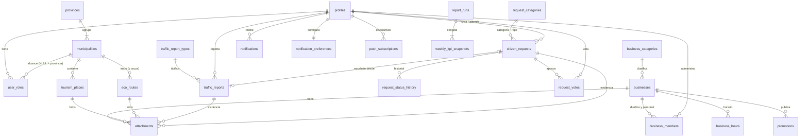

# SR Conecta — Backend y base de datos

> Versión 1.0 · 24 de septiembre de 2026 · Complementa [ARCHITECTURE.md](ARCHITECTURE.md) (v1.6).
> **La fuente de verdad es el SQL** de [`supabase/migrations/`](supabase/migrations): este documento explica sus decisiones. Si el documento y el SQL discrepan, manda el SQL.
> **Estado verificado:** las 15 migraciones se aplican desde cero en PostgreSQL 18.3 + PostGIS 3.6.2, y **87 pruebas** de seguridad, integridad, concurrencia, PostGIS, KPIs y mantenimiento pasan ([`supabase/tests/`](supabase/tests)). Lo que no se pudo verificar fuera de Supabase está en §14.

---

## 1. Resumen

| | |
|---|---|
| Motor | PostgreSQL (Supabase; probado en 18.3, compatible con 15+) + PostGIS, `pg_trgm`, `unaccent`, `pgcrypto`, `pg_cron`, `pg_net`, Vault |
| Esquemas | `public` (expuesto por la Data API): 27 tablas, 25 funciones · `private` (no expuesto): 6 tablas, 29 funciones · `extensions` |
| Seguridad | RLS en las 27 tablas de `public` (31 políticas + 3 de Storage) · grants por columna · `EXECUTE` explícito por función · 42 funciones `SECURITY DEFINER`, todas con `search_path` fijo |
| Integridad | FK compuestas territoriales, `CHECK` en cada columna con dominio acotado, `UNIQUE NULLS NOT DISTINCT` donde `NULL` tiene significado, arco exclusivo en adjuntos |
| Rendimiento | 109 índices: GiST geométricos y geográficos, GIN de texto y trigramas, parciales para bandejas y colas, soporte de todas las FK hacia `profiles` |
| Asincronía | Cola `private.jobs` (outbox) + worker con `FOR UPDATE SKIP LOCKED` + `pg_cron` |

## 2. Arquitectura del backend

No hay un servidor de aplicación separado. El backend son **cuatro capas con una sola autoridad: PostgreSQL**.

```text
Navegador / PWA
   │  fetch /api/v1/…  (cookie de sesión)            ← nunca decide permisos ni estados
   ▼
Next.js · Route Handler / Server Action               ← CAPA 1: transporte
   │  getUser() · Zod (defensa temprana y mensajes) · traduce reason → HTTP
   ▼
modules/<dominio>/server/*.ts                         ← CAPA 2: servicio (orquestación)
   │  supabase-js con el JWT del usuario: rpc('create_traffic_report', …)
   ▼
PostgREST (Data API de Supabase)
   ▼
RPC en public (SECURITY DEFINER)                      ← CAPA 3: AUTORIDAD
   │  identidad = auth.uid() · valida todo · rate limit · compare-and-set · auditoría · encola efectos
   ▼
Tablas con RLS + grants por columna + CHECK/FK       ← CAPA 4: integridad (última red)
```

| Capa | Responsabilidad | Puede | No debe |
|---|---|---|---|
| 1. Route Handler / Server Action | Transporte HTTP, sesión, validación de forma (Zod), mapeo de errores | Rechazar pronto una entrada mal formada; añadir `ip_declared` | Decidir permisos, estados o existencias; usar `service_role` en requests de usuario |
| 2. Servicio TS (`modules/*/server`) | Orquestar llamadas, combinar lecturas, llamar APIs externas (push, email) | Componer varias lecturas; llamar **una** RPC por operación de escritura | Encadenar varias escrituras esperando atomicidad (no hay transacción entre RPC) |
| 3. RPC | Regla de negocio completa y atómica (una transacción) | Todo lo que modifica estado, permisos o contadores | Llamar servicios externos de forma síncrona (se encolan) |
| 4. Tablas | Invariantes que nunca deben romperse | `CHECK`, FK, `UNIQUE`, RLS, triggers de derivados | Contener lógica de negocio compleja en triggers ocultos |

**Lecturas:** las simples van directo a las tablas por RLS (`select` con supabase-js, respetando los grants por columna). Las compuestas o públicas-anónimas van por RPC `SECURITY INVOKER` (`map_features`, `search_all`), así la RLS sigue aplicando.

**"Repositorio":** no se añade una capa extra. Cada módulo tiene `queries.ts` con funciones tipadas (tipos generados con `supabase gen types`) que envuelven `from(...)`/`rpc(...)`. Es la única frontera con la base.

### 2.1 Contrato de las RPC

1. La identidad sale de `auth.uid()`, **nunca** de un parámetro (`user_id`, `owner_id`, `role` y `municipality_id` no se aceptan del cliente cuando se pueden derivar).
2. Toda RPC asume que la llaman **directamente** con la anon key (PostgREST es público) y valida todo por sí misma.
3. Los rechazos de negocio **se devuelven**, no se lanzan: `{"status":"rejected","reason":"…"}`. Así el contador de rate limit, el intento denegado y la auditoría hacen commit.
4. Creación **idempotente**: `p_idempotency_key` (8–64 caracteres) + `UNIQUE (autor, clave)`; ante un doble envío concurrente se atrapa `unique_violation` y se devuelve el existente.
5. Cambios de estado con **compare-and-set**: `p_expected_status` + `UPDATE … WHERE status = :esperado`. Si otro se adelantó: `stale_state` con el estado actual.
6. Ediciones de contenido con **bloqueo optimista**: `p_version` + `WHERE version = :v`. Si no coincide: `version_conflict`.
7. Efectos secundarios (push, email, imágenes, PDF, avisos a moderadores) → `private.enqueue()` dentro de la misma transacción.

### 2.2 Mapeo de `reason` a HTTP (capa 1)

| `reason` | HTTP |
|---|---|
| — (`status: ok`) | 200 / 201 |
| `not_authenticated` | 401 |
| `forbidden`, `own_request` | 403 |
| `not_found` | 404 |
| `stale_state`, `version_conflict`, `conflict` | 409 |
| `invalid_*`, `*_required`, `out_of_area`, `not_votable`, `no_changes`, `unknown_field`, `bbox_too_large` | 422 |
| `rate_limited` | 429 |

Una excepción no controlada (bug) → 500 sin detalles internos; el detalle va a Sentry.

## 3. Convenciones

| Tema | Regla | Motivo |
|---|---|---|
| Nombres | `snake_case`, tablas en plural, FK `<entidad>_id` | Consistencia con PostgREST y los tipos generados |
| Claves primarias | `uuid` (`gen_random_uuid()`) en entidades; `bigint identity` en tablas de alto volumen solo de inserción (historial, auditoría, moderación, cola) | Los UUID no revelan volumen ni son enumerables por la API; los `bigint` son más compactos donde nadie los expone |
| Fechas | `timestamptz` siempre; periodos de informes como `date` interpretadas en `America/Santo_Domingo` | Evita errores de zona horaria en KPIs |
| Estados | `text` + `CHECK` (nunca `enum`); transiciones en tablas `private.*_transitions` | Un `enum` no permite quitar ni renombrar valores |
| Territorio | `province_id` + `municipality_id` con **FK compuesta** `(municipality_id, province_id) → municipalities (id, province_id)` | Imposible guardar un municipio de otra provincia |
| Geometría | `geometry(<Tipo>, 4326)` con typmod; distancias con `::geography`; `ST_Covers` para pertenencia | Tipo y SRID garantizados; metros reales; el borde cuenta |
| Texto libre | `CHECK (char_length(...) <= N)` en cada columna | Sin payloads gigantes por la API |
| `jsonb` | Solo para contenido realmente libre (`translations`, `services`, `payload`), con `CHECK (jsonb_typeof(...) = 'object')`. Lo consultable va en columnas o tablas (p. ej. `business_hours`) | Validación e índices |
| Borrado | Lógico (`deleted_at`) en contenido; físico solo para datos personales (baja de cuenta) | KPIs e historial intactos |
| Derivados | Columnas generadas (`search_vector`, `distance_km`, `start_point`, `geom_simplified`) o triggers (`support_count`, `municipality_ids`) | El cliente nunca envía un dato derivado |
| Funciones | `SECURITY DEFINER` solo cuando hace falta, siempre con `set search_path`; `(select auth.uid())` en políticas | Sin secuestro de `search_path`; `auth.uid()` evaluado una vez por consulta |

## 4. Esquemas, extensiones y roles

| Esquema | Expuesto | Contenido |
|---|---|---|
| `public` | Sí (Data API) | Tablas de negocio con RLS y las RPC invocables |
| `private` | No | Helpers de RLS, transiciones, reglas de rate limit, cola de trabajos, mantenimiento |
| `extensions` | No | PostGIS, `pg_trgm`, `unaccent`, `pgcrypto`, `pg_net` |

| Rol | Uso |
|---|---|
| `anon` | Visitante sin sesión: lectura pública + `map_features`, `search_all` |
| `authenticated` | Usuario con sesión: RPC de negocio, lectura por RLS; el rol de negocio real sale de `user_roles` |
| `service_role` | Solo el worker y el cron (servidor). Ejecuta `worker_*`, `weekly_report_*`, `kpi_summary` |

## 5. Modelo de datos



### 5.1 Territorio — `20260924120010_territory.sql`

| Tabla | Propósito | Claves e invariantes |
|---|---|---|
| `provinces` | Territorio raíz (1 fila en el MVP) | `code` único |
| `municipalities` | Límites oficiales (`MultiPolygon` válido) y versión simplificada para el mapa | `UNIQUE (id, province_id)` como destino de las FK compuestas; GiST en `geom` |
| `feature_flags` | Activación por provincia o municipio | `UNIQUE NULLS NOT DISTINCT (key, province_id, municipality_id)` |

`private.locate(geom)`: municipio que **cubre** el punto (`ST_Covers`); si no hay, el más cercano a ≤ 2 km; si no, ninguno. Es la única regla de pertenencia y la usan todas las RPC.

### 5.2 Identidad — `…020_identity.sql`

| Tabla | Propósito | Claves e invariantes |
|---|---|---|
| `profiles` | 1:1 con `auth.users`; nombre, municipio, consentimiento, reputación | `ON DELETE CASCADE` desde `auth.users`; el usuario solo edita 4 columnas (grant por columna) |
| `user_roles` | Roles con alcance: `citizen`, `entrepreneur`, `moderator`, `municipal_admin` | PK sustituta; `UNIQUE NULLS NOT DISTINCT (user_id, role, province_id, municipality_id)`; FK compuesta territorial |

El trigger `on_auth_user_created` crea el perfil y el rol `citizen` al registrarse. Si falla, el registro falla: no hay usuarios sin perfil. Helpers: `user_has_role`, `is_staff`, `is_admin`, `is_provincial_admin`, `is_any_staff`, `current_role_label`. **No hay `super_admin`** (ADR-020): el administrador provincial se crea con [`supabase/ops/grant_provincial_admin.sql`](supabase/ops/grant_provincial_admin.sql).

### 5.3 Catálogos y configuración — `…030_catalogs.sql`

`business_categories`, `traffic_report_types` (bases F4: accidente, calle cerrada, bache, semáforo, desvío…; cada uno con gravedad y duración por defecto), `request_categories` (tipo `incident` o `inquiry`, con `UNIQUE (code, kind)` como destino de FK compuesta). En `private`: `request_transitions`, `traffic_transitions`, `content_transitions` y `rate_limit_rules`. Todo editable sin deploy.

### 5.4 Negocios, lugares y rutas — `…040_places.sql`

| Tabla | Notas clave |
|---|---|
| `businesses` | Estados `draft → pending → under_review → approved / rejected → suspended / archived`; contacto validado por `CHECK` (teléfono, email, `https://`); `version` para bloqueo optimista; `search_vector` generado; `UNIQUE (province_id, slug)` |
| `business_members` | Dueños y personal; `is_business_member()` para RLS |
| `business_hours` | Normalizada (`weekday`, `opens`, `closes`); `closes < opens` = cierra después de medianoche |
| `promotions` | Informativas (sin stock ni canje); vigencia máxima de 90 días; moderadas |
| `tourism_places` | Propuestas ciudadanas (`pending`) o del personal (`published`); `proposed_by` / `reviewed_by` |
| `eco_routes` | `MultiLineString` válido (2–5.000 vértices); **`distance_km`, `start_point` y `geom_simplified` los calcula la base** (columnas generadas); `municipality_ids` por trigger |
| `engagement_daily` | Vistas, "cómo llegar" y WhatsApp agregados por día (nunca una fila por evento) |

### 5.5 Participación ciudadana — `…050_citizen.sql`

| Tabla | Notas clave |
|---|---|
| `citizen_requests` | `kind` + `category` con FK compuesta (una consulta no usa una categoría de incidencia); `incident` exige punto; `resolved` exige nota; `rejected` exige motivo; `support_count` mantenido por trigger |
| `request_status_history` | Inmutable; base del tiempo de resolución |
| `request_votes` | PK `(request_id, user_id)` = un voto por persona (bases F5) |
| `traffic_reports` | `expires_at` obligatorio; sin municipio solo si `out_of_area` o `rejected`; `escalated_request_id` al pasar a incidencia municipal |

Decisión deliberada: la regla "`in_progress` exige responsable" está en la RPC, **no** en un `CHECK`. `assigned_to` es `ON DELETE SET NULL`, y un `CHECK` así impediría borrar la cuenta del empleado.

### 5.6 Adjuntos, moderación y auditoría — `…060_media_audit.sql`

- `attachments` usa un **arco exclusivo**: una FK real por entidad y `CHECK (num_nonnulls(...) = 1)`. Así hay cascadas reales y no quedan adjuntos huérfanos. La ruta la genera el servidor (regex estricta, sin `..`), con `mime` y tamaño acotados.
- `moderation_actions` es inmutable.
- `audit_logs` tiene PK `(created_at, id)`, lista para particionado mensual. Guarda dos IPs: `ip_observed` (vista por Supabase) e `ip_declared` (enviada por Next.js, informativa). `private.audit()` nunca hace fallar la operación principal.

### 5.7 Notificaciones y cola — `…070_notifications_system.sql`

`notifications` es la fuente de verdad in-app. `private.notify()` inserta la notificación y encola un job `push` si el usuario lo activó. `private.jobs` tiene deduplicación (`UNIQUE` parcial en `dedupe_key` mientras está activo), backoff exponencial y estado `dead` tras N intentos. `private.hit_rate_limit()` usa ventana fija con upsert atómico.

### 5.8 Informes — mismo archivo

`report_runs`: `UNIQUE (province_id, period_start, version)`; el periodo empieza en lunes y dura 7 días; `succeeded` exige `storage_path`. `weekly_kpi_snapshots`: `UNIQUE NULLS NOT DISTINCT (report_run_id, municipality_id)` (NULL = provincia). Son inmutables por ejecución.

### 5.9 Índices de soporte de FK — `…220_fk_indexes.sql`

Toda FK hacia `profiles` tiene índice (parcial, `WHERE … IS NOT NULL`). Sin ellos, borrar una cuenta recorrería completas todas las tablas que referencian al usuario (14 índices lo evitan). Las FK hacia catálogos y territorio (`ON DELETE RESTRICT`, casi nunca se borran) no se indexan a propósito.

## 6. Catálogo de RPC

| RPC | Quién | Seguridad | Rate limit | Idempotencia / concurrencia |
|---|---|---|---|---|
| `create_traffic_report` | ciudadano | definer | 5/h | `idempotency_key` |
| `moderate_traffic_report` | personal del municipio | definer | 300/h | compare-and-set |
| `escalate_traffic_report` | personal | definer | 300/h | `FOR UPDATE` + devuelve el existente |
| `create_citizen_request` | ciudadano | definer | 5/h | `idempotency_key` |
| `change_request_status` | personal / asignado | definer | 300/h | compare-and-set, un paso por llamada |
| `assign_request` | personal | definer | 300/h | — |
| `set_request_public` | personal | definer | — | — |
| `toggle_request_vote` | ciudadano (no autor) | definer | 30/h | PK + captura de doble clic |
| `submit_business` | ciudadano | definer | 3/día | `idempotency_key` |
| `update_business` | miembro / personal | definer | 30/h | lista blanca de campos + `version` |
| `set_business_hours` | miembro / personal | definer | 30/h | reemplazo completo |
| `create_promotion` | miembro de negocio aprobado | definer | 30/h | — |
| `propose_place`, `propose_route` | ciudadano (personal publica directo) | definer | 5/día | — |
| `review_content` | personal del municipio | definer | 300/h | compare-and-set; sin SQL dinámico |
| `assign_role`, `revoke_role` | admin municipal (moderadores) / admin provincial (admins municipales) | definer | 30/h | `ON CONFLICT DO NOTHING` |
| `map_features` | anon, ciudadano | **invoker** | — | bbox ≤ 2°, ≤ 500 features, `truncated` |
| `search_all` | anon, ciudadano | **invoker** | — | 2–80 caracteres, ≤ 50 resultados |
| `my_activity` | ciudadano | definer | — | solo lo propio |
| `kpi_summary` | admin (su alcance), service | definer | — | **única fuente de KPIs** |
| `weekly_report_begin` / `_finish` | service (cron) / admin provincial (manual) | definer | — | toma atómica; versión nueva si es manual |
| `worker_claim_jobs` / `worker_finish_job` | service | definer | — | `SKIP LOCKED`, recupera locks vencidos |

## 7. Matriz RLS y grants

"Escritura directa" = `INSERT/UPDATE/DELETE` desde la API. Todo lo demás se escribe **solo por RPC**.

| Tabla | anon | Ciudadano | Dueño / autor | Personal (su municipio) | Escritura directa | Columnas ocultas |
|---|---|---|---|---|---|---|
| provinces, municipalities, catálogos, feature_flags | ✓ | ✓ | — | ✓ | — | geometría completa de municipios |
| profiles | — | propio | propio | ✓ | `UPDATE` de 4 columnas propias | — |
| user_roles | — | propio | — | admin | — | `granted_by` |
| businesses | aprobados | aprobados | + los suyos | + su municipio | — | `created_by`, `idempotency_key` |
| business_hours, promotions | heredan del negocio | ✓ | ✓ | ✓ | — | `created_by` |
| tourism_places, eco_routes | publicados | publicados | + sus propuestas | + su municipio | — | `proposed_by`, `reviewed_by` |
| citizen_requests | públicas aprobadas | públicas | + las suyas | + su municipio | — | `requester_id`, `assigned_to`, `idempotency_key` |
| request_status_history | — | — | de lo suyo | ✓ | — | `changed_by` |
| request_votes | — | propios | — | — | — | — |
| traffic_reports | activos no vencidos | activos | + los suyos | + su municipio | — | `reporter_id`, `idempotency_key` |
| attachments | aprobados en `public-media` | ídem | + los suyos | ✓ | — | `owner_id`, `bytes` |
| moderation_actions | — | — | — | ✓ | — | — |
| audit_logs | — | — | — | admin (su alcance) | — | — |
| notifications | — | propias | — | — | `UPDATE (read_at)` | — |
| notification_preferences, push_subscriptions | — | propias | — | — | propias | claves push |
| report_runs, weekly_kpi_snapshots | — | — | — | admin | — | — |
| engagement_daily | — | — | su negocio | ✓ | — | — |

Storage: `report-evidence` solo acepta subidas en `incoming/{auth.uid()}/…`; `public-media` y `reports-pdf` solo los escribe `service_role`.

## 8. Errores de diseño detectados al ejecutar (y cómo se evitan)

Estos fallos solo aparecieron al correr el SQL contra un PostgreSQL real. Quedan documentados para que nadie los reintroduzca:

| # | Error | Por qué ocurre | Regla |
|---|---|---|---|
| 1 | Una función nueva nació ejecutable por cualquiera | Postgres concede `EXECUTE` a `PUBLIC` globalmente, y `ALTER DEFAULT PRIVILEGES … IN SCHEMA` solo puede **añadir** privilegios | Usar la forma **global** `alter default privileges revoke execute on functions from public` (sin `IN SCHEMA`); la prueba A5 lo vigila |
| 2 | `permission denied for table citizen_requests` al leer el historial propio | Las **subconsultas dentro de una política RLS respetan los grants por columna**; la política leía `requester_id`, que está oculto | Las comprobaciones que tocan columnas ocultas van en un helper `SECURITY DEFINER` (`private.can_read_request`) |
| 3 | `type "geometry" does not exist` para `anon` | Una función `SECURITY INVOKER` resuelve tipos con los permisos del usuario; sin `USAGE` en `extensions` no ve PostGIS | `grant usage on schema extensions` explícito (no depender del valor por defecto de Supabase) |
| 4 | (evitado en diseño) `unaccent()` en columna generada o índice | `unaccent()` no es `IMMUTABLE` | Envoltorio `private.f_unaccent()` inmutable con diccionario explícito |
| 5 | (evitado en diseño) `CHECK` que rompe `ON DELETE SET NULL` | Borrar la cuenta del asignado violaría "`in_progress` exige `assigned_to`" | Reglas que dependen de una FK nullable → en la RPC, no en un `CHECK` |
| 6 | (evitado en diseño) FK hacia `profiles` sin índice | Cada baja de cuenta recorrería tablas completas | Índice parcial en toda FK hacia `profiles` (prueba A7) |

## 9. Storage

| Bucket | Público | Límite | Quién escribe |
|---|---|---|---|
| `report-evidence` | No | 5 MB, JPEG/PNG/WebP | Ciudadano en `incoming/{uid}/`; el worker procesa (magic bytes, EXIF fuera, re-codifica a WebP) y mueve |
| `public-media` | Sí | 5 MB | Solo el worker, tras moderación |
| `reports-pdf` | No | 20 MB, PDF | Solo el worker; descarga con URL firmada de 5 min |

Las subidas sin confirmar a las 24 h se marcan `rejected` y se encola el borrado del archivo (`apply_retention`).

## 10. Asincronía, Realtime y tareas programadas

| Tarea | Frecuencia | Función |
|---|---|---|
| Despertar al worker | cada minuto | `private.wake_worker()`: `pg_net` → `/api/v1/internal/jobs/run` con el secreto de Vault |
| Expirar reportes de tránsito | cada 15 min | `private.expire_traffic_reports()` (el mapa ya filtra por `expires_at`; esto es para los KPIs) |
| Archivar consultas resueltas | diaria, 04:15 UTC | `private.archive_resolved_requests()` (30 días después de resolver) |
| Retención (§32 de la arquitectura) | diaria, 04:30 UTC | `private.apply_retention()` |
| Informe semanal | diaria (Vercel Cron) | `weekly_report_begin()` → PDF → `weekly_report_finish()` |

Realtime: el trigger `traffic_reports_broadcast` emite por `realtime.send` en el canal `traffic:{province_id}` solo datos públicos (id, tipo, gravedad, coordenadas, estado). Un fallo del broadcast nunca revierte el reporte.

## 11. KPIs: una sola fuente

`kpi_summary(from, to, municipality)` calcula todo: tránsito por tipo, consultas recibidas, resueltas, rechazadas y abiertas, tiempo medio de resolución, las más apoyadas, negocios, turismo, usuarios nuevos y vistas. El panel la llama en vivo. El informe semanal guarda su resultado en `weekly_kpi_snapshots` y genera el PDF desde esos snapshots. La prueba I4 verifica que **snapshot == `kpi_summary`** para el mismo periodo, así que el caso "Dashboard = 72 / PDF = 69" es imposible por construcción.

## 12. Migraciones: flujo de trabajo

| Archivo | Contenido |
|---|---|
| `…000_foundation` | Extensiones, esquemas, privilegios base, utilidades |
| `…010_territory` | Provincias, municipios, feature flags, `locate()` |
| `…020_identity` | Perfiles, roles, helpers de permisos, alta automática |
| `…030_catalogs` | Catálogos, transiciones, reglas de rate limit (con datos de referencia) |
| `…040_places` | Negocios, horarios, promociones, lugares, rutas, métricas |
| `…050_citizen` | Consultas, historial, votos, tránsito |
| `…060_media_audit` | Adjuntos, moderación, auditoría |
| `…070_notifications_system` | Notificaciones, cola, rate limiting, informes |
| `…100 / 110 / 120 / 130` | RPC ciudadanas, de contenido, de lectura, worker y mantenimiento |
| `…200_rls_grants` | RLS, grants por columna, `EXECUTE` |
| `…210_storage_realtime_cron` | Buckets, políticas de Storage, broadcast, `pg_cron` |
| `…220_fk_indexes` | Índices de soporte de FK |

**Reglas:**
- Solo hacia adelante.
- Compatibles con el código anterior (expandir → migrar datos → contraer).
- Una responsabilidad por archivo.
- Toda tabla nueva de `public` nace con RLS, grants explícitos y su fila en la matriz del §7.
- Toda función nueva lleva `set search_path` y su `grant execute` explícito.

**Probar:**
```bash
cd supabase/tests && npm install && npm test     # PostgreSQL 18 + PostGIS en WebAssembly, sin Docker
```

**Aplicar:** `supabase db push` desde la Action de release (ARCHITECTURE.md §36), antes de desplegar el código. `supabase/seed.sql` solo en desarrollo: sus municipios son rectángulos de demostración que se reemplazan por los límites oficiales de los datos abiertos.

## 13. Rendimiento

| Consulta | Índice |
|---|---|
| Capas por viewport | GiST en `geom` de cada tabla (`&&` con `ST_MakeEnvelope`) |
| Cercanía en metros | GiST de expresión `((geom::geography))` |
| Tránsito en vivo | Parcial `(expires_at) WHERE status IN ('active','verified')` |
| Bandeja municipal | `(municipality_id, status, support_count desc, created_at)` |
| Búsqueda | GIN en `search_vector` + GIN trigramas en `f_unaccent(name)` |
| Cola de trabajos | Parciales `WHERE status = 'pending'` / `'running'` |

Antes de producción, revisar con `EXPLAIN (ANALYZE, BUFFERS)` `map_features`, `search_all` y `kpi_summary` con datos de volumen realista, y revisar semanalmente los *advisors* de seguridad y rendimiento de Supabase. Punto caliente conocido: `support_count` se actualiza en la fila de la consulta con cada voto. A esta escala es aceptable; si una consulta recibiera miles de votos por minuto, se pasaría a un contador agregado por lotes.

## 14. No verificado fuera de Supabase

Las pruebas usan stubs mínimos de lo que aporta Supabase ([`supabase/tests/supabase-stubs.sql`](supabase/tests/supabase-stubs.sql)). Antes de producción hay que comprobar en un proyecto Supabase real:

- que `pg_cron`, `pg_net` y Vault se habiliten y que `cron.schedule` registre las 4 tareas (en las pruebas se omiten);
- la firma de `realtime.send(payload, event, topic, private)` y la configuración de canales de Broadcast;
- que la Data API exponga solo `public`, y los `GRANT` que Supabase aplica por defecto a tablas nuevas (la migración 200 los revoca y concede explícitamente, así que no dependemos de ellos);
- `storage.foldername()` y los límites de los buckets en el servicio de Storage real;
- el rendimiento con los polígonos oficiales de los municipios (los de desarrollo son rectángulos).
