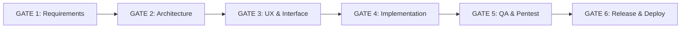

# SR CONECTA — Plataforma Territorial Inteligente

> **EL TERRITORIO ESTÁ VIVO.**  
> Ecosistema digital y geográfico para la provincia de **Santiago Rodríguez** (República Dominicana).  
> Conecta a ciudadanos, turistas, emprendedores, comercios y autoridades municipales alrededor de un mapa interactivo central.  
> Diseñado para los municipios de: **San Ignacio de Sabaneta**, **Monción** y **Villa Los Almácigos**.

---

## 1. Visión General del Producto

**SR CONECTA** no es un portal web convencional con un mapa estático incrustado: es una **plataforma territorial viva** donde el mapa es la interfaz y el escenario principal que responde permanentemente a cuatro preguntas:

- **¿Dónde estoy?** — Ubicación y contextualización municipal automática.
- **¿Qué hay cerca?** — Comercios locales, gastronomía típica, atractivos turísticos, rutas y alertas viales.
- **¿Qué puedo hacer?** — Misiones territoriales de exploración, retos comerciales y participación cívica.
- **¿Qué puedo ganar?** — Beneficios económicos tangibles (descuentos, cupones, productos), insignias y sellos en el **Pasaporte del Territorio**.

---

## 2. Documentación Técnica Integral (`/docs`)

El diseño, validación y arquitectura de SR CONECTA está documentado en un conjunto riguroso de 16 especificaciones técnicas:

| Documento | Descripción y Alcance |
|---|---|
| [**docs/ARCHITECTURE.md**](docs/ARCHITECTURE.md) | Arquitectura modular de capas limpias, topología Vercel/Supabase, Server vs Client Components y flujo de datos. |
| [**docs/DATABASE.md**](docs/DATABASE.md) | Modelo relacional PostgreSQL + PostGIS, diccionario de entidades, ERD Mermaid, índices espaciales y RPCs transaccionales. |
| [**docs/DOMAIN.md**](docs/DOMAIN.md) | Reglas de negocio, invariantes, máquinas de estado de negocios, reportes, misiones y recompensas, y criterios de aceptación por actor. |
| [**docs/API.md**](docs/API.md) | Contratos de Server Actions, endpoints de sistema, esquemas de validación Zod, RPCs y mapeo de errores HTTP. |
| [**docs/SECURITY.md**](docs/SECURITY.md) | Modelo de amenazas, matriz RLS exhaustiva, prevención de fraude GPS, bloqueo de sobregiro y seguridad en Supabase Storage. |
| [**docs/PWA.md**](docs/PWA.md) | Configuración de Serwist, Web App Manifest, máquina de estados offline (`DRAFT` → `QUEUED` → `SYNCING` → `SYNCED` / `FAILED`) e idempotencia. |
| [**docs/MAPS.md**](docs/MAPS.md) | Google Maps JavaScript API, Advanced Markers, sistema de clusters numéricos (`05`, `12`, `24`, `48`, `100+`) y geolocalización. |
| [**docs/MISSIONS.md**](docs/MISSIONS.md) | Sistema declarativo de misiones territoriales, requisitos técnicos (GPS, QR, PIN), verificación en servidor y anti-spoofing. |
| [**docs/REWARDS.md**](docs/REWARDS.md) | Economía de incentivos locales, tiers de dificultad (5%, 10%, 15%, especial) y control de concurrencia pesimista (`FOR UPDATE`). |
| [**docs/ADMIN.md**](docs/ADMIN.md) | Panel de inteligencia territorial municipal, mapa administrativo con polígonos oficiales, moderación y catálogo de KPIs. |
| [**docs/REPORTING.md**](docs/REPORTING.md) | Sistema automatizado de informes ejecutivos en PDF, Vercel Cron semanal, compilación en Node.js runtime y almacenamiento seguro. |
| [**docs/QA.md**](docs/QA.md) | Plan integral de aseguramiento de calidad, las 10 dimensiones de evaluación, pruebas E2E Playwright y banco de pentest funcional. |
| [**docs/DEPLOYMENT.md**](docs/DEPLOYMENT.md) | Guía de despliegue DevOps en Vercel y Supabase, matriz de variables de entorno, configuración de GCP y pipeline CI/CD con GitHub Actions. |
| [**docs/DECISIONS.md**](docs/DECISIONS.md) | Registro de 22 Decisiones de Arquitectura (ADR-001 al ADR-022) que justifican cada elección tecnológica. |
| [**docs/AGENTS.md**](docs/AGENTS.md) | Orquesta de 20 agentes especializados, matriz de dependencias, reglas de coordinación y los 6 Quality Gates. |
| [**docs/RISKS.md**](docs/RISKS.md) | Matriz cuantitativa de riesgos técnicos (cuotas de mapas, fraude, concurrencia, offline) y protocolos de mitigación. |

---

## 3. Gobernanza de Calidad: Los 6 Gates

El ciclo de desarrollo y liberación de SR CONECTA está custodiado por 6 compuertas de calidad ineludibles:



1. **GATE 1 — REQUIREMENTS:** Aprobado por el *Product Analyst Agent* (cobertura total de los 21 objetivos del MVP y los 4 actores del ecosistema).
2. **GATE 2 — ARCHITECTURE:** Aprobado por *Solution*, *Database*, *Geospatial* y *Security Agents* (compatibilidad Next.js 16 + React 19 + PostGIS + Serwist + React PDF en Node runtime).
3. **GATE 3 — UX & INTERACTION:** Aprobado por *UX/UI*, *Frontend* y *PWA Agents* (diseño Light Mode First, paleta semántica, usabilidad móvil de alta respuesta).
4. **GATE 4 — IMPLEMENTATION:** Aprobado por *Frontend*, *Backend*, *Database* y *Security Agents* (código tipado, migraciones limpias y RPCs atómicas).
5. **GATE 5 — QUALITY & SECURITY QA:** Aprobado por *QA*, *Security QA* y *Performance Agents* (100% de pruebas pasando, cero sobregiro en canjes concurrentes).
6. **GATE 6 — RELEASE & DEPLOY:** Aprobado por *DevOps*, *Security* y *QA Agents* (CI/CD verificado, variables encriptadas y documentación completa).

---

## 4. Estructura del Repositorio

```
CERTIC-MAPS-SR/
├── docs/                      # 16 Especificaciones técnicas maestras (ADRs, DB, API, etc.)
├── supabase/
│   ├── migrations/            # Migraciones SQL secuenciales (PostgreSQL + PostGIS)
│   ├── ops/                   # Scripts operativos (asignación de admin provincial)
│   ├── tests/                 # Suite de pruebas automatizadas con PGlite (WASM)
│   └── seed.sql               # Semilla territorial reproducible para desarrollo y demo
├── project/                   # Prototipo visual navegable con datos de demostración
│   ├── Main.dc.html           # Interfaz interactiva de diseño
│   ├── sr-core.js             # Lógica y datos de demostración
│   └── support.js             # Runtime del lienzo de diseño
├── src/                       # Aplicación Next.js 16 (App Router + TypeScript)
│   ├── app/                   # Rutas y páginas (Server Components & Route Handlers)
│   ├── components/            # Componentes visuales UI (shadcn/ui + Tailwind)
│   ├── features/              # Módulos de dominio (map, missions, rewards, reports, admin...)
│   ├── hooks/                 # Custom React hooks (geolocation, offline, realtime)
│   ├── services/              # Orquestación de llamadas y clientes Supabase/Google
│   ├── lib/                   # Utilidades del sistema y helpers matemáticos
│   └── types/                 # Definiciones TypeScript de entidades y contratos
├── README.md                  # Este documento maestro
└── package.json               # Configuración del proyecto y dependencias
```

---

## 5. Verificación y Pruebas de la Base de Datos

La base de datos puede verificarse localmente sin necesidad de instalar Docker ni contar con una cuenta de Supabase, utilizando PostgreSQL y PostGIS compilados en WebAssembly (PGlite):

```bash
cd supabase/tests
npm install
npm test
```

---

## 6. Visualización del Prototipo Interactivo

El prototipo de diseño permite explorar la experiencia de usuario de inmediato:
1. Abre `project/Main.dc.html` directamente en tu navegador web.
2. Alterna en la esquina superior derecha entre la **App Ciudadana** y el **Panel Municipal**.
3. Prueba la búsqueda de comercios, el trazado de rutas ecoturísticas y el formulario de incidencias.

---

## 7. Licencia

Este proyecto está licenciado bajo la **Licencia MIT**, garantizando su apertura y transferencia soberana a las instituciones comunitarias de la provincia Santiago Rodríguez.
